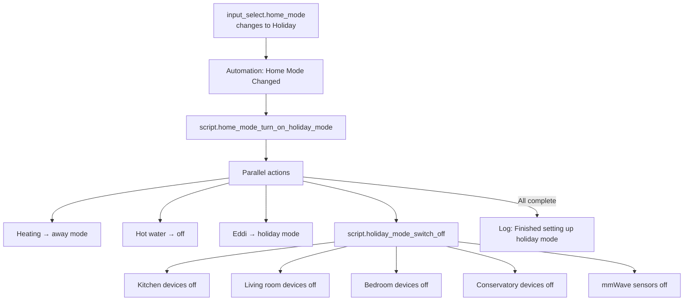
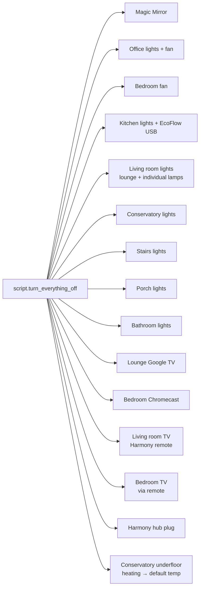

[<- Back to Packages README](README.md) · [Main README](../README.md)

# Home

*Last updated: 2026-04-06*

Global home mode management, whole-house device control, privacy and naughty-step modes, and appliance temperature monitoring. This package is the central coordinator for high-level "state of the house" changes.

---

## Contents

- [Automations](#automations)
- [Scripts](#scripts)
- [Scenes](#scenes)
- [Template Binary Sensors](#template-binary-sensors)
- [Holiday Mode Flow](#holiday-mode-flow)
- [Turn Everything Off Scope](#turn-everything-off-scope)

---

## Automations

### `Home Mode: Changed`

| Property | Value |
|---|---|
| ID | `1631138390675` |
| Trigger | `input_select.home_mode` changes to any value |
| Mode | Single |

Logs the mode change then branches:

| New mode | Script called |
|---|---|
| `Holiday` | `script.home_mode_turn_on_holiday_mode` |
| `Normal` | `script.home_mode_turn_on_normal_mode` |
| Any other | No action (log only) |

---

### `Home: Privacy Mode Turned On`

| Property | Value |
|---|---|
| ID | `1646257483770` |
| Trigger | `input_boolean.privacy_mode` turns `on` |
| Mode | Single |

Logs that privacy mode is enabled and logs a message about turning off conservatory camera recording and detection. Camera recording is disabled as part of this action.

---

### `Enter Naughty Step Mode`

| Property | Value |
|---|---|
| ID | `1647094528209` |
| Trigger | `input_boolean.naughty_step_mode` changes from `off` to `on` |
| Mode | Single |

Turns off living room and stairs lights (`scene.living_room_lights_off`, `scene.stairs_light_2_off`, `scene.stairs_light_off`) and disables motion triggers for those areas:

- `input_boolean.enable_living_room_motion_triggers` → `off`
- `input_boolean.enable_stairs_motion_triggers` → `off`

---

### `Fridge: High temperature`

| Property | Value |
|---|---|
| ID | `1762804331885` |
| Trigger | `sensor.utility_fridge_interior_temperature` rises above **4.9°C** |
| Mode | Single |

Sends a direct notification to Danny, Terina, and Leo with the current temperature reading and sensor name. `suppress_if_quiet: false` — alert fires regardless of quiet hours.

---

### `Freezer: High temperature`

| Property | Value |
|---|---|
| ID | `1762804331886` |
| Trigger | `sensor.kitchen_freezer_interior_temperature` or `sensor.utility_freezer_interior_temperature` rises above **-5°C** |
| Mode | Single |

Sends a direct notification to Danny, Terina, and Leo identifying which freezer (kitchen or utility room) has exceeded the threshold. `suppress_if_quiet: false`.

---

## Scripts

### `script.home_mode_turn_on_holiday_mode`

**Alias:** Home Mode Turn On Holiday Mode
**Icon:** `mdi:airplane`
**Mode:** `single`

Runs all of the following **in parallel**, then logs completion:

| Action | What it does |
|---|---|
| `script.set_central_heating_to_away_mode` | Sets Hive/heating to away/frost-protection mode |
| `script.set_hot_water_to_off` | Turns off hot water schedule |
| `script.hvac_set_solar_diverter_to_holiday_mode` | Sets Eddi solar diverter to holiday mode |
| `script.holiday_mode_switch_off` | Powers down non-essential devices room by room |

---

### `script.home_mode_turn_on_normal_mode`

**Alias:** Home Mode Turn On Normal Mode
**Icon:** `mdi:home`
**Mode:** `single`

Runs all of the following **in parallel**:

| Action | What it does |
|---|---|
| `script.set_central_heating_to_home_mode` | Restores heating to home schedule |
| `script.check_and_run_hot_water` | Re-enables hot water schedule |
| `script.check_and_run_central_heating` | Checks and runs central heating |
| `script.normal_mode_switch_on` | Powers up devices room by room |
| `script.hvac_set_solar_diverter_to_normal_mode` | Restores Eddi to normal operation |
| Log | "Finished setting up normal mode" |

---

### `script.holiday_mode_switch_off`

**Alias:** Holiday Mode Switch Off
**Icon:** `mdi:power-plug-off`

Powers down devices sequentially, logging each room:

| Room | Devices turned off |
|---|---|
| Kitchen | `switch.toaster` |
| Living Room | `switch.harmony_hub_plug`, `switch.playstation_plug`, `switch.tv_plug` |
| Bedroom | `switch.bedroom_tv_plug`, `switch.bedroom_fan` |
| Conservatory | `switch.printer_plug`, `switch.conservatory_extension_1` |
| Office | (logged, no specific switches listed) |
| mmWave sensors | `switch.bathroom_motion_mmwave_sensor`, `switch.living_room_motion_mmwave_sensor`, `switch.conservatory_motion_mmwave_sensor` |

---

### `script.normal_mode_switch_on`

**Alias:** Normal Mode Switch On
**Icon:** `mdi:power-plug`

Powers up devices sequentially, logging each room:

| Room | Devices turned on |
|---|---|
| Kitchen | `switch.toaster`, `switch.ecoflow_kitchen_usb_enabled` |
| Living Room | `switch.harmony_hub_plug`, `switch.playstation_plug`, `switch.tv_plug` |
| Bedroom | `switch.bedroom_tv_plug` |
| Conservatory | `switch.printer_plug`, `switch.conservatory_extension_1` |
| mmWave sensors | `switch.bathroom_motion_mmwave_sensor`, `switch.living_room_motion_mmwave_sensor`, `switch.conservatory_motion_mmwave_sensor` |

---

### `script.lock_house`

**Alias:** Lock House

Complex script that determines the correct locking behaviour based on whether all external entry points are physically closed and whether special modes are active.

```
binary_sensor.alarmed_doors_and_windows
├── off (all closed) → can arm
│   ├── Guest mode active → prompt: "Alarm On & Turn Off Devices" / "Alarm On Only" / "Turn Off Devices Only"
│   ├── Family computer on → prompt (same 3 buttons)
│   └── Default path →
│       ├── Arm alarm (away mode) + lock front door
│       ├── Any external openings? → notify with list of open doors
│       └── Direct notifications enabled? →
│           ├── Yes → 3-button prompt: "Disarm" / "Devices On" / "Disarm & Leave On" (5-min timeout)
│           │       └── timeout → everybody_leave_home
│           └── No → everybody_leave_home
└── on (something open) →
    └── Not Guest mode → direct notification listing open entrances
```

---

### `script.turn_everything_off`

**Alias:** Turn Everything Off
**Mode:** `single`

Sequential shutdown of all major devices and lights. Each step runs in parallel (log + action):

| Step | Action |
|---|---|
| Magic Mirror | `switch.magic_mirror_plug` off |
| Office lights | `scene.office_all_lights_off` |
| Bedroom fan | `switch.bedroom_fan` off |
| Office ceiling fan | `fan.office_ceiling_fan` off |
| Kitchen lights | `scene.kitchen_all_lights_off` + `switch.ecoflow_kitchen_usb_enabled` off |
| Living room lights | `scene.living_room_lights_off` + individual `light.living_room_*` entities off |
| Conservatory lights | `scene.conservatory_turn_off_light` |
| Stairs lights | `scene.stairs_light_off`, `scene.stairs_light_2_off` |
| Porch lights | `scene.porch_lights_off` |
| Bathroom lights | `scene.bathroom_turn_off_light` |
| Lounge Google TV | `media_player.lounge_tv` off (if not already off/unavailable) |
| Bedroom Chromecast | `media_player.bedroom_tv` off (if not already off/unavailable) |
| Living room TV (Harmony) | `remote.living_room` off (if `binary_sensor.tv_powered_on` is `on`) |
| Bedroom TV | `remote.bedroom_remote` power command (if `binary_sensor.bedroom_tv_powered_on` is `on`) |
| Harmony hub plug | `switch.harmony_hub_plug` off (if currently on) |
| Conservatory underfloor heating | Set to default temperature (`input_number.conservatory_default_under_floor_temperature`) in `heat` mode |

---

### `script.asleep_turn_everything_off`

**Alias:** Asleep Turn Everything Off
**Mode:** `single`

A subset of `turn_everything_off` targeted at bedtime use, shutting down only bedroom-relevant devices:

- Magic Mirror (`switch.magic_mirror_plug` off)
- Bedroom Chromecast (`media_player.bedroom_tv` off, if not already off/unavailable)
- Bedroom TV via remote (`remote.bedroom_remote` power command, if `binary_sensor.bedroom_tv_powered_on` is `on`)

---

## Scenes

### `Turn Off Downstairs Lights`

**ID:** `1582406269472`

Turns off the following lights:

| Light | Friendly name |
|---|---|
| `light.kitchen_cabinets` | Cabinet Light |
| `light.kitchen_down_lights` | Kitchen Down Light |
| `light.living_room_lamp_left` | Left Lamp |
| `light.living_room_lamp_right` | Right Lamp |

---

## Template Binary Sensors

### `binary_sensor.home_open_windows`

Aggregates all entities whose `device_class` is `door`. Reports `on` if any door-class sensor is currently `on` (open). The `windows` attribute lists the friendly names of all open doors/windows.

Used by `script.lock_house` and the time-based night warning automation.

---

## Holiday Mode Flow



---

## Turn Everything Off Scope



---

## Dependencies

| Entity | Purpose |
|---|---|
| `input_select.home_mode` | Master home mode selector (`Normal`, `Holiday`, `Guest`, `No Children`) |
| `input_boolean.privacy_mode` | Privacy mode flag |
| `input_boolean.naughty_step_mode` | Naughty step mode flag |
| `input_boolean.enable_direct_notifications` | Guards notification sends |
| `binary_sensor.alarmed_doors_and_windows` | Aggregate open-entry sensor for lock logic |
| `binary_sensor.external_doors_and_windows` | External-only entry sensor for alarm notification |
| `group.family_computer` | Detects if family PC is on when everyone leaves |
| `lock.front_door` | Front door lock for `lock_house` |
| `script.set_alarm_to_away_mode` / `script.set_alarm_to_disarmed_mode` | Alarm state management |
| `script.lock_front_door` | Locks the front door |
| `script.everybody_leave_home` | Final leave script |
| `script.send_actionable_notification_with_3_buttons` | Interactive lock prompt |
| `script.send_direct_notification` | Direct push notification |
| `script.send_to_home_log` | Home log writer |
