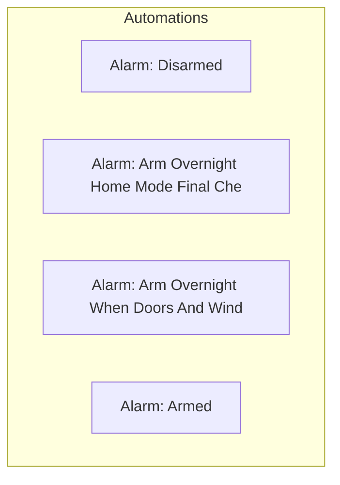

[<- Back to Alarm README](../README.md) · [Packages README](../../README.md) · [Main README](../../../README.md)

# Alarm Package Documentation

This package manages alarm automation including 8 automations and 0 scripts.

---

## Table of Contents

- [Overview](#overview)
- [Automations](#automations)
- [Entity Reference](#entity-reference)

---

## Overview

The alarm automation system provides intelligent control and monitoring.



### File Structure

```
packages/integrations/
├── alarm.yaml      # Main package file
└── README.md             # This documentation
```

---

## Automations

### Alarm: Disarmed
**ID:** `1628956688014`

**Triggers:**
- When `House Alarm` changes to 'disarmed'

**Conditions:**
- `Enable Alarm Automations` is enabled

**Actions:**
- Execute actions in parallel

### Alarm: Arm Overnight Home Mode
**ID:** `1587680439012`

**Triggers:**
- When `Alarm Scheduled Home Mode` changes from 'off' to 'on'

**Conditions:**
- `House Alarm` is 'disarmed'
- `Enable Alarm Automations` is enabled

**Actions:**
- Execute actions in parallel
- Conditional action selection

### Alarm: Arm Overnight Home Mode Final Check
**ID:** `1587680439015`

**Triggers:**
- At 02:05:00

**Conditions:**
- `House Alarm` is 'disarmed'

**Actions:**
- Turn on Under Bed Left, Under Bed Right
- Execute actions in parallel
- Conditional action selection

### Alarm: Arm Overnight When Doors And Windows Shut
**ID:** `1587680439013`

**Triggers:**
- When `Alarmed Doors And Windows` changes from 'on' to 'off'

**Conditions:**
- `Adult People` is 'home'
- `Alarmed Doors And Windows` is 'off'
- `Enable Alarm Automations` is enabled

**Actions:**
- *See YAML for action details*

### Alarm: Armed
**ID:** `1630366065607`

**Triggers:**
- When `House Alarm` changes to 'armed_away'

**Conditions:**
- `Enable Alarm Automations` is enabled

**Actions:**
- Execute actions in parallel

### Alarm: Disconnected
**ID:** `1614197981954`

**Triggers:**
- When `House Alarm` changes to 'unavailable'

**Conditions:**
- `Enable Alarm Automations` is enabled

**Actions:**
- Execute actions in parallel

### Alarm: Disconnected For A Period Of Time
**ID:** `1658658845650`

**Triggers:**
- When `House Alarm` changes to 'unavailable'

**Conditions:**
- `Enable Alarm Automations` is enabled

**Actions:**
- Conditional action selection

### Alarm: Triggered
**ID:** `1589026420341`

**Triggers:**
- When `House Alarm` changes to 'triggered'

**Conditions:**
- `Enable Alarm Automations` is enabled

**Actions:**
- Execute actions in parallel

---

## Entity Reference

### Referenced Entities

- `schedule.alarm_scheduled_home_mode`
- `person.danny`
- `person.terina`
- `alias: Turn on bedroom light to warn not all doors/windows are closed.`
- `light.under_bed_left`
- `light.under_bed_right`
- `light.bedroom_lamp_left`
- `light.bedroom_lamp_right`
- `action: script.set_alarm_to_home_mode`
- `action: script.lock_front_door`
- `binary_sensor.alarmed_doors_and_windows`
- `alarm_control_panel.house_alarm`
- `person.leo`
- `action: script.send_actionable_notification_with_2_buttons`

---

## Related Documentation

| Document | Purpose |
|----------|---------|
| [Integrations Overview](../README.md) | Overview of all integration packages |
| [Main Packages README](../../README.md) | Architecture and organization guidelines |

---

## Maintenance Notes

### Troubleshooting

| Issue | Check |
|-------|-------|
| Automation not triggering | Entity states and conditions |
| Script failing | Service calls and entity availability |

*Last updated: 2026-04-07*
