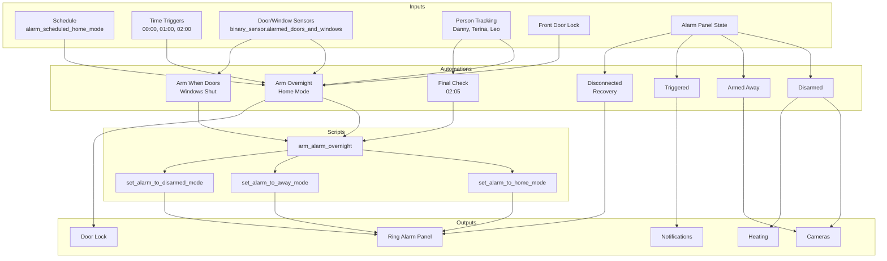
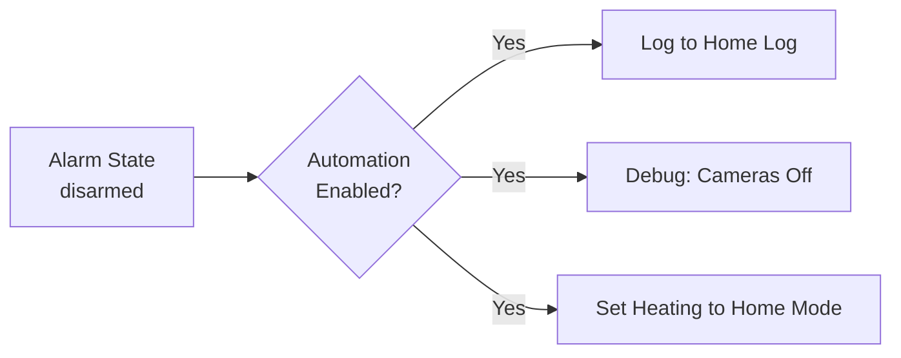
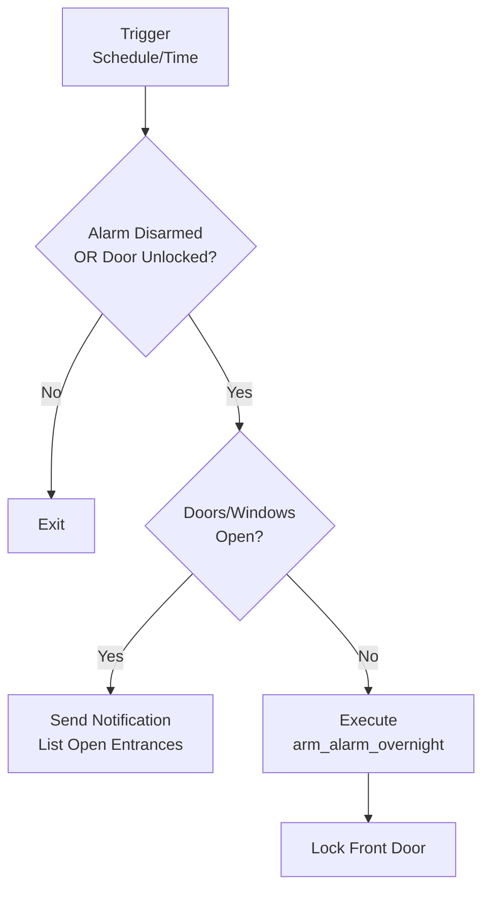
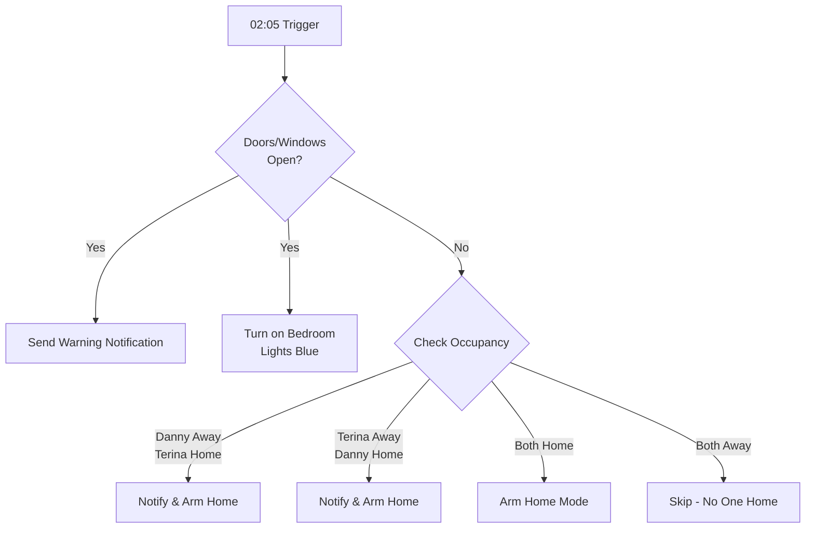
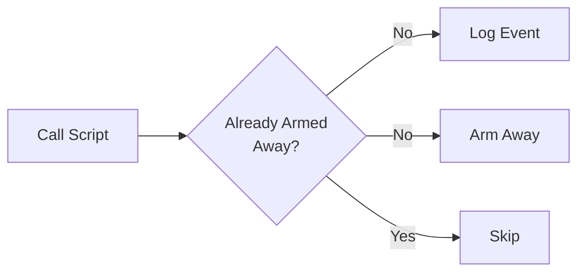
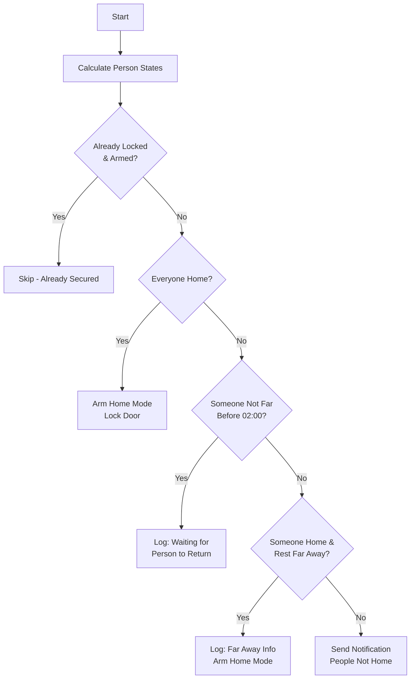
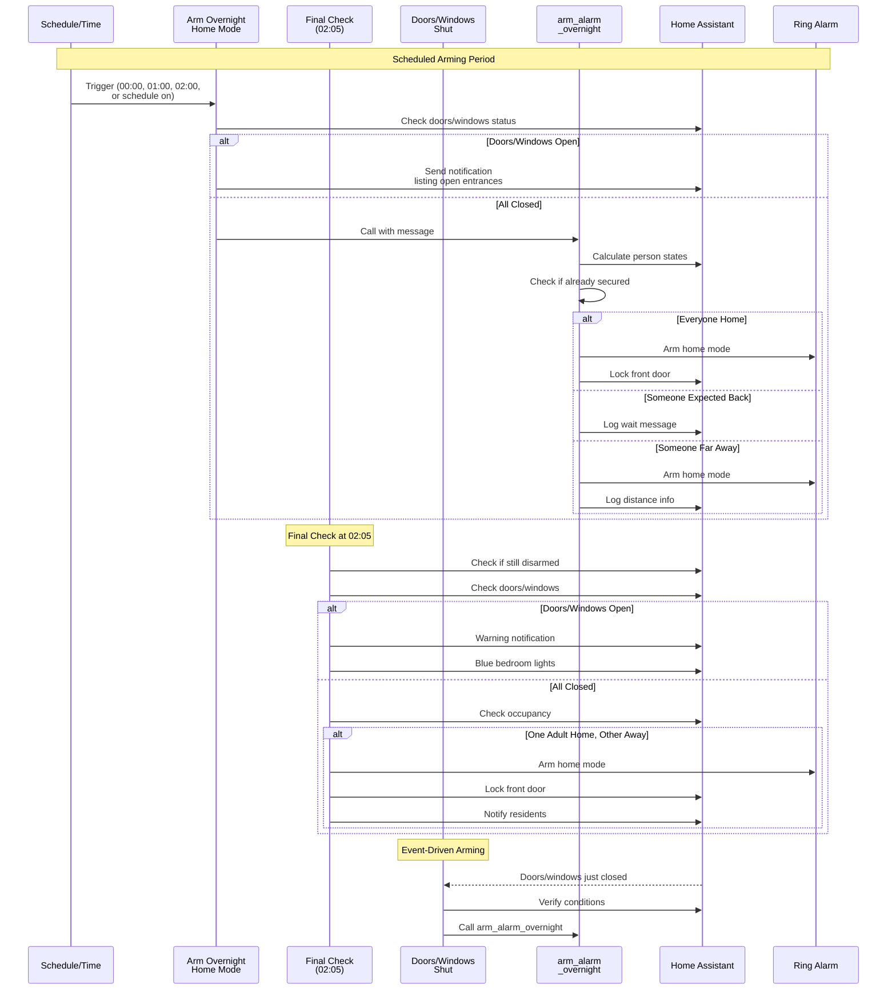

# Alarm System

Automated alarm control integrating Ring Alarm with Home Assistant for intelligent arming/disarming based on occupancy, time schedules, and door/window states.

---

## Overview

This package provides comprehensive alarm automation that handles:

- **Automatic overnight arming** based on schedule and occupancy
- **Smart presence detection** with distance-based logic for family members
- **Door/window validation** before arming
- **Multiple alarm modes** (home, away, disarmed)
- **Triggered alarm notifications** with actionable responses
- **Automatic recovery** from Ring MQTT disconnections

The system integrates with Ring Alarm via the [ring-mqtt](https://github.com/tsightler/ring-mqtt) add-on and coordinates with door locks, cameras, and heating systems.

---

## Architecture

---

## Entities

### Alarm Control Panel

| Entity | Description |
|--------|-------------|
| `alarm_control_panel.house_alarm` | Main Ring Alarm panel entity |

### Input Boolean

| Entity | Description |
|--------|-------------|
| `input_boolean.enable_alarm_automations` | Master switch to enable/disable all alarm automations |

### Binary Sensors

| Entity | Description |
|--------|-------------|
| `binary_sensor.alarmed_doors_and_windows` | Group sensor indicating if any alarmed doors/windows are open |

### Schedules

| Entity | Description |
|--------|-------------|
| `schedule.alarm_scheduled_home_mode` | Schedule defining when overnight arming should be active |

### Groups

| Entity | Description |
|--------|-------------|
| `group.adult_people` | Group of adult residents (Danny, Terina) |
| `group.all_tracked_people` | All tracked people including Leo |

### Person Entities

| Entity | Description |
|--------|-------------|
| `person.danny` | Danny's presence status |
| `person.terina` | Terina's presence status |
| `person.leo` | Leo's presence status |

### Distance Sensors

| Entity | Description |
|--------|-------------|
| `sensor.danny_home_nearest_distance` | Danny's distance from home (meters) |
| `sensor.terina_home_nearest_distance` | Terina's distance from home (meters) |
| `sensor.leo_home_nearest_distance` | Leo's distance from home (meters) |

### Lock

| Entity | Description |
|--------|-------------|
| `lock.front_door` | Front door smart lock |

---

## Automations

### Alarm: Disarmed

Triggered when the alarm is disarmed.

**Actions:**
- Logs disarm event to home log
- Turns off indoor cameras (debug log)
- Sets central heating to home mode

---

### Alarm: Arm Overnight Home Mode

Primary automation for automatically arming the alarm overnight.

**Triggers:**
- Schedule `alarm_scheduled_home_mode` turns on
- Time: 00:00, 01:00, 02:00
- Time pattern: Every 30 minutes between 00:00-01:59

**Conditions:**
- Alarm is disarmed OR front door is unlocked
- Alarm automations are enabled

**Logic:**

---

### Alarm: Arm Overnight Home Mode Final Check

Final attempt to arm the alarm at 02:05 if still disarmed.

**Triggers:**
- Time: 02:05:00

**Conditions:**
- Alarm is disarmed
- Automations enabled

**Logic:**

---

### Alarm: Arm Overnight When Doors And Windows Shut

Arms the alarm when all doors/windows close during the scheduled period.

**Triggers:**
- `binary_sensor.alarmed_doors_and_windows` changes from on to off (with 30s delay)

**Conditions:**
- Adult people are home
- Alarm is disarmed
- All doors/windows are closed
- Schedule is active
- Automations enabled

---

### Alarm: Armed

Triggered when alarm is set to away mode.

**Actions:**
- Logs arming event
- Turns on all cameras

---

### Alarm: Disconnected

Monitors for Ring Alarm disconnections.

**Triggers:**
- Alarm panel becomes `unavailable` for 1 minute

**Actions:**
- Sends direct notification to Danny

---

### Alarm: Disconnected For A Period Of Time

Attempts automatic recovery from extended disconnections.

**Triggers:**
- Alarm panel unavailable for 5 minutes

**Actions:**
- Logs recovery attempt
- Restarts Ring MQTT add-on
- Waits for reconnection
- Logs success or failure

---

### Alarm: Triggered

Handles alarm trigger events with immediate notifications.

**Triggers:**
- Alarm state changes to `triggered`

**Actions:**
- Sends direct notifications to all residents
- Sends actionable notification (Yes/No to turn off)
- Posts high-priority notification

---

## Scripts

### set_alarm_to_away_mode

Arms the alarm in away mode (all sensors active).

**Logic:**

### set_alarm_to_home_mode

Arms the alarm in home mode (door sensors only, motion sensors disabled).

### set_alarm_to_disarmed_mode

Disarms the alarm system.

### arm_alarm_overnight

Complex script handling overnight arming logic with presence detection.

**Person State Logic:**

**Person State Array:**
Each person is evaluated as a binary array `[home, far_away]`:
- `home`: Person state is "home"
- `far_away`: Distance > `input_number.long_distance_away_from_home` - 1 meter

**Decision Matrix:**

| Danny | Terina | Leo | Time | Action |
|-------|--------|-----|------|--------|
| Home | Home | Home | Any | Arm home mode |
| Not home + not far | Any | Any | Before 02:00 | Wait, check later |
| Far away | Home | Home | After 22:59 or before 02:00 | Arm home mode with log |
| Home | Far away | Home | After 22:59 or before 02:00 | Arm home mode with log |
| Not home + not far | Not home + not far | Not home + not far | Before 02:00 | Wait for return |

---

## Overnight Arming Flow

The complete overnight arming sequence:

---

## Dependencies

### Required Integrations

- **ring-mqtt**: Ring Alarm integration via MQTT
- **Home Assistant Companion App**: For person tracking and notifications

### Required Scripts

- `script.send_to_home_log` - Logging to home log
- `script.send_direct_notification` - Direct notifications to people
- `script.send_actionable_notification_with_2_buttons` - Actionable notifications
- `script.post_home_assistant_direct_notification` - High-priority notifications
- `script.get_clock_emoji` - Clock emoji for time-based messages
- `script.set_central_heating_to_home_mode` - Heating control
- `script.lock_front_door` - Door locking

### Required Input Helpers

- `input_boolean.enable_alarm_automations` - Master enable switch
- `input_number.long_distance_away_from_home` - Distance threshold (meters)
- `input_text.restart_ring_mqtt_add_on_timeout` - Timeout for add-on restart

---

## Configuration

### Schedule Setup

Create a schedule helper named `alarm_scheduled_home_mode` to define when overnight arming should be active. Typically set for evening hours (e.g., 22:00 - 06:00).

### Distance Threshold

Set `input_number.long_distance_away_from_home` to define how far someone must be to be considered "far away" (default in miles for notifications, meters for calculation).

### Enabling Automations

All automations check `input_boolean.enable_alarm_automations` before executing. This provides a master kill-switch for all alarm-related automation.

---

## Notes

- The system uses **home mode** for overnight arming (door sensors only) to allow movement inside without triggering
- **Away mode** is used when leaving the house (all sensors including motion)
- The 30-second delay on door/window close trigger prevents false triggers from brief openings
- Final check at 02:05 is a safety net for residents who may be out late
- Ring MQTT add-on restart is attempted automatically after 5 minutes of disconnection
