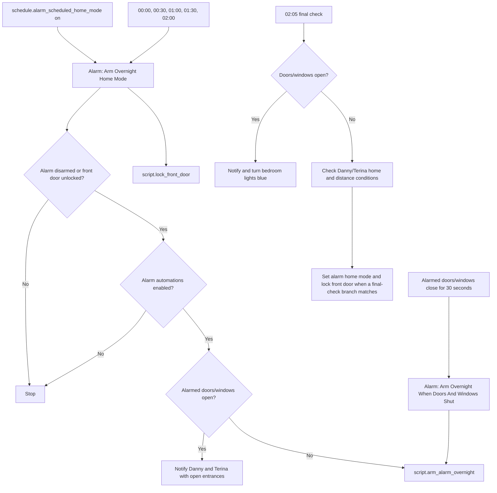
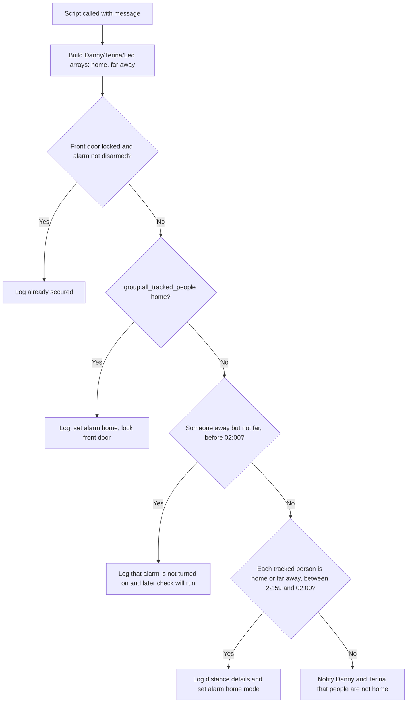

[<- Back to Integrations README](README.md) · [Packages README](../README.md) · [Main README](../../README.md)

# Alarm Package Documentation

The alarm package coordinates Ring Alarm overnight arming, disarming side effects, triggered-alarm notifications, and Ring MQTT recovery. For everyday use, it tries to arm the house in home mode overnight, checks that alarmed doors and windows are closed, accounts for tracked people who may still be nearby, locks the front door, and alerts the family if the alarm triggers or becomes unavailable.

Integration: [ring-mqtt](https://github.com/tsightler/ring-mqtt)

| File | Purpose | Contents |
|------|---------|----------|
| `alarm.yaml` | Ring Alarm automation and helper scripts | 8 automations, 4 scripts |

## Quick Summary

| Area | What Happens |
|------|--------------|
| Overnight arming | A schedule and late-night time checks attempt to arm home mode when conditions are safe. |
| Door/window safety | Open alarmed doors or windows block normal overnight arming and notify Danny and Terina. |
| Presence logic | `script.arm_alarm_overnight` compares home state and distance-from-home sensors for Danny, Terina, and Leo. |
| Final check | At 02:05, a final safety-net check can notify, flash bedroom lights blue, arm home mode, and lock the front door depending on doors/windows and adult presence. |
| Triggered alarm | A triggered alarm sends direct, actionable, and high-priority Home Assistant notifications. |
| Ring MQTT recovery | If the alarm panel is unavailable for 5 minutes, the Ring MQTT add-on is restarted and success/failure is logged. |

## How Overnight Arming Works

## User Controls

| Entity | Plain-English Purpose |
|--------|-----------------------|
| `input_boolean.enable_alarm_automations` | Master switch for all eight alarm automations. The scripts themselves do not all check this helper. |
| `schedule.alarm_scheduled_home_mode` | Defines the overnight arming period used by scheduled and door/window-closed arming. |
| `input_number.long_distance_away_from_home` | Distance threshold used to decide whether an away person is far enough away that the alarm can still arm. |
| `input_text.restart_ring_mqtt_add_on_timeout` | Wait timeout after restarting the Ring MQTT add-on. |

## Main Entities Used

| Entity | Purpose |
|--------|---------|
| `alarm_control_panel.house_alarm` | Main Ring Alarm panel. |
| `binary_sensor.alarmed_doors_and_windows` | Aggregate sensor for alarmed doors/windows being open. |
| `lock.front_door` | Lock checked and locked during overnight routines. |
| `group.adult_people` | Used by the door/window-closed arming automation. |
| `group.all_tracked_people` | Used by `script.arm_alarm_overnight` to detect everyone home. |
| `person.danny`, `person.terina`, `person.leo` | Presence entities used for arming decisions and notifications. |
| `sensor.danny_home_nearest_distance`, `sensor.terina_home_nearest_distance`, `sensor.leo_home_nearest_distance` | Distance sensors used by arming logic. |

## Automations

| Automation | Trigger | Conditions | Result |
|------------|---------|------------|--------|
| `Alarm: Disarmed` | Alarm panel changes to `disarmed` | Alarm automations enabled | Logs disarm, logs a debug indoor-camera message, and runs `script.set_central_heating_to_home_mode`. |
| `Alarm: Arm Overnight Home Mode` | Schedule turns on; 00:00; every 30 minutes during hours 0 and 1; 01:00; 02:00 | Alarm is disarmed or front door is not locked; alarm automations enabled | Notifies if openings are present, otherwise calls `script.arm_alarm_overnight`; then calls `script.lock_front_door`. |
| `Alarm: Arm Overnight Home Mode Final Check` | 02:05 | Alarm disarmed; alarm automations enabled | Warns if openings remain. If openings are closed, selected Danny/Terina presence branches notify, arm home mode, and lock the front door. |
| `Alarm: Arm Overnight When Doors And Windows Shut` | Alarmed doors/windows change from `on` to `off` for 30 seconds | Adult people home; alarm disarmed; openings closed; schedule active; alarm automations enabled | Calls `script.arm_alarm_overnight` with a closed-openings message. |
| `Alarm: Armed` | Alarm panel changes to `armed_away` | Alarm automations enabled | Logs away-mode arming and camera text to the home log. |
| `Alarm: Disconnected` | Alarm panel is `unavailable` for 1 minute | Alarm automations enabled | Sends Danny and Terina a direct notification. |
| `Alarm: Disconnected For A Period Of Time` | Alarm panel is `unavailable` for 5 minutes | Alarm automations enabled | Logs, restarts add-on `fdb328a7_ring_mqtt`, waits for recovery, then logs success or failure. |
| `Alarm: Triggered` | Alarm panel changes to `triggered` | Alarm automations enabled | Sends direct notifications to Danny, Terina, and Leo; sends Danny and Terina a Yes/No actionable notification; posts a high-priority Home Assistant direct notification. |

## Scripts

| Script | Mode | Result |
|--------|------|--------|
| `script.set_alarm_to_away_mode` | `single` | If not already `armed_away`, logs and calls `alarm_control_panel.alarm_arm_away`. |
| `script.set_alarm_to_disarmed_mode` | `single` | If not already `disarmed`, logs and calls `alarm_control_panel.alarm_disarm`. |
| `script.set_alarm_to_home_mode` | `single` | If not already `armed_home`, logs and calls `alarm_control_panel.alarm_arm_home`. |
| `script.arm_alarm_overnight` | `single` | Applies the overnight presence/distance decision tree, then logs, arms home mode, locks the front door, or notifies depending on the branch. |

## `arm_alarm_overnight` Decision Tree

Power-user detail: each person is represented as `[home, far_away]`, where `far_away` means the relevant distance sensor is greater than `input_number.long_distance_away_from_home - 1`.

## External Scripts And Services Used

| Dependency | Used For |
|------------|----------|
| `script.send_to_home_log` | Normal/debug logging. |
| `script.send_direct_notification` | Direct resident notifications. |
| `script.send_actionable_notification_with_2_buttons` | Triggered-alarm Yes/No prompt. |
| `script.post_home_assistant_direct_notification` | High-priority triggered-alarm notification. |
| `script.get_clock_emoji` | Clock emoji used in some late-night messages. |
| `script.set_central_heating_to_home_mode` | Heating response after disarm. |
| `script.lock_front_door` | Door locking during arming routines. |
| `hassio.addon_restart` | Ring MQTT add-on recovery. |

## Troubleshooting

| Symptom | Check |
|---------|-------|
| Overnight alarm did not arm | Check `input_boolean.enable_alarm_automations`, `binary_sensor.alarmed_doors_and_windows`, `schedule.alarm_scheduled_home_mode`, person states, and distance sensors in the automation trace. |
| Notification lists open entrances | One or more entities inside `binary_sensor.alarmed_doors_and_windows` were `on`; close them and the door/window-closed automation can retry after 30 seconds if the schedule is active. |
| Front door did not lock | This package calls `script.lock_front_door`; check the Nuki package and `input_boolean.enable_front_door_lock_automations`. |
| Alarm unavailable recovery failed | Review `Alarm: Disconnected For A Period Of Time`, the add-on slug `fdb328a7_ring_mqtt`, and `input_text.restart_ring_mqtt_add_on_timeout`. |
| Expected cameras to actually toggle | Current YAML only logs camera-related messages in this package; it does not call camera enable/disable services. |
