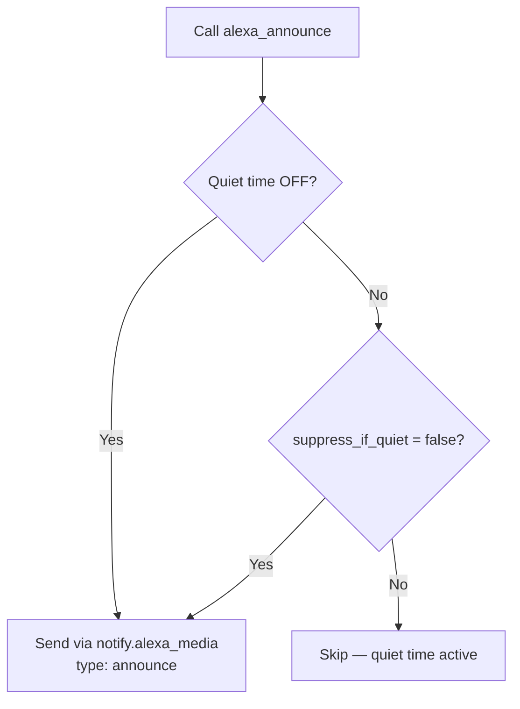

[<- Back to Integrations README](../README.md) · [Packages README](../../README.md) · [Main README](../../../README.md)

# Alexa

Alexa TTS and announcement scripts using the [alexa_media_player](https://github.com/custom-components/alexa_media_player) HACS integration.

---

## Overview

Two reusable scripts wrap the `notify.alexa_media` service to provide TTS delivery to Echo devices throughout the house:

- **`alexa_announce`** — plays the announcement chime tone before speaking the message. Respects quiet hours via `schedule.notification_quiet_time`.
- **`alexa_tts`** — speaks the message without any tone.

Both scripts default to `media_player.everywhere` when no target is specified, broadcasting to all Echo devices.

---

## Scripts

| Script | Alias | Tone | Quiet Hours Aware |
|--------|-------|------|-------------------|
| `script.alexa_announce` | Send Alexa announcement | Yes (bong) | Yes |
| `script.alexa_tts` | Send Alexa TTS | No | No |

### alexa_announce

**Fields:**

| Field | Required | Default | Description |
|-------|----------|---------|-------------|
| `message` | Yes | — | Text to speak |
| `title` | No | — | Optional title |
| `target` | No | `media_player.everywhere` | Echo device(s) to target |
| `method` | No | `speak` | `speak` (TTS only) or `all` (TTS + screen display) |
| `suppress_if_quiet` | No | `true` | If `true`, skip delivery during quiet hours |

### alexa_tts

Speaks without announcement tone. No quiet-hours check — callers are responsible for gate-keeping.

**Fields:**

| Field | Required | Default | Description |
|-------|----------|---------|-------------|
| `message` | Yes | — | Text to speak |
| `title` | No | — | Optional title |
| `target` | No | `media_player.everywhere` | Echo device(s) to target |

---

## Entities

| Entity | Description |
|--------|-------------|
| `media_player.everywhere` | All Echo devices (default target) |
| `schedule.notification_quiet_time` | Quiet hours schedule — gates `alexa_announce` delivery |

---

## Dependencies

- **HACS Integration:** [alexa_media_player](https://github.com/custom-components/alexa_media_player)
- **notify service:** `notify.alexa_media`

---

*Last updated: 2026-04-05*
