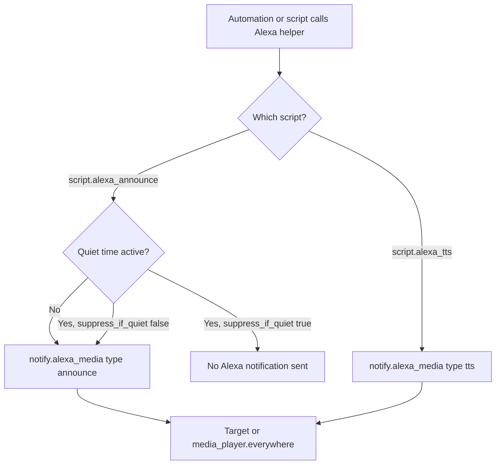

[<- Back to Integrations README](README.md) · [Packages README](../README.md) · [Main README](../../README.md)

# Alexa Package Documentation

The Alexa package provides reusable speech scripts for Echo devices. Other automations can call these scripts instead of talking directly to `notify.alexa_media`, which keeps announcements consistent across the house.

This documentation covers one YAML file:

| File | Purpose | Contents |
|------|---------|----------|
| `alexa.yaml` | Alexa speech helpers | 2 scripts |

## Quick Summary

For non-technical users, the important behavior is:

| Area | What Happens |
|------|--------------|
| Announcements | `script.alexa_announce` speaks a message with the Alexa announcement sound first. |
| Quiet hours | Announcements are skipped while `schedule.notification_quiet_time` is on unless the caller explicitly disables suppression. |
| Plain speech | `script.alexa_tts` speaks a message without the announcement sound and does not check quiet hours. |
| Default target | Both scripts default to `media_player.everywhere` if no target is supplied. |

## How Alexa Speech Is Routed

## Scripts

| Script | Alias | Purpose | Quiet Hours |
|--------|-------|---------|-------------|
| `script.alexa_announce` | Send Alexa announcement | Sends an Alexa announcement using `notify.alexa_media` with `type: announce`. | Yes, controlled by `suppress_if_quiet`. |
| `script.alexa_tts` | Send Alexa TTS | Sends plain Alexa text-to-speech using `notify.alexa_media` with `type: tts`. | No. |

### `script.alexa_announce`

Fields:

| Field | Required | Default | Description |
|-------|----------|---------|-------------|
| `message` | Yes | None | Text to speak. |
| `title` | No | None | Defined as a script field, but not used in the current notify payload. |
| `target` | No | `media_player.everywhere` | Echo media player target. |
| `method` | No | `speak` | Announcement method passed to Alexa. YAML allows `speak` or `all`. |
| `suppress_if_quiet` | No | `true` | If true, skip the announcement while quiet time is on. |

Delivery rules:

| Situation | Result |
|-----------|--------|
| `schedule.notification_quiet_time` is `off` | Announcement is sent. |
| Quiet time is `on` and `suppress_if_quiet` is `false` | Announcement is sent. |
| Quiet time is `on` and `suppress_if_quiet` is `true` or omitted | Announcement is skipped. |

The notify action uses `continue_on_error: true`, so a temporary Alexa Media failure should not stop the caller's remaining actions.

### `script.alexa_tts`

Fields:

| Field | Required | Default | Description |
|-------|----------|---------|-------------|
| `message` | Yes | None | Text to speak. |
| `title` | No | None | Defined as a script field, but not used in the current notify payload. |
| `target` | No | `media_player.everywhere` | Echo media player target. |

`script.alexa_tts` does not check quiet hours. Use `script.alexa_announce` with `suppress_if_quiet` when speech should respect quiet time.

## Entities And Services

| Entity or Service | Purpose |
|-------------------|---------|
| `notify.alexa_media` | Alexa Media Player notify service used by both scripts. |
| `media_player.everywhere` | Default target when no Echo target is supplied. |
| `schedule.notification_quiet_time` | Quiet-hours guard used by `script.alexa_announce`. |

## Dependencies

| Dependency | Purpose |
|------------|---------|
| Alexa Media Player HACS integration | Provides `notify.alexa_media` and Alexa media player entities. |

Integration reference: <https://github.com/custom-components/alexa_media_player>

## Troubleshooting

| Symptom | Check |
|---------|-------|
| Announcement does not play | Check whether `schedule.notification_quiet_time` is `on` and whether the caller omitted `suppress_if_quiet: false`. |
| TTS works but announcement does not | Verify Alexa Media Player supports announcements for the target device and that `method` is one of `speak` or `all`. |
| Message goes to every Echo | Confirm the caller supplied `target`; otherwise the script intentionally defaults to `media_player.everywhere`. |
| Caller expects a title to appear | The `title` field exists for both scripts but is not currently passed to `notify.alexa_media`. |
