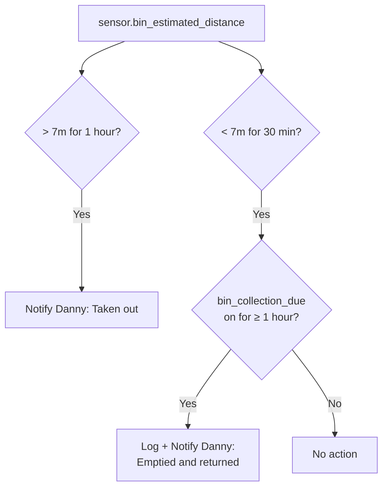
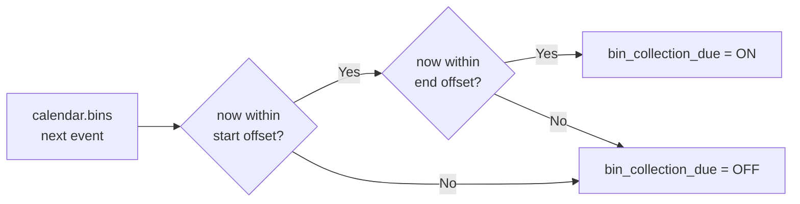

[<- Back to Integrations README](README.md) · [Packages README](../README.md) · [Main README](../../README.md)

# Bins

Bin collection monitoring using an estimated distance sensor to detect when the bin leaves and returns to the property.

---

## Overview

Two automations notify Danny about bin collection events. Distance statistics sensors provide smoothed readings used to detect movement. A template binary sensor tracks whether the current time falls within the collection window defined by configurable offset helpers.

---

## Automations

| ID | Alias | Trigger | Condition | Action |
|----|-------|---------|-----------|--------|
| `1714779045289` | Bin: Taken Out | `sensor.bin_estimated_distance` > 7 m for 1 hour | None | Direct notification to Danny: "Taken out" |
| `1736801234567` | Bin: Emptied And Returned | `sensor.bin_estimated_distance` < 7 m for 30 min | `binary_sensor.bin_collection_due` on for ≥ 1 hour | Home log + direct notification to Danny: "Emptied and returned home" |

---

## Sensors

### Statistics Sensors

| Sensor Name | Characteristic | Window | Sampling Size |
|-------------|---------------|--------|---------------|
| Bin Distance Change Sample | `change_sample` | all history | 100 |
| Bin Distance 95 Percent | `distance_95_percent_of_values` | all history | 100 |
| Bin Distance 95 Percent Over 5 Minutes | `distance_95_percent_of_values` | 5 min | 50 |
| Bin Distance Change Over 5 minutes | `change` | 5 min | 50 |
| Bin Distance Change Over 1 minutes | `change` | 1 min | 25 |

All statistics sensors are derived from `sensor.bin_estimated_distance`.

### Template Binary Sensor

**`binary_sensor.bin_collection_due`**

Returns `on` when the current time is within the collection notification window:

- `start`: within `input_number.bin_collection_notification_start_offset` hours before the calendar event start
- `end`: within `input_number.bin_collection_notification_end_offset` hours after the calendar event end

---

## Entities

| Entity | Description |
|--------|-------------|
| `sensor.bin_estimated_distance` | Estimated distance of bin from home (metres) |
| `binary_sensor.bin_collection_due` | True when within the collection notification window |
| `calendar.bins` | Bin collection calendar (provides start/end times) |
| `input_number.bin_collection_notification_start_offset` | Hours before collection start to begin window |
| `input_number.bin_collection_notification_end_offset` | Hours after collection end to close window |

---

## Dependencies

- **Scripts:** `script.send_to_home_log`, `script.send_direct_notification`
- **Person:** `person.danny` (notification recipient)
- **Calendar:** `calendar.bins`

---

*Last updated: 2026-04-05*
