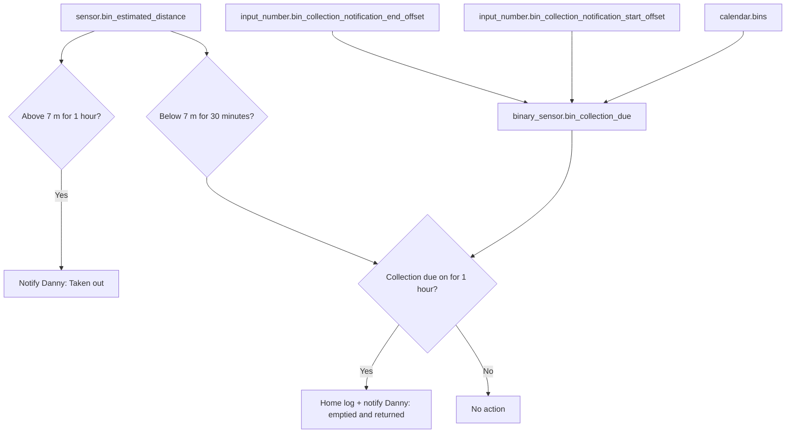

[<- Back to Integrations README](README.md) · [Packages README](../README.md) · [Main README](../../README.md)

# Bins Package Documentation

The bins package watches the bin's estimated distance from home so Danny gets useful reminders around collection day. It can notify when the bin has been taken out, and when it appears to have been emptied and returned during the configured collection window.

This documentation covers `bins.yaml`.

| File | Purpose | Contents |
|------|---------|----------|
| `bins.yaml` | Bin distance monitoring and collection-window helper | 2 automations, 5 statistics sensors, 1 template binary sensor |

## Quick Summary

For non-technical users, the important behavior is:

| Area | What Happens |
|------|--------------|
| Taken out alert | If `sensor.bin_estimated_distance` stays above 7 m for 1 hour, Danny gets a direct notification saying the bin was taken out. |
| Returned alert | If the bin stays below 7 m for 30 minutes while collection is due, the event is logged and Danny gets a direct notification. |
| Collection window | `binary_sensor.bin_collection_due` turns on around the `calendar.bins` event using configurable start and end offsets. |
| Distance history | Five statistics sensors smooth and summarize the distance sensor for monitoring and debugging. |

## How It Decides What To Do

## Everyday Behavior

| Situation | Result |
|-----------|--------|
| Bin distance is above 7 m for 1 hour | `Bin: Taken Out` sends `Taken out.` to `person.danny`. |
| Bin distance is below 7 m for 30 minutes and collection due has been on for 1 hour | `Bin: Emptied And Returned` logs the returned distance and notifies `person.danny`. |
| Outside the configured collection window | The returned-bin automation does not run, even if the distance drops below 7 m. |

## Technical Reference

### Automations

| ID | Alias | Trigger | Conditions | Actions | Mode |
|----|-------|---------|------------|---------|------|
| `1714779045289` | `Bin: Taken Out` | `sensor.bin_estimated_distance` above `7` for 1 hour | None | `script.send_direct_notification` to `person.danny` | `single` |
| `1736801234567` | `Bin: Emptied And Returned` | `sensor.bin_estimated_distance` below `7` for 30 minutes | `binary_sensor.bin_collection_due` on for 1 hour | Parallel home-log entry and direct notification to `person.danny` | `single` |

### Sensors

All statistics sensors are derived from `sensor.bin_estimated_distance` and use precision `2`.

| Sensor Name | Characteristic | Window | Sampling Size |
|-------------|----------------|--------|---------------|
| `Bin Distance Change Sample` | `change_sample` | No `max_age` configured | 100 |
| `Bin Distance 95 Percent` | `distance_95_percent_of_values` | No `max_age` configured | 100 |
| `Bin Distance 95 Percent Over 5 Minutes` | `distance_95_percent_of_values` | 5 minutes | 50 |
| `Bin Distance Change Over 5 minutes` | `change` | 5 minutes | 50 |
| `Bin Distance Change Over 1 minutes` | `change` | 1 minute | 25 |

### Template Binary Sensor

| Entity | Logic |
|--------|-------|
| `binary_sensor.bin_collection_due` | On when now is within the `calendar.bins` event window after applying `input_number.bin_collection_notification_start_offset` and `input_number.bin_collection_notification_end_offset`. |

## Important Entities

| Entity | Used For |
|--------|----------|
| `sensor.bin_estimated_distance` | Main distance measurement used by both automations and all statistics sensors. |
| `binary_sensor.bin_collection_due` | Gate for the returned-bin notification. |
| `calendar.bins` | Supplies the next collection event start and end times. |
| `input_number.bin_collection_notification_start_offset` | Hours before the calendar start when collection should be considered due. |
| `input_number.bin_collection_notification_end_offset` | Hours after the calendar end when collection should stop being considered due. |
| `person.danny` | Direct notification recipient. |

## Troubleshooting

| Symptom | First Things To Check |
|---------|-----------------------|
| No taken-out alert | Check `sensor.bin_estimated_distance` exceeded `7` continuously for 1 hour. |
| No returned alert | Check `binary_sensor.bin_collection_due` has been `on` for at least 1 hour and distance stayed below `7` for 30 minutes. |
| Collection window looks wrong | Check `calendar.bins` start/end attributes and both bin collection offset helpers. |
| Distance looks noisy | Compare the raw distance sensor with the five `Bin Distance ...` statistics sensors. |

*Last updated: 2026-06-27*
