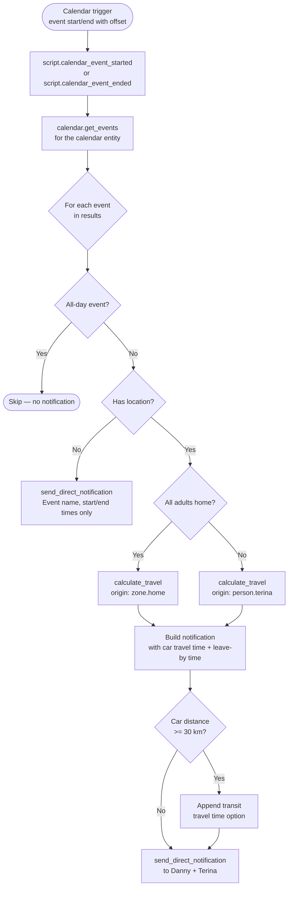

[<- Back to Integrations README](../README.md) · [Packages README](../../README.md) · [Main README](../../../README.md)

# Calendar — Google Calendar Event Notifications

*Last updated: 2026-04-05*

Sends advance notifications for family and children's calendar events. For events with a location, calculates driving travel time and conditionally includes public transit options for longer journeys. Notifications go to both Danny and Terina (or Danny only for no-location events).

Integration references: Google Calendar, Google Travel Time

---

## Event Notification Flow

---

## Automations

| Name | ID | Calendar Entity | Trigger Offset | Script Called |
|---|---|---|---|---|
| Calendar: Family | `1654008759007` | `calendar.family` | −1 hour before start | `script.calendar_event_started` |
| Calendar: Children Start Event | `1654008759008` | `calendar.tsang_children` | −1 hour before start | `script.calendar_event_started` |
| Calendar: Children End Event | `1654008759009` | `calendar.tsang_children` | −30 minutes before end | `script.calendar_event_ended` |

All automations run in `queued` mode with 20 stored traces.

---

## Scripts

### `calendar_event_started`

Alias: *Calendar event Started*

Fetches upcoming events from the given calendar and notifies for each non-all-day event. Includes travel information when a location is present.

| Field | Required | Default | Description |
|---|---|---|---|
| `calendar_id` | Yes | — | Calendar entity ID (target selector; uses first entity) |
| `start_date_time` | Yes | `now()` | Datetime to begin the event search window |
| `duration` | No | `1:0:0` | Hours to search forward for events |

### `calendar_event_ended`

Alias: *Calendar event Ended*

Same logic as `calendar_event_started` but triggered near event end. Excludes events whose summary contains `school` (via `excluded_event_names` variable).

| Field | Required | Default | Description |
|---|---|---|---|
| `calendar_id` | Yes | — | Calendar entity ID |
| `start_date_time` | Yes | `now()` | Datetime to begin the event search window |
| `duration` | No | `1:0:0` | Hours to search forward |

---

## Notification Content

| Event Type | Notification Includes |
|---|---|
| Non-all-day, no location | Event name, start time, end time |
| Non-all-day, with location | Event name, location, start/end times, car travel time, leave-by time (+ transit if distance ≥ 30 km) |
| All-day event | No notification sent |

Travel buffers are sourced from `input_datetime.travel_start_time_buffer` and `input_datetime.travel_end_time_buffer`.

---

## Dependencies

- `calendar.family`, `calendar.tsang_children` — Google Calendar entities
- `script.calculate_travel` — resolves travel time and distance via Google Travel Time
- `sensor.google_travel_time_by_car`, `sensor.google_travel_time_by_transit` — travel time sensors
- `group.all_adult_people` — used to determine travel origin (home vs person.terina's location)
- `input_datetime.travel_start_time_buffer`, `input_datetime.travel_end_time_buffer` — configurable departure buffer times
- `script.send_direct_notification` — sends push notification to Danny and/or Terina
