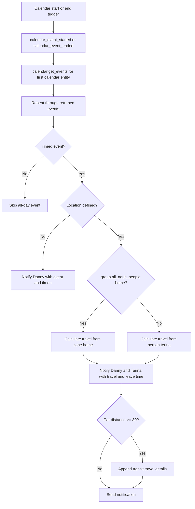

[<- Back to Integrations README](README.md) · [Packages README](../README.md) · [Main README](../../README.md)

# Calendar Package Documentation

The calendar package sends family event reminders before calendar events start or end. For timed events with a location, it calculates travel from home or Terina's current location and includes a suggested leave time.

This documentation covers `calendar.yaml`.

| File | Purpose | Contents |
|------|---------|----------|
| `calendar.yaml` | Family and children calendar notifications | 3 automations, 2 scripts |

## Quick Summary

For non-technical users, the important behavior is:

| Area | What Happens |
|------|--------------|
| Family calendar | Events on `calendar.family` trigger a reminder 1 hour before the event starts. |
| Children calendar start | Events on `calendar.tsang_children` trigger a reminder 1 hour before the event starts. |
| Children calendar end | Events on `calendar.tsang_children` trigger a reminder 30 minutes before the event ends. |
| Travel details | If an event has a location, the notification includes car travel details and a leave time. |
| Long journeys | If the car distance sensor reports at least 30 km, transit travel details are appended too. |

## How Calendar Notifications Work

## Everyday Behavior

| Situation | Result |
|-----------|--------|
| Timed event with no location | Danny receives a direct notification with calendar name, event name, start time, and end time. |
| Timed event with a location | Danny and Terina receive a direct notification with event details, location, car travel time, distance, and leave time. |
| Car distance is at least 30 according to `sensor.google_travel_time_by_car` | Transit travel time and distance are added to the location notification. |
| All adults are home | Travel is calculated from `zone.home`. |
| Not all adults are home | Travel is calculated from `person.terina`. |
| All-day event | No notification branch matches, so no notification is sent. |

Power-user note: `calendar_event_ended` defines an `excluded_event_names` variable containing `school`, but the YAML does not currently apply that variable in any condition or template.

## Technical Reference

### Automations

| ID | Alias | Calendar | Trigger | Action | Mode |
|----|-------|----------|---------|--------|------|
| `1654008759007` | `Calendar: Family` | `calendar.family` | Event start, offset `-1:0:0` | Calls `script.calendar_event_started` | `queued` |
| `1654008759008` | `Calendar: Children Start Event` | `calendar.tsang_children` | Event start, offset `-1:0:0` | Calls `script.calendar_event_started` | `queued` |
| `1654008759009` | `Calendar: Children End Event` | `calendar.tsang_children` | Event end, offset `-0:30:0` | Calls `script.calendar_event_ended` | `queued` |

All three automations store 20 traces.

### Scripts

| Script | Alias | Purpose | Mode |
|--------|-------|---------|------|
| `script.calendar_event_started` | `Calendar event Started` | Gets events from the target calendar and sends start-related notifications. | `queued` |
| `script.calendar_event_ended` | `Calendar event Ended` | Gets events from the target calendar and sends end-related notifications. | `queued` |

Both scripts define the same fields:

| Field | Required In Selector | Runtime Default | Notes |
|-------|----------------------|-----------------|-------|
| `calendar_id` | Yes | None | Target selector; the script uses the first entity in `calendar_id.entity_id`. |
| `start_date_time` | Yes | `now()` | Used as the `calendar.get_events` search start when not supplied. |
| `duration` | No | `1:0:0` | Search duration for `calendar.get_events`. |

## Important Entities

| Entity | Used For |
|--------|----------|
| `calendar.family` | Family start-event reminder source. |
| `calendar.tsang_children` | Children start and end reminder source. |
| `group.all_adult_people` | Chooses travel origin. |
| `zone.home` | Travel origin when all adults are home. |
| `person.terina` | Travel origin when not all adults are home. |
| `person.danny` | Notification recipient for all event notifications. |
| `sensor.google_travel_time_by_car` | Supplies car mode and distance attributes used in the notification. |
| `sensor.google_travel_time_by_transit` | Supplies transit mode, time, and distance when the car distance is at least 30. |
| `input_datetime.travel_start_time_buffer` | Buffer added into the leave-time calculation. |
| `input_datetime.travel_end_time_buffer` | Buffer added into the leave-time calculation. |

## Troubleshooting

| Symptom | First Things To Check |
|---------|-----------------------|
| No reminder arrives | Check the calendar trigger offset, whether `calendar.get_events` returns the event in the 1-hour search window, and automation traces. |
| Travel details are missing | Confirm the event has a `location` field and `script.calculate_travel` returned data. |
| Notification goes only to Danny | That is expected for timed events without a location. |
| Transit details are missing | Check the `distance` attribute on `sensor.google_travel_time_by_car`; transit is only included when its numeric value is at least 30. |
| Leave time looks wrong | Check `input_datetime.travel_start_time_buffer` and `input_datetime.travel_end_time_buffer`. |

*Last updated: 2026-06-27*
