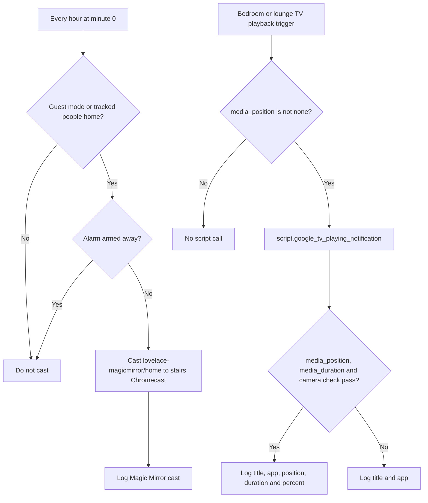

[<- Back to Integrations README](README.md) · [Packages README](../README.md) · [Main README](../../README.md)

# Chromecast Package Documentation

The Chromecast package keeps the stairs Magic Mirror displaying the Home Assistant dashboard and records useful Google TV playback starts in the home log.

This documentation covers one YAML file:

| File | Purpose | Contents |
|------|---------|----------|
| `chromecast.yaml` | Cast and Google TV logging | 2 automations, 1 script |

## Quick Summary

For non-technical users, the important behavior is:

| Area | What Happens |
|------|--------------|
| Magic Mirror | Every hour, Home Assistant is cast to the stairs Chromecast when someone is home or the house is in guest mode. |
| Alarm guard | The Magic Mirror cast is skipped while the house alarm is armed away. |
| Google TV logging | When the lounge or bedroom Google TV starts playing, playback details are written to the home log. |
| Progress details | If position and duration metadata are available, the log includes progress and percentage complete. |

## How Chromecast Events Flow

## Automations

| ID | Alias | Trigger | Main Conditions | Action |
|----|-------|---------|-----------------|--------|
| `1647307174048` | Stairs: Check Magic Mirror Is Casting Home Assistant | Time pattern, every hour at minute `0`. | `input_select.home_mode` is `guest` or `group.tracked_people` is `home`; `alarm_control_panel.house_alarm` is not `armed_away`. | Logs the cast attempt and calls `cast.show_lovelace_view` for `media_player.stairs_chromecast`. |
| `1672397019959` | Chromecast: Google TV Turned Playing | `media_player.lounge_tv` or `media_player.bedroom_tv` state changes to `playing`; also listens for `media_title` or `app_name` attribute changes to `playing`. | Triggering media player has `media_position` not equal to `none`. | Calls `script.google_tv_playing_notification` with the triggering entity. |

### Magic Mirror Cast

The hourly Magic Mirror automation runs both actions in parallel:

| Action | Details |
|--------|---------|
| Log | Sends `Casting Home Assistant.` to `script.send_to_home_log` with title `:mirror: Magic Mirror` and debug level. |
| Cast | Calls `cast.show_lovelace_view` for dashboard path `lovelace-magicmirror` and view path `home`. |

### Google TV Playing

The Google TV automation is queued with `max: 10`, so bursts of playback metadata updates can be processed without dropping immediately.

The automation only calls the script when the triggering player has `media_position` not equal to `none`. This avoids logging some incomplete playback starts.

## Script

### `script.google_tv_playing_notification`

Alias: Google TV Basic Notification

| Field | Required | Description |
|-------|----------|-------------|
| `entity_id` | Yes | Chromecast or Google TV media player entity to inspect. |

The script builds a log title from the entity ID:

| Entity | Log Title |
|--------|-----------|
| `media_player.lounge_tv` | `:couch_and_lamp: Living Room` |
| `media_player.bedroom_tv` | `🛏️ Bedroom` |
| Any other entity | `⚠️ Unknown device <entity_id>` |

When `media_position`, `media_duration`, and the current YAML `camera != none` template checks pass, the log message includes title, app name, current position, total duration, and percentage complete. The script does not define a `camera` field, so this is documented as current YAML behavior rather than a required script input. Otherwise, the default branch logs only the media title and app name.

## Entities And Services

| Entity or Service | Purpose |
|-------------------|---------|
| `media_player.stairs_chromecast` | Stairs Magic Mirror cast target. |
| `media_player.lounge_tv` | Lounge Google TV playback source. |
| `media_player.bedroom_tv` | Bedroom Google TV playback source. |
| `input_select.home_mode` | Allows Magic Mirror casting in guest mode. |
| `group.tracked_people` | Allows Magic Mirror casting when someone is home. |
| `alarm_control_panel.house_alarm` | Prevents Magic Mirror casting while armed away. |
| `cast.show_lovelace_view` | Cast service for displaying a Lovelace view. |
| `script.send_to_home_log` | Structured logging helper. |

Integration reference: <https://www.home-assistant.io/integrations/cast/>

## Troubleshooting

| Symptom | Check |
|---------|-------|
| Magic Mirror does not cast | Confirm someone is home or `input_select.home_mode` is `guest`, and the alarm is not `armed_away`. |
| Magic Mirror casts the wrong page | Check dashboard path `lovelace-magicmirror` and view path `home` still exist. |
| TV starts playing but no log appears | Check whether the triggering media player has `media_position` not equal to `none` at the time of the trigger. |
| TV log appears without progress details | Check whether `media_duration` is available and inspect the current `camera != none` template checks in the detailed logging branch. |
| Log title says unknown device | The script only has friendly titles for `media_player.lounge_tv` and `media_player.bedroom_tv`. |
