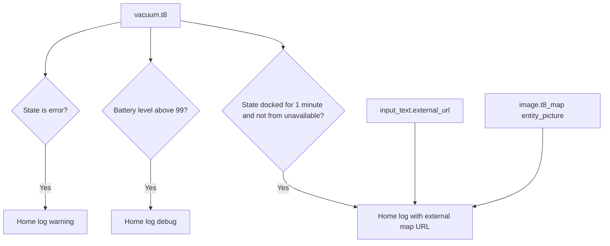

[<- Back to Integrations README](README.md) · [Packages README](../README.md) · [Main README](../../README.md)

# Cleaning Package Documentation

The cleaning package monitors the Deebot T8 robot vacuum and records useful vacuum lifecycle events in the home log. It also defines a REST command that can reload the Deebot integration through a configured API endpoint.

This documentation covers `cleaning.yaml`.

| File | Purpose | Contents |
|------|---------|----------|
| `cleaning.yaml` | Deebot vacuum monitoring | 3 automations, 1 REST command |

## Quick Summary

For non-technical users, the important behavior is:

| Area | What Happens |
|------|--------------|
| Vacuum error | If `vacuum.t8` enters `error`, the home log records a warning. |
| Battery full | If the vacuum battery level rises above 99%, the home log records a debug fully-charged message. |
| Cleaning complete | If the vacuum has been docked for 1 minute, the home log records completion with a URL to the latest map image. |
| Integration reload | `rest_command.reload_deebot` posts to a secret URL with a secret token. |

## How It Works

## Technical Reference

### Automations

| ID | Alias | Trigger | Action | Mode |
|----|-------|---------|--------|------|
| `1650387098757` | `Deebot: Error` | `vacuum.t8` to `error` | `script.send_to_home_log` with Normal log level | `single` |
| `1650387098756` | `Deebot: Fully Charged` | `vacuum.t8` `battery_level` above `99` | `script.send_to_home_log` with Debug log level | `single` |
| `1654865901253` | `Deebot: Finished Cleaning` | `vacuum.t8` to `docked` for 1 minute, not from `unavailable` | `script.send_home_log_with_url` using the current map image | `single` |

### REST Command

| Command | Method | URL | Headers |
|---------|--------|-----|---------|
| `rest_command.reload_deebot` | `POST` | `!secret deebot_restcommand_reload_url` | Authorization token from `!secret deebot_restcommand_reload_token`; JSON content type |

## Important Entities

| Entity | Used For |
|--------|----------|
| `vacuum.t8` | Main Deebot T8 vacuum entity and trigger source. |
| `image.t8_map` | Supplies the latest map image path for the cleaning-complete log. |
| `input_text.external_url` | Prefixes the map image path to create an external URL. |

## Troubleshooting

| Symptom | First Things To Check |
|---------|-----------------------|
| No error log | Check whether `vacuum.t8` actually changed to state `error`. |
| Fully charged log repeats or is missing | Check the `battery_level` attribute and whether it crossed above 99. |
| Cleaning complete log has a broken map link | Check `input_text.external_url` and the `entity_picture` attribute on `image.t8_map`. |
| Reload command fails | Check both Deebot REST command secrets and the target API endpoint. |

## Related Integration

| Integration | Purpose |
|-------------|---------|
| [Deebot-4-Home-Assistant](https://github.com/DeebotUniverse/Deebot-4-Home-Assistant) | Provides the Deebot vacuum entities used by this package. |

*Last updated: 2026-06-27*
