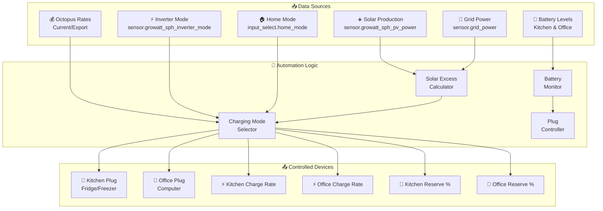
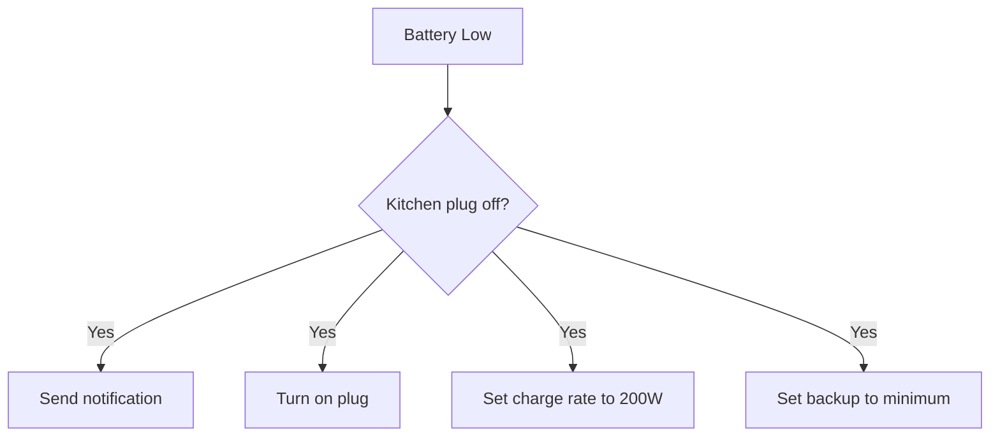
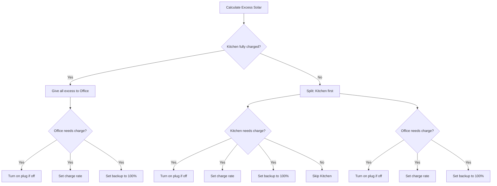
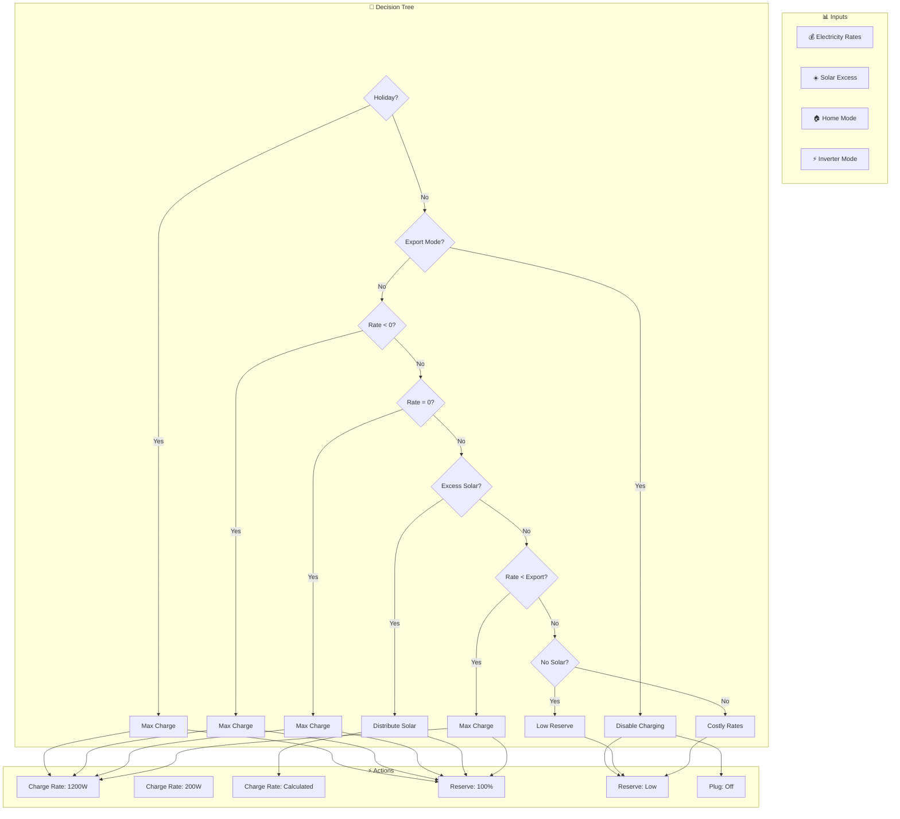
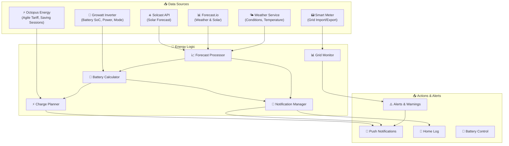
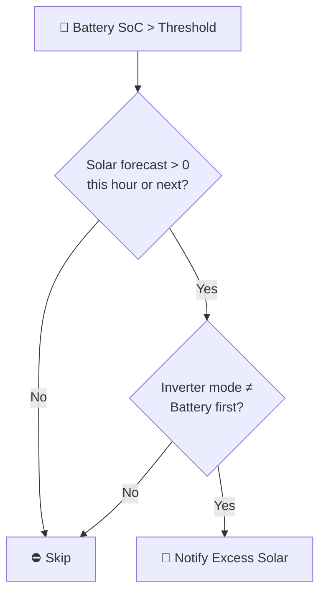
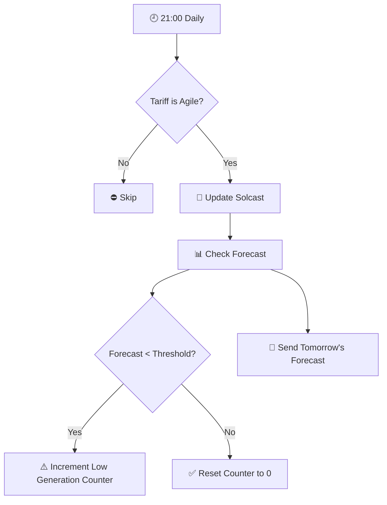
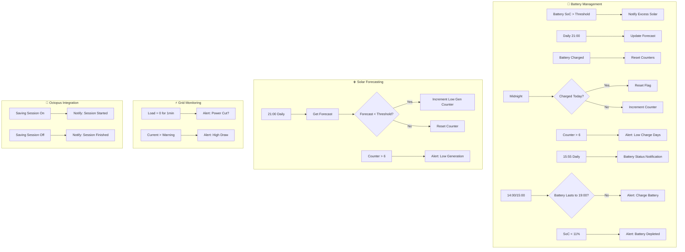

[<- Back to Integrations README](../README.md) · [Packages README](../../README.md) · [Main README](../../../README.md)

# Energy ⚡
All electrical related integrations from solar to EV charging.

## EcoFlow
Battery system that provides a convenient EPS system and some energy monitoring capabilities.

## MyEnergi
[Eddi](https://github.com/CJNE/ha-myenergi) for the solar diverter and EV charger.

## Solcast
Used for solar forecasting. The data it provides is better than forecast.io but unfortunately there is no homelab friendly subscription.

## Solar Assistant
Replaces the Growatt integration that does not work. It has a faster refresh on data as well.

---

# EcoFlow Package Documentation

This package manages EcoFlow power stations for intelligent energy storage, solar charging, and backup power management.

---

## Table of Contents

- [Overview](#overview)
- [Architecture](#architecture)
- [Automations](#automations)
  - [Solar Management](#solar-management)
  - [Battery Monitoring](#battery-monitoring)
  - [Offline Detection](#offline-detection)
  - [Scheduled Events](#scheduled-events)
- [Scripts](#scripts)
  - [Backup Reserve Management](#backup-reserve-management)
  - [Charge Rate Management](#charge-rate-management)
  - [Charging Mode Logic](#charging-mode-logic)
  - [Plug Control](#plug-control)
- [Sensors](#sensors)
- [Configuration](#configuration)
- [Entity Reference](#entity-reference)

---

## Overview

The EcoFlow integration provides intelligent management of two Delta 2 power stations (Kitchen and Office) for:
- **Solar excess harvesting** - Charge batteries when solar production exceeds household consumption
- **Time-of-use optimization** - Charge during cheap/negative electricity rates
- **Backup power** - Maintain minimum charge levels for power outages
- **Smart load management** - Control AC output plugs based on battery state and occupancy



---

## Architecture

### File Structure

```
packages/integrations/energy/
├── ecoflow.yaml          # Main EcoFlow package
└── README.md             # This documentation
```

### Integration

Uses the [hassio-ecoflow-cloud](https://github.com/tolwi/hassio-ecoflow-cloud) integration for device communication.

### Key Components

| Component | Purpose |
|-----------|---------|
| `sensor.ecoflow_solar_excess` | Calculated excess solar available for charging |
| `sensor.ecoflow_kitchen_battery_level` | Kitchen Delta 2 battery percentage |
| `sensor.ecoflow_office_battery_level` | Office Delta 2 battery percentage |
| `switch.ecoflow_kitchen_plug` | AC output control for kitchen appliances |
| `switch.ecoflow_office_plug` | AC output control for office equipment |
| `number.ecoflow_*_ac_charging_power` | Charge rate control (200-1200W) |
| `number.ecoflow_*_backup_reserve_level` | Backup reserve percentage (15-100%) |

---

## Automations

### Solar Management

#### EcoFlow: Solar Below House Consumption
**ID:** `1689437015870`

Triggers when solar production drops below household consumption.

**Triggers:**
- `sensor.ecoflow_solar_excess` below 0 for 5 minutes

**Conditions:**
- Import rate > export rate (or rate unavailable)
- Either battery above minimum reserve with backup enabled
- Automations enabled (`input_boolean.enable_ecoflow_automations`)

**Actions:**
- Calls `script.ecoflow_check_charging_mode` to evaluate charging strategy
- Cancels `timer.check_solar_excess` if active

---

#### EcoFlow: Solar Above House Consumption
**ID:** `1689437015871`

Triggers when excess solar is available for charging.

**Triggers:**
- `sensor.ecoflow_solar_excess` above threshold for 5 minutes
- `timer.check_solar_excess` finishes

**Conditions:**
- Kitchen backup reserve enabled
- Automations enabled

**Actions:**
- Calls charging mode script
- Starts 5-minute timer if grid is exporting and timer not active

**Mode:** Queued (max 10)

---

### Battery Monitoring

#### EcoFlow: Battery Low And Plug Is Off
**ID:** `1695566530591`

Emergency automation to turn on plugs when battery drops critically low.

**Triggers:**
- Kitchen battery below low threshold
- Office battery below low threshold

**Conditions:**
- Either plug is off
- Automations enabled

**Actions:**

**Kitchen Path:**


**Office Path:**
- Send notification
- Turn on plug

---

#### EcoFlow: Battery Ultra Low And Plug Is Off
**ID:** `1714563193661`

Critical alert when kitchen battery drops below 6% and plug cannot be turned on.

**Triggers:**
- Kitchen battery below 6%

**Conditions:**
- Kitchen plug is off

**Actions:**
- Send notification to Danny and Terina

---

#### EcoFlow: Kitchen Plug Offline
**ID:** `1719062430507`

Detects when kitchen plug becomes unavailable while battery is low.

**Triggers:**
- Kitchen battery below low threshold

**Conditions:**
- Automations enabled
- Plug state is `unavailable` or `unknown`

**Actions:**
- Send notification

---

#### EcoFlow: Office Plug Offline
**ID:** `1719062430508`

Detects when office plug becomes unavailable while battery is low.

**Triggers:**
- Office battery below low threshold

**Conditions:**
- Automations enabled
- Plug state is `unavailable` or `unknown`

**Actions:**
- Send notification

---

#### Ecoflow: Kitchen Battery Low And Switch Comes Online
**ID:** `1719061926981`

Handles recovery when kitchen plug comes back online with low battery.

**Triggers:**
- Kitchen plug changes from `unavailable` to `off`

**Conditions:**
- Automations enabled
- Battery below low threshold

**Actions:**
- Send notification
- Turn on plug

---

#### Ecoflow: Office Battery Low And Switch Comes Online
**ID:** `1719061926982`

Handles recovery when office plug comes back online with low battery.

**Triggers:**
- Office plug changes from `unavailable` to `off`

**Conditions:**
- Automations enabled
- Battery below low threshold

**Actions:**
- Send notification
- Turn on plug

---

#### Ecoflow: No Power Drawn By Device
**ID:** `1734262347581`

Holiday mode alert when kitchen EcoFlow shows no power consumption over 12 hours.

**Triggers:**
- Kitchen 12-hour power below 9.9W

**Conditions:**
- Home mode is "Holiday"

**Actions:**
- Send notification to Danny

---

### Offline Detection

#### Ecoflow: Goes Offline
**ID:** `1714641195916`

Handles extended offline periods for kitchen EcoFlow.

**Triggers:**
- Kitchen main battery level `unknown` for 30 minutes
- Kitchen main battery level `unavailable` for 30 minutes

**Conditions:**
- Automations enabled

**Actions:**
- If plug is off: Turn it on and log the event

---

### Scheduled Events

#### Ecoflow: Sunset
**ID:** `1745329568830`

Daily sunset routine to evaluate turning off plugs.

**Triggers:**
- Sunset event

**Conditions:**
- Not in Holiday mode

**Actions:**
- Call office plug turn-off script
- Call kitchen plug turn-off script

---

## Scripts

### Backup Reserve Management

#### ecoflow_set_backup_reserve
Sets the backup reserve level with retry logic.

**Fields:**
| Field | Type | Description |
|-------|------|-------------|
| `entity_id` | entity | Backup reserve number entity |
| `target_reserve_amount` | number | Target percentage (15-100%) |

**Logic:**
1. Determines target input_number based on entity_id
2. Updates the target input_number
3. Calls `script.ecoflow_update_backup_reserve`

---

#### ecoflow_update_backup_reserve
Updates backup reserve with retry handling.

**Fields:**
| Field | Type | Description |
|-------|------|-------------|
| `entity_id` | entity | Backup reserve number entity |
| `reserve_amount` | number | Reserve percentage to set |

**Features:**
- Uses `retry.action` for reliability
- 5 retry attempts with 60-second delays
- Sends notification on failure

---

#### ecoflow_set_backup_reserve_to_target
Sets backup reserve to the stored target value.

**Fields:**
| Field | Type | Description |
|-------|------|-------------|
| `entity_id` | entity | Backup reserve number entity |

---

### Charge Rate Management

#### ecoflow_set_charge_rate
Sets the AC charging power with retry logic.

**Fields:**
| Field | Type | Description |
|-------|------|-------------|
| `entity_id` | entity | AC charging power number entity |
| `target_charge_rate` | number | Target watts (200-1200) |

**Logic:**
1. Updates corresponding target input_number
2. Calls `script.ecoflow_update_charge_rate`

---

#### ecoflow_update_charge_rate
Updates charge rate with retry handling.

**Fields:**
| Field | Type | Description |
|-------|------|-------------|
| `entity_id` | entity | AC charging power number entity |
| `charge_rate` | number | Watts to set (200-1200) |

**Features:**
- Uses `retry.action` for reliability
- 5 retry attempts with 60-second delays
- Sends notification on failure

---

#### ecoflow_set_charge_rate_to_target
Sets charge rate to the stored target value.

**Fields:**
| Field | Type | Description |
|-------|------|-------------|
| `entity_id` | entity | AC charging power number entity |

---

### Charging Mode Logic

#### ecoflow_excess_solar_detected
Complex logic for distributing excess solar between kitchen and office units.



**Charge Rate Calculation:**
Uses Jinja2 macro `calculate_ecoflow_delta2_charge_rate` to determine optimal charging rate based on available excess power.

---

#### ecoflow_check_charging_mode
Main charging strategy selector with multiple modes.

**Fields:**
| Field | Type | Description |
|-------|------|-------------|
| `current_electricity_import_rate` | number | Import rate in GBP/kWh |
| `current_electricity_import_rate_unit` | text | Rate unit (e.g., "GBP/kWh") |
| `current_electricity_export_rate` | number | Export rate in p/kWh |

**Charging Modes (in priority order):**

| Mode | Condition | Action |
|------|-----------|--------|
| **Holiday** | Home mode = "Holiday" | Max charge (1200W) if battery < 99% |
| **Export Mode** | Inverter = "Grid first" | Disable charging, set low reserve |
| **Negative Rates** | Rate < 0p/kWh | Max charge (1200W), 100% reserve |
| **Zero Rates** | Rate = 0p/kWh | Max charge (1200W), 100% reserve |
| **Excess Solar** | Solar > threshold | Distribute to both units |
| **Below Export** | Import < Export | Charge at max rate |
| **No Excess** | Solar < consumption | Reduce charge rate or set low reserve |
| **Costly Rates** | Import > Export | Set low backup reserve |

---

### Plug Control

#### ecoflow_office_turn_off_plug
Smart routine for turning off office plug at sunset.

**Conditions for skipping:**
- Office computer still on (JD or work computer home)
- Solar excess detected
- Battery level too low

**Actions if conditions met:**
- Send notification
- Turn off plug

---

#### ecoflow_kitchen_turn_off_plug
Smart routine for turning off kitchen plug at sunset.

**Conditions for skipping:**
- No one home
- Battery level too low

**Actions if conditions met:**
- Log message
- Turn off plug

---

## Sensors

### Template Sensors

#### sensor.ecoflow_solar_excess
Calculates available solar excess for EcoFlow charging.

**Calculation:**
```yaml
# Only calculates when solar is producing
if PV power > (daily average / 2):
    excess = grid_export - 0.2kW + zappi_power + eddi_power
else:
    excess = 0
```

**Triggers:**
- `sensor.eddi_power` changes
- `sensor.house_grid_export_power` changes
- `sensor.zappi_power` changes

---

#### sensor.ecoflow_kitchen_charging_rate
Net charging rate for kitchen unit.

**Calculation:**
```
Total In Power - Total Out Power
```

**Unit:** Watts

---

#### sensor.ecoflow_kitchen_minimum_backup_reserve_low_threshold
Low battery warning threshold for kitchen.

**Calculation:**
```
input_number.ecoflow_kitchen_minimum_backup_reserve + 1%
```

---

#### sensor.ecoflow_office_minimum_backup_reserve_low_threshold
Low battery warning threshold for office.

**Calculation:**
```
input_number.ecoflow_office_minimum_backup_reserve + 1%
```

---

## Configuration

### Input Booleans

| Entity | Purpose |
|--------|---------|
| `input_boolean.enable_ecoflow_automations` | Master switch for all EcoFlow automations |
| `input_boolean.ecoflow_kitchen_charge_below_export` | Allow kitchen charging when rates < export |
| `input_boolean.ecoflow_office_charge_below_export` | Allow office charging when rates < export |
| `input_boolean.ecoflow_kitchen_charge_electricity_below_nothing` | Allow kitchen charging at negative rates |
| `switch.ecoflow_kitchen_backup_reserve_enabled` | Enable backup reserve for kitchen |
| `switch.ecoflow_office_backup_reserve_enabled` | Enable backup reserve for office |

### Input Numbers

| Entity | Range | Purpose |
|--------|-------|---------|
| `input_number.ecoflow_kitchen_minimum_backup_reserve` | 15-100% | Minimum reserve for kitchen |
| `input_number.ecoflow_office_minimum_backup_reserve` | 15-100% | Minimum reserve for office |
| `input_number.ecoflow_kitchen_low_battery_reserve` | 15-100% | Low battery reserve setting |
| `input_number.ecoflow_office_low_battery_reserve` | 15-100% | Low battery reserve setting |
| `input_number.target_ecoflow_kitchen_backup_reserve` | 15-100% | Target reserve (internal) |
| `input_number.target_ecoflow_office_backup_reserve` | 15-100% | Target reserve (internal) |
| `input_number.target_ecoflow_kitchen_charge_rate` | 200-1200W | Target charge rate (internal) |
| `input_number.target_ecoflow_office_charge_rate` | 200-1200W | Target charge rate (internal) |
| `input_number.ecoflow_charge_solar_threshold` | 0.1-2.0kW | Solar excess threshold for charging |

### Timers

| Timer | Duration | Purpose |
|-------|----------|---------|
| `timer.check_solar_excess` | 5 minutes | Debounce for solar excess changes |

---

## Entity Reference

### Sensors

| Entity | Type | Purpose |
|--------|------|---------|
| `sensor.ecoflow_solar_excess` | Template | Available solar excess (kW) |
| `sensor.ecoflow_kitchen_battery_level` | Integration | Kitchen battery percentage |
| `sensor.ecoflow_office_battery_level` | Integration | Office battery percentage |
| `sensor.ecoflow_kitchen_main_battery_level` | Integration | Kitchen main battery |
| `sensor.ecoflow_kitchen_charging_rate` | Template | Net charging rate (W) |
| `sensor.ecoflow_kitchen_minimum_backup_reserve_low_threshold` | Template | Low threshold for alerts |
| `sensor.ecoflow_office_minimum_backup_reserve_low_threshold` | Template | Low threshold for alerts |
| `sensor.ecoflow_kitchen_ac_in_power` | Integration | AC input power |
| `sensor.ecoflow_office_ac_in_power` | Integration | AC input power |
| `sensor.ecoflow_kitchen_total_in_power` | Integration | Total input power |
| `sensor.ecoflow_kitchen_total_out_power` | Integration | Total output power |
| `sensor.ecoflow_ac_out_power` | Integration | AC output power |
| `sensor.ecoflow_kitchen_power_over_12_hours` | Integration | 12-hour power history |

### Switches

| Entity | Purpose |
|--------|---------|
| `switch.ecoflow_kitchen_plug` | Kitchen AC output control |
| `switch.ecoflow_office_plug` | Office AC output control |
| `switch.ecoflow_kitchen_backup_reserve_enabled` | Backup reserve enable |
| `switch.ecoflow_office_backup_reserve_enabled` | Backup reserve enable |

### Number Entities

| Entity | Range | Purpose |
|--------|-------|---------|
| `number.ecoflow_kitchen_backup_reserve_level` | 15-100% | Kitchen backup reserve |
| `number.ecoflow_office_backup_reserve_level` | 15-100% | Office backup reserve |
| `number.ecoflow_kitchen_ac_charging_power` | 200-1200W | Kitchen charge rate |
| `number.ecoflow_office_ac_charging_power` | 200-1200W | Office charge rate |

---

## Charging Strategy Flow



---

## Related Documentation

| Document | Purpose |
|----------|---------|
| [Integrations Overview](../README.md) | Overview of all integration packages |
| [Main Packages README](../../README.md) | Architecture and organization guidelines |
| [Solar Assistant README](solar_assistant_README.md) | Solar inverter monitoring details |

### Related Integrations

| Integration | Connection |
|-------------|------------|
| [HVAC](../hvac/README.md) | Eddi solar diverter for hot water |
| [Transport](../transport/README.md) | Zappi EV charger integration |
| [Conservatory](../../rooms/conservatory/README.md) | Rate-based underfloor heating and airer |

### External Dependencies

- **Octopus Energy:** Rate sensors for time-of-use optimization
- **Growatt/Solar Assistant:** Solar production data
- **MyEnergi:** Eddi and Zappi power for excess calculation
- **retry.action:** Custom integration for reliable entity updates

---

## Maintenance Notes

### Troubleshooting

| Issue | Check |
|-------|-------|
| Not charging from solar | `sensor.ecoflow_solar_excess` calculation, PV power sensor |
| Not charging at cheap rates | Octopus rate sensors, `input_boolean.ecoflow_*_charge_below_export` |
| Plugs not turning on | Battery levels, automation enable switch, plug availability |
| Backup reserve not setting | Retry logs, entity availability |

### Seasonal Adjustments

- **Summer:** Higher solar thresholds may be appropriate
- **Winter:** Lower minimum reserves for shorter days
- **DST changes:** Sunset automation adjusts automatically

---

This package manages the home energy system including solar generation forecasting, battery management, grid power monitoring, and energy-related notifications. It integrates with Growatt inverter, Octopus Energy Agile tariff, and Solcast solar forecasting.

---

## Table of Contents

- [Overview](#overview)
- [Architecture](#architecture)
- [Automations](#automations)
  - [Battery Management](#battery-management)
  - [Solar Forecasting](#solar-forecasting)
  - [Grid Monitoring](#grid-monitoring)
  - [Notifications](#notifications)
  - [Octopus Energy Integration](#octopus-energy-integration)
- [Groups](#groups)
- [Scripts](#scripts)
  - [Forecast Data Scripts](#forecast-data-scripts)
  - [Calculation Scripts](#calculation-scripts)
  - [Notification Scripts](#notification-scripts)
  - [Utility Scripts](#utility-scripts)
- [Sensors](#sensors)
- [Configuration](#configuration)
- [Entity Reference](#entity-reference)

---

## Overview

The energy management system provides intelligent solar forecasting, battery charge optimization, grid power monitoring, and proactive notifications for energy-related events. It integrates multiple data sources to make informed decisions about battery charging and energy usage.



---

## Architecture

### File Structure

```
packages/integrations/energy/
├── energy.yaml      # Main energy package file
└── README.md        # This documentation
```

### Key Components

| Component | Purpose |
|-----------|---------|
| `sensor.growatt_sph_battery_state_of_charge` | Battery charge percentage |
| `sensor.growatt_sph_inverter_mode` | Current inverter operating mode |
| `sensor.growatt_sph_pv_energy` | Solar energy generated today |
| `sensor.total_solar_forecast_estimated_energy_production_*` | Solar forecast from Forecast.io |
| `sensor.solcast_pv_forecast_forecast_*` | Solar forecast from Solcast |
| `sensor.octopus_energy_electricity_current_rate` | Current electricity price |
| `binary_sensor.octopus_energy_octoplus_saving_sessions` | Octopus saving session status |
| `sensor.house_power` / `sensor.smart_meter_electricity_power` | Grid power readings |

---

## Automations

### Battery Management

#### Energy: Battery Charged And Forecasted Excess Solar
**ID:** `1661076689668`

Notifies when battery is charged and excess solar is forecasted.



**Triggers:**
- Battery SoC rises above `input_number.battery_charged_notification`

**Conditions:**
- Solar forecast for this hour OR next hour is above 0
- Inverter is NOT in "Battery first" mode
- Previous state was not "unknown"

**Actions:**
- Calls `script.energy_notify_excess_solar`

---

#### Energy: Battery Charged Today
**ID:** `1664743590782`

Tracks when battery reaches full charge and resets counters.

**Triggers:**
- Battery SoC rises above `input_number.growatt_battery_charged_threshold`

**Conditions:**
- `input_boolean.battery_charged_today` is `off`

**Actions:**
- Logs to home log
- Sets `input_boolean.battery_charged_today` to `on`
- Resets `input_number.consecutive_days_battery_not_charged` to 0

---

#### Energy: Reset Battery Charged Today
**ID:** `1664743700827`

Daily reset of battery charge tracking at midnight.

**Triggers:**
- Time: 00:00:00

**Logic:**
```
IF battery_charged_today == on:
    → Reset to off
    → Log "Resetting battery charged today"
ELSE:
    → Log "Battery did not fully charge today"
    → Increment consecutive_days_battery_not_charged
```

---

#### Energy: Consecutive Days Battery Not Charged
**ID:** `1664744505278`

Alerts when battery hasn't fully charged for 7+ consecutive days.

**Triggers:**
- `input_number.consecutive_days_battery_not_charged` rises above 6

**Actions:**
- Sends direct notification to person.danny

---

#### Energy: Battery Charge Notification
**ID:** `1674508693884`

Daily battery status notification (used for Demand Flexibility Service).

**Triggers:**
- Time: 15:55:00

**Conditions:**
- Battery SoC > (load_first_stop_discharge + 1%)

**Actions:**
- Sends notification with current SoC and remaining runtime

---

#### Energy: Low Battery Before Peak Time
**ID:** `1704121569476`

Warns when battery won't last until end of peak pricing period.

**Triggers:**
- Time: 14:00:00 OR 15:00:00

**Conditions:**
- Battery runtime < 19:00 (end of peak time)
- Inverter NOT in "Battery first" mode
- Tariff is Octopus Agile

**Actions:**
- Sends notification suggesting battery charging

---

#### Energy: Battery Depleted
**ID:** `1736798645231`

Notifies when battery runs out and switches to grid power.

**Triggers:**
- Battery SoC drops below 11% for 1 minute

**Conditions:**
- Grid import power > 0

**Actions:**
- Logs to home log
- Sends direct notification with current SoC and grid import power

---

### Solar Forecasting

#### Energy: Solar Forecast Tomorrow
**ID:** `1660858653319`

Daily evening forecast update and notification.



**Triggers:**
- Time: 21:00:00

**Conditions:**
- Tariff code contains "AGILE"

**Actions:**
- Updates Solcast forecast via `script.update_solcast`
- Checks if tomorrow's forecast is below threshold
- Increments or resets `input_number.consecutive_forecast_days_below_solar_generation`
- Sends tomorrow's solar forecast notification

---

#### Energy: Solar Production Exceed Threshold
**ID:** `1663589154517`

Resets forecast tracking when production is above threshold.

**Triggers:**
- Today's solar forecast rises above `input_number.solar_generation_minimum_threshold`

**Actions:**
- Logs "Production above threshold. Resetting Forecast"

---

#### Energy: Consecutive Low Solar Generation
**ID:** `1663588514009`

Alerts when solar generation has been low for 7+ consecutive days.

**Triggers:**
- `input_number.consecutive_forecast_days_below_solar_generation` rises above 6

**Actions:**
- Sends direct notification to person.danny

---

### Grid Monitoring

#### Energy: Power Cut Notification
**ID:** `1680444237958`

Detects potential power cuts when no electricity consumption is detected.

**Triggers:**
- Load power drops to 0 for 1 minute

**Actions:**
- Sends direct notification alerting about possible power cut

---

#### Energy: High Grid Power Draw
**ID:** `1712404842177`

Warns when household power draw approaches fuse limit.

**Triggers:**
- House current rises above `sensor.grid_max_import_power_warning`

**Actions:**
- Sends notification warning about approaching cut-out fuse limit
- Includes current draw vs fuse size

---

### Notifications

#### Energy: Battery Charged And Forecasted Excess Solar
See [Battery Management](#battery-management) section above.

#### Energy: Battery Charge Notification
See [Battery Management](#battery-management) section above.

#### Energy: Low Battery Before Peak Time
See [Battery Management](#battery-management) section above.

#### Energy: Power Cut Notification
See [Grid Monitoring](#grid-monitoring) section above.

#### Energy: High Grid Power Draw
See [Grid Monitoring](#grid-monitoring) section above.

#### Energy: Battery Depleted
See [Battery Management](#battery-management) section above.

---

### Octopus Energy Integration

#### Energy: Saving Session Started
**ID:** `1719080490915`

Notifies when an Octopus Energy saving session begins.

**Triggers:**
- `binary_sensor.octopus_energy_octoplus_saving_sessions` changes to `on`

**Conditions:**
- Not transitioning from "unavailable"

**Actions:**
- Sends direct notification to person.danny and person.terina

---

#### Energy: Saving Session Finished
**ID:** `1719080490916`

Notifies when an Octopus Energy saving session ends.

**Triggers:**
- `binary_sensor.octopus_energy_octoplus_saving_sessions` changes to `off`

**Conditions:**
- Not transitioning from "unavailable"

**Actions:**
- Sends direct notification to person.danny and person.terina

---

## Groups

### Battery First Charging Schedules
**Name:** `group.battery_first_charging_schedules`

Entities:
- `input_boolean.enable_battery_first_schedule_1`
- `input_boolean.enable_battery_first_schedule_2`

### Below Export Charging Schedules
**Name:** `group.below_export_charging_schedules`

Entities:
- `input_boolean.enable_charge_below_export_schedule_1`
- `input_boolean.enable_charge_below_export_schedule_2`
- `input_boolean.enable_charge_below_export_schedule_3`

### Grid First Charging Schedules
**Name:** `group.grid_first_charging_schedules`

Entities:
- `input_boolean.enable_grid_first_schedule_1`

### Maintain Battery First Charging Schedules
**Name:** `group.maintain_battery_first_charging_schedules`

Entities:
- `binary_sensor.maintain_charge_first_schedule_1`
- `binary_sensor.maintain_charge_first_schedule_2`

---

## Scripts

### Forecast Data Scripts

#### Today's Solar Forecast Data
**Alias:** `todays_solar_forecast_data`

Retrieves and processes today's solar forecast data with weather compensation.

**Sequence:**
1. Get weather forecast from `weather.home`
2. Calculate weather compensation ratio via `script.battery_charge_compensation_ratio`
3. Get solar forecast (Solcast → Forecast.io fallback)
4. Calculate target battery SoC via `script.calculate_charge_battery_amount`
5. Compute charge estimates (kWh, hours)

**Response Variables:**
| Variable | Description |
|----------|-------------|
| `estimate_charge_percentage` | Target battery SoC % |
| `estimate_charge_kwh` | Estimated charge amount in kWh |
| `charge_hours` | Hours needed to charge |
| `charge_hours_rounded` | Rounded to nearest 0.5h |
| `weather_condition` | Weather condition text |
| `weather_temperature` | Temperature |
| `weather_compensation_ratio` | Applied compensation ratio |
| `last_changed` | Forecast last updated |

---

#### Tomorrow's Solar Forecast Data
**Alias:** `tomorrows_solar_forecast_data`

Same as today's forecast but for tomorrow's generation.

**Additional Response Variables:**
| Variable | Description |
|----------|-------------|
| `generation_forecast` | Total forecasted generation |
| `generation_forecast_unit_of_measurement` | Unit (kWh) |
| `generation_forecast_source` | Source (Solcast/Forecast.io) |

---

### Calculation Scripts

#### Battery Charge Compensation Ratio
**Alias:** `battery_charge_compensation_ratio`

Returns a compensation multiplier based on weather conditions.

**Fields:**
| Field | Type | Description |
|-------|------|-------------|
| `weather_condition` | select | Weather condition (rainy, cloudy, sunny, etc.) |

**Compensation Ratios:**
| Weather | Ratio |
|---------|-------|
| rainy, pouring, cloudy, fog | 1.5 |
| partlycloudy, lightning, lightning-rainy, snowy | 1.25 |
| sunny, windy, windy-variant, exceptional | 1.0 |

**Response Variables:**
| Variable | Description |
|----------|-------------|
| `weather_condition` | Input condition |
| `weather_compensation_ratio` | Calculated ratio |

---

#### Calculate Charge Battery Amount
**Alias:** `calculate_charge_battery_amount`

Calculates target battery SoC based on forecasted solar generation.

**Fields:**
| Field | Type | Description |
|-------|------|-------------|
| `forecast_kwh` | number | Forecast solar generation in kWh (0-50) |

**Target SoC Logic:**
| Forecast Range | Target SoC |
|----------------|------------|
| < 5 kWh | 100% |
| 5 - 8.25 kWh | 85% |
| 8.25 - 11.5 kWh | 70% |
| 11.5 - 13 kWh | 65% |
| 13 - 15 kWh | 50% |
| 15 - 17 kWh | 45% |
| 17 - 18 kWh | 40% |
| ≥ 18 kWh | 23% |

**Response Variables:**
| Variable | Description |
|----------|-------------|
| `forecast` | Input forecast value |
| `target_soc` | Calculated target SoC % |

---

### Notification Scripts

#### Energy Notify Tomorrow's Solar Forecast
**Alias:** `energy_notify_tomorrows_solar_forecast`

Comprehensive daily forecast notification with battery recommendations.

**Variables:**
- `avg_hourly_energy_usage`: Daily average if holiday mode, else weekly average

**Sequence:**
1. Get tomorrow's solar forecast data
2. Calculate first/last solar generation times
3. Calculate self-sustaining generation periods
4. Build detailed forecast text with weather emoji
5. Send notification with:
   - Weather and generation forecast
   - Current battery SoC and load
   - Battery charge recommendation
   - Charge time estimate

---

#### Energy Notify Excess Solar
**Alias:** `energy_notify_excess_solar`

Notifies about available excess solar energy.

**Variables:**
- `people_home`: List of people currently at home
- `message`: Formatted message with battery status and solar info

**Sequence:**
1. Check who is home
2. Build message with:
   - Current battery SoC
   - Time to full charge (if charging)
   - Next hour solar forecast
   - Remaining solar for today
3. If people are home: send direct notification
4. Else: log to home log

---

### Utility Scripts

#### Remaining Solar Forecast Today
**Alias:** `remaining_solar_forecast_today`

Calculates remaining solar generation expected today.

**Response Variables:**
| Variable | Description |
|----------|-------------|
| `value` | Forecast minus actual generation |
| `unit_of_measurement` | kWh |

---

#### Get First Solar Generation
**Alias:** `get_first_solar_generation`

Finds the first period with solar generation above a threshold.

**Fields:**
| Field | Type | Description |
|-------|------|-------------|
| `forecast_entity` | text | Entity ID with forecast attribute |
| `attribute_name` | text | Attribute containing forecast list |
| `get_attribute` | text | Attribute to return (e.g., period_start) |
| `generation_attribute_name` | text | Attribute with kWh generation |
| `min_generation` | number | Minimum generation threshold |

**Response Variables:**
| Variable | Description |
|----------|-------------|
| `forecast` | First matching value or none |

---

#### Get Last Solar Generation
**Alias:** `get_last_solar_generation`

Finds the last period with solar generation above a threshold.

Same fields and response as `get_first_solar_generation`.

---

## Sensors

### Grid Power Sensors

#### Grid Power
**Entity:** `sensor.grid_power`
**Unique ID:** `e697ba51-edd8-40cd-b797-ee79786c0415`

Unified grid power reading from multiple sources.

**State Logic:**
```yaml
if house_power is number: use house_power
elif smart_meter_power is number: use smart_meter_power * 1000
else: 0
```

**Attributes:**
| Attribute | Value |
|-----------|-------|
| device_class | power |
| unit_of_measurement | W |

---

#### Grid Import Power
**Entity:** `sensor.grid_import_power`
**Unique ID:** `09f48f73-ea68-421f-868c-ffd20cd8eab8`

Positive power values only (importing from grid).

**State Logic:**
```yaml
if house_power > 0: use house_power
elif smart_meter_power > 0: use smart_meter_power
else: 0
```

**Attributes:**
| Attribute | Value |
|-----------|-------|
| device_class | power |
| unit_of_measurement | W |
| state_class | measurement |

---

#### Grid Export Power
**Entity:** `sensor.grid_export_power`
**Unique ID:** `ed52b9f5-fddd-4797-85a1-b4fb6df8cd0e`

Negative power values converted to positive (exporting to grid).

**State Logic:**
```yaml
if house_power < 0: use abs(house_power)
elif smart_meter_power < 0: use abs(smart_meter_power)
else: 0
```

**Attributes:**
| Attribute | Value |
|-----------|-------|
| device_class | power |
| unit_of_measurement | W |
| state_class | measurement |

---

#### Grid Amp Import Warning
**Entity:** `sensor.grid_amp_import_warning`
**Unique ID:** `02d4ee4e-967f-4b1a-80c1-a2b9dca61d01`

Calculates 90% of fuse capacity for warning threshold.

**State:** `input_number.cut_out_fuse_size * 0.9`

**Attributes:**
| Attribute | Value |
|-----------|-------|
| icon | mdi:fuse-alert |
| unit_of_measurement | A |

---

## Configuration

### Input Booleans

| Entity | Purpose |
|--------|---------|
| `input_boolean.battery_charged_today` | Tracks if battery reached full charge today |
| `input_boolean.enable_battery_first_schedule_1/2` | Enable battery-first charging schedules |
| `input_boolean.enable_charge_below_export_schedule_1/2/3` | Enable below-export charging schedules |
| `input_boolean.enable_grid_first_schedule_1` | Enable grid-first charging schedule |

### Input Numbers

| Entity | Purpose |
|--------|---------|
| `input_number.battery_charged_notification` | SoC threshold for excess solar notification |
| `input_number.growatt_battery_charged_threshold` | SoC threshold for "fully charged" status |
| `input_number.consecutive_days_battery_not_charged` | Counter for days without full charge |
| `input_number.consecutive_forecast_days_below_solar_generation` | Counter for low generation days |
| `input_number.solar_generation_minimum_threshold` | Minimum expected generation threshold |
| `input_number.solar_battery_size` | Battery capacity in kWh |
| `input_number.solar_battery_max_charge_rate` | Maximum battery charge rate |
| `input_number.cut_out_fuse_size` | Main fuse rating in amps |

### Binary Sensors (External)

| Entity | Purpose |
|--------|---------|
| `binary_sensor.maintain_charge_first_schedule_1/2` | Maintain battery-first schedule status |
| `binary_sensor.octopus_energy_octoplus_saving_sessions` | Octopus saving session active |

---

## Entity Reference

### Sensors

| Entity | Source | Purpose |
|--------|--------|---------|
| `sensor.grid_power` | Template | Unified grid power reading |
| `sensor.grid_import_power` | Template | Grid import only (W) |
| `sensor.grid_export_power` | Template | Grid export only (W) |
| `sensor.grid_amp_import_warning` | Template | 90% fuse capacity warning |
| `sensor.growatt_sph_battery_state_of_charge` | Growatt | Battery charge % |
| `sensor.growatt_sph_inverter_mode` | Growatt | Current inverter mode |
| `sensor.growatt_sph_pv_energy` | Growatt | Today's solar generation |
| `sensor.growatt_sph_load_power` | Growatt | Current load power |
| `sensor.growatt_battery_charge_power` | Growatt | Battery charge power |
| `sensor.house_power` | External | House power consumption |
| `sensor.smart_meter_electricity_power` | External | Smart meter reading |
| `sensor.total_solar_forecast_estimated_energy_production_today` | Forecast.io | Today's solar forecast |
| `sensor.total_solar_forecast_estimated_energy_production_tomorrow` | Forecast.io | Tomorrow's solar forecast |
| `sensor.total_solar_forecast_estimated_energy_production_this_hour` | Forecast.io | This hour forecast |
| `sensor.total_solar_forecast_estimated_energy_production_next_hour` | Forecast.io | Next hour forecast |
| `sensor.solcast_pv_forecast_forecast_today` | Solcast | Today's Solcast forecast |
| `sensor.solcast_pv_forecast_forecast_tomorrow` | Solcast | Tomorrow's Solcast forecast |
| `sensor.solcast_pv_forecast_forecast_remaining_today` | Solcast | Remaining today forecast |
| `sensor.octopus_energy_electricity_current_rate` | Octopus | Current electricity rate |
| `sensor.electricity_next_rate` | Octopus | Next period rate |
| `sensor.electricity_previous_rate` | Octopus | Previous period rate |
| `sensor.battery_charge_remaining_hours` | External | Estimated battery runtime |
| `sensor.time_to_charge_battery` | External | Time to full charge |
| `sensor.home_electricity_power_daily_average_over_a_day` | External | Daily average usage |
| `sensor.home_electricity_power_daily_average_over_a_week` | External | Weekly average usage |
| `sensor.house_current` | External | House current draw |
| `sensor.grid_max_import_power_warning` | External | Warning threshold |

### Groups

| Entity | Purpose |
|--------|---------|
| `group.battery_first_charging_schedules` | Battery-first schedule controls |
| `group.below_export_charging_schedules` | Below-export schedule controls |
| `group.grid_first_charging_schedules` | Grid-first schedule controls |
| `group.maintain_battery_first_charging_schedules` | Maintain charge schedules |
| `group.adult_people` | People to notify |

### Scripts

| Entity | Purpose |
|--------|---------|
| `script.todays_solar_forecast_data` | Get today's forecast data |
| `script.tomorrows_solar_forecast_data` | Get tomorrow's forecast data |
| `script.battery_charge_compensation_ratio` | Weather compensation calculation |
| `script.calculate_charge_battery_amount` | Target SoC calculation |
| `script.energy_notify_tomorrows_solar_forecast` | Send forecast notification |
| `script.energy_notify_excess_solar` | Send excess solar notification |
| `script.remaining_solar_forecast_today` | Calculate remaining forecast |
| `script.get_first_solar_generation` | Find first generation period |
| `script.get_last_solar_generation` | Find last generation period |
| `script.update_solcast` | External: Update Solcast data |
| `script.send_to_home_log` | External: Log to home log |
| `script.send_direct_notification` | External: Send notification |

---

## Automation Flow Summary



---

## Maintenance Notes

### Troubleshooting

| Issue | Check |
|-------|-------|
| No solar forecast notifications | Solcast/Forecast.io entity availability |
| Battery notifications not firing | `input_number.battery_charged_notification` value |
| Grid sensors showing 0 | Source sensors: `sensor.house_power`, `sensor.smart_meter_electricity_power` |
| Incorrect charge recommendations | `input_number.solar_battery_size` and `input_number.solar_battery_max_charge_rate` |
| Missing weather compensation | `weather.home` entity availability |

### Seasonal Adjustments

- **Summer:** Higher generation forecasts may reduce target SoC to 23%
- **Winter:** Lower generation forecasts will target 100% SoC
- **Weather compensation:** Adjust ratios in `script.battery_charge_compensation_ratio` if needed

### Related Documentation

- See TOOLS.md for energy subsystem canonical entities
- Battery control via Growatt integration
- Solar forecasting via Solcast and Forecast.io
- Octopus Energy Agile tariff integration

---

## Related Documentation

| Document | Purpose |
|----------|---------|
| [Integrations Overview](../README.md) | Overview of all integration packages |
| [Main Packages README](../../README.md) | Architecture and organization guidelines |
| [Solar Assistant README](solar_assistant_README.md) | Solar inverter monitoring details |
| [EcoFlow Package Docs](#ecoflow-package-documentation) | EcoFlow power station management |

### Related Integrations

| Integration | Connection |
|-------------|------------|
| [HVAC](../hvac/README.md) | Eddi solar diverter for hot water |
| [Transport](../transport/README.md) | Zappi EV charger integration |
| [Rooms](../../rooms/conservatory/README.md) | Rate-based underfloor heating and airer |
| [Rooms](../../rooms/office/README.md) | EcoFlow office plug management |
| [Rooms](../../rooms/kitchen/README.md) | Grid power RGB notifications |

### External Documentation

- [Solcast API](https://solcast.com/) - Solar forecasting service
- [Octopus Energy Agile](https://octopus.energy/agile/) - Dynamic pricing tariff
- [Growatt Integration](https://www.home-assistant.io/integrations/growatt_server/) - Inverter monitoring

---

*Last updated: 2026-03-01*
