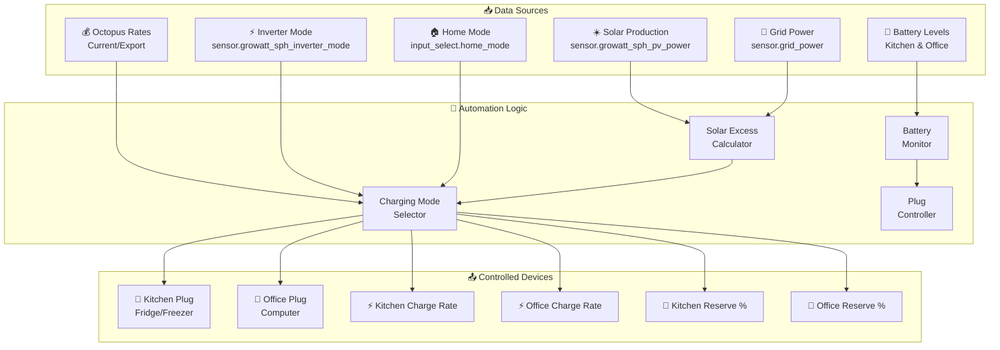
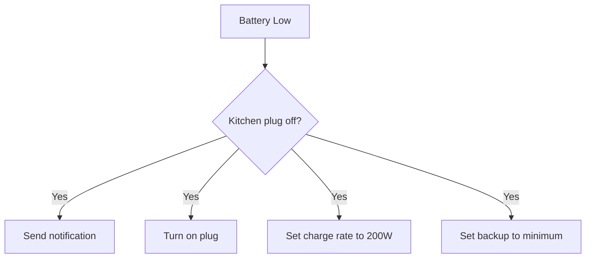
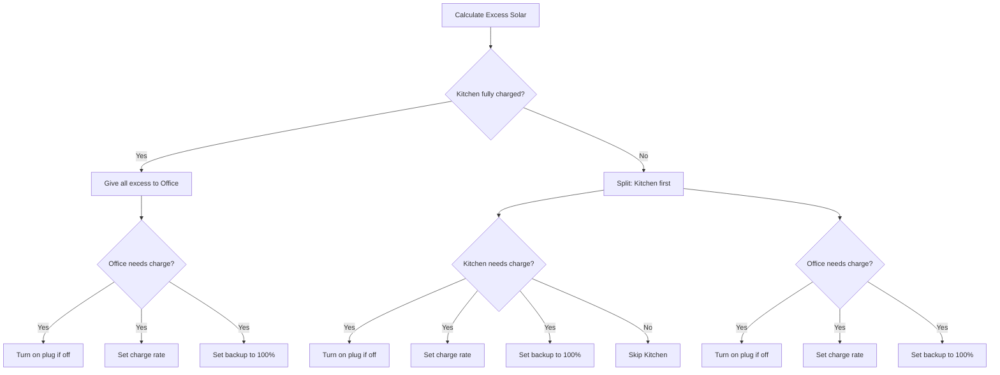
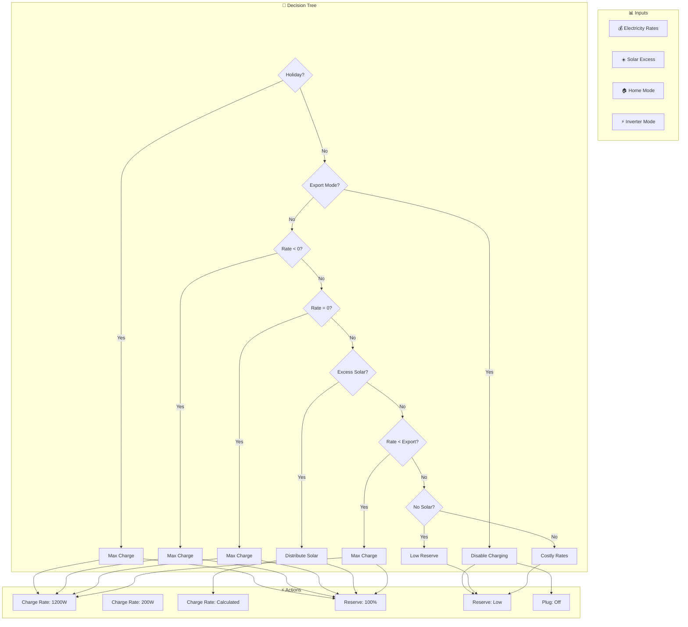

# EcoFlow Package Documentation

This package manages EcoFlow power stations for intelligent energy storage, solar charging, and backup power management.

---

## Table of Contents

- [Overview](#overview)
- [Architecture](#architecture)
- [Automations](#automations)
  - [Solar Management](#solar-management)
  - [Battery Monitoring](#battery-monitoring)
  - [Offline Detection](#offline-detection)
  - [Scheduled Events](#scheduled-events)
- [Scripts](#scripts)
  - [Backup Reserve Management](#backup-reserve-management)
  - [Charge Rate Management](#charge-rate-management)
  - [Charging Mode Logic](#charging-mode-logic)
  - [Plug Control](#plug-control)
- [Sensors](#sensors)
- [Configuration](#configuration)
- [Entity Reference](#entity-reference)

---

## Overview

The EcoFlow integration provides intelligent management of two Delta 2 power stations (Kitchen and Office) for:
- **Solar excess harvesting** - Charge batteries when solar production exceeds household consumption
- **Time-of-use optimization** - Charge during cheap/negative electricity rates
- **Backup power** - Maintain minimum charge levels for power outages
- **Smart load management** - Control AC output plugs based on battery state and occupancy



---

## Architecture

### File Structure

```
packages/integrations/energy/
├── ecoflow.yaml          # Main EcoFlow package
└── README.md             # This documentation
```

### Integration

Uses the [hassio-ecoflow-cloud](https://github.com/tolwi/hassio-ecoflow-cloud) integration for device communication.

### Key Components

| Component | Purpose |
|-----------|---------|
| `sensor.ecoflow_solar_excess` | Calculated excess solar available for charging |
| `sensor.ecoflow_kitchen_battery_level` | Kitchen Delta 2 battery percentage |
| `sensor.ecoflow_office_battery_level` | Office Delta 2 battery percentage |
| `switch.ecoflow_kitchen_plug` | AC output control for kitchen appliances |
| `switch.ecoflow_office_plug` | AC output control for office equipment |
| `number.ecoflow_*_ac_charging_power` | Charge rate control (200-1200W) |
| `number.ecoflow_*_backup_reserve_level` | Backup reserve percentage (15-100%) |

---

## Automations

### Solar Management

#### EcoFlow: Solar Below House Consumption
**ID:** `1689437015870`

Triggers when solar production drops below household consumption.

**Triggers:**
- `sensor.ecoflow_solar_excess` below 0 for 5 minutes

**Conditions:**
- Import rate > export rate (or rate unavailable)
- Either battery above minimum reserve with backup enabled
- Automations enabled (`input_boolean.enable_ecoflow_automations`)

**Actions:**
- Calls `script.ecoflow_check_charging_mode` to evaluate charging strategy
- Cancels `timer.check_solar_excess` if active

---

#### EcoFlow: Solar Above House Consumption
**ID:** `1689437015871`

Triggers when excess solar is available for charging.

**Triggers:**
- `sensor.ecoflow_solar_excess` above threshold for 5 minutes
- `timer.check_solar_excess` finishes

**Conditions:**
- Kitchen backup reserve enabled
- Automations enabled

**Actions:**
- Calls charging mode script
- Starts 5-minute timer if grid is exporting and timer not active

**Mode:** Queued (max 10)

---

### Battery Monitoring

#### EcoFlow: Battery Low And Plug Is Off
**ID:** `1695566530591`

Emergency automation to turn on plugs when battery drops critically low.

**Triggers:**
- Kitchen battery below low threshold
- Office battery below low threshold

**Conditions:**
- Either plug is off
- Automations enabled

**Actions:**

**Kitchen Path:**


**Office Path:**
- Send notification
- Turn on plug

---

#### EcoFlow: Battery Ultra Low And Plug Is Off
**ID:** `1714563193661`

Critical alert when kitchen battery drops below 6% and plug cannot be turned on.

**Triggers:**
- Kitchen battery below 6%

**Conditions:**
- Kitchen plug is off

**Actions:**
- Send notification to Danny and Terina

---

#### EcoFlow: Kitchen Plug Offline
**ID:** `1719062430507`

Detects when kitchen plug becomes unavailable while battery is low.

**Triggers:**
- Kitchen battery below low threshold

**Conditions:**
- Automations enabled
- Plug state is `unavailable` or `unknown`

**Actions:**
- Send notification

---

#### EcoFlow: Office Plug Offline
**ID:** `1719062430508`

Detects when office plug becomes unavailable while battery is low.

**Triggers:**
- Office battery below low threshold

**Conditions:**
- Automations enabled
- Plug state is `unavailable` or `unknown`

**Actions:**
- Send notification

---

#### Ecoflow: Kitchen Battery Low And Switch Comes Online
**ID:** `1719061926981`

Handles recovery when kitchen plug comes back online with low battery.

**Triggers:**
- Kitchen plug changes from `unavailable` to `off`

**Conditions:**
- Automations enabled
- Battery below low threshold

**Actions:**
- Send notification
- Turn on plug

---

#### Ecoflow: Office Battery Low And Switch Comes Online
**ID:** `1719061926982`

Handles recovery when office plug comes back online with low battery.

**Triggers:**
- Office plug changes from `unavailable` to `off`

**Conditions:**
- Automations enabled
- Battery below low threshold

**Actions:**
- Send notification
- Turn on plug

---

#### Ecoflow: No Power Drawn By Device
**ID:** `1734262347581`

Holiday mode alert when kitchen EcoFlow shows no power consumption over 12 hours.

**Triggers:**
- Kitchen 12-hour power below 9.9W

**Conditions:**
- Home mode is "Holiday"

**Actions:**
- Send notification to Danny

---

### Offline Detection

#### Ecoflow: Goes Offline
**ID:** `1714641195916`

Handles extended offline periods for kitchen EcoFlow.

**Triggers:**
- Kitchen main battery level `unknown` for 30 minutes
- Kitchen main battery level `unavailable` for 30 minutes

**Conditions:**
- Automations enabled

**Actions:**
- If plug is off: Turn it on and log the event

---

### Scheduled Events

#### Ecoflow: Sunset
**ID:** `1745329568830`

Daily sunset routine to evaluate turning off plugs.

**Triggers:**
- Sunset event

**Conditions:**
- Not in Holiday mode

**Actions:**
- Call office plug turn-off script
- Call kitchen plug turn-off script

---

## Scripts

### Backup Reserve Management

#### ecoflow_set_backup_reserve
Sets the backup reserve level with retry logic.

**Fields:**
| Field | Type | Description |
|-------|------|-------------|
| `entity_id` | entity | Backup reserve number entity |
| `target_reserve_amount` | number | Target percentage (15-100%) |

**Logic:**
1. Determines target input_number based on entity_id
2. Updates the target input_number
3. Calls `script.ecoflow_update_backup_reserve`

---

#### ecoflow_update_backup_reserve
Updates backup reserve with retry handling.

**Fields:**
| Field | Type | Description |
|-------|------|-------------|
| `entity_id` | entity | Backup reserve number entity |
| `reserve_amount` | number | Reserve percentage to set |

**Features:**
- Uses `retry.action` for reliability
- 5 retry attempts with 60-second delays
- Sends notification on failure

---

#### ecoflow_set_backup_reserve_to_target
Sets backup reserve to the stored target value.

**Fields:**
| Field | Type | Description |
|-------|------|-------------|
| `entity_id` | entity | Backup reserve number entity |

---

### Charge Rate Management

#### ecoflow_set_charge_rate
Sets the AC charging power with retry logic.

**Fields:**
| Field | Type | Description |
|-------|------|-------------|
| `entity_id` | entity | AC charging power number entity |
| `target_charge_rate` | number | Target watts (200-1200) |

**Logic:**
1. Updates corresponding target input_number
2. Calls `script.ecoflow_update_charge_rate`

---

#### ecoflow_update_charge_rate
Updates charge rate with retry handling.

**Fields:**
| Field | Type | Description |
|-------|------|-------------|
| `entity_id` | entity | AC charging power number entity |
| `charge_rate` | number | Watts to set (200-1200) |

**Features:**
- Uses `retry.action` for reliability
- 5 retry attempts with 60-second delays
- Sends notification on failure

---

#### ecoflow_set_charge_rate_to_target
Sets charge rate to the stored target value.

**Fields:**
| Field | Type | Description |
|-------|------|-------------|
| `entity_id` | entity | AC charging power number entity |

---

### Charging Mode Logic

#### ecoflow_excess_solar_detected
Complex logic for distributing excess solar between kitchen and office units.



**Charge Rate Calculation:**
Uses Jinja2 macro `calculate_ecoflow_delta2_charge_rate` to determine optimal charging rate based on available excess power.

---

#### ecoflow_check_charging_mode
Main charging strategy selector with multiple modes.

**Fields:**
| Field | Type | Description |
|-------|------|-------------|
| `current_electricity_import_rate` | number | Import rate in GBP/kWh |
| `current_electricity_import_rate_unit` | text | Rate unit (e.g., "GBP/kWh") |
| `current_electricity_export_rate` | number | Export rate in p/kWh |

**Charging Modes (in priority order):**

| Mode | Condition | Action |
|------|-----------|--------|
| **Holiday** | Home mode = "Holiday" | Max charge (1200W) if battery < 99% |
| **Export Mode** | Inverter = "Grid first" | Disable charging, set low reserve |
| **Negative Rates** | Rate < 0p/kWh | Max charge (1200W), 100% reserve |
| **Zero Rates** | Rate = 0p/kWh | Max charge (1200W), 100% reserve |
| **Excess Solar** | Solar > threshold | Distribute to both units |
| **Below Export** | Import < Export | Charge at max rate |
| **No Excess** | Solar < consumption | Reduce charge rate or set low reserve |
| **Costly Rates** | Import > Export | Set low backup reserve |

---

### Plug Control

#### ecoflow_office_turn_off_plug
Smart routine for turning off office plug at sunset.

**Conditions for skipping:**
- Office computer still on (JD or work computer home)
- Solar excess detected
- Battery level too low

**Actions if conditions met:**
- Send notification
- Turn off plug

---

#### ecoflow_kitchen_turn_off_plug
Smart routine for turning off kitchen plug at sunset.

**Conditions for skipping:**
- No one home
- Battery level too low

**Actions if conditions met:**
- Log message
- Turn off plug

---

## Sensors

### Template Sensors

#### sensor.ecoflow_solar_excess
Calculates available solar excess for EcoFlow charging.

**Calculation:**
```yaml
# Only calculates when solar is producing
if PV power > (daily average / 2):
    excess = grid_export - 0.2kW + zappi_power + eddi_power
else:
    excess = 0
```

**Triggers:**
- `sensor.eddi_power` changes
- `sensor.house_grid_export_power` changes
- `sensor.zappi_power` changes

---

#### sensor.ecoflow_kitchen_charging_rate
Net charging rate for kitchen unit.

**Calculation:**
```
Total In Power - Total Out Power
```

**Unit:** Watts

---

#### sensor.ecoflow_kitchen_minimum_backup_reserve_low_threshold
Low battery warning threshold for kitchen.

**Calculation:**
```
input_number.ecoflow_kitchen_minimum_backup_reserve + 1%
```

---

#### sensor.ecoflow_office_minimum_backup_reserve_low_threshold
Low battery warning threshold for office.

**Calculation:**
```
input_number.ecoflow_office_minimum_backup_reserve + 1%
```

---

## Configuration

### Input Booleans

| Entity | Purpose |
|--------|---------|
| `input_boolean.enable_ecoflow_automations` | Master switch for all EcoFlow automations |
| `input_boolean.ecoflow_kitchen_charge_below_export` | Allow kitchen charging when rates < export |
| `input_boolean.ecoflow_office_charge_below_export` | Allow office charging when rates < export |
| `input_boolean.ecoflow_kitchen_charge_electricity_below_nothing` | Allow kitchen charging at negative rates |
| `switch.ecoflow_kitchen_backup_reserve_enabled` | Enable backup reserve for kitchen |
| `switch.ecoflow_office_backup_reserve_enabled` | Enable backup reserve for office |

### Input Numbers

| Entity | Range | Purpose |
|--------|-------|---------|
| `input_number.ecoflow_kitchen_minimum_backup_reserve` | 15-100% | Minimum reserve for kitchen |
| `input_number.ecoflow_office_minimum_backup_reserve` | 15-100% | Minimum reserve for office |
| `input_number.ecoflow_kitchen_low_battery_reserve` | 15-100% | Low battery reserve setting |
| `input_number.ecoflow_office_low_battery_reserve` | 15-100% | Low battery reserve setting |
| `input_number.target_ecoflow_kitchen_backup_reserve` | 15-100% | Target reserve (internal) |
| `input_number.target_ecoflow_office_backup_reserve` | 15-100% | Target reserve (internal) |
| `input_number.target_ecoflow_kitchen_charge_rate` | 200-1200W | Target charge rate (internal) |
| `input_number.target_ecoflow_office_charge_rate` | 200-1200W | Target charge rate (internal) |
| `input_number.ecoflow_charge_solar_threshold` | 0.1-2.0kW | Solar excess threshold for charging |

### Timers

| Timer | Duration | Purpose |
|-------|----------|---------|
| `timer.check_solar_excess` | 5 minutes | Debounce for solar excess changes |

---

## Entity Reference

### Sensors

| Entity | Type | Purpose |
|--------|------|---------|
| `sensor.ecoflow_solar_excess` | Template | Available solar excess (kW) |
| `sensor.ecoflow_kitchen_battery_level` | Integration | Kitchen battery percentage |
| `sensor.ecoflow_office_battery_level` | Integration | Office battery percentage |
| `sensor.ecoflow_kitchen_main_battery_level` | Integration | Kitchen main battery |
| `sensor.ecoflow_kitchen_charging_rate` | Template | Net charging rate (W) |
| `sensor.ecoflow_kitchen_minimum_backup_reserve_low_threshold` | Template | Low threshold for alerts |
| `sensor.ecoflow_office_minimum_backup_reserve_low_threshold` | Template | Low threshold for alerts |
| `sensor.ecoflow_kitchen_ac_in_power` | Integration | AC input power |
| `sensor.ecoflow_office_ac_in_power` | Integration | AC input power |
| `sensor.ecoflow_kitchen_total_in_power` | Integration | Total input power |
| `sensor.ecoflow_kitchen_total_out_power` | Integration | Total output power |
| `sensor.ecoflow_ac_out_power` | Integration | AC output power |
| `sensor.ecoflow_kitchen_power_over_12_hours` | Integration | 12-hour power history |

### Switches

| Entity | Purpose |
|--------|---------|
| `switch.ecoflow_kitchen_plug` | Kitchen AC output control |
| `switch.ecoflow_office_plug` | Office AC output control |
| `switch.ecoflow_kitchen_backup_reserve_enabled` | Backup reserve enable |
| `switch.ecoflow_office_backup_reserve_enabled` | Backup reserve enable |

### Number Entities

| Entity | Range | Purpose |
|--------|-------|---------|
| `number.ecoflow_kitchen_backup_reserve_level` | 15-100% | Kitchen backup reserve |
| `number.ecoflow_office_backup_reserve_level` | 15-100% | Office backup reserve |
| `number.ecoflow_kitchen_ac_charging_power` | 200-1200W | Kitchen charge rate |
| `number.ecoflow_office_ac_charging_power` | 200-1200W | Office charge rate |

---

## Charging Strategy Flow



---

## Maintenance Notes

### Troubleshooting

| Issue | Check |
|-------|-------|
| Not charging from solar | `sensor.ecoflow_solar_excess` calculation, PV power sensor |
| Not charging at cheap rates | Octopus rate sensors, `input_boolean.ecoflow_*_charge_below_export` |
| Plugs not turning on | Battery levels, automation enable switch, plug availability |
| Backup reserve not setting | Retry logs, entity availability |

### Seasonal Adjustments

- **Summer:** Higher solar thresholds may be appropriate
- **Winter:** Lower minimum reserves for shorter days
- **DST changes:** Sunset automation adjusts automatically

### External Dependencies

- **Octopus Energy:** Rate sensors for time-of-use optimization
- **Growatt/Solar Assistant:** Solar production data
- **MyEnergi:** Eddi and Zappi power for excess calculation
- **retry.action:** Custom integration for reliable entity updates

---

*Last updated: March 2026*
