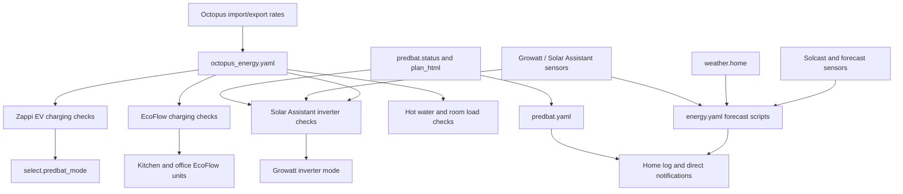

[<- Back to Integrations README](../README.md) · [Packages README](../../README.md) · [Main README](../../../README.md)

# Energy Integration Packages

The energy integration packages coordinate the house battery, solar forecasting, Octopus rates, portable EcoFlow batteries, Predbat, and Zappi EV charging. The goal is simple: use cheap or free electricity when it is available, avoid wasting solar generation, protect backup batteries, and notify the right people when energy behaviour needs attention.

This documentation covers all YAML files in this folder:

| File | Purpose | Contents |
|------|---------|----------|
| `energy.yaml` | Core energy notifications, solar forecast helpers, grid sensors, and schedule groups | 14 automations, 4 groups, 9 scripts, 4 template sensors |
| `ecoflow.yaml` | Kitchen and office EcoFlow backup battery management | 11 automations, 10 scripts, 4 template sensors |
| `energy_conversations.yaml` | Voice/conversation responses for energy questions | 13 intents, 13 intent scripts |
| `octopus_energy.yaml` | Rate-change coordinator and Intelligent Octopus dispatch refresh | 3 automations, 1 script |
| `predbat.yaml` | Predbat plan notification and mode-mismatch alerting | 2 automations |
| `solar_assistant.yaml` | Growatt inverter mode control and battery/runtime sensors | 1 automation, 6 scripts, 12 statistics sensors, 8 template sensors |
| `solcast.yaml` | Solcast forecast refresh with API-limit protection | 1 automation, 1 script |
| `zappi.yaml` | Zappi EV charge scheduling, rate charging, and Predbat coordination | 6 automations, 1 script |

## Quick Summary

For non-technical users, the important behaviour is:

| Area | What Happens |
|------|--------------|
| Solar and house battery | Solar forecasts and battery state are watched so the house can recommend charging levels, warn about low generation, and report when the battery has not fully charged for several days. |
| Electricity rates | Octopus rate changes fan out to the battery, Zappi, EcoFlow, hot water, conservatory heating, Tesla notifications, and airer checks. |
| Growatt inverter | Solar Assistant scripts switch the inverter between `Battery first`, `Grid first`, `Load first`, and maintain-style battery charging depending on schedules, rates, and Predbat state. |
| EcoFlow batteries | Kitchen and office EcoFlow units charge from excess solar or cheap electricity, keep backup reserves, and alert if batteries or plugs are offline or too low. |
| EV charging | Zappi starts charging during enabled schedules or cheap-rate windows, stops when rates become costly, and coordinates with Predbat so the car does not drain the house battery unexpectedly. |
| Solar forecasting | Solcast is updated once each morning and also by the evening forecast notification if API limits allow. |
| Voice queries | Conversation intents answer common questions such as battery level, runtime, inverter mode, electricity rates, charging schedule, and solar forecasts. |

## How Energy Decisions Flow

## Main Files

### `energy.yaml`

Core package for energy notifications and reusable forecast helpers. It does not directly switch the inverter; that work lives in `solar_assistant.yaml`.

| Section | YAML Objects | Summary |
|---------|--------------|---------|
| Battery and solar notifications | 12 automations | Tracks charged/not-charged days, low forecast days, daily forecast recommendations, low battery before peak, battery depletion, power cuts, and high grid draw. |
| Octopus saving sessions | 2 automations | Notifies Danny and Terina when Octoplus Saving Sessions start or finish. |
| Schedule groups | 4 groups | Groups battery-first, below-export, grid-first, and maintain-charge schedules for reporting and voice summaries. |
| Forecast and notification scripts | 9 scripts | Builds forecast data, calculates target charge, finds first/last useful solar periods, and sends solar notifications. |
| Grid sensors | 4 template sensors | Creates unified grid power, import power, export power, and fuse warning current sensors. |

### `octopus_energy.yaml`

The rate-change coordinator. Every current-rate state change runs independent checks for Solar Assistant, Zappi, Eddi hot water, EcoFlow, conservatory heating, Tesla low-rate notifications, and conservatory airer control when their enable switches allow it.

### `solar_assistant.yaml`

The Growatt inverter control layer. It turns inverter schedules off before changing mode, can stop Eddi/Zappi before Grid First export mode, and synchronises with Predbat states such as `Demand` and `Exporting`.

### `ecoflow.yaml`

Manages the kitchen and office EcoFlow units. It protects minimum reserves, charges when solar or rates make sense, and can turn plugs off at sunset when safe.

### `zappi.yaml`

Manages Zappi charge mode. Schedules and cheap-rate conditions use `Fast`; costly rate recovery switches back to `Eco+`. It also restores Predbat mode when the EV disconnects.

### `solcast.yaml`

Updates Solcast at 08:00 via `script.update_solcast`, but only when the Solcast API usage sensor is below its limit.

### `predbat.yaml`

Sends an 08:00 plan summary from `predbat.plan_html` and alerts if Predbat reports `Demand` while the inverter is not in `Load first`.

### `energy_conversations.yaml`

Defines natural-language intents for battery level/runtime, schedules, inverter mode, rates, and solar forecasts.

## User Controls

| Entity | Plain-English Purpose |
|--------|-----------------------|
| `input_boolean.enable_solar_assistant_automations` | Master enable for automatic Growatt inverter mode decisions. |
| `input_boolean.enable_predbat_automations` | Allows Predbat state to influence alerts, inverter checks, and Zappi coordination. |
| `input_boolean.enable_ecoflow_automations` | Master enable for EcoFlow battery and plug automations. |
| `input_boolean.enable_zappi_automations` | Master enable for Zappi EV charging automations. |
| `input_boolean.enable_hot_water_automations` | Allows Octopus rate changes to trigger Eddi hot-water checks. |
| `input_boolean.solar_assistant_charge_electricity_cost_nothing` | Allows house battery charging when import rate is exactly zero. |
| `input_boolean.solar_assistant_charge_electricity_cost_below_nothing` | Allows house battery charging when import rate is negative. |
| `input_boolean.enable_permanent_charge_below_export` | Allows house battery charging whenever import is cheaper than export. |
| `input_boolean.zappi_charge_when_electricity_cost_nothing` | Allows Zappi charging at zero import rate. |
| `input_boolean.zappi_charge_when_electricity_cost_below_nothing` | Allows Zappi charging at negative import rate. |
| `input_boolean.zappi_charge_when_electricity_cost_below_export` | Allows Zappi charging when import is cheaper than export. |
| `input_boolean.guest_ev` | Prevents unknown-vehicle alerts while a guest EV is expected. |

## Troubleshooting

| Issue | Check |
|-------|-------|
| Battery or EV did not react to a rate change | `sensor.octopus_energy_electricity_current_rate`, relevant enable boolean, and traces for `Octopus Energy: Electricity Rates Changed`. |
| Inverter mode looks wrong | `sensor.growatt_sph_inverter_mode`, `select.growatt_sph_work_mode_priority`, and whether Predbat automations are enabled. |
| Solar forecast notification missing | Solcast API usage/limit sensors, `script.update_solcast`, and `event.octopus_energy_electricity_current_day_rates` tariff code containing `AGILE`. |
| EcoFlow did not charge from solar | `sensor.ecoflow_solar_excess`, `input_number.ecoflow_charge_solar_threshold`, backup reserve switches, and EcoFlow automation enable switch. |
| Zappi did not start charging | Plug status, schedule booleans, cheap-rate booleans, and `script.zappi_check_ev_charge` traces. |
| Voice query gives stale data | Check the specific source sensor named in `energy_conversations_README.md`; the intent scripts mostly return live sensor states directly. |

## Package Documentation

| Document | Purpose |
|----------|---------|
| [energy_README.md](energy_README.md) | Core energy notifications, forecast scripts, and grid template sensors. |
| [octopus_energy_README.md](octopus_energy_README.md) | Rate-change fan-out and Intelligent Octopus dispatch refresh. |
| [solar_assistant_README.md](solar_assistant_README.md) | Growatt inverter control and battery/runtime sensors. |
| [ecoflow_README.md](ecoflow_README.md) | Kitchen and office EcoFlow battery management. |
| [zappi_README.md](zappi_README.md) | EV charge schedules, cheap-rate charging, and Predbat coordination. |
| [solcast_README.md](solcast_README.md) | Solcast update script and API-limit behaviour. |
| [predbat_README.md](predbat_README.md) | Predbat plan and mode alerting. |
| [energy_conversations_README.md](energy_conversations_README.md) | Conversation intents and spoken responses. |
