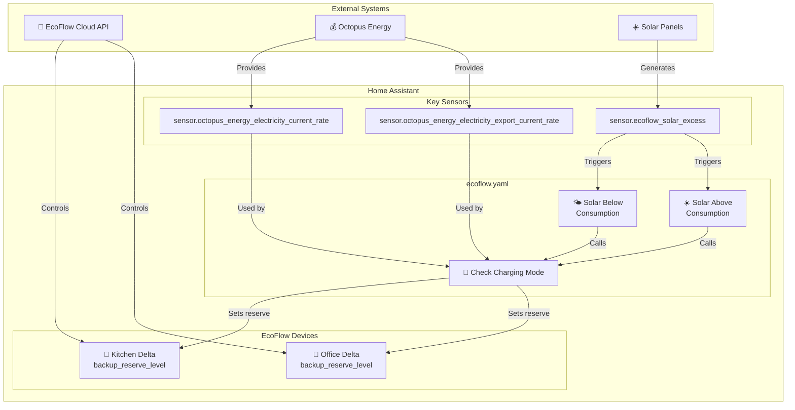
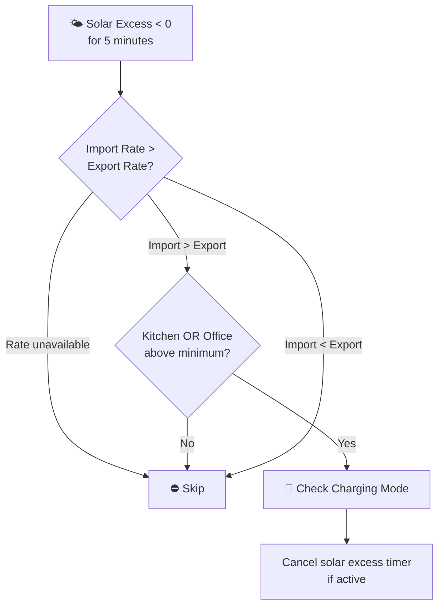
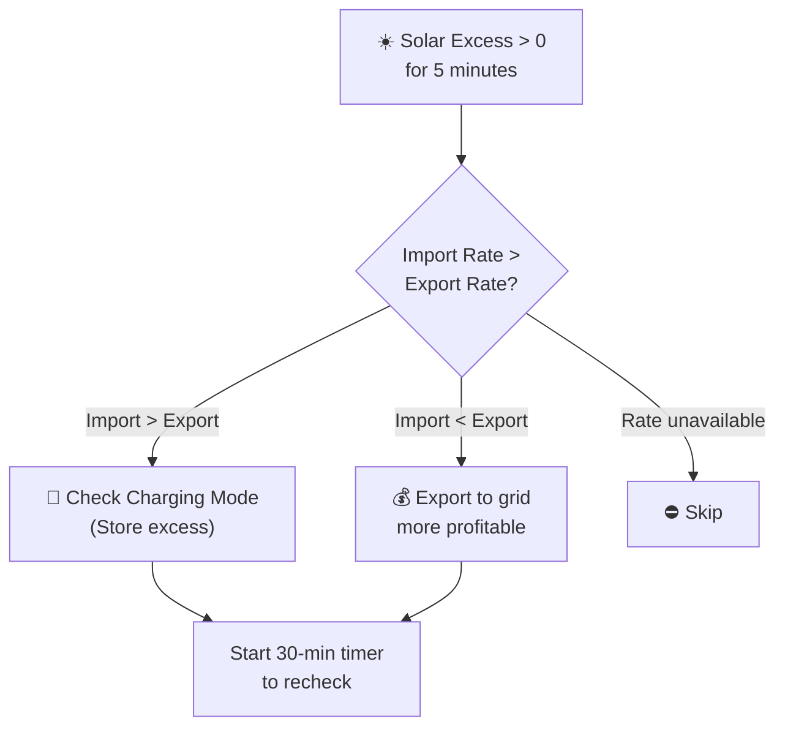
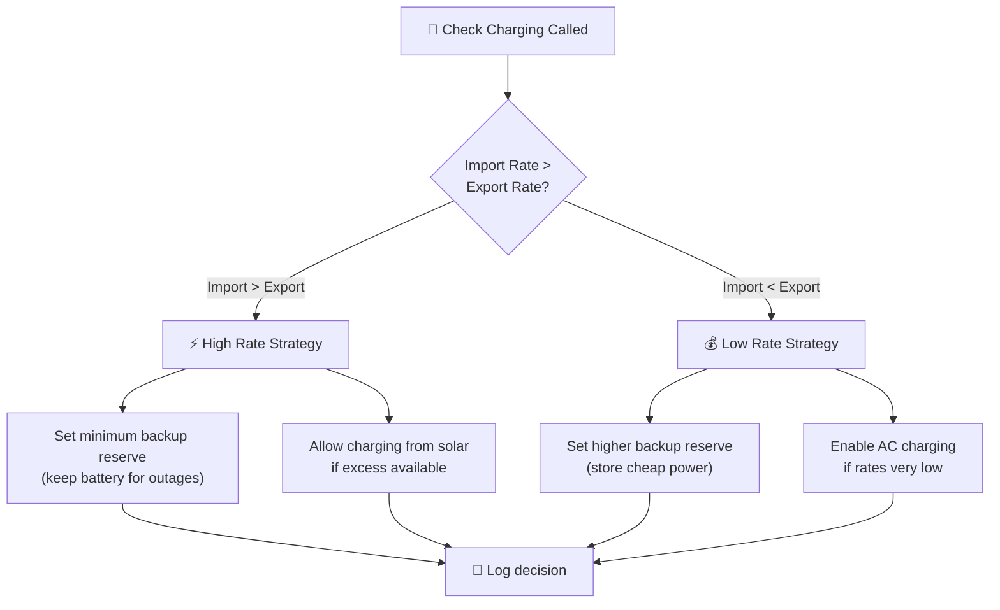
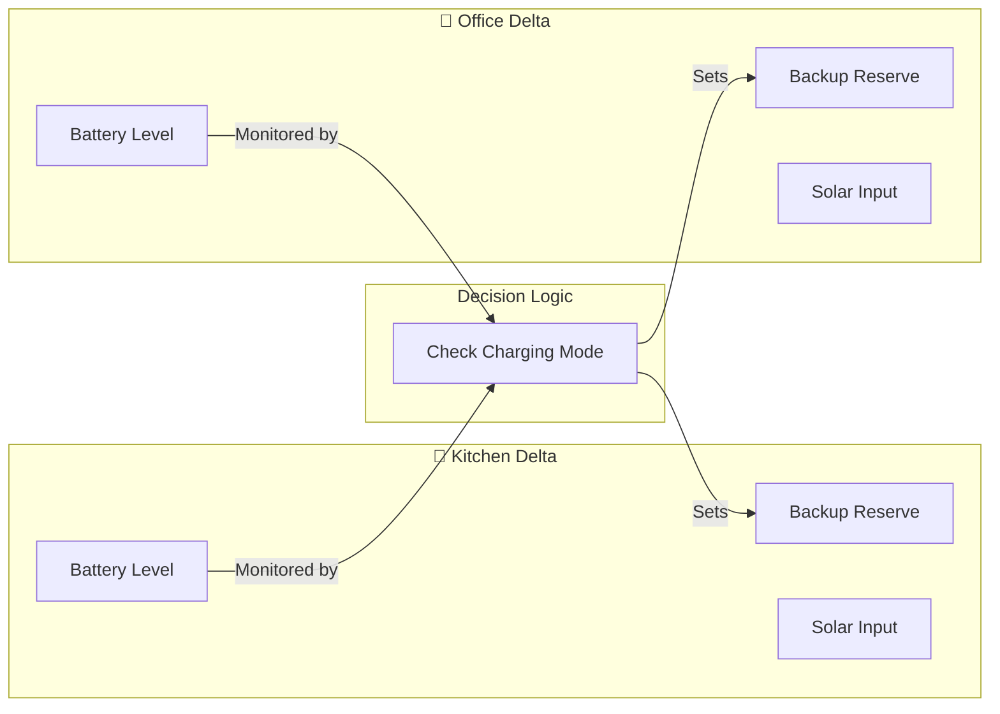

# EcoFlow

Integration with EcoFlow portable battery systems for intelligent backup power and rate-based charging.

**Integration:** https://github.com/tolwi/hassio-ecoflow-cloud

---

## Overview

This package manages EcoFlow portable batteries (Delta series) to provide:
- **Backup power** during outages with configurable reserve levels
- **Rate-based charging** — charges when electricity is cheap/negative
- **Solar excess capture** — stores excess solar instead of exporting
- **Multi-device coordination** — manages Kitchen and Office units together

### Key Capabilities

- Automatic backup reserve management per device
- Rate-aware charging decisions (Octopus Agile)
- Solar excess detection and storage
- Integration with central energy management

---

## Architecture

---

## Automations

### EcoFlow: Solar Below House Consumption
**ID:** `1689437015870`

Triggers when solar generation drops below house consumption for 5 minutes.

**Conditions:**
- Import rate > Export rate (expensive to buy, cheap to sell)
- Either Kitchen or Office backup reserve is above minimum threshold
- EcoFlow automations enabled

**Actions:**
- Calls `script.ecoflow_check_charging_mode` with current rates
- Cancels `timer.check_solar_excess` if running

---

### EcoFlow: Solar Above House Consumption
**ID:** `1689437015871`

Triggers when solar exceeds house consumption — opportunity to store excess.

**Logic:**
- If importing is expensive (rate > export), store solar in batteries
- If exporting is profitable (rate < export), send to grid instead
- Starts a 30-minute timer to re-evaluate conditions

---

### EcoFlow: Check Charging Mode
**Script:** `ecoflow_check_charging_mode`

Central decision script for EcoFlow charging strategy.

---

## Key Entities

### EcoFlow Integration Sensors

| Entity | Description |
|--------|-------------|
| `sensor.ecoflow_solar_excess` | Solar generation minus house consumption (W) |
| `sensor.ecoflow_kitchen_battery_level` | Kitchen Delta battery percentage |
| `sensor.ecoflow_office_battery_level` | Office Delta battery percentage |
| `number.ecoflow_kitchen_backup_reserve_level` | Minimum reserve for Kitchen (%) |
| `number.ecoflow_office_backup_reserve_level` | Minimum reserve for Office (%) |
| `switch.ecoflow_kitchen_backup_reserve_enabled` | Enable backup reserve mode |
| `switch.ecoflow_office_backup_reserve_enabled` | Enable backup reserve mode |

### Input Numbers (Configuration)

| Entity | Default | Purpose |
|--------|---------|---------|
| `input_number.ecoflow_kitchen_minimum_backup_reserve` | 20% | Minimum backup level for Kitchen |
| `input_number.ecoflow_office_minimum_backup_reserve` | 20% | Minimum backup level for Office |

### Input Booleans (Feature Flags)

| Entity | Purpose |
|--------|---------|
| `input_boolean.enable_ecoflow_automations` | Master switch for EcoFlow automations |

### Timers

| Entity | Duration | Purpose |
|--------|----------|---------|
| `timer.check_solar_excess` | 30 minutes | Re-evaluation interval for solar conditions |

---

## Dependencies

### Required Integrations

- [hassio-ecoflow-cloud](https://github.com/tolwi/hassio-ecoflow-cloud) — EcoFlow device control
- [Octopus Energy](https://github.com/BottlecapDave/HomeAssistant-OctopusEnergy) — Rate-based decisions

### Cross-Package Dependencies

| Dependency | Package | Purpose |
|------------|---------|---------|
| `sensor.octopus_energy_electricity_current_rate` | octopus_energy | Import rate |
| `sensor.octopus_energy_electricity_export_current_rate` | octopus_energy | Export rate |
| `script.send_to_home_log` | shared_helpers | Logging |

---

## Multi-Device Coordination

Both devices are managed together but can have independent reserve levels based on their location and importance.

---

## Troubleshooting

| Issue | Check |
|-------|-------|
| Not charging when solar excess | `sensor.ecoflow_solar_excess` value, timer state |
| Backup reserve not changing | `input_boolean.enable_ecoflow_automations` state |
| Charging at wrong times | Octopus rate sensor values |
| One device not responding | Individual device connectivity to EcoFlow cloud |

---

## Related Documentation

| Document | Purpose |
|----------|---------|
| [Octopus Energy](octopus_energy/README.md) | Rate-based trigger source |
| [Solar Assistant](solar_assistant/README.md) | Main inverter coordination |
| [Zappi](zappi/README.md) | EV charging (competes for solar excess) |

---

*Last updated: 2026-04-05*

*Source: [packages/integrations/energy/ecoflow.yaml](../../../../packages/integrations/energy/ecoflow.yaml)*
