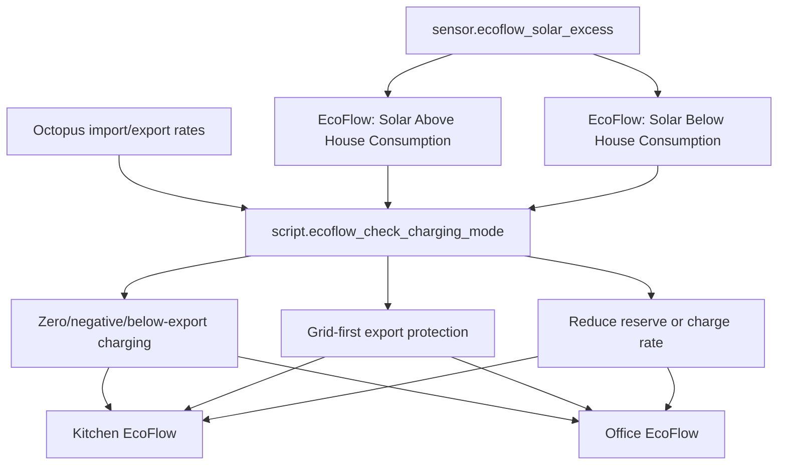

[<- Back to Energy README](README.md) · [Integrations README](../README.md) · [Packages README](../../README.md)

# EcoFlow Package Documentation

The EcoFlow package manages two EcoFlow units, one in the kitchen and one in the office. It keeps backup reserve levels safe, charges from excess solar or cheap electricity when enabled, and warns if batteries or plugs are offline at risky times.

| File | Purpose | Contents |
|------|---------|----------|
| `ecoflow.yaml` | EcoFlow battery and plug automation | 11 automations, 10 scripts, 4 template sensors |

## Quick Summary

| Area | What Happens |
|------|--------------|
| Solar excess | If `sensor.ecoflow_solar_excess` stays above the configured threshold, the package can allocate charge power to the kitchen and office units. |
| No solar excess | If the house starts importing and import costs more than export, charge rate/reserve is reduced back toward configured low reserve levels. |
| Cheap rates | If enabled, zero or negative import rates set backup reserve to 100% and charge at up to 1200 W. |
| Battery safety | If a battery falls below its low threshold while the plug is off, the package turns the plug back on and notifies Danny. |
| Offline safety | Offline plugs and the kitchen EcoFlow main battery going unavailable are monitored so the fridge/freezer supply can be protected. |
| Sunset routine | At sunset, kitchen and office plugs can be turned off when not in holiday mode and safety checks pass. |

## How EcoFlow Decisions Flow

## Automations

| Automation | Trigger | Result |
|------------|---------|--------|
| `EcoFlow: Solar Below House Consumption` | `sensor.ecoflow_solar_excess` below 0 for 5 minutes | Runs the charging-mode script and cancels the solar excess timer if active. |
| `EcoFlow: Solar Above House Consumption` | Solar excess above `input_number.ecoflow_charge_solar_threshold` for 5 minutes, or `timer.check_solar_excess` finishes | Runs the charging-mode script and starts a 5-minute recheck timer while exporting. |
| `EcoFlow: Battery Low And Plug Is Off` | Kitchen or office battery below its low threshold | Turns the relevant plug on; kitchen also sets 200 W charge rate and minimum backup reserve. |
| `EcoFlow: Kitchen Plug Offline` | Kitchen battery below low threshold while plug is unavailable/unknown | Notifies Danny that the kitchen plug is offline. |
| `EcoFlow: Office Plug Offline` | Office battery below low threshold while plug is unavailable/unknown | Notifies Danny that the office plug is offline. |
| `Ecoflow: Kitchen Battery Low And Switch Comes Online` | Kitchen plug returns from unavailable to off | Notifies Danny and turns the plug on if battery is still low. |
| `Ecoflow: Office Battery Low And Switch Comes Online` | Office plug returns from unavailable to off | Notifies Danny and turns the plug on if battery is still low. |
| `EcoFlow: Battery Ultra Low And Plug Is Off` | Kitchen battery below 6% while plug is off | Sends an urgent notification to Danny and Terina. |
| `Ecoflow: Goes Offline` | Kitchen main battery level unknown/unavailable for 30 minutes | If kitchen plug is off, logs and turns the fridge/freezer plug on. |
| `Ecoflow: No Power Drawn By Device` | Kitchen 12-hour power below 9.9 while home mode is Holiday | Notifies Danny to check the kitchen EcoFlow. |
| `Ecoflow: Sunset` | Sunset, unless home mode is Holiday | Calls both plug turn-off scripts in parallel. |

## Scripts

| Script | Purpose |
|--------|---------|
| `script.ecoflow_set_backup_reserve` | Stores a target reserve input number and calls the update script. |
| `script.ecoflow_update_backup_reserve` | Uses `retry.action` to set an EcoFlow backup reserve number entity, with notification on failure. |
| `script.ecoflow_set_backup_reserve_to_target` | Applies the stored target reserve to a kitchen or office reserve entity. |
| `script.ecoflow_set_charge_rate` | Stores a target charge rate and calls the update script. |
| `script.ecoflow_update_charge_rate` | Uses `retry.action` to set an EcoFlow AC charging power entity, with notification on failure. |
| `script.ecoflow_set_charge_rate_to_target` | Applies the stored target charge rate to a kitchen or office charge-rate entity. |
| `script.ecoflow_excess_solar_detected` | Calculates available solar and assigns charge rates to kitchen first, then office, subject to battery state and feature flags. |
| `script.ecoflow_check_charging_mode` | Main decision engine for holiday mode, export mode, zero/negative rates, excess solar, below-export rates, and costly rates. |
| `script.ecoflow_office_turn_off_plug` | Turns the office plug off only when reserve, battery level, solar excess, and computer checks allow it. |
| `script.ecoflow_kitchen_turn_off_plug` | Turns the kitchen plug off only when reserve, occupancy, and battery level checks allow it. |

## Template Sensors

| Entity | Purpose |
|--------|---------|
| `sensor.ecoflow_solar_excess` | Calculates kW available for EcoFlow charging from grid export, Zappi power, and Eddi power, only when PV power is high enough. |
| `sensor.ecoflow_kitchen_charging_rate` | Kitchen total input minus total output, in watts. |
| `sensor.ecoflow_kitchen_minimum_backup_reserve_low_threshold` | Kitchen minimum reserve plus 1%. |
| `sensor.ecoflow_office_minimum_backup_reserve_low_threshold` | Office minimum reserve plus 1%. |

## User Controls

| Entity | Plain-English Purpose |
|--------|-----------------------|
| `input_boolean.enable_ecoflow_automations` | Master enable for EcoFlow automation behaviour. |
| `input_boolean.ecoflow_kitchen_charge_below_export` | Allows kitchen EcoFlow charging when import is cheaper than export and for solar-excess handling. |
| `input_boolean.ecoflow_office_charge_below_export` | Allows office EcoFlow charging when import is cheaper than export and for solar-excess handling. |
| `input_boolean.ecoflow_kitchen_charge_electricity_below_nothing` | Allows kitchen EcoFlow charging when import rate is negative. |
| `input_boolean.ecoflow_office_charge_electricity_below_nothing` | Allows office EcoFlow charging when import rate is negative. |
| `switch.ecoflow_backup_reserve_enabled` | Global backup-reserve gate used by the charging-mode script. |
| `switch.ecoflow_kitchen_backup_reserve_enabled` | Kitchen backup reserve must be enabled for several safety and reserve actions. |
| `switch.ecoflow_office_backup_reserve_enabled` | Office backup reserve must be enabled for several safety and reserve actions. |

## Troubleshooting

| Issue | Check |
|-------|-------|
| Solar excess charging does not start | `sensor.ecoflow_solar_excess`, `input_number.ecoflow_charge_solar_threshold`, `switch.ecoflow_backup_reserve_enabled`, and below-export booleans. |
| Plug turns back on unexpectedly | Battery low thresholds and the low-battery plug recovery automations. |
| Reserve or charge rate does not update | `retry.action` failures, EcoFlow cloud availability, and the target input numbers. |
| Sunset plug shutdown is skipped | Office computer state, adult occupancy, battery levels, backup reserve level, and solar excess. |
| Kitchen offline alert or recovery fires | `sensor.ecoflow_kitchen_main_battery_level` and `switch.ecoflow_kitchen_plug` availability. |
