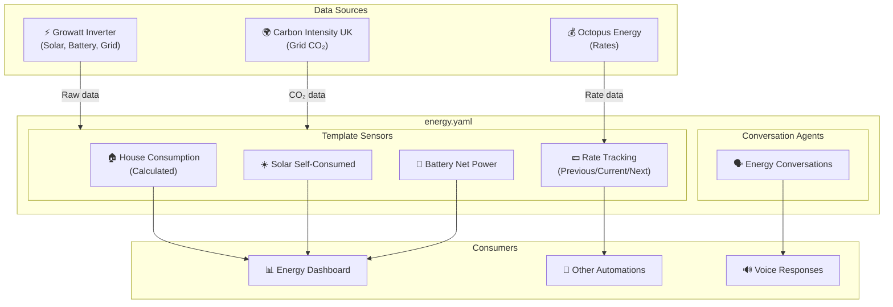
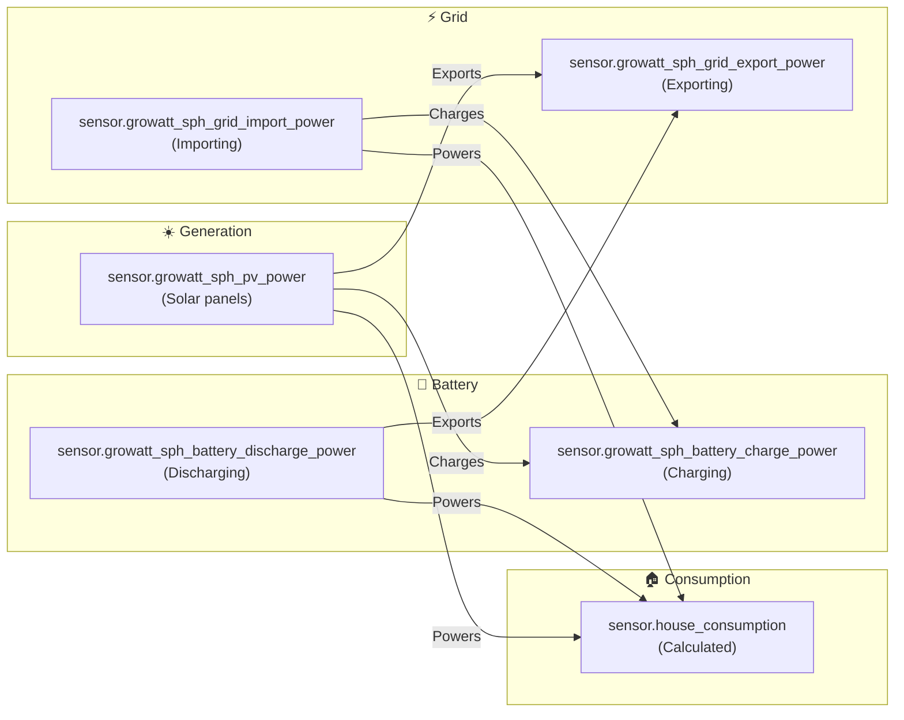
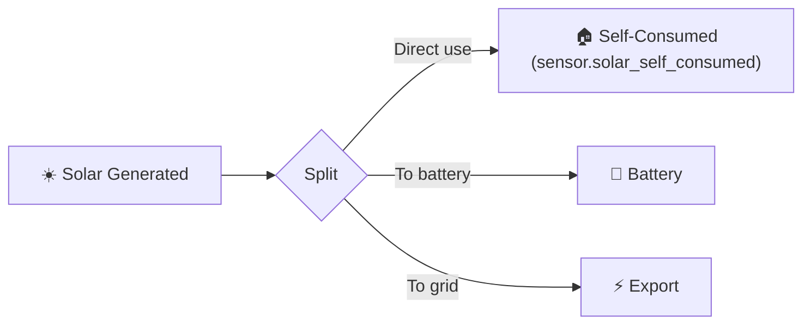
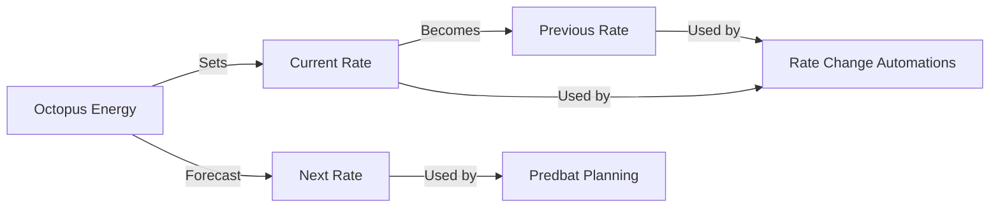
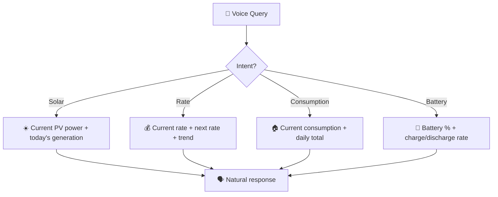

# Energy

Central energy management package coordinating solar, battery, grid, and consumption monitoring.

---

## Overview

This package serves as the **central nervous system** for the home's energy management. It doesn't control devices directly but provides:
- **Energy dashboard** sensors for Home Assistant's built-in energy panel
- **Consumption calculations** — converts grid import into actual home consumption
- **Rate tracking** — previous/current/next electricity rates for automation logic
- **Carbon intensity** — grid carbon footprint monitoring
- **Conversation helpers** — natural language responses for voice assistants

### Key Insight: Import ≠ Consumption

Grid import sensors do **not** represent whole-home usage. When solar or battery is supplying power, consumption can be high while grid import is zero (or negative when exporting).

This package calculates **actual consumption** by combining:
- Grid import/export
- Solar generation
- Battery charge/discharge

---

## Architecture



---

## Energy Dashboard Integration



---

## Template Sensors

### House Consumption

**Entity:** `sensor.house_consumption`

Calculates actual home energy usage by combining all sources:

```yaml
# Logic:
consumption = grid_import + solar_generation - grid_export + battery_discharge - battery_charge
```

This gives the true picture of what the house is using, regardless of where the power comes from.

---

### Solar Self-Consumed

**Entity:** `sensor.solar_self_consumed`

Tracks how much solar generation is used directly by the house (not exported or stored).



---

### Battery Net Power

**Entity:** `sensor.battery_net_power`

Combined view of battery activity:
- Positive = discharging (supplying power)
- Negative = charging (absorbing power)

---

### Rate Tracking

| Entity | Purpose |
|--------|---------|
| `sensor.electricity_previous_rate` | Rate before current period (for trend analysis) |
| `sensor.electricity_current_rate` | Current import rate (p/kWh) |
| `sensor.electricity_next_rate` | Upcoming rate (for predictive decisions) |



---

## Conversation Agents

### Energy Conversations

Provides natural language responses for voice assistants:

**Example Queries:**
- "How much solar are we generating?"
- "What's the current electricity rate?"
- "How much power is the house using?"

**Response Logic:**


---

## Carbon Intensity

**Entity:** `sensor.carbon_intensity_uk`

Tracks the real-time carbon intensity of the UK grid (gCO₂/kWh).

**Usage:**
- High carbon = prioritize battery/solar
- Low carbon = acceptable to import from grid
- Can trigger automations to shift loads to cleaner periods

---

## Key Entities

### Sensors (Template)

| Entity | Unit | Description |
|--------|------|-------------|
| `sensor.house_consumption` | W | Real-time house consumption |
| `sensor.solar_self_consumed` | W | Solar used directly by house |
| `sensor.battery_net_power` | W | Battery discharge (positive) / charge (negative) |
| `sensor.electricity_previous_rate` | p/kWh | Previous period rate |
| `sensor.electricity_current_rate` | p/kWh | Current import rate |
| `sensor.electricity_next_rate` | p/kWh | Next period rate |
| `sensor.carbon_intensity_uk` | gCO₂/kWh | Grid carbon intensity |

### From Growatt Integration

| Entity | Description |
|--------|-------------|
| `sensor.growatt_sph_pv_power` | Solar generation |
| `sensor.growatt_sph_battery_charge_power` | Battery charging |
| `sensor.growatt_sph_battery_discharge_power` | Battery discharging |
| `sensor.growatt_sph_grid_import_power` | Grid import |
| `sensor.growatt_sph_grid_export_power` | Grid export |

---

## Dependencies

### Required Integrations

- [Growatt](https://www.home-assistant.io/integrations/growatt_server/) — Solar/battery/grid data
- [Octopus Energy](https://github.com/BottlecapDave/HomeAssistant-OctopusEnergy) — Rate data
- [Carbon Intensity UK](https://www.home-assistant.io/integrations/carbon_intensity/) — Grid carbon data

### Cross-Package Dependencies

| Dependency | Package | Purpose |
|------------|---------|---------|
| `sensor.growatt_sph_*` | solar_assistant | Raw energy data |
| `sensor.octopus_energy_electricity_*` | octopus_energy | Rate data |
| `conversation` | home_assistant | Voice responses |

---

## Energy Dashboard Configuration

To use these sensors in Home Assistant's Energy Dashboard:

```yaml
# configuration.yaml
energy:
  # Grid consumption
  grid:
    - name: Grid Import
      power: sensor.growatt_sph_grid_import_power
    - name: Grid Export
      power: sensor.growatt_sph_grid_export_power

  # Solar panels
  solar:
    - name: Solar Panels
      power: sensor.growatt_sph_pv_power

  # Battery
  battery:
    - name: Home Battery
      power: sensor.battery_net_power
```

---

## Troubleshooting

| Issue | Check |
|-------|-------|
| Consumption seems wrong | Verify all Growatt sensors are available |
| Rate sensors stale | Octopus Energy integration status |
| Negative consumption | Battery sensor signs may be reversed |
| Carbon intensity unavailable | Carbon Intensity UK integration |

---

## Related Documentation

| Document | Purpose |
|----------|---------|
| [Solar Assistant](solar_assistant/README.md) | Inverter control and monitoring |
| [Octopus Energy](octopus_energy/README.md) | Rate-based automation triggers |
| [Predbat](predbat/README.md) | Battery optimization planning |
| [EcoFlow](ecoflow/README.md) | Portable battery coordination |
| [Zappi](zappi/README.md) | EV charging energy flow |

---

*Last updated: 2026-04-05*

*Source: [packages/integrations/energy/energy.yaml](../../../../packages/integrations/energy/energy.yaml)*
