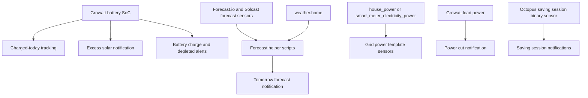

[<- Back to Energy README](README.md) · [Integrations README](../README.md) · [Packages README](../../README.md)

# Core Energy Package Documentation

The core energy package watches the house battery, solar forecast, grid power, and Octopus saving sessions. It sends the household useful warnings, produces reusable forecast calculations for other packages, and exposes a small set of grid power sensors.

| File | Purpose | Contents |
|------|---------|----------|
| `energy.yaml` | Core energy behaviour | 14 automations, 4 groups, 9 scripts, 4 template sensors |

## Quick Summary

| Area | What Happens |
|------|--------------|
| Battery charge tracking | Records whether the Growatt battery reached the configured charged threshold today and counts consecutive days where it did not. |
| Solar forecast | At 21:00 on Agile tariffs, updates Solcast, checks tomorrow's forecast against the low-generation threshold, and sends a forecast notification. |
| Battery warnings | Warns about low battery before peak time, battery depletion, and long runs of days without a full charge. |
| Grid warnings | Alerts for possible power cuts and high house current draw near the configured fuse limit. |
| Saving sessions | Notifies Danny and Terina when Octoplus Saving Sessions start and finish. |
| Forecast helpers | Calculates recommended charge amounts from solar forecast and weather conditions. |

## How The Package Decides What To Do

## Automations

| Automation | Trigger | Result |
|------------|---------|--------|
| `Energy: Battery Charged And Forecasted Excess Solar` | Battery SoC rises above `input_number.battery_charged_notification` | Calls `script.energy_notify_excess_solar` when this/next hour solar is forecast and inverter is not `Battery first`. |
| `Energy: Solar Forecast Tomorrow` | 21:00 | On Agile tariff, updates Solcast, updates the low-forecast counter, and sends tomorrow's forecast. |
| `Energy: Battery Charged Today` | Battery SoC rises above `input_number.growatt_battery_charged_threshold` | Marks `input_boolean.battery_charged_today` on and resets the not-charged counter if needed. |
| `Energy: Reset Battery Charged Today` | Midnight | Resets the charged-today flag or increments `input_number.consecutive_days_battery_not_charged`. |
| `Energy: Solar Production exceed threshold` | Today's forecast rises above `input_number.solar_generation_minimum_threshold` | Logs that production is above threshold. |
| `Energy: Consecutive Days Battery Not Charged` | Not-charged counter above 6 | Notifies Danny. |
| `Energy: Consecutive Low Solar Generation` | Low-forecast counter above 6 | Notifies Danny. |
| `Energy: Battery Charge Notification` | 15:55 | Sends battery SoC and runtime if SoC is above the load-first stop-discharge value plus 1. |
| `Energy: Low Battery Before Peak Time` | 14:00 and 15:00 | On Agile tariff, warns Danny if estimated runtime will not last beyond 19:00 and inverter is not already charging. |
| `Energy: Power Cut Notification` | `sensor.growatt_sph_load_power` is `0` for 1 minute | Sends a possible power-cut notification. |
| `Energy: High Grid Power Draw` | `sensor.house_current` above `sensor.grid_max_import_power_warning` | Warns Danny and Terina about approaching fuse limit. |
| `Energy: Battery Depleted` | Battery SoC below 11% for 1 minute while importing from grid | Logs and sends a battery depleted notification. |
| `Energy: Saving Session Started` | Octoplus saving sessions binary sensor turns on | Notifies Danny and Terina. |
| `Energy: Saving Session Finished` | Octoplus saving sessions binary sensor turns off | Notifies Danny and Terina. |

## Scripts

| Script | Purpose |
|--------|---------|
| `script.todays_solar_forecast_data` | Returns today's forecast-derived charge recommendation, weather condition, weather compensation, and forecast timestamp. |
| `script.tomorrows_solar_forecast_data` | Returns tomorrow's forecast, source, unit, charge recommendation, weather condition, compensation, and forecast timestamp. |
| `script.battery_charge_compensation_ratio` | Maps weather conditions to a compensation ratio: 1.5 for rainy/cloudy/fog, 1.25 for partly cloudy/lightning-rainy/snowy, and 1.0 for sunny/windy/exceptional. |
| `script.calculate_charge_battery_amount` | Converts forecast kWh into a target charge percentage from 100% down to 23%. |
| `script.energy_notify_tomorrows_solar_forecast` | Sends tomorrow's forecast, battery runtime, and recommended battery charge. |
| `script.remaining_solar_forecast_today` | Returns forecast minus actual Growatt PV energy so far. |
| `script.get_first_solar_generation` | Finds the first forecast period above a threshold. |
| `script.get_last_solar_generation` | Finds the last forecast period above a threshold. |
| `script.energy_notify_excess_solar` | Notifies adults currently home about excess solar, or logs if no adult is home. |

## Groups

| Group | Members |
|-------|---------|
| `group.battery_first_charging_schedules` | `input_boolean.enable_battery_first_schedule_1`, `input_boolean.enable_battery_first_schedule_2` |
| `group.below_export_charging_schedules` | `input_boolean.enable_charge_below_export_schedule_1`, `_2`, `_3` |
| `group.grid_first_charging_schedules` | `input_boolean.enable_grid_first_schedule_1` |
| `group.maintain_battery_first_charging_schedules` | `binary_sensor.maintain_charge_first_schedule_1`, `_2` |

## Template Sensors

| Entity | Purpose |
|--------|---------|
| `sensor.grid_power` | Unified grid power using `sensor.house_power`, falling back to smart meter power converted to W. |
| `sensor.grid_import_power` | Positive import-only power, otherwise `0`. |
| `sensor.grid_export_power` | Negative grid power converted to positive export power, otherwise `0`. |
| `sensor.grid_amp_import_warning` | 90% of `input_number.cut_out_fuse_size`, in amps. |

## Power-User Notes

The forecast scripts use Home Assistant response variables and are consumed by Solar Assistant and notification scripts. The target charge table in `script.calculate_charge_battery_amount` is deliberately simple: lower forecast means higher recommended grid charge, and forecasts of 18 kWh or more target 23%.

The `Energy: Solar Forecast Tomorrow` automation only runs its forecast work when the current-day Octopus tariff code contains `AGILE`.

## Troubleshooting

| Issue | Check |
|-------|-------|
| Forecast notification does not send | `event.octopus_energy_electricity_current_day_rates` tariff code, `script.update_solcast`, and forecast sensor availability. |
| Battery not-charged counter seems wrong | `input_boolean.battery_charged_today`, `input_number.growatt_battery_charged_threshold`, and midnight automation trace. |
| Grid sensors are zero | `sensor.house_power` and `sensor.smart_meter_electricity_power` numeric availability. |
| Low battery before peak warning missing | `sensor.battery_charge_remaining_hours`, inverter mode not `Battery first`, and Agile tariff condition. |
| Saving session alerts missing | `binary_sensor.octopus_energy_octoplus_saving_sessions` state transitions from non-`unavailable` states. |
