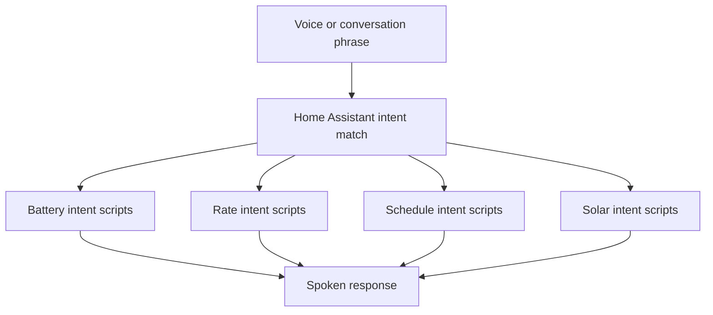

[<- Back to Energy README](README.md) · [Integrations README](../README.md) · [Packages README](../../README.md)

# Energy Conversations Package Documentation

The energy conversations package lets voice and conversation agents answer common household energy questions. It does not control devices; it reads live sensors, helpers, and schedule groups and returns spoken text.

| File | Purpose | Contents |
|------|---------|----------|
| `energy_conversations.yaml` | Energy voice/conversation intents | 13 intents, 13 intent scripts |

## Quick Summary

| Area | What You Can Ask |
|------|------------------|
| Battery | Battery level, runtime, and a short battery summary. |
| Charging schedules | Current charging schedule settings and active windows. |
| Electricity rates | Current, next, and previous import rates. |
| Export schedule | Active grid-first/export schedule windows. |
| Inverter | Current Growatt inverter mode. |
| Solar | Today's forecast, tomorrow's forecast, remaining forecast today, and generation so far. |

## Intent Flow

## Intent Reference

| Intent | Example Phrases | Response Source |
|--------|-----------------|-----------------|
| `getBatteryLevel` | `How much battery is left`, `What is the battery level` | `sensor.growatt_sph_battery_state_of_charge` with unit. |
| `getBatteryRunTime` | `How long will the battery last`, `When will the battery run out` | `sensor.battery_charge_remaining_hours`. |
| `getBatterySummary` | `Battery summary` | Battery SoC plus runtime formatted as today, tomorrow, or date/time. |
| `getChargingScheduleSummary` | `What is the charging schedule summary`, `How is the charging schedule set` | Charge booleans and schedule groups. |
| `getCurrentElectricityRates` | `What is the current electricity rate`, `What is the current unit rate` | `sensor.octopus_energy_electricity_current_rate`. |
| `getExportSchedule` | `What is the export schedule` | `group.grid_first_charging_schedules` and matching binary schedule sensors. |
| `getInverterMode` | `What is the inverter mode` | `sensor.growatt_sph_inverter_mode`. |
| `getNextElectricityRates` | `What is the next electricity rate`, `What is the next unit rate` | `sensor.electricity_next_rate`. |
| `getPreviousElectricityRates` | `What was the previous electricity rate`, `What was the old unit rate` | `sensor.electricity_previous_rate`. |
| `getSolarForecastLeft` | `How much solar generation is left today`, `Remaining solar forecast today` | Today's forecast minus `sensor.growatt_sph_pv_energy`. |
| `getSolarForecastToday` | `What is the solar forecast today` | `sensor.total_solar_forecast_estimated_energy_production_today`. |
| `getSolarForecastTomorrow` | `What is the solar forecast` | `sensor.total_solar_forecast_estimated_energy_production_tomorrow`. |
| `getSolarGeneratedToday` | `How much solar has generated today`, `How much solar so far` | `sensor.growatt_sph_pv_energy`. |

## Schedule Summary Details

`getChargingScheduleSummary` reports these sections:

| Section | Entity |
|---------|--------|
| Cost nothing | `input_boolean.solar_assistant_charge_electricity_cost_nothing` |
| Cost below nothing | `input_boolean.solar_assistant_charge_electricity_cost_below_nothing` |
| Forecast based | `input_boolean.enable_forecast_based_charging` |
| Below export | `input_boolean.enable_permanent_charge_below_export` and `group.below_export_charging_schedules` |
| Battery first | `group.battery_first_charging_schedules` |
| Grid first | `group.grid_first_charging_schedules` |
| Maintain charge | `group.maintain_battery_first_charging_schedules` |

For enabled schedule groups, the intent script derives each matching binary sensor name and reports its `after`, `before`, and `next_update` attributes.

## Troubleshooting

| Issue | Check |
|-------|-------|
| Phrase is not recognised | Confirm the phrase matches one of the patterns under `conversation.intents`. |
| Battery summary errors | `sensor.battery_charge_remaining_hours` must be parseable as a timestamp. |
| Schedule times are missing | Check the relevant schedule binary sensor has `after`, `before`, and `next_update` attributes. |
| Rate answer is `0` | The intent scripts use `| float(0)`, so unavailable rate sensors will speak `0`. Check Octopus rate sensors. |
| Solar remaining is negative | Today's actual PV energy can exceed the forecast; the intent reports the raw forecast-minus-actual calculation. |
