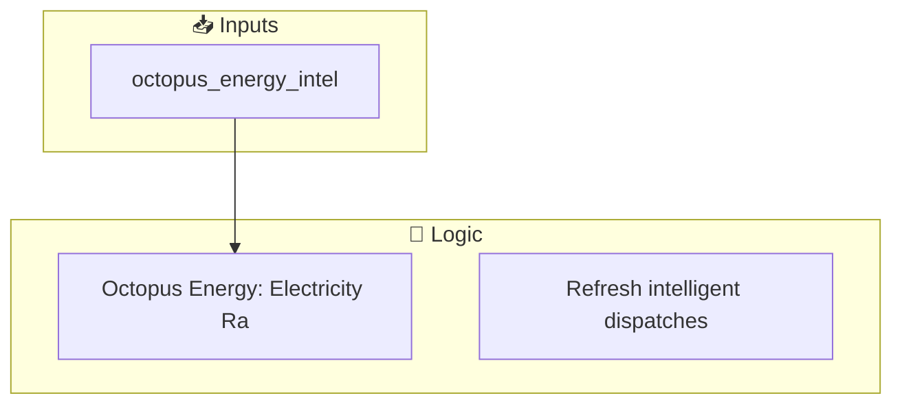
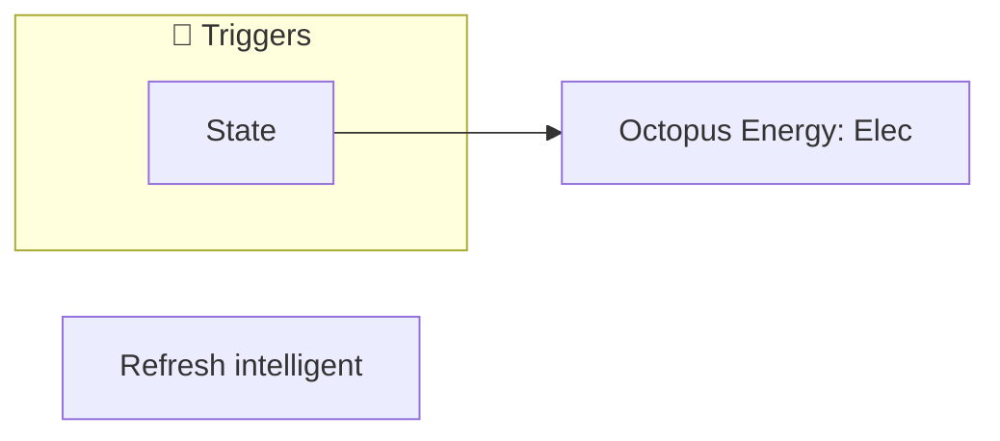
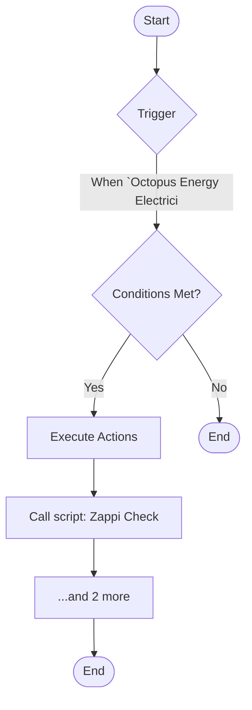
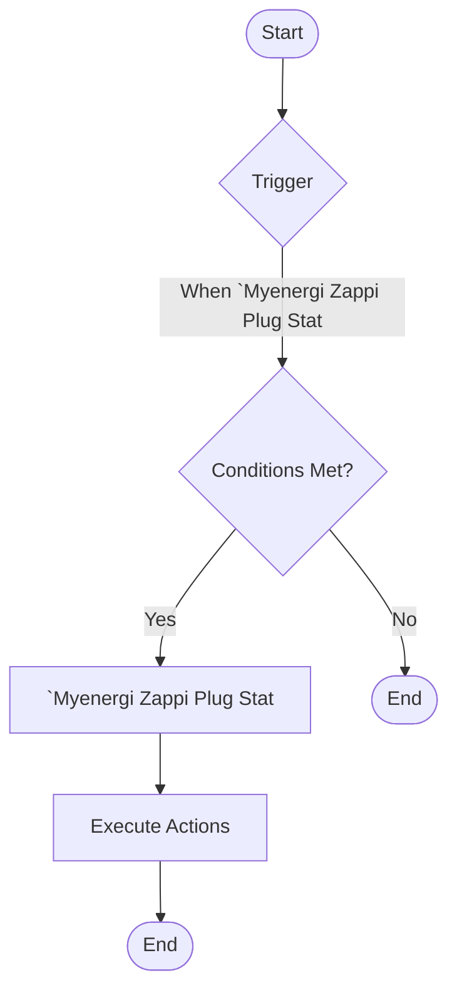

[<- Back to Energy README](../README.md) · [Packages README](../../README.md) · [Main README](../../../README.md)

# Octopus Energy

This package manages 2 automations and 0 scripts for octopus energy.

---

## Table of Contents

- [Overview](#overview)
- [Purpose](#purpose)
- [Dependencies](#dependencies)
- [How It Works](#how-it-works)
- [Automations](#automations)
- [Entities](#entities)
- [Troubleshooting](#troubleshooting)
- [Related Files](#related-files)

---

## Overview

This package provides automation for **octopus energy**. It includes 2 automations and 0 scripts.

### File Structure

```
packages/integrations/energy/
├── octopus_energy.yaml  # Main package configuration
└── README.md                           # This documentation
```

---

## Purpose

- **Octopus Energy: Electricity Rates Changed**: 
- **Refresh intelligent dispatches**: Example from: https://bottlecapdave.github.io/HomeAssistant-OctopusEnergy/services/#octopus_energyrefresh_intelligent_dispatches

### Package Architecture

The following diagram shows the high-level flow of this package:



---

## Dependencies

This package depends on the following components:

### Integrations

- `EcoFlow`
- `Zappi`
- `Octopus Energy`

---

## How It Works

This section explains the overall behavior and logic of the package.

### Automation Logic

**Octopus Energy: Electricity Rates Changed**
Triggered when: When `Octopus Energy Electricity Current Rate` state changes

**Refresh intelligent dispatches**
Example from: https://bottlecapdave.github.io/HomeAssistant-OctopusEnergy/services/#octopus_energyrefresh_intelligent_dispatches
Triggered when: When `Myenergi Zappi Plug Status` changes to 'EV Disconnected'

### Workflow Diagram

The following diagram illustrates the automation flow:



---

## Automations

Detailed documentation for each automation in this package.

### Octopus Energy: Electricity Rates Changed

**Automation ID:** `168962611780`

#### Trigger

- When `Octopus Energy Electricity Current Rate` state changes

#### Actions

1. Call script: Zappi Check Ev Charge
2. Execute actions in parallel
3. Conditional action selection

#### Flow Diagram



### Refresh intelligent dispatches

Example from: https://bottlecapdave.github.io/HomeAssistant-OctopusEnergy/services/#octopus_energyrefresh_intelligent_dispatches

**Automation ID:** `168962611781`

#### Trigger

- When `Myenergi Zappi Plug Status` changes to 'EV Disconnected'

#### Conditions

All conditions must be met for the automation to execute:

- `Myenergi Zappi Plug Status` is 'EV Disconnected'

#### Actions

- *See YAML for action details*

#### Flow Diagram



---

## Entities

Key entities used or created by this package.

### Referenced Entities

- `binary_sensor.octopus_energy_intelligent_dispatching`

---

## Troubleshooting

Common issues and how to resolve them.

### Automation Issues

| Issue | Possible Cause | Resolution |
|-------|---------------|------------|
| Automation not triggering | Entity unavailable or condition not met | Check entity states in Developer Tools |
| Automation fires unexpectedly | Trigger too broad or condition missing | Review trigger entity and add conditions |
| Actions not executing | Service call invalid or entity offline | Verify service and entity in YAML |

### General Debugging

1. Check Home Assistant logs for errors
2. Verify all referenced entities exist in Developer Tools
3. Test automations manually using the 'Run' button
4. Review traces for executed automations to see execution path

---

## Related Files

| File | Description |
|------|-------------|
| [`packages/integrations/energy/octopus_energy.yaml`](./octopus_energy.yaml) | Main package YAML configuration |
| [Integrations Overview](../README.md) | Overview of all integration packages |
| [Main Packages README](../../README.md) | Architecture and organization guidelines |

---

*Last updated: 2026-04-09*
