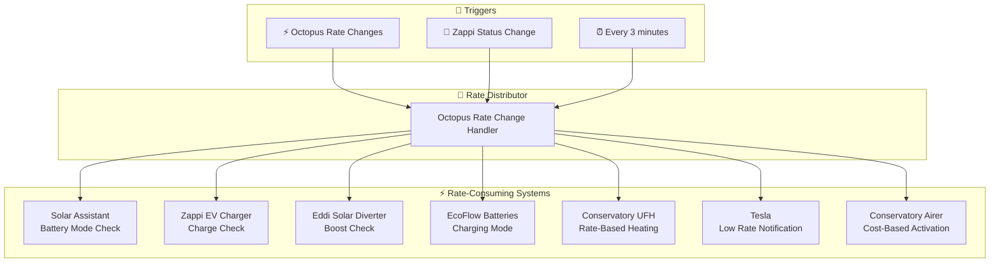

# Octopus Energy Integration

[<- Back to Energy README](../README.md) · [Packages README](../../README.md) · [Main README](../../../README.md)

# Octopus Energy Rate-Based Automation

This package provides Octopus Energy rate change handling to coordinate charging across multiple devices (Zappi EV charger, Eddi solar diverter, EcoFlow batteries, Conservatory underfloor heating, and Airer).

---

## Table of Contents

- [Overview](#overview)
- [Architecture](#architecture)
- [Automations](#automations)
  - [Electricity Rates Changed](#octopus-energy-electricity-rates-changed)
  - [Refresh Intelligent Dispatches](#refresh-intelligent-dispatches)
- [Script](#script)
- [Entity Reference](#entity-reference)
- [Cross-References](#cross-references)

---

## Overview

When Octopus Agile electricity rates change, this package distributes the event to multiple systems that respond to rate signals:

- **Solar Assistant** - Battery charging optimization
- **Zappi** - EV charging optimization
- **Eddi** - Hot water solar diversion boost
- **EcoFlow** - Portable battery charging
- **Conservatory UFH** - Underfloor heating control
- **Tesla** - Low rate notifications
- **Airer** - Clothes airer activation

---

## Architecture

---

## Automations

### Octopus Energy: Electricity Rates Changed
**ID:** `168962611780`

Distributes rate changes to all connected systems.

**Triggers:**
- `sensor.octopus_energy_electricity_current_rate` changes

**Actions (parallel branches):**

| System | Condition | Action |
|--------|-----------|--------|
| Solar Assistant | `enable_solar_assistant_automations` on + Growatt available | `solar_assistant_check_charging_mode` |
| Zappi | `enable_zappi_automations` on + EV not disconnected | `zappi_check_ev_charge` |
| Eddi | Not stopped + not Holiday + `enable_hot_water_automations` on | `hvac_check_eddi_boost_hot_water` |
| EcoFlow | `enable_ecoflow_automations` on | `ecoflow_check_charging_mode` |
| UFH | `enable_conservatory_under_floor_heating_automations` on | `conservatory_electricity_rate_change` |
| Tesla | Tesla unplugged + Zappi disconnected + `enable_tesla_automations` on | `tesla_notify_low_electricity_rates` |
| Airer | `enable_conservatory_airer_when_cost_below_nothing` OR `enable_conservatory_airer_when_cost_nothing` on | `check_conservatory_airer` |

---

### Refresh Intelligent Dispatches
**ID:** `168962611781`

Keeps Octopus Intelligent Dispatching schedule up-to-date based on Zappi status changes and periodic refreshes.

**Triggers:**
- Zappi plug status changes to anything other than "EV Disconnected"
- Every 3 minutes (time pattern)

**Conditions:**
- Zappi plug is not "EV Disconnected"

**Actions:**
- Calls `script.refresh_octopus_intelligent_dispatching`

---

## Script

### refresh_octopus_intelligent_dispatching

Calls the `octopus_energy.refresh_intelligent_dispatches` service for the intelligent dispatch sensor.

---

## Entity Reference

### Octopus Energy Sensors

| Entity | Purpose |
|--------|---------|
| `sensor.octopus_energy_electricity_current_rate` | Current import rate |
| `sensor.octopus_energy_electricity_export_current_rate` | Current export rate |
| `binary_sensor.octopus_energy_intelligent_dispatching` | Intelligent dispatch status |

### MyEnergi Status

| Entity | Purpose |
|--------|---------|
| `sensor.myenergi_zappi_plug_status` | Zappi charging status |
| `select.myenergi_eddi_operating_mode` | Eddi mode (Normal/Stopped/etc) |

### Tesla

| Entity | Purpose |
|--------|---------|
| `binary_sensor.model_y_charger` | Tesla charger connection status |

### Automation Enables

| Entity | Purpose |
|--------|---------|
| `input_boolean.enable_solar_assistant_automations` | Solar Assistant master switch |
| `input_boolean.enable_zappi_automations` | Zappi master switch |
| `input_boolean.enable_hot_water_automations` | Hot water master switch |
| `input_boolean.enable_ecoflow_automations` | EcoFlow master switch |
| `input_boolean.enable_conservatory_under_floor_heating_automations` | UFH master switch |
| `input_boolean.enable_tesla_automations` | Tesla master switch |
| `input_boolean.enable_conservatory_airer_when_cost_below_nothing` | Airer negative rates |
| `input_boolean.enable_conservatory_airer_when_cost_nothing` | Airer zero rates |

---

## Cross-References

| Document | Purpose |
|----------|---------|
| [Energy README](../README.md) | Parent energy package |
| [Solar Assistant README](solar_assistant_README.md) | Battery management |
| [EcoFlow README](ecoflow_README.md) | Portable battery control |
| [Zappi README](zappi_README.md) | EV charger |
| [HVAC README](../../hvac/README.md) | Eddi solar diverter |
| [Conservatory README](../../rooms/conservatory/README.md) | UFH and airer |

---

*Last updated: 2026-04-26*