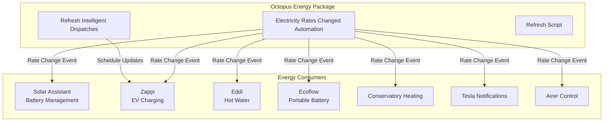
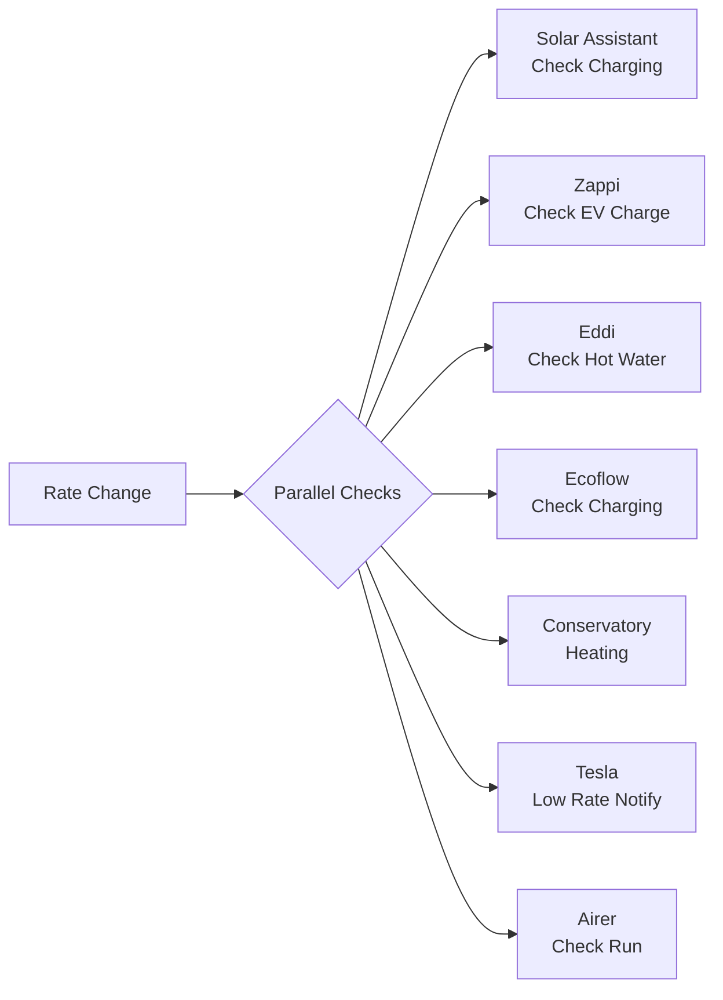

# Octopus Energy Integration

This package integrates the [HomeAssistant-OctopusEnergy](https://github.com/BottlecapDave/HomeAssistant-OctopusEnergy) custom component to manage dynamic electricity pricing and coordinate energy-aware automations across the entire home.

## Purpose

Octopus Energy provides time-of-use electricity tariffs with variable rates throughout the day. This package serves as the **central coordinator** for all rate-dependent energy decisions, triggering automations that optimize battery charging, EV charging, hot water heating, and discretionary loads based on current and upcoming electricity prices.

## Architecture

## Key Entities

### Sensors (from Integration)

| Entity | Description |
|--------|-------------|
| `sensor.octopus_energy_electricity_current_rate` | Current import rate (p/kWh) |
| `sensor.octopus_energy_electricity_export_current_rate` | Current export rate (p/kWh) |
| `binary_sensor.octopus_energy_intelligent_dispatching` | Intelligent Octopus dispatch status |

### Scripts (Defined in This Package)

| Script | Purpose |
|--------|---------|
| `script.refresh_octopus_intelligent_dispatching` | Refetches Intelligent Octopus dispatch schedule |

## Automations

### Electricity Rates Changed

**Trigger:** `sensor.octopus_energy_electricity_current_rate` state change

This is the **central coordination event** for the entire energy management system. When rates change, the automation runs parallel checks across all energy consumers:

Each check includes:
- Current import rate
- Current export rate
- Relevant unit of measurement

**Conditional Logic:**
- **Solar Assistant:** Only if `input_boolean.enable_solar_assistant_automations` is on and inverter is available
- **Zappi:** Only if EV automations enabled and car is connected
- **Eddi:** Only if hot water automations enabled, not in holiday mode, and Eddi is running
- **Ecoflow:** Only if Ecoflow automations enabled
- **Conservatory:** Only if underfloor heating automations enabled
- **Tesla:** Only if car unplugged, Zappi disconnected, and Tesla automations enabled
- **Airer:** Only if airer cost-saving automations enabled

### Refresh Intelligent Dispatches

**Trigger:** 
- Zappi plug status changes to connected
- Every 3 minutes while EV is connected

**Purpose:** Keeps the Intelligent Octopus dispatch schedule current for optimized EV charging windows.

## Dependencies

### Required Integrations

- [HomeAssistant-OctopusEnergy](https://github.com/BottlecapDave/HomeAssistant-OctopusEnergy) - The core integration

### Input Booleans (Feature Flags)

| Input Boolean | Purpose |
|---------------|---------|
| `input_boolean.enable_solar_assistant_automations` | Enable battery management automations |
| `input_boolean.enable_zappi_automations` | Enable EV charging automations |
| `input_boolean.enable_hot_water_automations` | Enable hot water heating automations |
| `input_boolean.enable_ecoflow_automations` | Enable portable battery automations |
| `input_boolean.enable_conservatory_under_floor_heating_automations` | Enable conservatory heating |
| `input_boolean.enable_tesla_automations` | Enable Tesla notifications |
| `input_boolean.enable_conservatory_airer_when_cost_below_nothing` | Enable airer at negative rates |
| `input_boolean.enable_conservatory_airer_when_cost_nothing` | Enable airer at zero rates |

### Dependent Scripts

| Script | Provided By |
|--------|-------------|
| `script.solar_assistant_check_charging_mode` | Solar Assistant package |
| `script.zappi_check_ev_charge` | MyEnergi package |
| `script.hvac_check_eddi_boost_hot_water` | HVAC package |
| `script.ecoflow_check_charging_mode` | Ecoflow package |
| `script.conservatory_electricity_rate_change` | Conservatory package |
| `script.tesla_notify_low_electricity_rates` | Tesla package |
| `script.check_conservatory_airer` | Conservatory package |

## Configuration

No additional configuration required beyond the HomeAssistant-OctopusEnergy integration setup. The package uses entities exposed by that integration.

## Notes

- This package does not define the Octopus Energy sensors themselves—they are created by the integration
- Rate changes propagate through parallel script calls for minimal latency
- Each consumer script makes its own rate-based decisions independently
- Intelligent Octopus dispatches are refreshed frequently while an EV is connected to capture schedule updates
