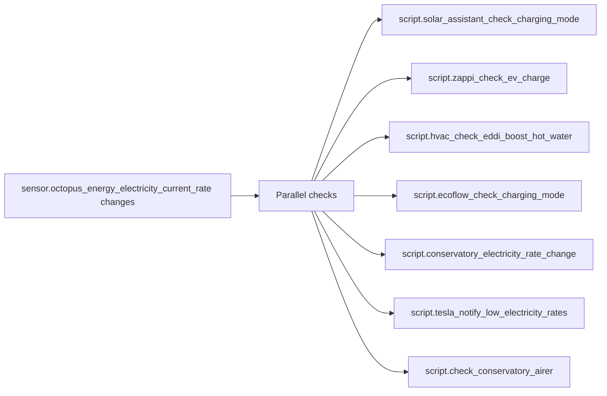

[<- Back to Energy README](README.md) · [Integrations README](../README.md) · [Packages README](../../README.md)

# Octopus Energy Package Documentation

The Octopus Energy package is the rate-change coordinator for the energy system. When the current import rate changes, it asks each enabled subsystem to re-evaluate what it should do.

| File | Purpose | Contents |
|------|---------|----------|
| `octopus_energy.yaml` | Octopus rate and Intelligent Dispatch coordination | 3 automations, 1 script |

## Quick Summary

| Area | What Happens |
|------|--------------|
| Rate changes | Current import rate changes trigger parallel checks for Solar Assistant, Zappi, Eddi, EcoFlow, conservatory heating, Tesla low-rate notifications, and the conservatory airer. |
| Intelligent Octopus | Dispatch data is refreshed every 3 minutes while the Zappi is connected, and once when the Zappi disconnects. |
| Safety gates | Each subsystem has its own enable boolean and availability checks before its script is called. |

## Rate Change Fan-Out

## Automations

| Automation | Trigger | Result |
|------------|---------|--------|
| `Octopus Energy: Electricity Rates Changed` | `sensor.octopus_energy_electricity_current_rate` changes | Runs enabled subsystem checks in parallel with current import/export rates. |
| `Refresh intelligent dispatches` | Zappi plug status becomes anything except `EV Disconnected`, or every 3 minutes | Refreshes Intelligent Octopus dispatches while an EV is connected. |
| `Refresh intelligent dispatches` | Zappi plug status changes to `EV Disconnected` | Refreshes Intelligent Octopus dispatches once after disconnect. |

## Script

| Script | Purpose |
|--------|---------|
| `script.refresh_octopus_intelligent_dispatching` | Calls `octopus_energy.refresh_intelligent_dispatches` for the configured Intelligent Dispatch binary sensor. |

## Subsystem Conditions

| Subsystem | Required Conditions |
|-----------|---------------------|
| Solar Assistant | `input_boolean.enable_solar_assistant_automations` on and `select.growatt_sph_work_mode_priority` available. |
| Zappi | `input_boolean.enable_zappi_automations` on and Zappi plug status is not `EV Disconnected`. |
| Eddi hot water | Eddi operating mode not `Stopped`, home mode not `Holiday`, and hot-water automations enabled. |
| EcoFlow | `input_boolean.enable_ecoflow_automations` on. |
| Conservatory underfloor heating | `input_boolean.enable_conservatory_under_floor_heating_automations` on. |
| Tesla notification | Model Y charger binary sensor is `Unplugged`, Zappi is disconnected, and Tesla automations enabled. |
| Conservatory airer | Either cost-below-nothing or cost-nothing airer enable boolean is on. |

## Troubleshooting

| Issue | Check |
|-------|-------|
| A subsystem did not react to a rate change | Its enable boolean and the trace for `Octopus Energy: Electricity Rates Changed`. |
| Intelligent dispatches are stale | Zappi plug status and `script.refresh_octopus_intelligent_dispatching` trace. |
| Solar Assistant not called | `select.growatt_sph_work_mode_priority` must not be `unavailable`. |
| Zappi not called | `sensor.myenergi_zappi_plug_status` must not be `EV Disconnected`. |
