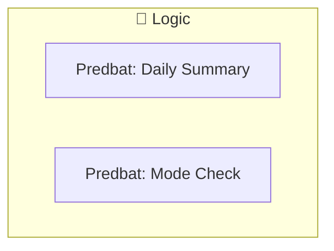
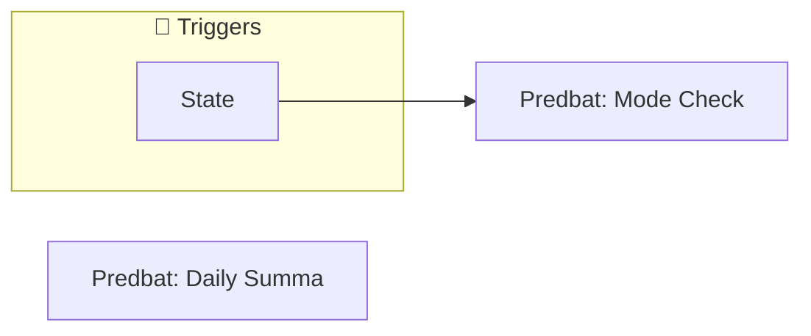
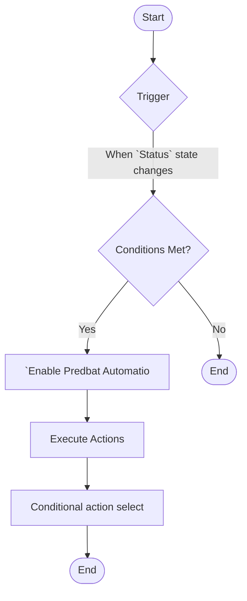

[<- Back to Energy README](../README.md) · [Packages README](../../README.md) · [Main README](../../../README.md)

# Predbat

This package manages 2 automations and 0 scripts for predbat.

---

## Table of Contents

- [Overview](#overview)
- [Purpose](#purpose)
- [Dependencies](#dependencies)
- [How It Works](#how-it-works)
- [Automations](#automations)
- [Entities](#entities)
- [Troubleshooting](#troubleshooting)
- [Related Files](#related-files)
- [Notes](#notes)

---

## Overview

This package provides automation for **predbat**. It includes 2 automations and 0 scripts.

### File Structure

```
packages/integrations/energy/
├── predbat.yaml  # Main package configuration
└── README.md                           # This documentation
```

---

## Purpose

- **Predbat: Daily Summary**: 
- **Predbat: Mode Check**: 

### Package Architecture

The following diagram shows the high-level flow of this package:



---

## Dependencies

This package depends on the following components:

### Integrations

- `predbat`

---

## How It Works

This section explains the overall behavior and logic of the package.

### Automation Logic

**Predbat: Daily Summary**
Triggered when: At 08:00:00

**Predbat: Mode Check**
Triggered when: When `Status` state changes

### Workflow Diagram

The following diagram illustrates the automation flow:



---

## Automations

Detailed documentation for each automation in this package.

### Predbat: Daily Summary

**Automation ID:** `1750929784418`

#### Trigger

- At 08:00:00

#### Actions

- *See YAML for action details*

### Predbat: Mode Check

**Automation ID:** `1752209130762`

#### Trigger

- When `Status` state changes

#### Conditions

All conditions must be met for the automation to execute:

- `Enable Predbat Automations` is enabled

#### Actions

1. Conditional action selection

#### Flow Diagram



---

## Entities

Key entities used or created by this package.

### Referenced Entities

- `person.danny`
- `predbat.status`

---

## Troubleshooting

Common issues and how to resolve them.

### Automation Issues

| Issue | Possible Cause | Resolution |
|-------|---------------|------------|
| Automation not triggering | Entity unavailable or condition not met | Check entity states in Developer Tools |
| Automation fires unexpectedly | Trigger too broad or condition missing | Review trigger entity and add conditions |
| Actions not executing | Service call invalid or entity offline | Verify service and entity in YAML |

### General Debugging

1. Check Home Assistant logs for errors
2. Verify all referenced entities exist in Developer Tools
3. Test automations manually using the 'Run' button
4. Review traces for executed automations to see execution path

---

## Related Files

| File | Description |
|------|-------------|
| [`packages/integrations/energy/predbat.yaml`](./predbat.yaml) | Main package YAML configuration |
| [Integrations Overview](../README.md) | Overview of all integration packages |
| [Main Packages README](../../README.md) | Architecture and organization guidelines |

---

## Notes

### Design Decisions

- **Predbat: Mode Check** has a master enable switch for easy disabling

---

*Last updated: 2026-04-10*
