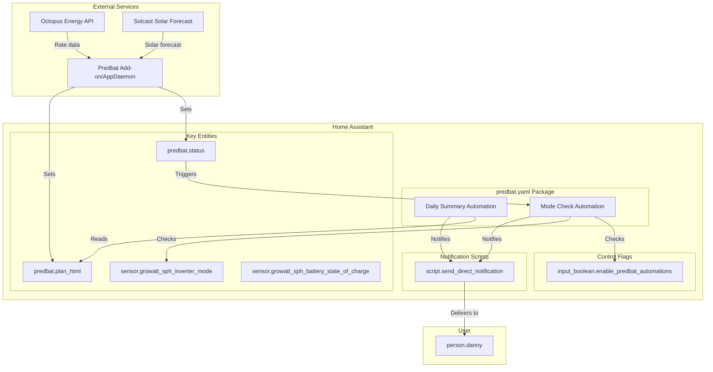
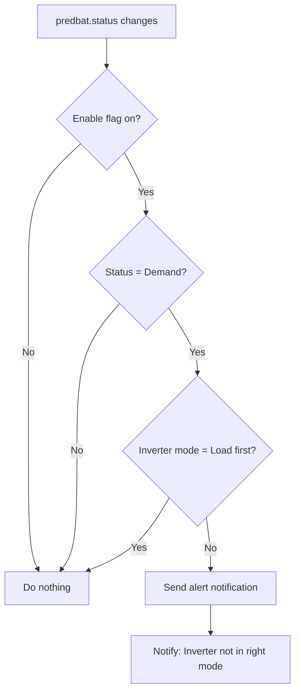

# Predbat Integration

> Intelligent battery and solar forecasting for Home Assistant using [Predbat](https://github.com/springfall2008/batpred).

## Overview

This package integrates [Predbat](https://github.com/springfall2008/batpred) — a sophisticated battery prediction and control system — into Home Assistant. Predbat optimizes battery charging/discharging based on electricity rates, solar forecasts, and consumption patterns to minimize energy costs.

## Architecture



## Automations

### 1. Daily Summary (`predbat_daily_summary`)

**Trigger:** Daily at 08:00

**Purpose:** Sends a morning briefing with Predbat's optimized charging plan for the day.

**Logic:**
- Extracts the HTML plan from `predbat.plan_html`
- Converts HTML to plain text for notifications
- Sends formatted plan via direct notification

**Notification Format:**
```
Predbat
- Plan item 1
- Plan item 2
- ...
```

### 2. Mode Check (`predbat_mode_check`)

**Trigger:** State change of `predbat.status`

**Condition:** `input_boolean.enable_predbat_automations` must be `on`

**Purpose:** Ensures the inverter is in the correct mode when Predbat is actively managing the battery.

**Logic Flow:**



**Alert Condition:**
- `predbat.status` = `Demand`
- `sensor.growatt_sph_inverter_mode` ≠ `Load first`

This indicates Predbat wants to discharge the battery but the inverter isn't in the correct mode to allow it.

## Key Entities

| Entity | Type | Description |
|--------|------|-------------|
| `predbat.status` | sensor | Current Predbat operating mode (e.g., Demand, Charging, Idle) |
| `predbat.plan_html` | sensor | HTML-formatted daily optimization plan |
| `sensor.growatt_sph_inverter_mode` | sensor | Current inverter operating mode |
| `input_boolean.enable_predbat_automations` | input_boolean | Master switch for Predbat automations |

## Dependencies

### Required Integrations

- [Predbat](https://github.com/springfall2008/batpred) — Core battery prediction engine
- [Octopus Energy](https://github.com/BottlecapDave/HomeAssistant-OctopusEnergy) — Time-of-use rate data
- Growatt integration — Inverter control and monitoring

### Required Scripts

- `script.send_direct_notification` — Cross-cutting notification helper

## Configuration

### Prerequisites

1. Predbat installed and configured (via AppDaemon or standalone add-on)
2. Octopus Energy integration providing rate sensors
3. Inverter integration (Growatt) with mode control
4. `input_boolean.enable_predbat_automations` helper created

### Enable/Disable Automations

Use the `input_boolean.enable_predbat_automations` helper to control whether mode check alerts are active:

```yaml
# Enable alerts
input_boolean.enable_predbat_automations: on

# Disable alerts (maintenance, manual override, etc.)
input_boolean.enable_predbat_automations: off
```

## Troubleshooting

### Not receiving daily summaries

- Verify `predbat.plan_html` entity exists and contains data
- Check `script.send_direct_notification` is properly configured
- Review Home Assistant logs for automation execution

### Mode check alerts firing incorrectly

- Check if `input_boolean.enable_predbat_automations` is enabled
- Verify inverter entity ID matches (`sensor.growatt_sph_inverter_mode`)
- Confirm Predbat is correctly setting `predbat.status`

### Inverter mode mismatch

When Predbat status is `Demand` but inverter is not in `Load first`:
1. Check inverter integration connectivity
2. Verify inverter supports mode switching
3. Review Predbat logs for control commands

## References

- [Predbat Documentation](https://github.com/springfall2008/batpred/blob/main/README.md)
- [Predbat Configuration Guide](https://github.com/springfall2008/batpred/blob/main/docs/config.md)
- [Octopus Energy Integration](https://github.com/BottlecapDave/HomeAssistant-OctopusEnergy)
