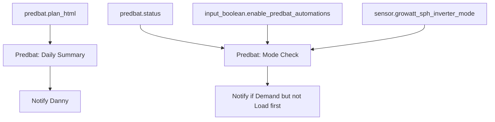

[<- Back to Energy README](README.md) · [Integrations README](../README.md) · [Packages README](../../README.md)

# Predbat Package Documentation

The Predbat package is deliberately small. It does not configure Predbat itself; it reads Predbat entities and sends a morning plan plus one inverter-mode warning.

| File | Purpose | Contents |
|------|---------|----------|
| `predbat.yaml` | Predbat plan and mode alerting | 2 automations |

## Quick Summary

| Area | What Happens |
|------|--------------|
| Daily plan | At 08:00, Danny receives the text from `predbat.plan_html` with simple HTML list tags stripped out. |
| Mode warning | When `predbat.status` changes to `Demand`, Danny is alerted if the inverter is not in `Load first` and Predbat automations are enabled. |

## Flow

## Automations

| Automation | Trigger | Result |
|------------|---------|--------|
| `Predbat: Daily Summary` | 08:00 | Sends Danny `predbat.plan_html` converted from basic HTML list markup to plain text. |
| `Predbat: Mode Check` | `predbat.status` state change | If enabled and status is `Demand`, sends Danny a warning when the inverter is not `Load first`. |

## Key Entities

| Entity | Purpose |
|--------|---------|
| `predbat.plan_html` | Source text for the daily Predbat plan notification. |
| `predbat.status` | Status checked for `Demand`. |
| `sensor.growatt_sph_inverter_mode` | Must be `Load first` when Predbat status is `Demand`. |
| `input_boolean.enable_predbat_automations` | Enables the mode-check warning. |
| `script.send_direct_notification` | Sends both Predbat notifications. |

## Power-User Notes

The deeper Predbat-to-inverter coordination is in `solar_assistant.yaml`, not this package. Solar Assistant reacts to Predbat statuses such as `Demand`, `Exporting`, and `Hold charging` and can switch inverter mode or warn accordingly.

## Troubleshooting

| Issue | Check |
|-------|-------|
| Daily summary missing | `predbat.plan_html`, automation trace for `Predbat: Daily Summary`, and `script.send_direct_notification`. |
| Mode warning never fires | `input_boolean.enable_predbat_automations`, exact `predbat.status` value, and `sensor.growatt_sph_inverter_mode`. |
| Plan text contains markup | The automation only strips `<li>`, `</li>`, `<ul>`, `</ul>`, and `&percnt;`. Other markup will pass through. |
