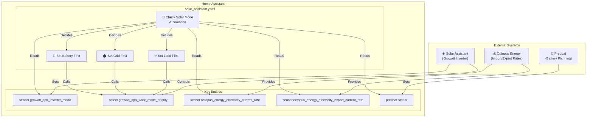
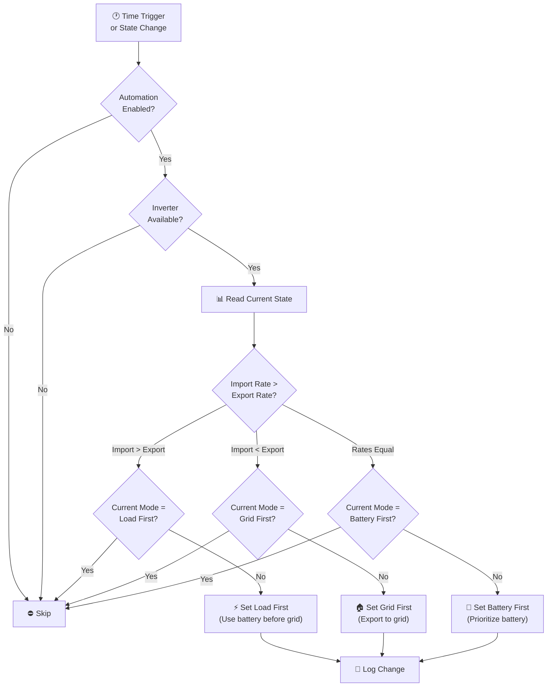
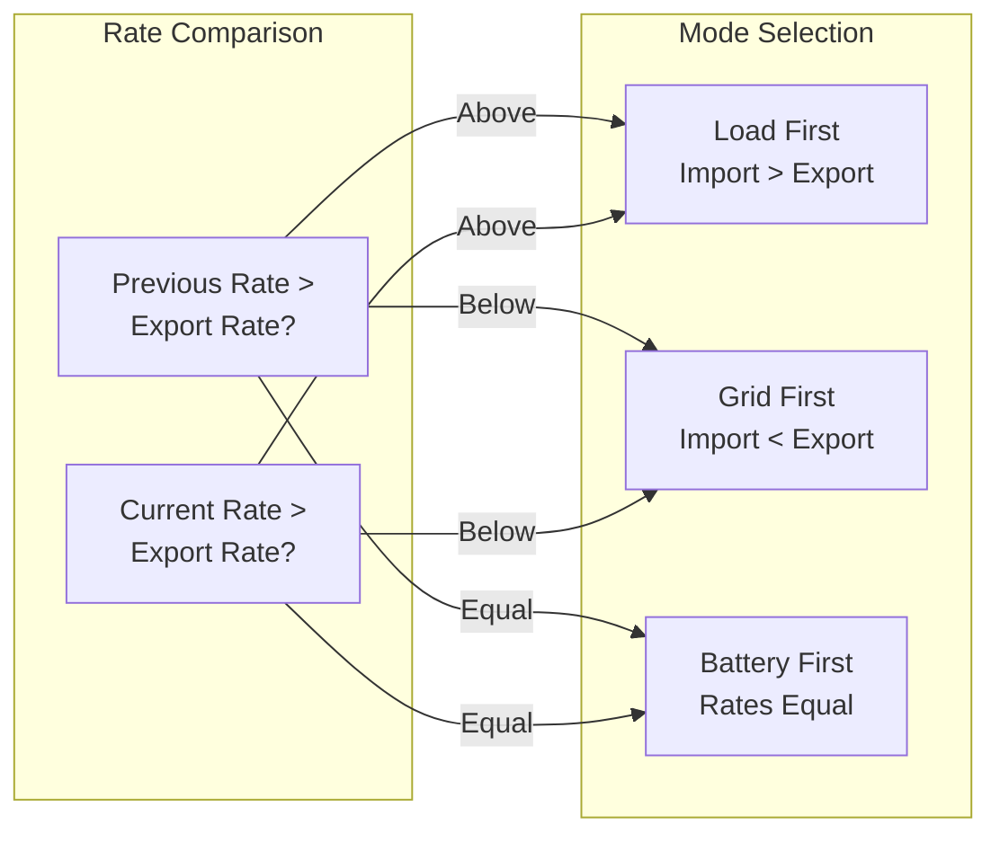
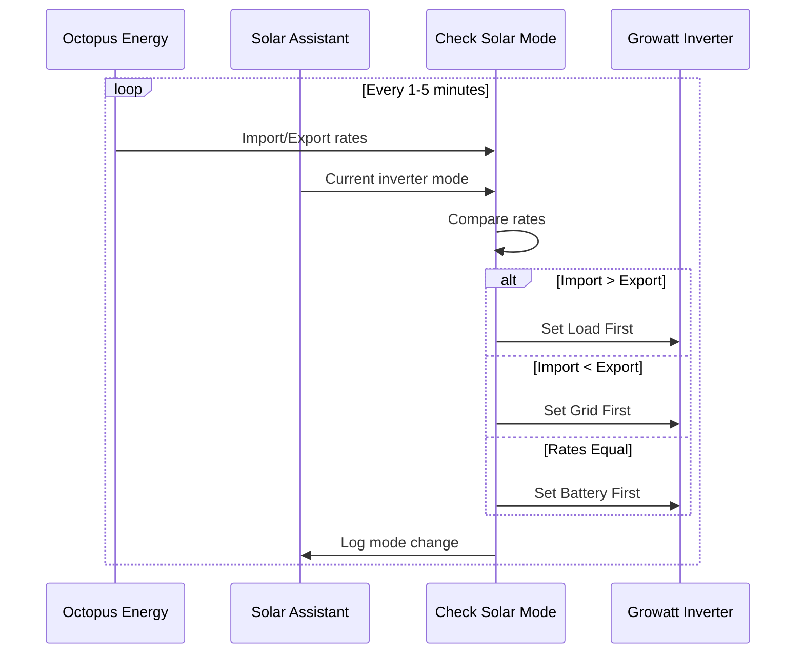

# Solar Assistant

Integration with Solar Assistant for Growatt inverter monitoring and intelligent battery/solar management.

**Integration:** https://github.com/remuslazar/homeassistant-solar-assistant

---

## Overview

Solar Assistant provides real-time monitoring and control of the Growatt SPH inverter. This package manages inverter operating modes, coordinates with Predbat for battery optimization, and makes rate-based decisions to minimize energy costs.

### Key Capabilities

- **Inverter mode management** — Switches between "Load first", "Grid first", and "Battery first" modes
- **Rate-based optimization** — Changes strategy based on Octopus Agile import/export rates
- **Predbat coordination** — Respects Predbat's battery planning while maintaining safety limits
- **Automatic failover** — Handles unavailable/unknown states gracefully

---

## Architecture

---

## Inverter Mode Logic

The automation evaluates conditions every 1-5 minutes and on state changes to determine the optimal inverter mode.

---

## Automations

### Solar Assistant: Check Solar Mode
**ID:** `1691009694611`

Evaluates electricity rates and inverter state to optimize battery usage.

**Triggers:**
| Trigger | Schedule | Purpose |
|---------|----------|---------|
| Time pattern | Every 1, 5, 31, 35 minutes | Regular rate checks |
| State change | `sensor.growatt_sph_inverter_mode` | React to mode changes |
| State change | `predbat.status` | React to Predbat planning |

**Conditions:**
- Either `input_boolean.enable_solar_assistant_automations` OR `input_boolean.enable_predbat_automations` is `on`
- Inverter entities are not `unavailable` or `unknown`

**Logic:**

**Mode Explanations:**

| Mode | When Used | Behavior |
|------|-----------|----------|
| **Load first** | Import rate > Export rate | Battery powers house loads before drawing from grid |
| **Grid first** | Import rate < Export rate | Export excess solar/battery to grid for profit |
| **Battery first** | Rates equal | Prioritize charging/discharging battery |

---

## Key Entities

### Sensors (from Solar Assistant Integration)

| Entity | Description |
|--------|-------------|
| `sensor.growatt_sph_inverter_mode` | Current operating mode (Load first/Grid first/Battery first) |
| `sensor.growatt_sph_battery_state_of_charge` | Battery charge percentage |
| `sensor.growatt_sph_pv_power` | Current solar generation (W) |
| `sensor.growatt_sph_load_power` | Current house consumption (W) |
| `sensor.growatt_sph_grid_power` | Grid import/export power (W) |

### Select Entities (Control)

| Entity | Options | Purpose |
|--------|---------|---------|
| `select.growatt_sph_work_mode_priority` | Load first, Grid first, Battery first | Control inverter operating mode |

### Input Booleans (Feature Flags)

| Entity | Purpose |
|--------|---------|
| `input_boolean.enable_solar_assistant_automations` | Master switch for Solar Assistant automations |
| `input_boolean.enable_predbat_automations` | Allows Predbat to override mode decisions |

---

## Dependencies

### Required Integrations

- [Solar Assistant](https://github.com/remuslazar/homeassistant-solar-assistant) — Inverter monitoring and control
- [Octopus Energy](https://github.com/BottlecapDave/HomeAssistant-OctopusEnergy) — Rate sensors for decisions
- [Predbat](https://github.com/springfall2008/batpred) — Optional battery planning coordination

### Cross-Package Dependencies

| Dependency | Package | Purpose |
|------------|---------|---------|
| `sensor.octopus_energy_electricity_current_rate` | octopus_energy | Import rate for mode decisions |
| `sensor.octopus_energy_electricity_export_current_rate` | octopus_energy | Export rate for mode decisions |
| `predbat.status` | predbat | Battery planning status |
| `script.send_to_home_log` | shared_helpers | Logging |

---

## Data Flow

---

## Troubleshooting

| Issue | Check |
|-------|-------|
| Mode not changing | `input_boolean.enable_solar_assistant_automations` state |
| "Unknown" inverter mode | Solar Assistant connectivity to inverter |
| Not responding to rate changes | Octopus Energy sensor availability |
| Predbat conflicts | Both `enable_solar_assistant_automations` and `enable_predbat_automations` may compete — disable one |

---

## Related Documentation

| Document | Purpose |
|----------|---------|
| [Octopus Energy](octopus_energy/README.md) | Rate-based trigger source |
| [Predbat](predbat/README.md) | Battery planning coordination |
| [Zappi](zappi/README.md) | EV charging (also uses inverter modes) |
| [EcoFlow](ecoflow/README.md) | Portable battery coordination |

---

*Last updated: 2026-04-05*

*Source: [packages/integrations/energy/solar_assistant.yaml](../../../../packages/integrations/energy/solar_assistant.yaml)*
