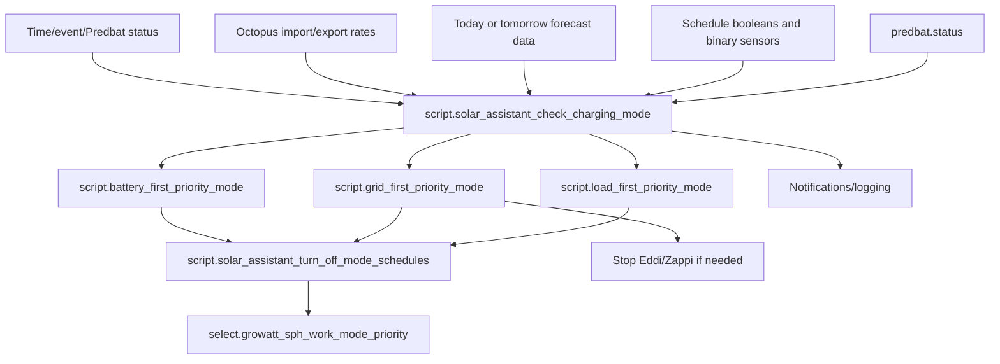

[<- Back to Energy README](README.md) · [Integrations README](../README.md) · [Packages README](../../README.md)

# Solar Assistant Package Documentation

The Solar Assistant package controls the Growatt SPH inverter mode. It decides when the inverter should charge the battery, export to the grid, use the battery for house load, or maintain the current state of charge.

| File | Purpose | Contents |
|------|---------|----------|
| `solar_assistant.yaml` | Growatt inverter mode control and energy sensors | 1 automation, 6 scripts, 12 statistics sensors, 8 template sensors |

## Quick Summary

| Area | What Happens |
|------|--------------|
| Mode checks | A scheduled/event automation calls the charging-mode script when Solar Assistant or Predbat automation is enabled and inverter entities are available. |
| Schedules first | Battery-first, grid-first, and maintain-charge schedules take priority over rate logic. |
| Cheap import | If enabled, zero, negative, below-export, or below-target import rates switch to `Battery first` and target 100% charge. |
| Predbat sync | Predbat `Demand` can switch to `Load first`; Predbat `Exporting` can switch to `Grid first`; `Hold charging` can warn if the inverter mode is not acceptable. |
| Safety | Grid-first export mode stops Eddi and/or Zappi when they are active, then switches the inverter. |
| Sensors | Creates household load statistics and template sensors for battery charge/discharge, inverter mode, runtime, and estimated AC charge power. |

## How Inverter Decisions Flow

## Automation

| Automation | Trigger | Result |
|------------|---------|--------|
| `Solar Assistant: Check Solar Mode` | Time pattern at minutes `1`, `5`, `31`, `35`; inverter mode returning from unknown/unavailable; Predbat status state trigger | Calls `script.solar_assistant_check_charging_mode` for selected event/time cases when Solar Assistant or Predbat automations are enabled and inverter entities are available. |

## Scripts

| Script | Purpose |
|--------|---------|
| `script.battery_first_priority_mode` | Sets battery stop-charge percentage, disables mode schedules, and selects `Battery first` if not already there. |
| `script.grid_first_priority_mode` | Disables mode schedules, stops Eddi/Zappi where needed, optionally sets grid discharge level, and selects `Grid first`. |
| `script.load_first_priority_mode` | Disables mode schedules and selects `Load first` if not already in load-first with schedules off. |
| `script.solar_assistant_turn_off_mode_schedules` | Repeatedly turns off battery-first and grid-first schedule switches until each has been off for 30 seconds. |
| `script.maintain_battery_soc` | Sets stop-charge percentage to current SoC and uses battery-first mode to hold that level. |
| `script.solar_assistant_check_charging_mode` | Main decision engine for schedules, cheap-rate charging, below-export/target-rate charging, Predbat modes, and default load-first mode. |

## Decision Priority

`script.solar_assistant_check_charging_mode` uses a first-match `choose` block:

| Priority | Condition | Result |
|----------|-----------|--------|
| 1 | Battery-first schedule enabled and active | Switch to `Battery first`. |
| 2 | Grid-first schedule enabled and active | Switch to `Grid first`. |
| 3 | Maintain-charge schedule enabled and active | Switch to battery-first with max charge set to current SoC. |
| 4 | Import rate is exactly zero and zero-rate charging enabled | Charge to 100% in `Battery first`. |
| 5 | Import rate is negative and negative-rate charging enabled | Charge to 100% in `Battery first`. |
| 6 | Import rate is below export and permanent/scheduled below-export charging enabled | Charge to 100% in `Battery first`. |
| 7 | Target-rate charging enabled and import rate is below target | Charge to 100% in `Battery first`. |
| 8 | Predbat status is `Demand` and Predbat automations enabled | Switch to `Load first` if needed. |
| 9 | Predbat status is `Exporting` and Predbat automations enabled | Switch to `Grid first` if needed. |
| 10 | Predbat status is `Hold charging` and Predbat automations enabled | Notify Danny if inverter is not in an accepted mode. |
| 11 | Solar Assistant automations enabled and inverter is not `Load first` | Switch to `Load first`. |

## Sensors

### Statistics Sensors

All 12 statistics sensors use `sensor.growatt_sph_load_power` as their source.

| Statistic | Periods |
|-----------|---------|
| Average | 1 hour, 24 hours, 7 days, 30 days |
| Median | 1 hour, 24 hours, 7 days, 30 days |
| Standard deviation | 1 hour, 24 hours, 7 days, 30 days |

### Template Sensors

| Entity | Purpose |
|--------|---------|
| `sensor.growatt_sph_battery_discharge_power` | Positive battery discharge power from negative `sensor.growatt_sph_battery_power`, otherwise 0. |
| `sensor.growatt_sph_battery_charge_power` | Positive battery charge power from positive `sensor.growatt_sph_battery_power`, otherwise 0. |
| `sensor.growatt_sph_inverter_mode` | Derived mode: `Maintain`, `Battery first`, `Grid first`, or the selected work mode priority. |
| `sensor.usable_battery_state_of_charge` | Battery SoC above `number.growatt_sph_load_first_stop_discharge`, expressed as a fraction. |
| `sensor.battery_runtime` | Timestamp estimate for when the battery will run out at current load. |
| `sensor.battery_runtime_duration` | Same runtime estimate expressed as seconds. |
| `sensor.time_to_charge_battery` | Timestamp estimate for full charge, or a long placeholder when not charging. |
| `sensor.growatt_sph_estimated_ac_battery_charge_power` | Charge power estimate adjusted for solar surplus in selected conditions. |

## User Controls

| Entity | Plain-English Purpose |
|--------|-----------------------|
| `input_boolean.enable_solar_assistant_automations` | Enables default inverter automation logic. |
| `input_boolean.enable_predbat_automations` | Enables Predbat-driven mode checks. |
| `input_boolean.solar_assistant_charge_electricity_cost_nothing` | Charge house battery when import rate is exactly zero. |
| `input_boolean.solar_assistant_charge_electricity_cost_below_nothing` | Charge house battery when import rate is negative. |
| `input_boolean.enable_permanent_charge_below_export` | Charge when import is cheaper than export regardless of schedule. |
| `input_boolean.enable_target_electricity_unit_rate` | Charge when import is below `input_number.target_electricity_unit_rate`. |
| `input_boolean.enable_battery_first_schedule_1/2` | Enables battery-first schedule windows. |
| `input_boolean.enable_grid_first_schedule_1/2` | Enables grid-first schedule windows used by the script. |
| `input_boolean.enable_maintain_charge_first_schedule_1/2` | Enables maintain-charge schedule windows. |

## Troubleshooting

| Issue | Check |
|-------|-------|
| Inverter does not change mode | `select.growatt_sph_work_mode_priority` availability, enable booleans, and script trace for `solar_assistant_check_charging_mode`. |
| Schedule seems to override rates | This is expected; schedule branches are evaluated before cheap-rate branches. |
| Grid-first mode stops Eddi/Zappi | This is intentional safety behaviour in `script.grid_first_priority_mode`. |
| Predbat is not influencing mode | `input_boolean.enable_predbat_automations`, exact `predbat.status`, and Solar Assistant automation/script traces. |
| Battery runtime looks wrong | `input_number.solar_battery_size`, `number.growatt_sph_load_first_stop_discharge`, and `sensor.growatt_sph_load_power`. |
