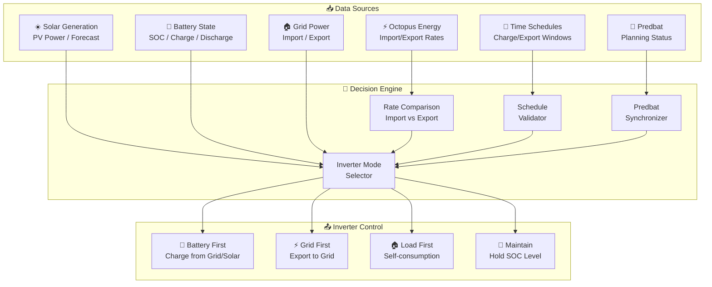
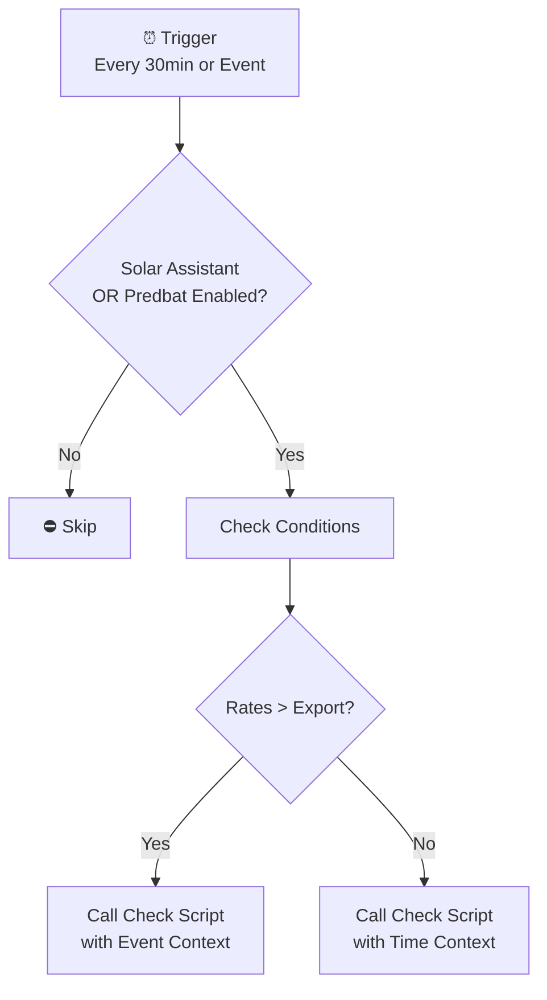
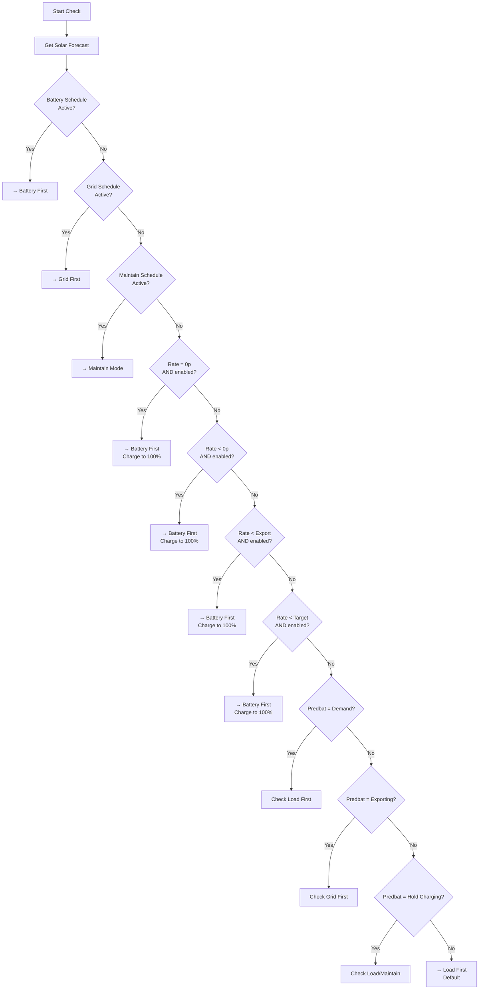
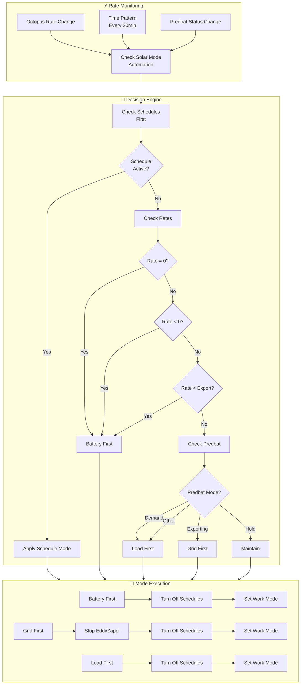

# Solar Assistant Package Documentation

This package manages the solar and battery system integration via Solar Assistant, providing intelligent inverter mode control based on electricity rates, solar forecasts, and Predbat integration. It optimizes energy storage, export, and consumption decisions.

---

## Table of Contents

- [Overview](#overview)
- [Architecture](#architecture)
- [Automations](#automations)
- [Scripts](#scripts)
- [Sensors](#sensors)
- [Configuration](#configuration)
- [Entity Reference](#entity-reference)

---

## Overview

The Solar Assistant package provides intelligent energy management for a Growatt SPH inverter system. It automates inverter mode switching between Battery First, Grid First, and Load First modes based on:

- **Electricity Rates**: Octopus Energy Agile/OE tariff optimization
- **Solar Forecasts**: Solcast integration for predicting solar generation
- **Predbat Integration**: Coordinates with Predbat battery planning
- **Schedules**: Time-based charging/discharging schedules
- **Battery State**: Current SOC and charge/discharge rates



---

## Architecture

### File Structure

```
packages/integrations/energy/
├── solar_assistant.yaml      # Main package file
└── solar_assistant_README.md # This documentation
```

### Key Components

| Component | Purpose |
|-----------|---------|
| `sensor.growatt_sph_inverter_mode` | Calculated inverter mode state |
| `sensor.growatt_sph_battery_state_of_charge` | Battery SOC from inverter |
| `sensor.octopus_energy_electricity_current_rate` | Current import rate |
| `sensor.octopus_energy_electricity_export_current_rate` | Current export rate |
| `predbat.status` | Predbat planning mode/status |
| `select.growatt_sph_work_mode_priority` | Inverter work mode control |

### Inverter Modes

| Mode | Description | Use Case |
|------|-------------|----------|
| **Battery First** | Prioritize charging battery | Cheap import rates, negative pricing |
| **Grid First** | Prioritize exporting to grid | High export rates, peak pricing |
| **Load First** | Prioritize self-consumption | Normal operation, solar covers load |
| **Maintain** | Hold battery at current SOC | Predbat hold charging state |

---

## Automations

### Solar Assistant: Check Solar Mode
**ID:** `1691009694611`

Primary automation that evaluates and switches inverter modes based on electricity rates, schedules, and Predbat status.



**Triggers:**
- Time pattern: Every 30 minutes (:01, :05, :31, :35 - primary + backup)
- Inverter mode changes from `unknown` or `unavailable`
- Predbat status changes

**Conditions:**
- Either `input_boolean.enable_solar_assistant_automations` OR `input_boolean.enable_predbat_automations` is `on`
- Inverter entities are available (not `unavailable`/`unknown`)

**Logic:**
1. If triggered by event and both previous + current rates are above export rate → call check script with event context
2. If triggered by time backup → call check script with time context
3. Otherwise, skip (handled by script logic)

---

## Scripts

### Battery First Priority Mode
**Alias:** `battery_first_priority_mode`

Switches inverter to Battery First mode, optionally setting a maximum charge level.

**Fields:**
| Field | Type | Default | Description |
|-------|------|---------|-------------|
| `max_charge` | number | 100 | SOC % to stop charging (maintain mode) |

**Sequence:**
1. Set battery stop charge percentage via `number.growatt_sph_battery_first_stop_charge`
2. Check if already in Battery First mode → skip if true
3. Turn off mode schedules via `script.solar_assistant_turn_off_mode_schedules`
4. Set work mode priority to "Battery first"

**Use Cases:**
- Charging when import rates are cheap
- Negative pricing events (get paid to charge)
- Overnight charging for next day

---

### Grid First Priority Mode
**Alias:** `grid_first_priority_mode`

Switches inverter to Grid First (export) mode, optionally setting a minimum discharge level.

**Fields:**
| Field | Type | Default | Description |
|-------|------|---------|-------------|
| `max_discharge` | number | 10 | SOC % to stop discharging |

**Sequence:**
1. Check if already in Grid First mode → skip if true
2. Turn off mode schedules
3. **Safety Check**: If Zappi (EV charger) or Eddi (solar diverter) are active:
   - Send notification to Danny and Terina
   - Stop Eddi operating mode
   - Stop Zappi charge mode
4. Set grid discharge rate if field provided
5. Set work mode priority to "Grid first"

**Use Cases:**
- Exporting when export rates are high
- Peak pricing periods
- Predbat export mode

---

### Load First Priority Mode
**Alias:** `load_first_priority_mode`

Switches inverter to Load First mode (default self-consumption).

**Sequence:**
1. Check if already in Load First mode with schedules off → skip if true
2. Turn off mode schedules
3. Set work mode priority to "Load first"

**Use Cases:**
- Default/normal operation
- When no special charging/exporting conditions apply
- Self-consumption optimization

---

### Solar Assistant Turn Off Mode Schedules
**Alias:** `solar_assistant_turn_off_mode_schedules`

Disables both battery first and grid first time schedules in parallel.

**Sequence:**
- **Parallel execution:**
  - Repeat: Turn off `switch.growatt_sph_battery_first_slot_1_enabled` until off for 30 seconds
  - Repeat: Turn off `switch.growatt_sph_grid_first_slot_1_enabled` until off for 30 seconds

**Purpose:** Prevents scheduled modes from interfering with automated mode changes.

---

### Maintain Battery SOC
**Alias:** `maintain_battery_soc`

Sets battery to maintain current SOC level (used in UI).

**Sequence:**
1. Set stop charge % to current SOC
2. Turn off mode schedules
3. If not in Battery First mode OR stop charge > current SOC:
   - Set to Battery First mode with max_charge = current SOC
4. Otherwise log that already in correct mode

**Use Case:** Hold battery at current level for Predbat hold charging state.

---

### Solar Assistant Check Charging Mode
**Alias:** `solar_assistant_check_charging_mode`

Core decision engine for inverter mode selection. Evaluates multiple conditions in priority order.

**Fields:**
| Field | Type | Required | Description |
|-------|------|----------|-------------|
| `event` | select | Yes | Trigger type: `event` or `time` |
| `current_electricity_import_rate` | number | No | Import rate (GBP/kWh) |
| `current_electricity_import_rate_unit` | text | No | Rate unit |
| `current_electricity_export_rate` | number | No | Export rate (GBP/kWh) |
| `current_electricity_export_rate_unit` | text | No | Export unit |

**Trace Storage:** 120 stored traces for debugging

**Decision Flow:**



**Priority Order:**

1. **Battery First Schedule** - Manual schedule takes precedence
2. **Grid First Schedule** - Export schedule takes precedence  
3. **Maintain Schedule** - SOC maintenance schedule
4. **Zero Rate Charging** - When rate = 0p and `input_boolean.solar_assistant_charge_electricity_cost_nothing` enabled
5. **Negative Rate Charging** - When rate < 0p and `input_boolean.solar_assistant_charge_electricity_cost_below_nothing` enabled
6. **Below Export Charging** - When import < export and charge below export enabled (permanent or scheduled)
7. **Target Rate Charging** - When import < target rate and `input_boolean.enable_target_electricity_unit_rate` enabled
8. **Predbat Modes** - Sync with Predbat planning:
   - Demand → Load First
   - Exporting → Grid First
   - Hold Charging → Load First or Maintain
9. **Default** → Load First

---

## Sensors

### Statistics Sensors (Home Electricity Power)

Statistical analysis of home electricity load power over various time periods.

| Sensor | Period | Statistic |
|--------|--------|-----------|
| `sensor.home_electricity_power_average_over_an_hour` | 1 hour | Mean |
| `sensor.home_electricity_power_average_over_a_day` | 24 hours | Mean |
| `sensor.home_electricity_power_average_over_a_week` | 7 days | Mean |
| `sensor.home_electricity_power_average_over_a_month` | 30 days | Mean |
| `sensor.home_electricity_power_median_over_an_hour` | 1 hour | Median |
| `sensor.home_electricity_power_median_over_a_day` | 24 hours | Median |
| `sensor.home_electricity_power_median_over_a_week` | 7 days | Median |
| `sensor.home_electricity_power_median_over_a_month` | 30 days | Median |
| `sensor.home_electricity_power_standard_deviation_over_an_hour` | 1 hour | Std Dev |
| `sensor.home_electricity_power_standard_deviation_over_a_day` | 24 hours | Std Dev |
| `sensor.home_electricity_power_standard_deviation_over_a_week` | 7 days | Std Dev |
| `sensor.home_electricity_power_standard_deviation_over_a_month` | 30 days | Std Dev |

**Source Entity:** `sensor.growatt_sph_load_power`

### Template Sensors

#### Growatt SPH Battery Discharge Power
**Entity:** `sensor.growatt_sph_battery_discharge_power`
**Unique ID:** `251bd989-90a2-4e1b-81d0-b6d87f934eeb`

Shows battery discharge power (positive when discharging, 0 when charging).

```yaml
state: >-
  {{ iif(states('sensor.growatt_sph_battery_power')|float(0) < 0, 
         states('sensor.growatt_sph_battery_power')|float(0)|abs, 0) }}
```

**Attributes:**
- Device Class: `power`
- Unit: `W`
- State Class: `measurement`

---

#### Growatt SPH Battery Charge Power
**Entity:** `sensor.growatt_sph_battery_charge_power`
**Unique ID:** `fe4f9f9c-4a61-4b27-9122-9c17ce5da164`

Shows battery charge power (positive when charging, 0 when discharging).

```yaml
state: >-
  
    {{ states('sensor.growatt_sph_battery_power')|float(0) }}
  
    0
  
```

---

#### Growatt SPH Inverter Mode
**Entity:** `sensor.growatt_sph_inverter_mode`
**Unique ID:** `da2d35ac-8c82-4d85-8529-25f28d3e7712`

Calculated inverter mode based on schedule switches and work mode priority.

**Logic:**
```yaml
 Maintain
 Battery first
 Grid first
 {{ work_mode_priority }}

```

**Icons:**
- Maintain: `mdi:power-plug-battery`
- Battery First: `mdi:battery-charging`
- Grid First: `mdi:battery-minus-variant`
- Default: `mdi:home-battery`

---

#### Usable Battery State of Charge
**Entity:** `sensor.usable_battery_state_of_charge`
**Unique ID:** `a681cc96-bfb5-407c-bc9d-d93f4a0f854f`

Calculates usable battery capacity accounting for minimum discharge SOC.

```yaml
state: "{{ ((soc|float(0)) - (discharge_stop|float(0)))/100 }}"
```

**Attributes:**
- `discharge_stop_soc`: Minimum discharge level
- `soc`: Raw battery SOC

---

#### Battery Runtime
**Entity:** `sensor.battery_runtime`
**Unique ID:** `c5955655-eb91-4bd7-9f8f-afc4e4f0c58c`

Estimates when battery will be depleted based on current load.

**Formula:**
```
Runtime = (Battery Size × Usable SOC) / Current Load
```

**Attributes:**
- `duration`: Human-readable duration (HH:MM:SS)

---

#### Battery Runtime Duration
**Entity:** `sensor.battery_runtime_duration`
**Unique ID:** `b3055c12-734f-4091-8d1b-c995d25f815e`

Same calculation as above but returns seconds as duration.

---

#### Time To Charge Battery
**Entity:** `sensor.time_to_charge_battery`
**Unique ID:** `78ea1413-0d1c-4b89-b109-c961fc30f84d`

Estimates when battery will be fully charged.

**Formula:**
```
Time to Full = (Battery Size × (1 - SOC/100)) / Charge Power
```

Returns `99:99:99` duration if not charging (359999 seconds).

---

#### Growatt SPH Estimated AC Battery Charge Power
**Entity:** `sensor.growatt_sph_estimated_ac_battery_charge_power`
**Unique ID:** `fd5d04da-c5aa-496c-82dc-0252b6dd54b7`

Estimates AC-side battery charge power accounting for solar surplus.

**Logic:**
- If solar > load: Subtract solar surplus from charge power
- Otherwise: Use raw charge power

---

## Configuration

### Input Booleans (External)

These input booleans control feature enablement (typically defined in `energy.yaml`):

| Entity | Purpose |
|--------|---------|
| `input_boolean.enable_solar_assistant_automations` | Master enable for Solar Assistant |
| `input_boolean.enable_predbat_automations` | Enable Predbat coordination |
| `input_boolean.solar_assistant_charge_electricity_cost_nothing` | Charge when rate = 0p |
| `input_boolean.solar_assistant_charge_electricity_cost_below_nothing` | Charge when rate < 0p |
| `input_boolean.enable_permanent_charge_below_export` | Always charge when import < export |
| `input_boolean.enable_charge_below_export_schedule_1/2/3` | Scheduled charge below export |
| `input_boolean.enable_target_electricity_unit_rate` | Enable target rate charging |
| `input_boolean.enable_battery_first_schedule_1/2` | Enable battery charge schedules |
| `input_boolean.enable_grid_first_schedule_1/2` | Enable grid export schedules |
| `input_boolean.enable_maintain_charge_first_schedule_1/2` | Enable maintain SOC schedules |

### Input Numbers (External)

| Entity | Purpose |
|--------|---------|
| `input_number.target_electricity_unit_rate` | Target rate threshold for charging |
| `input_number.solar_battery_size` | Battery capacity in kWh |

### Binary Sensors (External)

Schedule active state sensors (typically template sensors):

| Entity | Purpose |
|--------|---------|
| `binary_sensor.battery_first_schedule_1/2` | Battery schedule active |
| `binary_sensor.grid_first_schedule_1/2` | Grid schedule active |
| `binary_sensor.maintain_charge_first_schedule_1/2` | Maintain schedule active |
| `binary_sensor.charge_below_export_schedule_1/2/3` | Charge below export schedule active |

---

## Entity Reference

### Core Inverter Entities

| Entity | Type | Description |
|--------|------|-------------|
| `sensor.growatt_sph_inverter_mode` | sensor | Calculated mode (Battery/Grid/Load/Maintain) |
| `sensor.growatt_sph_battery_state_of_charge` | sensor | Battery SOC % |
| `sensor.growatt_sph_battery_power` | sensor | Battery power (+charge/-discharge) |
| `sensor.growatt_sph_pv_power` | sensor | Solar PV generation |
| `sensor.growatt_sph_load_power` | sensor | Home electricity consumption |
| `select.growatt_sph_work_mode_priority` | select | Inverter work mode control |
| `number.growatt_sph_battery_first_stop_charge` | number | Battery charge limit % |
| `number.growatt_sph_grid_first_discharge_rate` | number | Grid discharge limit % |
| `number.growatt_sph_load_first_stop_discharge` | number | Load discharge limit % |
| `switch.growatt_sph_battery_first_slot_1_enabled` | switch | Battery schedule enable |
| `switch.growatt_sph_grid_first_slot_1_enabled` | switch | Grid schedule enable |

### Energy Rate Entities

| Entity | Type | Description |
|--------|------|-------------|
| `sensor.octopus_energy_electricity_current_rate` | sensor | Current import rate |
| `sensor.octopus_energy_electricity_export_current_rate` | sensor | Current export rate |
| `sensor.electricity_previous_rate` | sensor | Previous period rate |
| `sensor.electricity_next_rate` | sensor | Next period rate |

### Predbat Entities

| Entity | Type | Description |
|--------|------|-------------|
| `predbat.status` | sensor | Predbat planning status |

### MyEnergi Entities (Safety Integration)

| Entity | Type | Description |
|--------|------|-------------|
| `select.myenergi_eddi_operating_mode` | select | Eddi solar diverter mode |
| `select.myenergi_zappi_charge_mode` | select | Zappi EV charger mode |
| `sensor.myenergi_zappi_plug_status` | sensor | Zappi plug connection status |

### Solar Forecast Entities

| Entity | Type | Description |
|--------|------|-------------|
| `script.todays_solar_forecast_data` | script | Returns today's forecast |
| `script.tomorrows_solar_forecast_data` | script | Returns tomorrow's forecast |

### Notification Scripts

| Entity | Purpose |
|--------|---------|
| `script.send_to_home_log` | Log messages to home log |
| `script.send_direct_notification` | Send mobile notifications |

---

## Automation Flow Summary



---

## Maintenance Notes

### Troubleshooting

| Issue | Check |
|-------|-------|
| Mode not switching | `input_boolean.enable_solar_assistant_automations` state |
| Predbat not syncing | `input_boolean.enable_predbat_automations` state |
| Schedules interfering | `switch.growatt_sph_*_slot_1_enabled` states |
| Rate comparisons wrong | Octopus sensor availability |
| Notifications not sending | Person entity states (Danny/Terina) |

### Key Debugging

1. **Check Traces:** The `solar_assistant_check_charging_mode` script stores 120 traces
2. **Log Level:** Use `script.send_to_home_log` with "Debug" level for detailed logging
3. **Mode State:** Verify `sensor.growatt_sph_inverter_mode` matches actual inverter state

### Safety Features

- **Eddi/Zappi Shutdown:** Grid First mode automatically stops solar diverter and EV charger to prevent conflicts
- **Schedule Override:** All mode changes disable time schedules to prevent conflicts
- **Availability Checks:** Conditions verify entities are not `unknown`/`unavailable`
- **Notification:** Direct notifications sent to Danny (and Terina for grid mode)

### Related Documentation

- See `energy.yaml` for input boolean/number definitions
- See `octopus_energy.yaml` for rate sensor configuration
- See `predbat.yaml` for Predbat integration
- See `zappi.yaml` for EV charger integration
- See `solcast.yaml` for solar forecasting

---

*Last updated: 2026-03-01*
