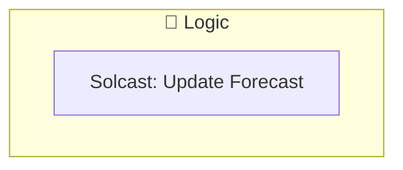
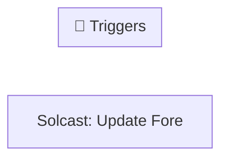

[<- Back to Energy README](../README.md) · [Packages README](../../README.md) · [Main README](../../../README.md)

# Solcast

This package manages 1 automations and 0 scripts for solcast.

---

## Table of Contents

- [Overview](#overview)
- [Purpose](#purpose)
- [How It Works](#how-it-works)
- [Automations](#automations)
- [Troubleshooting](#troubleshooting)
- [Related Files](#related-files)

---

## Overview

This package provides automation for **solcast**. It includes 1 automation and 0 scripts.

### File Structure

```
packages/integrations/energy/
├── solcast.yaml  # Main package configuration
└── README.md                           # This documentation
```

---

## Purpose

- **Solcast: Update Forecast**: 

### Package Architecture

The following diagram shows the high-level flow of this package:



---

## How It Works

This section explains the overall behavior and logic of the package.

### Automation Logic

**Solcast: Update Forecast**
Triggered when: At 08:00:00

### Workflow Diagram

The following diagram illustrates the automation flow:



---

## Automations

Detailed documentation for each automation in this package.

### Solcast: Update Forecast

**Automation ID:** `1691767286139`

#### Trigger

- At 08:00:00

#### Actions

- *See YAML for action details*

---

## Troubleshooting

Common issues and how to resolve them.

### Automation Issues

| Issue | Possible Cause | Resolution |
|-------|---------------|------------|
| Automation not triggering | Entity unavailable or condition not met | Check entity states in Developer Tools |
| Automation fires unexpectedly | Trigger too broad or condition missing | Review trigger entity and add conditions |
| Actions not executing | Service call invalid or entity offline | Verify service and entity in YAML |

### General Debugging

1. Check Home Assistant logs for errors
2. Verify all referenced entities exist in Developer Tools
3. Test automations manually using the 'Run' button
4. Review traces for executed automations to see execution path

---

## Related Files

| File | Description |
|------|-------------|
| [`packages/integrations/energy/solcast.yaml`](./solcast.yaml) | Main package YAML configuration |
| [Integrations Overview](../README.md) | Overview of all integration packages |
| [Main Packages README](../../README.md) | Architecture and organization guidelines |

---

*Last updated: 2026-04-09*
