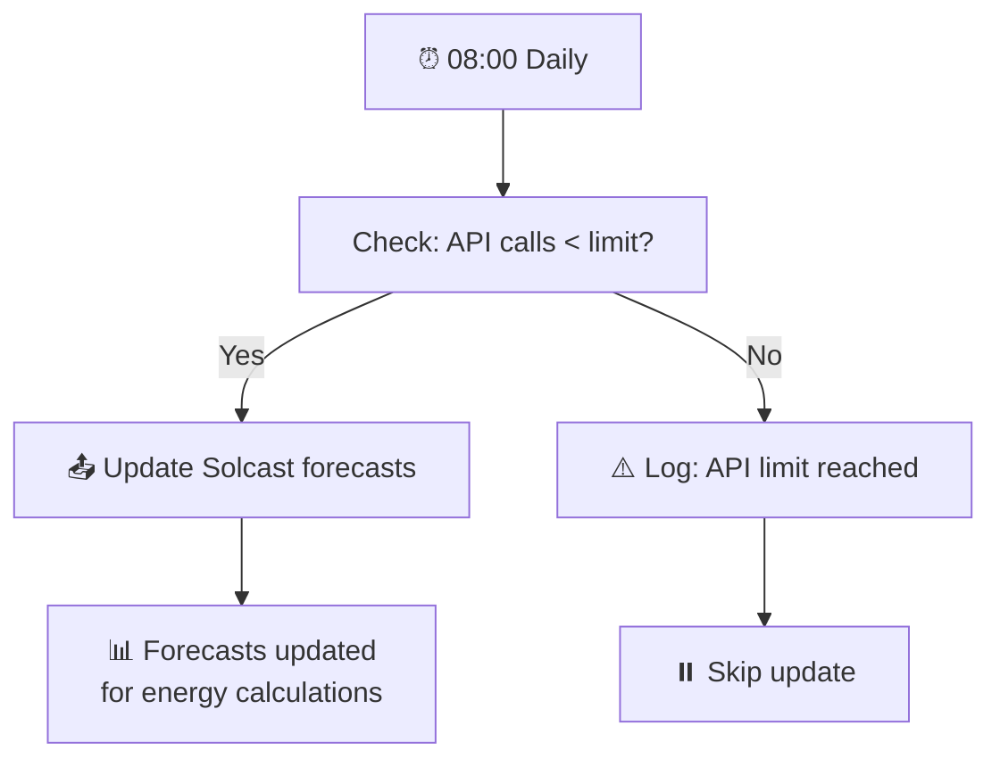

# Solcast Solar Forecasting

[<- Back to Energy README](../README.md) · [Packages README](../../README.md) · [Main README](../../../README.md)

# Solcast Integration

This package manages Solcast solar forecasting integration with 1 automation and 1 script.

---

## Table of Contents

- [Overview](#overview)
- [How It Works](#how-it-works)
- [Automation](#automation)
- [Script](#script)
- [Entity Reference](#entity-reference)
- [Cross-References](#cross-references)

---

## Overview

Solcast provides granular solar generation forecasts that inform battery charging decisions and energy optimization. The integration updates forecasts daily at 08:00.

**Note:** Solcast has API usage limits. The script checks remaining API calls before updating.

---

## How It Works

---

## Automation

### Solcast: Update Forecast
**ID:** `1691767286139`

Triggers daily Solcast forecast update at 08:00.

**Triggers:**
- Time: 08:00:00 daily

**Actions:**
- Calls `script.update_solcast`

---

## Script

### update_solcast

Checks API usage and triggers forecast update.

**Logic:**
1. Compare `sensor.solcast_pv_forecast_api_used` against `sensor.solcast_pv_forecast_api_limit`
2. If within limit → update forecasts + log to home log
3. If at limit → log warning to home log

---

## Entity Reference

### Sensors (from Solcast Integration)

| Entity | Purpose |
|--------|---------|
| `sensor.solcast_pv_forecast_forecast_today` | Today's total forecast |
| `sensor.solcast_pv_forecast_forecast_tomorrow` | Tomorrow's forecast |
| `sensor.solcast_pv_forecast_forecast_remaining_today` | Remaining generation today |
| `sensor.solcast_pv_forecast_api_used` | API calls used this period |
| `sensor.solcast_pv_forecast_api_limit` | API call limit |

---

## Cross-References

| Document | Purpose |
|----------|---------|
| [Energy README](../README.md) | Parent energy package |
| [Solar Assistant README](solar_assistant_README.md) | Solar inverter monitoring |
| [EcoFlow README](ecoflow_README.md) | Battery charging from solar |

---

*Last updated: 2026-04-26*