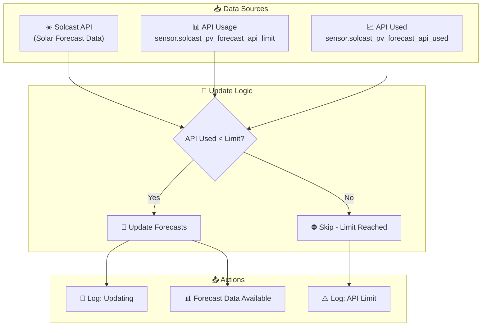
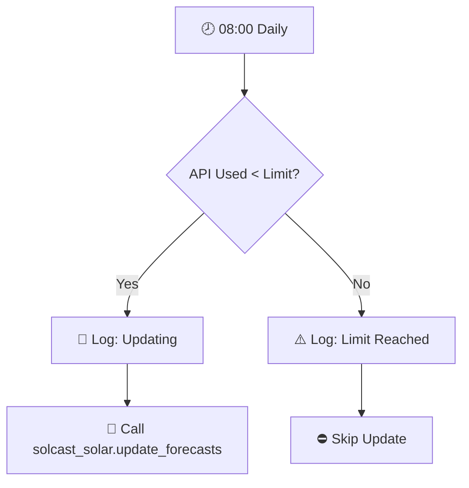
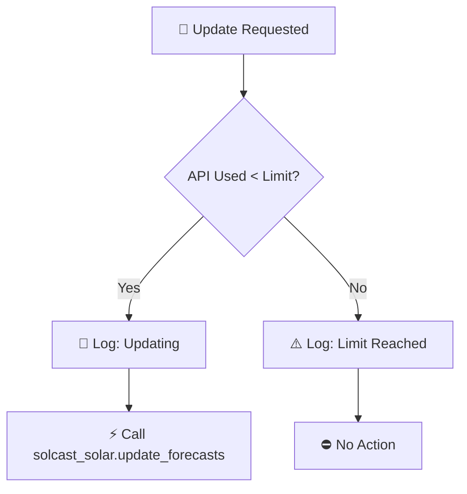
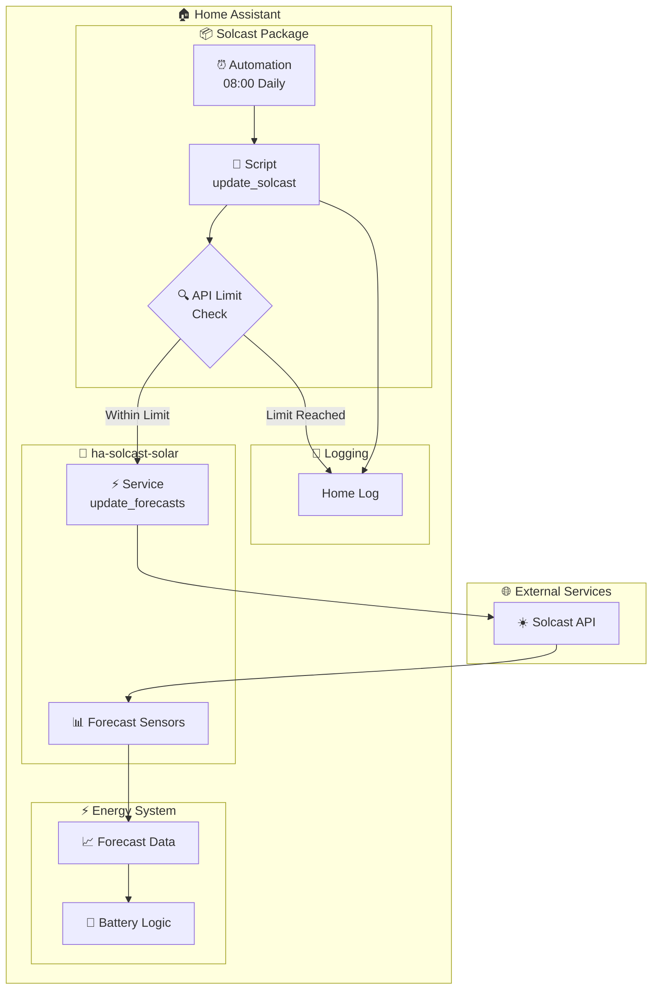

# Solcast Solar Forecasting

This package provides solar forecasting integration using the Solcast API for accurate solar generation predictions. The integration helps optimize battery charging decisions and energy management.

---

## Table of Contents

- [Overview](#overview)
- [Architecture](#architecture)
- [Automations](#automations)
  - [Forecast Updates](#forecast-updates)
- [Scripts](#scripts)
  - [Update Solcast](#update-solcast)
- [Configuration](#configuration)
- [Entity Reference](#entity-reference)
- [Related Documentation](#related-documentation)

---

## Overview

The Solcast integration provides solar forecasting data that is more accurate than Forecast.io for solar generation predictions. This data is used throughout the energy management system to make informed decisions about battery charging and energy usage.



### Key Features

- **API Rate Limiting**: Respects Solcast API limits to prevent over-usage
- **Scheduled Updates**: Daily forecast updates at 08:00
- **Integration with Energy System**: Provides forecast data for battery optimization
- **Logging**: Comprehensive logging of update attempts and API limit status

---

## Architecture

### File Structure

```
packages/integrations/energy/
├── solcast.yaml          # Main Solcast package
└── README.md             # This documentation
```

### Integration

Uses the [ha-solcast-solar](https://github.com/BJReplay/ha-solcast-solar) custom integration for Solcast API communication.

### Key Components

| Component | Purpose |
|-----------|---------|
| `sensor.solcast_pv_forecast_api_used` | Tracks API calls used this period |
| `sensor.solcast_pv_forecast_api_limit` | API call limit for the period |
| `sensor.solcast_pv_forecast_forecast_today` | Today's solar forecast |
| `sensor.solcast_pv_forecast_forecast_tomorrow` | Tomorrow's solar forecast |
| `sensor.solcast_pv_forecast_forecast_remaining_today` | Remaining generation forecast today |
| `script.update_solcast` | Manual/API trigger for forecast updates |

---

## Automations

### Forecast Updates

#### Solcast: Update Forecast
**ID:** `1691767286139`

Scheduled daily update of Solcast forecast data at 08:00.



**Triggers:**
- Time: 08:00:00 daily

**Conditions:**
- None

**Actions:**
1. Check if `sensor.solcast_pv_forecast_api_used` is below `sensor.solcast_pv_forecast_api_limit`
2. If within limit:
   - Log "Updating Solcast forecast" to home log
   - Call `solcast_solar.update_forecasts` service
3. If limit reached:
   - Log "Reached API limit" to home log with warning

**Mode:** Single

---

## Scripts

### Update Solcast

**Alias:** `update_solcast`

Manually triggers a Solcast forecast update with API limit checking.



**Sequence:**
1. **API Limit Check**: Compares `sensor.solcast_pv_forecast_api_used` against `sensor.solcast_pv_forecast_api_limit`
2. **Within Limit Path**:
   - Calls `script.send_to_home_log` with debug message: "Updating Solcast forecast."
   - Calls `solcast_solar.update_forecasts` service to fetch new data
3. **Limit Reached Path**:
   - Calls `script.send_to_home_log` with warning: "Reached API limit."

**Usage:**
- Called by automation at 08:00 daily
- Can be called manually or by other automations/scripts
- Respects API limits to prevent service interruption

---

## Configuration

### External Integration Setup

The Solcast integration requires the [ha-solcast-solar](https://github.com/BJReplay/ha-solcast-solar) custom component to be installed via HACS or manually.

**Configuration Requirements:**
- Solcast API key (obtained from [solcast.com](https://solcast.com/))
- Resource ID for your solar installation
- API rate limits depend on subscription tier

### API Rate Limits

| Tier | Daily API Calls | Notes |
|------|-----------------|-------|
| Free | 10 | Limited accuracy, hobbyist use |
| Hobbyist | 50 | Higher accuracy, personal use |
| Commercial | Varies | Professional installations |

**Note:** The package enforces rate limiting at the automation/script level to prevent exceeding your tier's limits.

### Dependencies

| Dependency | Purpose |
|------------|---------|
| `script.send_to_home_log` | Logging integration |
| `solcast_solar` integration | API communication |

---

## Entity Reference

### Sensors (from ha-solcast-solar integration)

| Entity | Type | Purpose |
|--------|------|---------|
| `sensor.solcast_pv_forecast_api_used` | Integration | API calls used this period |
| `sensor.solcast_pv_forecast_api_limit` | Integration | API call limit for period |
| `sensor.solcast_pv_forecast_forecast_today` | Integration | Today's solar forecast (kWh) |
| `sensor.solcast_pv_forecast_forecast_tomorrow` | Integration | Tomorrow's solar forecast (kWh) |
| `sensor.solcast_pv_forecast_forecast_remaining_today` | Integration | Remaining generation today (kWh) |

### Scripts

| Entity | Purpose |
|--------|---------|
| `script.update_solcast` | Trigger forecast update with limit checking |

### Automations

| Entity | Purpose |
|--------|---------|
| `automation.solcast_update_forecast` | Daily scheduled forecast update |

---

## Data Flow



---

## Maintenance Notes

### Troubleshooting

| Issue | Check |
|-------|-------|
| Forecast not updating | API limit status, API key validity |
| "Reached API limit" warnings | Daily API usage, subscription tier |
| No forecast data | Resource ID configuration, site setup in Solcast |
| Stale forecast data | Last update timestamp, automation enabled status |

### API Usage Monitoring

Monitor these sensors to track API usage:
- `sensor.solcast_pv_forecast_api_used` - Current period usage
- `sensor.solcast_pv_forecast_api_limit` - Period limit

If consistently hitting limits:
1. Consider upgrading Solcast subscription
2. Review other integrations/scripts that may be calling the API
3. Check for duplicate automation triggers

### Seasonal Considerations

- **Summer**: Higher forecast accuracy due to consistent weather patterns
- **Winter**: Lower generation forecasts, may need more frequent battery charging from grid
- **DST Changes**: Automation runs at 08:00 local time, adjusts automatically

---

## Related Documentation

| Document | Purpose |
|----------|---------|
| [Integrations Overview](../README.md) | Overview of all integration packages |
| [Main Packages README](../../README.md) | Architecture and organization guidelines |
| [Energy Package README](energy.yaml) | Main energy management system |

### Related Integrations

| Integration | Connection |
|-------------|------------|
| [Energy](energy.yaml) | Uses Solcast data for battery optimization |
| Forecast.io | Alternative/backup solar forecasting |
| Growatt/Solar Assistant | Solar production monitoring |

### External Documentation

- [ha-solcast-solar GitHub](https://github.com/BJReplay/ha-solcast-solar) - Integration source
- [Solcast API Documentation](https://docs.solcast.com.au/) - API reference
- [Solcast Website](https://solcast.com/) - Service and subscription info

---

*Last updated: April 2026*
