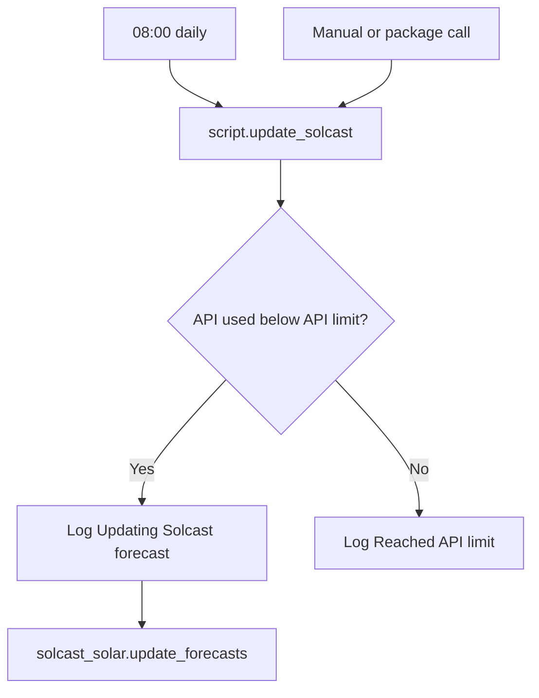

[<- Back to Energy README](README.md) · [Integrations README](../README.md) · [Packages README](../../README.md)

# Solcast Package Documentation

The Solcast package refreshes solar forecast data while respecting the Solcast API limit exposed by the integration. Other energy packages use the forecast sensors; this package only updates them.

| File | Purpose | Contents |
|------|---------|----------|
| `solcast.yaml` | Solcast forecast refresh | 1 automation, 1 script |

## Quick Summary

| Area | What Happens |
|------|--------------|
| Scheduled refresh | At 08:00, Home Assistant calls `script.update_solcast`. |
| API protection | Forecast refresh only runs when `sensor.solcast_pv_forecast_api_used` is below `sensor.solcast_pv_forecast_api_limit`. |
| Logging | Successful update attempts are logged at Debug level; API-limit skips are logged at Normal level. |

## Update Flow

## Automation

| Automation | Trigger | Result |
|------------|---------|--------|
| `Solcast: Update Forecast` | 08:00 | Calls `script.update_solcast`. |

## Script

| Script | Purpose |
|--------|---------|
| `script.update_solcast` | Checks Solcast API used vs limit, logs the result, and calls `solcast_solar.update_forecasts` only when under the limit. |

## Key Entities

| Entity | Purpose |
|--------|---------|
| `sensor.solcast_pv_forecast_api_used` | Current Solcast API usage count. |
| `sensor.solcast_pv_forecast_api_limit` | Current Solcast API usage limit. |
| `sensor.solcast_pv_forecast_forecast_today` | Used by other packages for today's forecast. |
| `sensor.solcast_pv_forecast_forecast_tomorrow` | Used by other packages for tomorrow's forecast. |
| `sensor.solcast_pv_forecast_forecast_remaining_today` | Used in excess-solar notifications. |

## Troubleshooting

| Issue | Check |
|-------|-------|
| Forecast did not update | API used/limit sensors and trace for `script.update_solcast`. |
| Log says API limit reached | Reduce manual calls or wait for the integration's API window to reset. |
| Forecast sensors are unavailable | Solcast integration setup, API credentials, and Solcast site/resource configuration. |
| Evening energy forecast seems stale | `energy.yaml` also calls `script.update_solcast` before the 21:00 forecast notification, but the same API-limit gate applies. |
