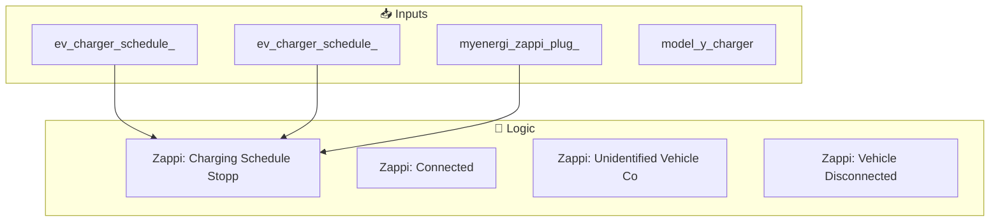
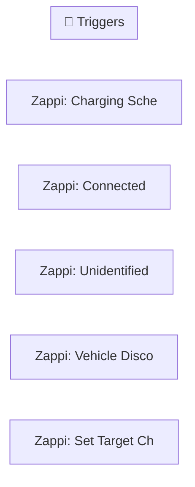
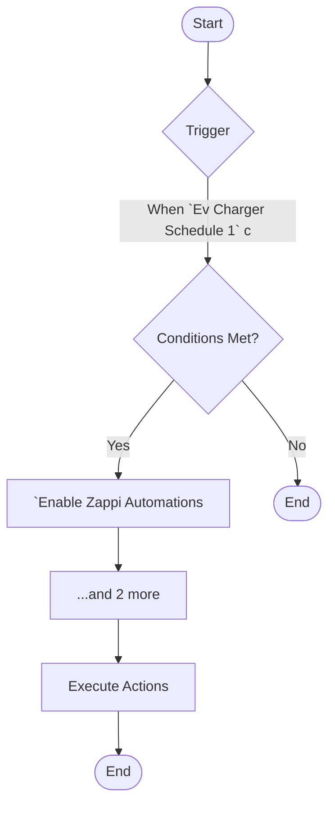
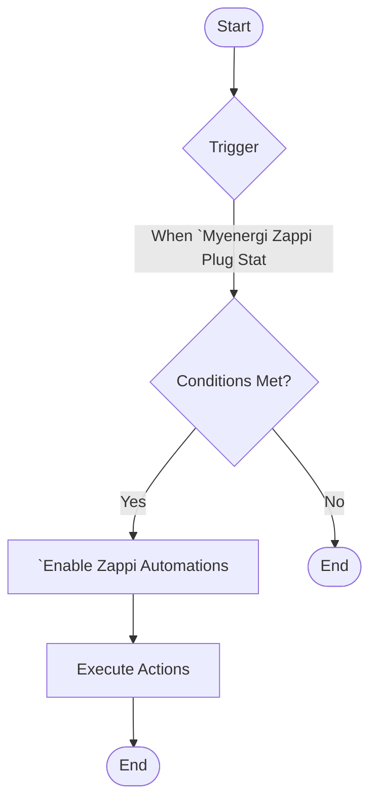
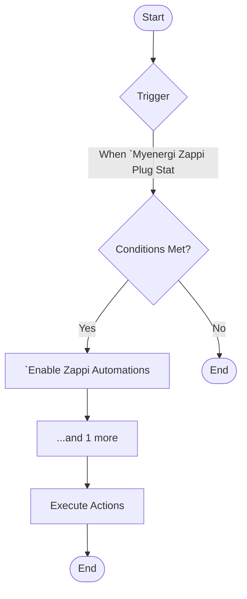
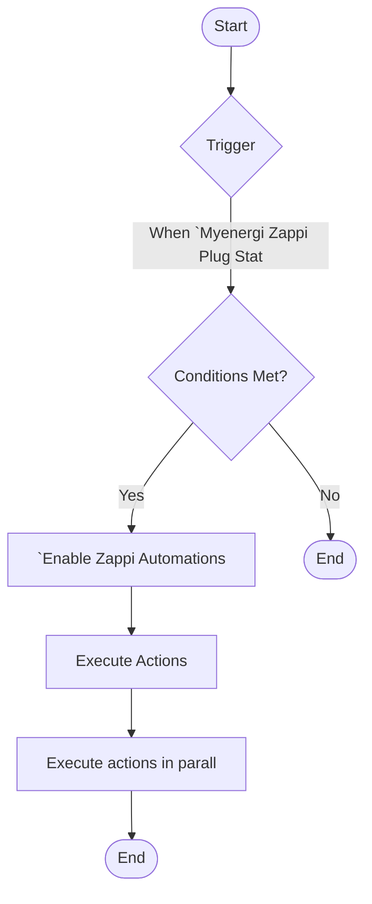
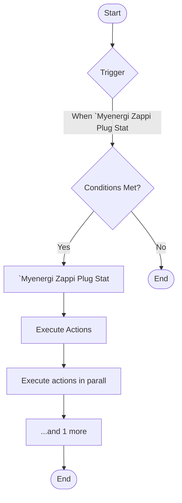

[<- Back to Energy README](../README.md) · [Packages README](../../README.md) · [Main README](../../../README.md)

# Zappi

This package manages 6 automations and 0 scripts for zappi.

---

## Table of Contents

- [Overview](#overview)
- [Purpose](#purpose)
- [Dependencies](#dependencies)
- [How It Works](#how-it-works)
- [Automations](#automations)
- [Entities](#entities)
- [Troubleshooting](#troubleshooting)
- [Related Files](#related-files)
- [Notes](#notes)

---

## Overview

This package provides automation for **zappi**. It includes 6 automations and 0 scripts.

### File Structure

```
packages/integrations/energy/
├── zappi.yaml  # Main package configuration
└── README.md                           # This documentation
```

---

## Purpose

- **Zappi: Charging Schedule Started**: 
- **Zappi: Charging Schedule Stopped**: 
- **Zappi: Connected**: 
- **Zappi: Unidentified Vehicle Connected**: 
- **Zappi: Vehicle Disconnected**: 

### Package Architecture

The following diagram shows the high-level flow of this package:



---

## Dependencies

This package depends on the following components:

### Integrations

- `Zappi`
- `Octopus Energy`

---

## How It Works

This section explains the overall behavior and logic of the package.

### Automation Logic

**Zappi: Charging Schedule Started**
Triggered when: When `Ev Charger Schedule 1` changes to 'on'

**Zappi: Charging Schedule Stopped**
Triggered when: When `Ev Charger Schedule 1` changes from 'on' to 'off'

**Zappi: Connected**
Triggered when: When `Myenergi Zappi Plug Status` changes from 'EV Disconnected' to 'unavailable'

*... plus 3 additional automations. See [Automations](#automations) section for details.*

### Workflow Diagram

The following diagram illustrates the automation flow:



---

## Automations

Detailed documentation for each automation in this package.

### Zappi: Charging Schedule Started

**Automation ID:** `1712086876964`

#### Trigger

- When `Ev Charger Schedule 1` changes to 'on'

#### Conditions

All conditions must be met for the automation to execute:

- `Enable Zappi Automations` is enabled
- `Enable Ev Charger Schedule 1` is enabled
- `Enable Ev Charger Schedule 2` is enabled

#### Actions

- *See YAML for action details*

#### Flow Diagram



### Zappi: Charging Schedule Stopped

**Automation ID:** `1712086876965`

#### Trigger

- When `Ev Charger Schedule 1` changes from 'on' to 'off'

#### Conditions

All conditions must be met for the automation to execute:

- `Enable Zappi Automations` is enabled
- `Myenergi Zappi Status` is 'Paused'
- `Enable Ev Charger Schedule 2` is enabled

#### Actions

- *See YAML for action details*

#### Flow Diagram


### Zappi: Connected

**Automation ID:** `1712435997060`

#### Trigger

- When `Myenergi Zappi Plug Status` changes from 'EV Disconnected' to 'unavailable'

#### Conditions

All conditions must be met for the automation to execute:

- `Enable Zappi Automations` is enabled

#### Actions

- *See YAML for action details*

#### Flow Diagram



### Zappi: Unidentified Vehicle Connected

**Automation ID:** `1715345710884`

#### Trigger

- When `Myenergi Zappi Plug Status` changes from 'EV Disconnected' to 'unavailable'

#### Conditions

All conditions must be met for the automation to execute:

- `Enable Zappi Automations` is enabled
- `Model 3 Charger` is 'off'

#### Actions

- *See YAML for action details*

#### Flow Diagram



### Zappi: Vehicle Disconnected

**Automation ID:** `1715345710885`

#### Trigger

- When `Myenergi Zappi Plug Status` changes to 'EV Disconnected'

#### Conditions

All conditions must be met for the automation to execute:

- `Enable Zappi Automations` is enabled

#### Actions

1. Execute actions in parallel

#### Flow Diagram



### Zappi: Set Target Charge Time For Weekday

**Automation ID:** `1748515764878`

#### Trigger

- When `Myenergi Zappi Plug Status` changes to 'EV Connected'

#### Conditions

All conditions must be met for the automation to execute:

- `Myenergi Zappi Plug Status` is 'EV Connected'

#### Actions

1. Execute actions in parallel
2. Conditional action selection

#### Flow Diagram



---

## Entities

Key entities used or created by this package.

### Referenced Entities

- `binary_sensor.ev_charger_schedule_1`
- `binary_sensor.ev_charger_schedule_2`
- `person.terina`
- `action: myenergi.myenergi_boost`
- `select.myenergi_zappi_charge_mode`
- `sensor.myenergi_zappi_plug_status`
- `person.danny`
- `binary_sensor.model_y_charger`
- `action: select.select_option`
- `action: script.load_first_priority_mode`

---

## Troubleshooting

Common issues and how to resolve them.

### Automation Issues

| Issue | Possible Cause | Resolution |
|-------|---------------|------------|
| Automation not triggering | Entity unavailable or condition not met | Check entity states in Developer Tools |
| Automation fires unexpectedly | Trigger too broad or condition missing | Review trigger entity and add conditions |
| Actions not executing | Service call invalid or entity offline | Verify service and entity in YAML |

### General Debugging

1. Check Home Assistant logs for errors
2. Verify all referenced entities exist in Developer Tools
3. Test automations manually using the 'Run' button
4. Review traces for executed automations to see execution path

---

## Related Files

| File | Description |
|------|-------------|
| [`packages/integrations/energy/zappi.yaml`](./zappi.yaml) | Main package YAML configuration |
| [Integrations Overview](../README.md) | Overview of all integration packages |
| [Main Packages README](../../README.md) | Architecture and organization guidelines |

---

## Notes

### Design Decisions

- **Zappi: Charging Schedule Started** has a master enable switch for easy disabling
- **Zappi: Charging Schedule Stopped** triggers on state transitions (edge detection) rather than continuous state
- **Zappi: Charging Schedule Stopped** has a master enable switch for easy disabling
- **Zappi: Connected** triggers on state transitions (edge detection) rather than continuous state
- **Zappi: Connected** has a master enable switch for easy disabling
- **Zappi: Unidentified Vehicle Connected** triggers on state transitions (edge detection) rather than continuous state
- **Zappi: Unidentified Vehicle Connected** has a master enable switch for easy disabling

---

*Last updated: 2026-04-10*
