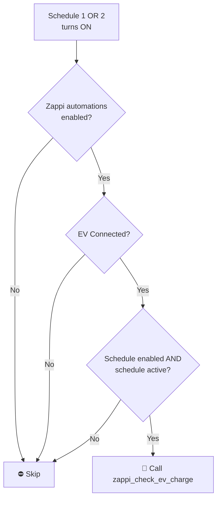
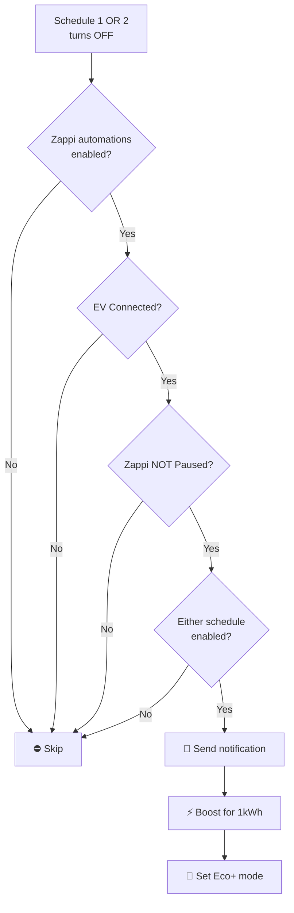
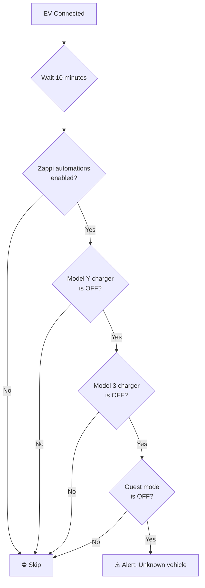
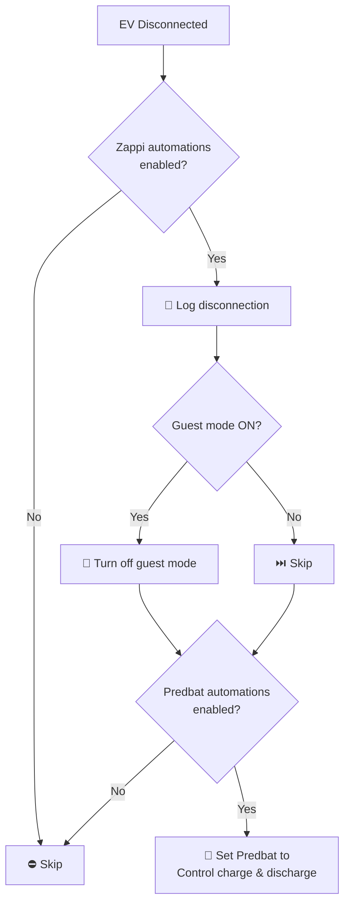
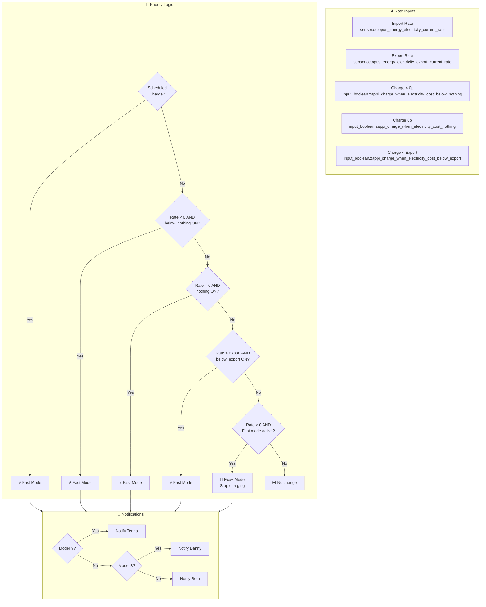
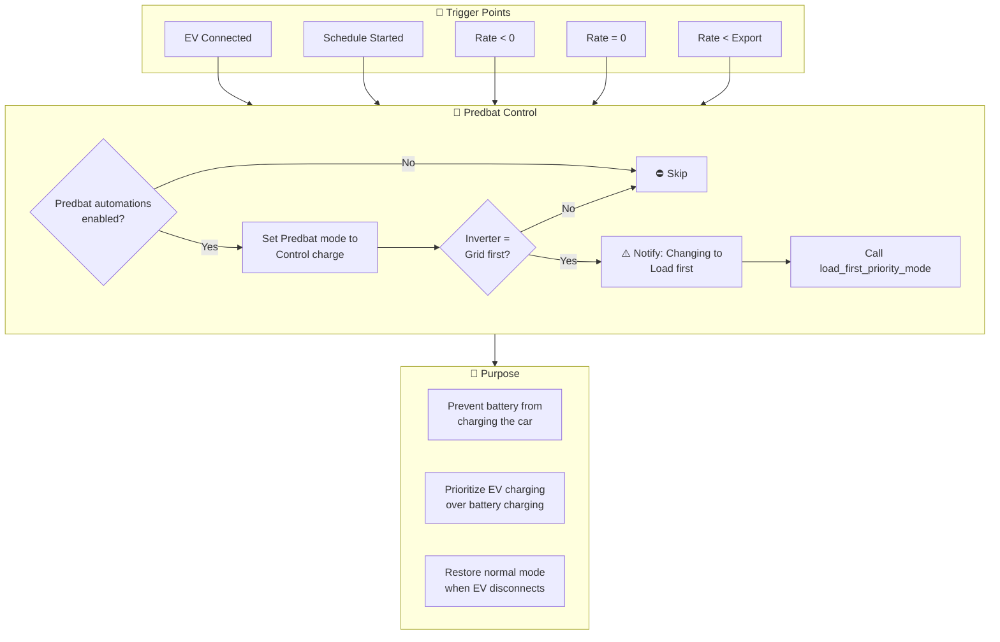
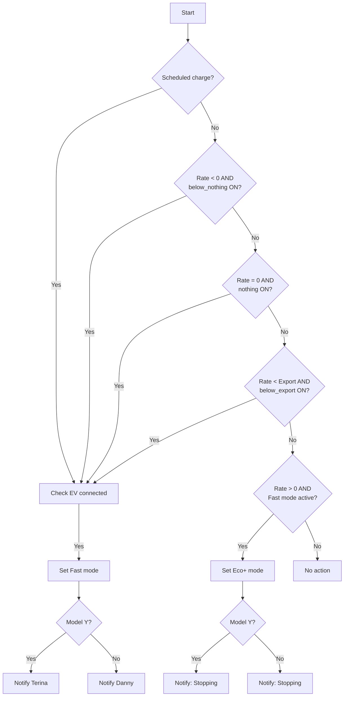
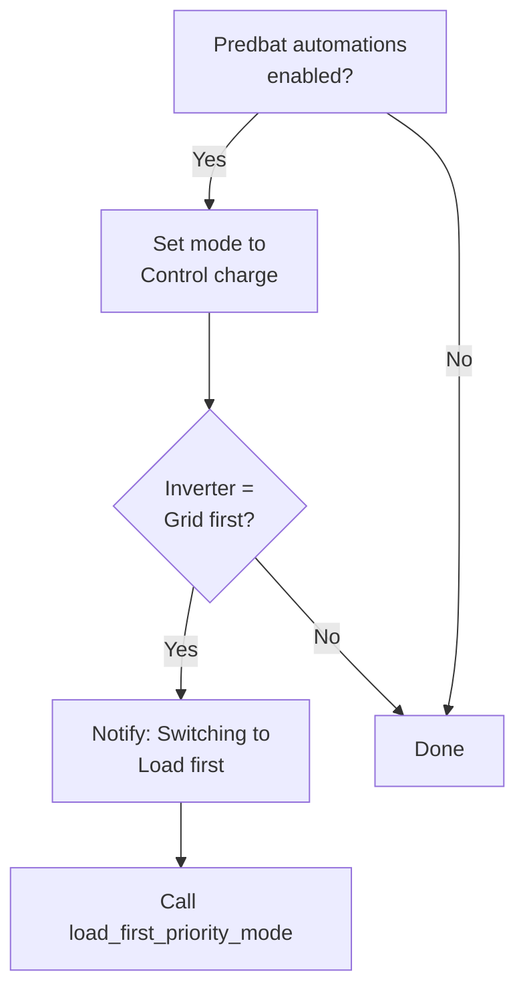
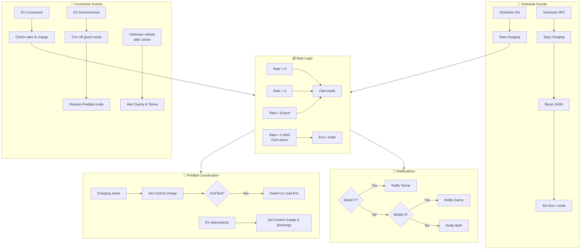

# Zappi EV Charger ⚡🚗

Integration with MyEnergi Zappi EV charger for intelligent rate-based charging, vehicle detection, and Predbat battery integration.

**Integration:** [ha-myenergi](https://github.com/CJNE/ha-myenergi)

---

## Table of Contents

- [Overview](#overview)
- [Architecture](#architecture)
- [Automations](#automations)
  - [Charging Schedule Management](#charging-schedule-management)
  - [Vehicle Detection](#vehicle-detection)
  - [Rate-Based Charging Logic](#rate-based-charging-logic)
  - [Predbat Integration](#predbat-integration)
- [Scripts](#scripts)
- [Configuration](#configuration)
- [Entity Reference](#entity-reference)

---

## Overview

The Zappi integration provides intelligent EV charging automation that optimizes charging based on electricity rates, solar availability, and battery state. It supports multiple vehicles with automatic detection and personalized notifications.

### Key Features

- **Rate-based charging** - Automatically start/stop charging based on Octopus Agile rates
- **Vehicle detection** - Distinguishes between Model Y, Model 3, and guest vehicles
- **Scheduled charging** - Two independent charging schedules with enable/disable controls
- **Predbat integration** - Coordinates with battery management to prevent conflicts
- **Smart notifications** - Targeted alerts based on which vehicle is charging

```mermaid
flowchart TB
    subgraph Inputs["📥 Data Sources"]
        ZappiStatus["🔌 Zappi Status<br/>sensor.myenergi_zappi_plug_status"]
        ZappiMode["⚡ Charge Mode<br/>select.myenergi_zappi_charge_mode"]
        OctopusImport["💰 Import Rate<br/>sensor.octopus_energy_electricity_current_rate"]
        OctopusExport["📤 Export Rate<br/>sensor.octopus_energy_electricity_export_current_rate"]
        ModelY["🚗 Model Y<br/>binary_sensor.model_y_charger"]
        Model3["🚙 Model 3<br/>binary_sensor.model_3_charger"]
        GuestMode["👤 Guest Mode<br/>input_boolean.guest_ev"]
        Schedule1["📅 Schedule 1<br/>binary_sensor.ev_charger_schedule_1"]
        Schedule2["📅 Schedule 2<br/>binary_sensor.ev_charger_schedule_2"]
        Predbat["🔋 Predbat<br/>select.predbat_mode"]
        Inverter["⚡ Inverter<br/>sensor.growatt_sph_inverter_mode"]
    end

    subgraph Logic["🧠 Charging Logic"]
        RateCheck{"Rate < 0?"}
        RateZero{"Rate = 0?"}
        RateExport{"Rate < Export?"}
        ScheduleCheck{"Schedule Active?"}
        VehicleDetect{"Which Vehicle?"}
        PredbatCtrl["Predbat Control"]
    end

    subgraph Outputs["📤 Actions"]
        FastCharge["⚡ Fast Mode"]
        EcoPlus["🌱 Eco+ Mode"]
        NotifyDanny["📱 Notify Danny"]
        NotifyTerina["📱 Notify Terina"]
        NotifyBoth["📱 Notify Both"]
        SetPredbat["🔋 Set Predbat Mode"]
    end

    ZappiStatus --> VehicleDetect
    ZappiStatus --> ScheduleCheck
    OctopusImport --> RateCheck
    OctopusImport --> RateZero
    OctopusImport --> RateExport
    OctopusExport --> RateExport
    Schedule1 --> ScheduleCheck
    Schedule2 --> ScheduleCheck
    ModelY --> VehicleDetect
    Model3 --> VehicleDetect
    GuestMode --> VehicleDetect

    RateCheck -->|Yes| FastCharge
    RateZero -->|Yes| FastCharge
    RateExport -->|Yes| FastCharge
    ScheduleCheck -->|Yes| FastCharge
    FastCharge --> PredbatCtrl
    PredbatCtrl --> SetPredbat

    VehicleDetect -->|Model Y| NotifyTerina
    VehicleDetect -->|Model 3| NotifyDanny
    VehicleDetect -->|Unknown| NotifyBoth
```



---

## Architecture

### File Structure

```
packages/integrations/energy/
├── zappi.yaml          # Main Zappi package
└── README.md           # This documentation
```

### Integration

Uses the [ha-myenergi](https://github.com/CJNE/ha-myenergi) custom integration for MyEnergi device communication.

### Key Components

| Component | Purpose |
|-----------|---------|
| `sensor.myenergi_zappi_plug_status` | EV connection status (Connected/Disconnected) |
| `select.myenergi_zappi_charge_mode` | Charge mode control (Fast/Eco/Eco+/Stopped) |
| `binary_sensor.model_y_charger` | Model Y vehicle detection |
| `binary_sensor.model_3_charger` | Model 3 vehicle detection |
| `binary_sensor.ev_charger_schedule_1/2` | Charging schedule status |
| `input_boolean.guest_ev` | Guest vehicle mode |

---

## Automations

### Charging Schedule Management

#### Zappi: Charging Schedule Started
**ID:** `1712086876964`

Triggers when either charging schedule becomes active and initiates charging if conditions are met.



**Triggers:**
- `binary_sensor.ev_charger_schedule_1` changes to `on`
- `binary_sensor.ev_charger_schedule_2` changes to `on`

**Conditions:**
- `input_boolean.enable_zappi_automations` is `on`
- `sensor.myenergi_zappi_plug_status` is NOT "EV Disconnected"
- Either schedule 1 is enabled AND active, OR schedule 2 is enabled AND active

**Actions:**
- Calls `script.zappi_check_ev_charge` with current electricity rates

---

#### Zappi: Charging Schedule Stopped
**ID:** `1712086876965`

Handles schedule deactivation by stopping charging and switching back to Eco+ mode.



**Triggers:**
- Schedule binary sensor changes from `on` to `off`

**Conditions:**
- Zappi automations enabled
- EV is connected
- Zappi is NOT in "Paused" state
- Either schedule 1 OR schedule 2 is enabled

**Actions:**
- Sends notification about schedule stop
- Calls `myenergi.myenergi_boost` with 1kWh amount
- Sets charge mode to `Eco+`

---

### Vehicle Detection

#### Zappi: Connected
**ID:** `1712435997060`

Handles vehicle connection events and initiates charging evaluation.

**Triggers:**
- `sensor.myenergi_zappi_plug_status` changes from "EV Disconnected"

**Conditions:**
- Zappi automations enabled

**Actions:**
- Calls `script.zappi_check_ev_charge` with current rates

---

#### Zappi: Unidentified Vehicle Connected
**ID:** `1715345710884`

Alerts when an unknown vehicle connects (not Model Y, Model 3, or guest mode).



**Triggers:**
- Plug status changes from "EV Disconnected" (with 10-minute delay)

**Conditions:**
- Zappi automations enabled
- `binary_sensor.model_y_charger` is `off`
- `binary_sensor.model_3_charger` is `off`
- `input_boolean.guest_ev` is `off`

**Actions:**
- Sends notification to Danny and Terina about unrecognized vehicle

---

#### Zappi: Vehicle Disconnected
**ID:** `1715345710885`

Handles vehicle disconnection with cleanup tasks and Predbat mode restoration.



**Triggers:**
- Plug status changes to "EV Disconnected"

**Conditions:**
- Zappi automations enabled

**Actions:**
- Logs disconnection to home log
- Turns off `input_boolean.guest_ev` if it was on
- Sets Predbat mode to "Control charge & discharge" (if Predbat automations enabled)

---

#### Zappi: Set Target Charge Time For Weekday
**ID:** `1748515764878`

Automatically sets the target ready-by time for Model Y on weekdays (Sunday-Thursday).

**Triggers:**
- Plug status changes to "EV Connected"
- `binary_sensor.model_y_charger` changes to `on`

**Conditions:**
- EV is connected
- Model Y charger is `on`
- Day is Sunday through Thursday

**Actions:**
- Sends notification about changing target ready time to 08:00

---

### Rate-Based Charging Logic

The core charging logic is implemented in `script.zappi_check_ev_charge` which evaluates multiple conditions in priority order:



#### Charging Conditions

| Priority | Condition | Input Boolean | Action |
|----------|-----------|---------------|--------|
| 1 | Scheduled charge active | Schedule enable + active | Fast mode |
| 2 | Rate < 0p/kWh | `zappi_charge_when_electricity_cost_below_nothing` | Fast mode |
| 3 | Rate = 0p/kWh | `zappi_charge_when_electricity_cost_nothing` | Fast mode |
| 4 | Rate < export rate | `zappi_charge_when_electricity_cost_below_export` | Fast mode |
| 5 | Rate > 0p/kWh AND currently in Fast mode | Any of above enabled | Eco+ mode (stop) |

---

### Predbat Integration

The Zappi integration coordinates with Predbat to prevent battery and EV charging conflicts.



**When EV charging starts:**
1. Sets Predbat mode to "Control charge" (limits battery to charge-only)
2. If inverter is in "Grid first" mode:
   - Sends notification about switching to "Load first"
   - Calls `script.load_first_priority_mode` to prevent battery from discharging to charge the car

**When EV disconnects:**
1. Sets Predbat mode to "Control charge & discharge" (full battery management)

---

## Scripts

### zappi_check_ev_charge

Main charging decision script with rate evaluation and Predbat coordination.

**Fields:**

| Field | Type | Description | Default |
|-------|------|-------------|---------|
| `current_electricity_import_rate` | number | Import rate in GBP/kWh | `sensor.octopus_energy_electricity_current_rate` |
| `current_electricity_import_rate_unit` | text | Rate unit | Unit of import rate sensor |
| `current_electricity_export_rate` | number | Export rate in p/kWh | `sensor.octopus_energy_electricity_export_current_rate` |

**Sequence:**

1. **Variable Setup**
   - Sets current import/export rates with fallbacks to sensor values

2. **Parallel Execution:**
   - **Charging Logic Branch:** Evaluates conditions in priority order
   - **Predbat Branch:** Coordinates battery management

**Charging Logic:**



**Predbat Logic:**



---

## Configuration

### Input Booleans

| Entity | Purpose |
|--------|---------|
| `input_boolean.enable_zappi_automations` | Master switch for all Zappi automations |
| `input_boolean.enable_ev_charger_schedule_1` | Enable charging schedule 1 |
| `input_boolean.enable_ev_charger_schedule_2` | Enable charging schedule 2 |
| `input_boolean.zappi_charge_when_electricity_cost_below_nothing` | Allow charging at negative rates |
| `input_boolean.zappi_charge_when_electricity_cost_nothing` | Allow charging at 0p/kWh |
| `input_boolean.zappi_charge_when_electricity_cost_below_export` | Allow charging when import < export |
| `input_boolean.guest_ev` | Guest vehicle mode (prevents unknown vehicle alerts) |
| `input_boolean.enable_predbat_automations` | Enable Predbat coordination |

### Binary Sensors (External)

| Entity | Purpose |
|--------|---------|
| `binary_sensor.ev_charger_schedule_1` | Schedule 1 active status |
| `binary_sensor.ev_charger_schedule_2` | Schedule 2 active status |
| `binary_sensor.model_y_charger` | Model Y vehicle detection |
| `binary_sensor.model_3_charger` | Model 3 vehicle detection |

### Select Entities

| Entity | Options | Purpose |
|--------|---------|---------|
| `select.myenergi_zappi_charge_mode` | Fast, Eco, Eco+, Stopped | Control charging mode |
| `select.predbat_mode` | Multiple modes | Battery management coordination |

### Sensor Entities

| Entity | Purpose |
|--------|---------|
| `sensor.myenergi_zappi_plug_status` | EV connection status |
| `sensor.octopus_energy_electricity_current_rate` | Current import rate |
| `sensor.octopus_energy_electricity_export_current_rate` | Current export rate |
| `sensor.growatt_sph_inverter_mode` | Inverter operating mode |

---

## Entity Reference

### MyEnergi Integration Entities

| Entity | Type | Purpose |
|--------|------|---------|
| `sensor.myenergi_zappi_plug_status` | Sensor | EV connection status (EV Connected / EV Disconnected) |
| `select.myenergi_zappi_charge_mode` | Select | Charge mode control |
| `sensor.myenergi_zappi_status` | Sensor | Charger operational status |

### Vehicle Detection Entities

| Entity | Type | Purpose |
|--------|------|---------|
| `binary_sensor.model_y_charger` | Binary Sensor | Model Y connected to Zappi |
| `binary_sensor.model_3_charger` | Binary Sensor | Model 3 connected to Zappi |

### Schedule Entities

| Entity | Type | Purpose |
|--------|------|---------|
| `binary_sensor.ev_charger_schedule_1` | Binary Sensor | Schedule 1 active |
| `binary_sensor.ev_charger_schedule_2` | Binary Sensor | Schedule 2 active |
| `input_boolean.enable_ev_charger_schedule_1` | Input Boolean | Enable schedule 1 |
| `input_boolean.enable_ev_charger_schedule_2` | Input Boolean | Enable schedule 2 |

### Rate-Based Charging Entities

| Entity | Type | Purpose |
|--------|------|---------|
| `input_boolean.zappi_charge_when_electricity_cost_below_nothing` | Input Boolean | Charge at negative rates |
| `input_boolean.zappi_charge_when_electricity_cost_nothing` | Input Boolean | Charge at 0p/kWh |
| `input_boolean.zappi_charge_when_electricity_cost_below_export` | Input Boolean | Charge when import < export |

### Predbat Integration Entities

| Entity | Type | Purpose |
|--------|------|---------|
| `select.predbat_mode` | Select | Predbat operating mode |
| `input_boolean.enable_predbat_automations` | Input Boolean | Enable Predbat coordination |

### External Dependencies

| Entity | Source | Purpose |
|--------|--------|---------|
| `sensor.octopus_energy_electricity_current_rate` | Octopus Energy | Current import rate |
| `sensor.octopus_energy_electricity_export_current_rate` | Octopus Energy | Current export rate |
| `sensor.growatt_sph_inverter_mode` | Growatt/Solar Assistant | Inverter mode for Predbat coordination |

---

## Automation Flow Summary



---

## Maintenance Notes

### Troubleshooting

| Issue | Check |
|-------|-------|
| Not charging at cheap rates | `input_boolean.zappi_charge_when_*` settings, rate sensor values |
| Unknown vehicle alerts | `binary_sensor.model_y_charger`, `binary_sensor.model_3_charger`, `input_boolean.guest_ev` |
| Predbat not coordinating | `input_boolean.enable_predbat_automations`, `select.predbat_mode` |
| Notifications not sending | Vehicle detection sensors, person entity availability |
| Schedule not triggering | `input_boolean.enable_ev_charger_schedule_*`, schedule binary sensor |

### Seasonal Adjustments

- **Agile tariff changes:** Update rate condition thresholds if Octopus tariff changes
- **DST changes:** All automations use local time and adjust automatically
- **Solar seasonality:** Rate-based charging becomes more important in winter with less solar

### Related Documentation

| Document | Purpose |
|----------|---------|
| [Integrations Overview](README.md) | Overview of all integration packages |
| [Energy README](README.md) | Main energy package documentation |
| [Predbat Documentation](predbat_README.md) | Battery management integration |
| [Transport README](../transport/README.md) | Tesla vehicle integrations |

### Related Integrations

| Integration | Connection |
|-------------|------------|
| [Octopus Energy](README.md) | Rate sensors for charging decisions |
| [Growatt/Solar Assistant](README.md) | Inverter mode for Predbat coordination |
| [Predbat](predbat_README.md) | Battery management coordination |
| [Transport](../transport/README.md) | Vehicle detection via TeslaMate |

---

*Last updated: 2026-04-05*
