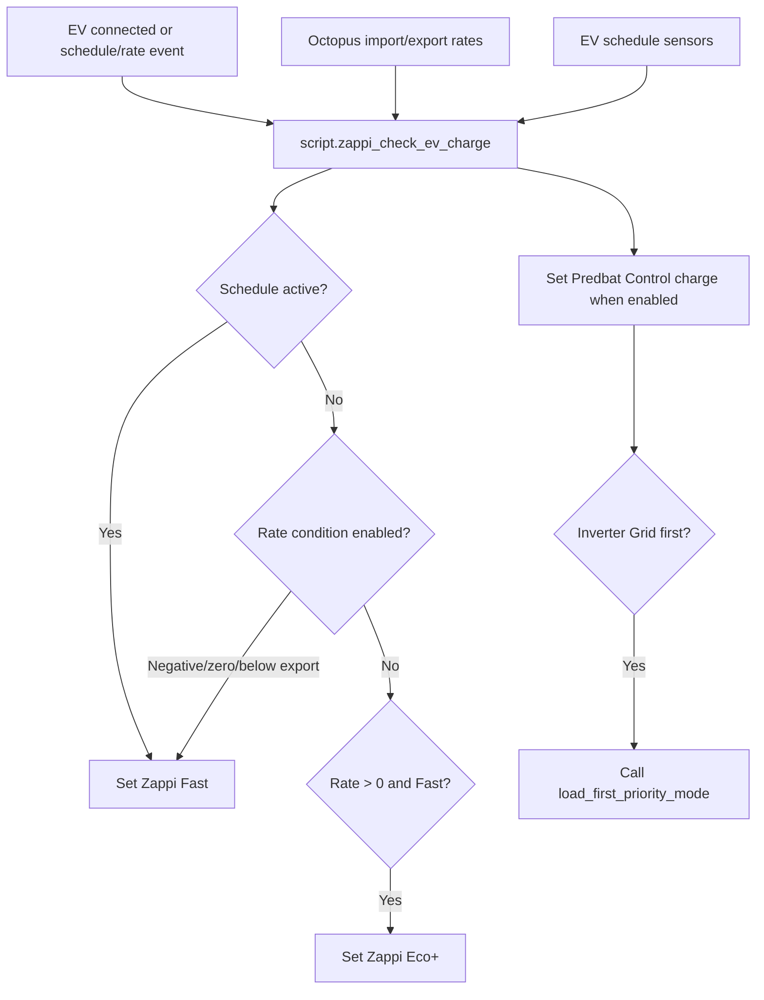

[<- Back to Energy README](README.md) · [Integrations README](../README.md) · [Packages README](../../README.md)

# Zappi Package Documentation

The Zappi package controls EV charging mode from schedules, electricity rates, vehicle detection, and Predbat coordination. It mainly switches the Zappi between `Fast` and `Eco+` and sends targeted notifications.

| File | Purpose | Contents |
|------|---------|----------|
| `zappi.yaml` | Zappi EV charging automation | 6 automations, 1 script |

## Quick Summary

| Area | What Happens |
|------|--------------|
| Schedule charging | Two schedule binary sensors can start charging when their matching enable booleans are on. |
| Cheap-rate charging | If enabled, Zappi switches to `Fast` at negative rates, zero rates, or when import is below export. |
| Costly-rate recovery | If rate rises above zero while Zappi is in `Fast` due to cheap-rate settings, it switches back to `Eco+`. |
| Vehicle detection | Model Y notifications go to Terina, other charging notifications go to Danny, and unrecognised vehicles alert both Danny and Terina after 10 minutes. |
| Guest EV | `input_boolean.guest_ev` suppresses unknown-vehicle alerts and is turned off when the vehicle disconnects. |
| Predbat | When charging is evaluated and Predbat automations are enabled, Predbat mode is set to `Control charge`; disconnect restores `Control charge & discharge`. |

## Charging Flow

## Automations

| Automation | Trigger | Result |
|------------|---------|--------|
| `Zappi: Charging Schedule Started` | `binary_sensor.ev_charger_schedule_1` or `_2` turns on | If Zappi automations are enabled, EV is connected, and the matching schedule is enabled, calls `script.zappi_check_ev_charge`. |
| `Zappi: Charging Schedule Stopped` | Either schedule turns from on to off | If EV is connected and Zappi is not paused, notifies Terina, boosts 1 kWh, then sets `Eco+`. |
| `Zappi: Connected` | Plug status changes from `EV Disconnected` | Calls `script.zappi_check_ev_charge`. |
| `Zappi: Unidentified Vehicle Connected` | Plug status remains connected for 10 minutes | Alerts Danny and Terina when Model Y, Model 3, and guest EV indicators are all off. |
| `Zappi: Vehicle Disconnected` | Plug status becomes `EV Disconnected` | Logs, turns off guest EV mode if on, and restores Predbat mode when enabled. |
| `Zappi: Set Target Charge Time For Weekday` | Model Y/Zappi connected on Sunday through Thursday | Sends Terina a notification saying the Zappi target ready time is changing to 08:00. |

## Script

| Script | Purpose |
|--------|---------|
| `script.zappi_check_ev_charge` | Evaluates schedule and rate conditions, sets Zappi charge mode, sends vehicle-specific notifications, and coordinates Predbat mode. |

## Script Decision Order

`script.zappi_check_ev_charge` uses a first-match charge branch:

| Priority | Condition | Result |
|----------|-----------|--------|
| 1 | Enabled charging schedule is active | If EV connected, notify and set `Fast`. |
| 2 | Import rate below 0 and `input_boolean.zappi_charge_when_electricity_cost_below_nothing` is on | If EV connected, notify and set `Fast`. |
| 3 | Import rate exactly 0 and `input_boolean.zappi_charge_when_electricity_cost_nothing` is on | If EV connected, notify and set `Fast`. |
| 4 | Import rate below export and `input_boolean.zappi_charge_when_electricity_cost_below_export` is on | If EV connected, notify and set `Fast`. |
| 5 | Import rate above 0, Zappi is already `Fast`, and any cheap-rate charging boolean is on | Notify and set `Eco+`. |

The Predbat branch runs in parallel. If `input_boolean.enable_predbat_automations` is on, it sets `select.predbat_mode` to `Control charge`. If the inverter is `Grid first`, it notifies Danny and calls `script.load_first_priority_mode`.

## User Controls

| Entity | Plain-English Purpose |
|--------|-----------------------|
| `input_boolean.enable_zappi_automations` | Master enable for Zappi automations. |
| `input_boolean.enable_ev_charger_schedule_1` | Enables schedule 1. |
| `input_boolean.enable_ev_charger_schedule_2` | Enables schedule 2. |
| `input_boolean.zappi_charge_when_electricity_cost_below_nothing` | Allows charging when import rate is negative. |
| `input_boolean.zappi_charge_when_electricity_cost_nothing` | Allows charging when import rate is zero. |
| `input_boolean.zappi_charge_when_electricity_cost_below_export` | Allows charging when import is cheaper than export. |
| `input_boolean.guest_ev` | Marks the connected vehicle as expected/guest and suppresses unknown vehicle alerts. |
| `input_boolean.enable_predbat_automations` | Allows Zappi charging to adjust Predbat mode. |

## Key Entities

| Entity | Purpose |
|--------|---------|
| `sensor.myenergi_zappi_plug_status` | EV connection state; `EV Disconnected` means no EV connected. |
| `sensor.myenergi_zappi_status` | Used to avoid schedule-stop handling when Zappi is `Paused`. |
| `select.myenergi_zappi_charge_mode` | Set to `Fast` or `Eco+` by this package. |
| `binary_sensor.ev_charger_schedule_1/2` | Active schedule windows. |
| `binary_sensor.model_y_charger` | Model Y detection, used for Terina notifications. |
| `binary_sensor.model_3_charger` | Model 3 detection, used to avoid unknown vehicle alerts. |
| `select.predbat_mode` | Set to `Control charge` while charging and restored on disconnect. |

## Troubleshooting

| Issue | Check |
|-------|-------|
| Charging did not start | `input_boolean.enable_zappi_automations`, plug status, relevant schedule/cheap-rate boolean, and `script.zappi_check_ev_charge` trace. |
| Charging stopped when rates rose | This is expected if a cheap-rate charging boolean is on and Zappi was in `Fast`. |
| Unknown vehicle alert fired | Model Y/Model 3 charger binary sensors and `input_boolean.guest_ev`. |
| Predbat changed unexpectedly | Zappi sets `select.predbat_mode` to `Control charge` whenever its script runs and Predbat automations are enabled. |
| Weekday target notification only logs a notification | The current YAML sends the notification; no target-time service call is defined in this package. |
