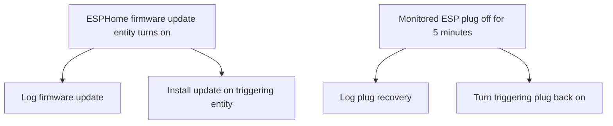

[<- Back to Integrations README](README.md) · [Packages README](../README.md) · [Main README](../../README.md)

# ESPHome Device Management

This package keeps a small set of ESPHome devices healthy without manual checks. It installs firmware updates for two bed-related ESPHome update entities and turns selected ESP-powered plugs back on if they have been off for 5 minutes.

## Quick Summary

| Area | What Happens |
|------|--------------|
| Firmware updates | When a monitored ESPHome firmware update entity turns on, Home Assistant logs the update and installs it. |
| Plug recovery | If a monitored ESP plug stays off for 5 minutes, Home Assistant logs the event and turns it back on. |

## Package Contents

| File | Purpose | Contents |
|------|---------|----------|
| `esphome.yaml` | ESPHome update and plug recovery automation | 2 automations |

## How It Works

## Automations

| Automation | ID | Trigger | Mode | Result |
|------------|----|---------|------|--------|
| `ESPHome: Firmware Update` | `1767778408952` | `update.bed_firmware` or `update.leos_bed_firmware` turns `on` | `queued`, max 15 | Logs the firmware update and calls `update.install` for the triggering entity. |
| `ESPHome: ESP Plug Turned Off` | `1767114704399` | Any monitored ESP plug stays `off` for 5 minutes | `queued`, max 10 | Logs a debug message and turns the triggering plug back on. |

## Monitored Entities

### Firmware Updates

| Entity | Purpose |
|--------|---------|
| `update.bed_firmware` | Bed ESPHome firmware update entity. |
| `update.leos_bed_firmware` | Leo's bed ESPHome firmware update entity. |

### ESP Plugs

| Entity |
|--------|
| `switch.ashlee_s_bedroom_esp_plug` |
| `switch.bedroom_esp_plug` |
| `switch.conservatory_extension_2` |
| `switch.kitchen_esp_plug` |
| `switch.leo_s_bedroom_esp_plug` |

## Power-User Notes

Both automations use `trigger.entity_id`, so the same action block handles every monitored entity. The actions run in `parallel` because logging and the update or switch action do not depend on each other.

## Troubleshooting

| Symptom | Check |
|---------|-------|
| Firmware update did not install | Confirm the update entity changed to `on` and that ESPHome can install updates for that device. |
| A plug was intentionally turned off but came back on | Remove it from the monitored entity list or disable the automation before maintenance. |
| No log entry appears | Check `script.send_to_home_log` and the automation trace for the triggering entity. |
