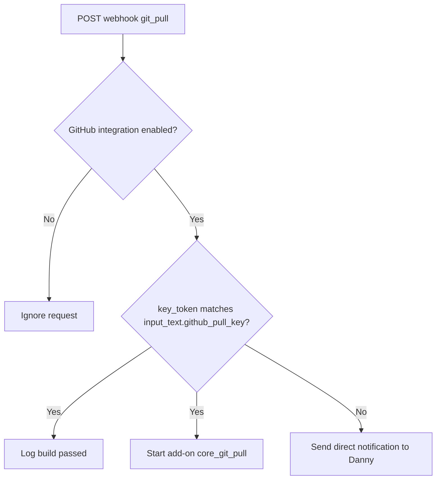

[<- Back to Integrations README](README.md) · [Packages README](../README.md) · [Main README](../../README.md)

# Git CI Pull Integration

This package lets a successful external CI workflow ask Home Assistant to pull the latest configuration. It only starts the Git Pull add-on when the integration is enabled and the webhook payload includes the expected shared token.

Community reference: <https://community.home-assistant.io/t/guide-to-setting-up-a-fully-automated-ci-for-hassio/51576>

## Quick Summary

| Area | What Happens |
|------|--------------|
| Webhook | Receives public `POST` requests on webhook ID `git_pull`. |
| Safety gate | Requires `input_boolean.enable_github_integration` to be on. |
| Token check | Compares `trigger.json.key_token` with `input_text.github_pull_key`. |
| Valid token | Logs success and starts the `core_git_pull` add-on. |
| Invalid token | Sends Danny a direct notification through `script.send_direct_notification`. |

## Package Contents

| File | Purpose | Contents |
|------|---------|----------|
| `git.yaml` | CI webhook handling | 1 automation |

## Flow

## Automation

| Automation | ID | Trigger | Mode | Result |
|------------|----|---------|------|--------|
| `Home Assistant CI` | `1613937312554` | Webhook `git_pull`, `POST`, `local_only: false` | `single` | Validates the token, starts Git Pull on success, and alerts on token mismatch. |

## Entities And Services

| Entity or Service | Purpose |
|-------------------|---------|
| `input_boolean.enable_github_integration` | Master enable switch for this webhook. |
| `input_text.github_pull_key` | Shared token used to validate webhook payloads. |
| `hassio.addon_start` with `addon: core_git_pull` | Starts the Git Pull add-on. |
| `script.send_to_home_log` | Logs valid build/pull events. |
| `script.send_direct_notification` | Alerts Danny when a request has the wrong token. |

## Troubleshooting

| Symptom | Check |
|---------|-------|
| Webhook arrives but nothing happens | Confirm `input_boolean.enable_github_integration` is `on`. |
| Token mismatch notification appears | Compare the CI secret with `input_text.github_pull_key`. |
| Git does not pull after a valid webhook | Check the `core_git_pull` add-on and the automation trace for `hassio.addon_start`. |
