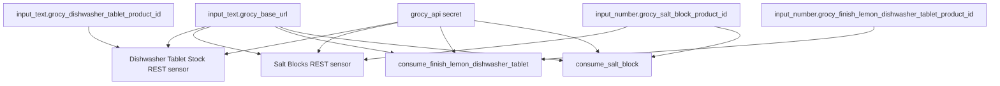

[<- Back to Integrations README](README.md) · [Packages README](../README.md) · [Main README](../../README.md)

# Grocy Package Documentation

The Grocy package connects Home Assistant to the Grocy inventory API for household consumables. It reads current stock for dishwasher tablets and salt blocks, and it exposes commands that record consumption back into Grocy.

This documentation covers `grocy.yaml`.

| File | Purpose | Contents |
|------|---------|----------|
| `grocy.yaml` | Grocy stock sensors and consumption commands | 2 REST sensors, 2 REST commands |

## Quick Summary

For non-technical users, the important behavior is:

| Area | What Happens |
|------|--------------|
| Dishwasher tablets | Home Assistant polls Grocy every 10 minutes for current dishwasher tablet stock. |
| Salt blocks | Home Assistant polls Grocy every 10 minutes for current salt block stock. |
| Tablet consumption | `rest_command.consume_finish_lemon_dishwasher_tablet` records consumption of 1 tablet. |
| Salt consumption | `rest_command.consume_salt_block` records consumption amount `2` for the salt block product. |

## How It Talks To Grocy

## Technical Reference

### REST Sensors

Both sensors read `value_json.stock_amount_aggregated`, use unit `pcs`, and set `state_class: total`.

| Name | Entity | Resource Product Helper | Scan Interval | Icon |
|------|--------|-------------------------|---------------|------|
| `Dishwasher Tablet Stock` | `sensor.dishwasher_tablet_stock` | `input_text.grocy_dishwasher_tablet_product_id` | 600 seconds | `mdi:pill-multiple` |
| `Salt Blocks` | `sensor.salt_blocks` | `input_number.grocy_salt_block_product_id` | 600 seconds | `mdi:shaker-outline` |

### REST Commands

Both commands POST to `/stock/products/{id}/consume` with `transaction_type: consume` and `spoiled: false`.

| Command | Product Helper | Payload Amount |
|---------|----------------|----------------|
| `rest_command.consume_finish_lemon_dishwasher_tablet` | `input_number.grocy_finish_lemon_dishwasher_tablet_product_id` | `1` |
| `rest_command.consume_salt_block` | `input_number.grocy_salt_block_product_id` | `2` |

Power-user note: the dishwasher tablet sensor and dishwasher tablet consumption command use different helper entity domains for their product IDs: `input_text.grocy_dishwasher_tablet_product_id` for the sensor and `input_number.grocy_finish_lemon_dishwasher_tablet_product_id` for the command.

## Important Entities And Secrets

| Entity Or Secret | Used For |
|------------------|----------|
| `input_text.grocy_base_url` | Grocy API base URL. |
| `input_text.grocy_dishwasher_tablet_product_id` | Product ID used by the dishwasher tablet stock sensor. |
| `input_number.grocy_finish_lemon_dishwasher_tablet_product_id` | Product ID used by the dishwasher tablet consumption command. |
| `input_number.grocy_salt_block_product_id` | Product ID used by the salt sensor and salt consumption command. |
| `!secret grocy_api` | API key sent as the `GROCY-API-KEY` header. |

## Troubleshooting

| Symptom | First Things To Check |
|---------|-----------------------|
| Stock sensor is unavailable | Check `input_text.grocy_base_url`, the product ID helper, Grocy availability, and `!secret grocy_api`. |
| Stock amount looks wrong | Check Grocy's aggregated stock amount for the configured product ID. |
| Consumption command affects the wrong product | Check the command-specific product ID helper. |
| Salt stock drops by an unexpected amount | The YAML posts amount `2` for `consume_salt_block`; confirm that matches the Grocy product unit setup. |

*Last updated: 2026-06-27*
