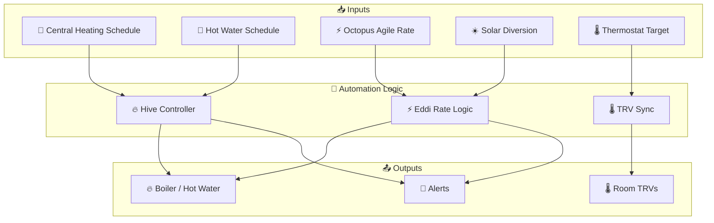
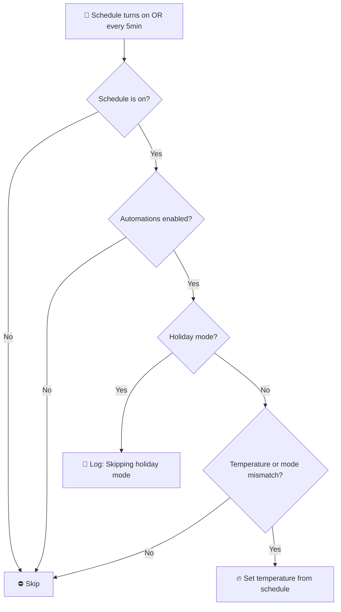
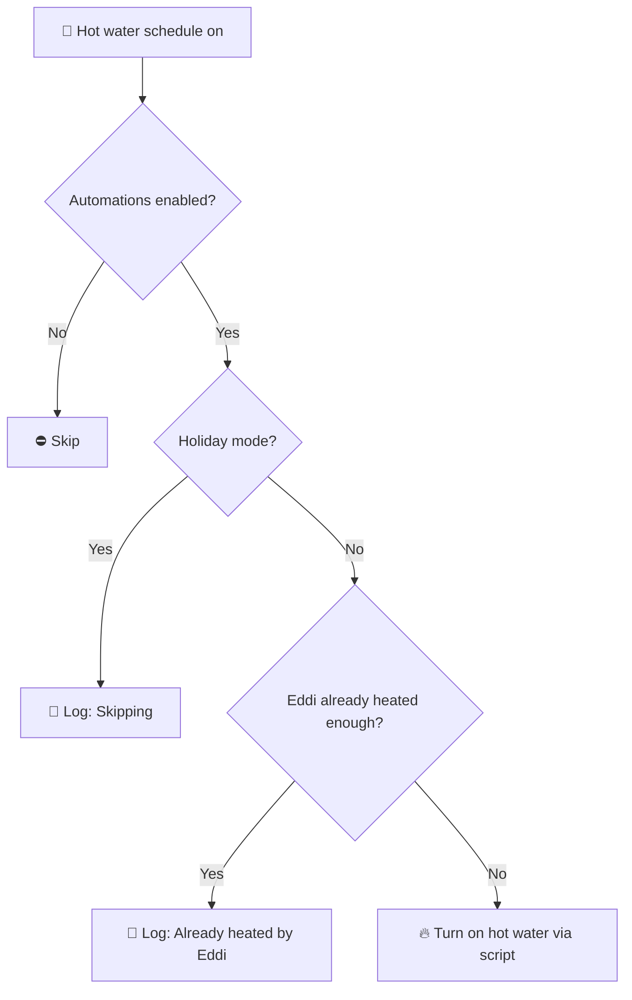
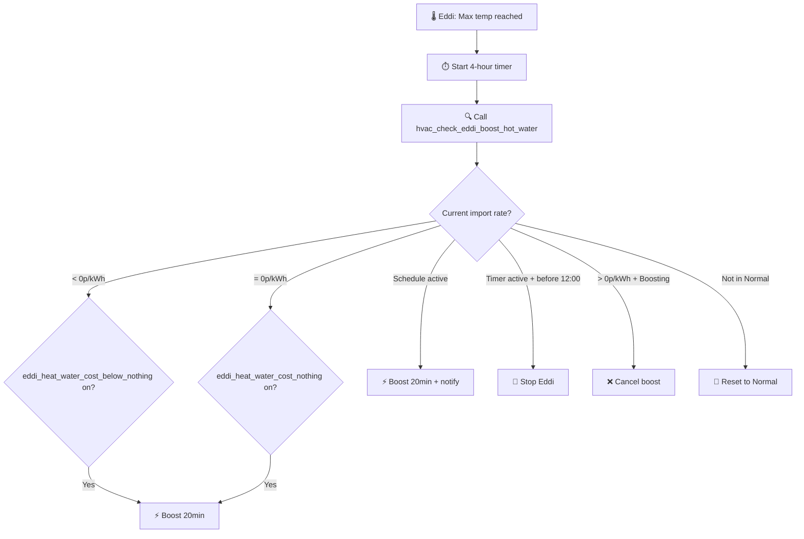
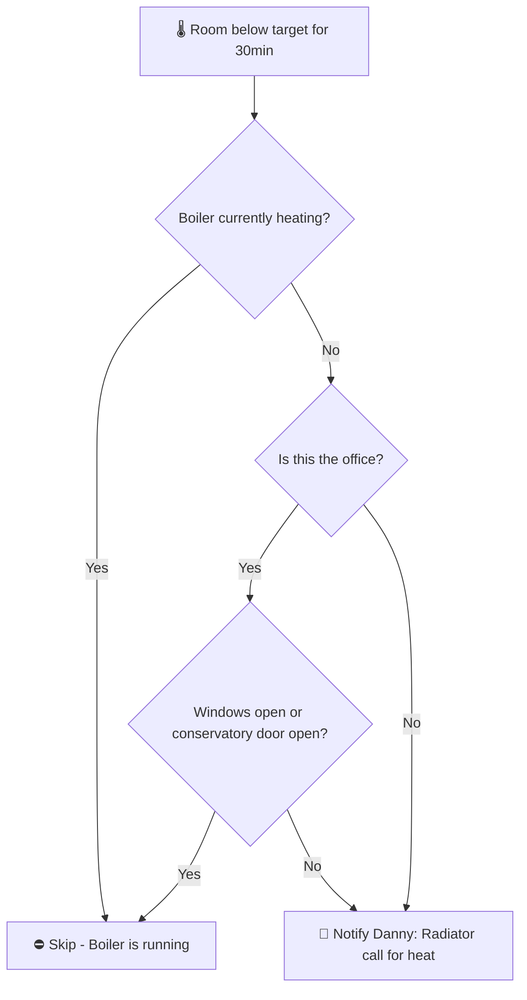

[<- Back to Integrations README](../README.md) · [Packages README](../../README.md) · [Main README](../../../README.md)

# Heating, Ventilation, and Air Conditioning 🌬

Manages central heating, hot water, and solar diversion via Hive, MyEnergi Eddi, and TRV radiators.

---

## Table of Contents

- [Overview](#overview)
- [Architecture](#architecture)
- [Hive Central Heating](#hive-central-heating)
  - [Automations](#hive-automations)
  - [Scripts](#hive-scripts)
  - [Schedule](#heating-schedule)
  - [Schedule Methodology](#heating-schedule-methodology)
- [MyEnergi Eddi (Solar Diverter)](#myenergi-eddi-solar-diverter)
  - [Automations](#eddi-automations)
  - [Scripts](#eddi-scripts)
- [Radiator TRVs](#radiator-trvs)
  - [Automations](#trv-automations)
  - [Sensors](#trv-sensors)
- [History Statistics](#history-statistics)
- [Related Integrations](#related-integrations)

---

## Overview



---

## Architecture

### File Structure

```
packages/integrations/hvac/
├── hvac.yaml      # TRV sync automations and template sensors
├── eddi.yaml      # MyEnergi Eddi solar diverter
├── hive.yaml      # Hive central heating and hot water
└── README.md      # This documentation
```

---

## Hive Central Heating

Controls the gas boiler via the Hive Local Thermostat integration for central heating and hot water.

### Hive Automations

#### HVAC: Heating Mode Changed To Automatic
**ID:** `1666470473973`

Sends a notification if the Hive thermostat is switched to `auto` mode, as this bypasses scheduled automation control.

---

#### HVAC: Heating Turned On
**ID:** `1666470473974`



**Triggers:**
- `schedule.central_heating` turns `on`
- Time pattern: every 5 minutes (handles back-to-back schedule slots)

**Conditions:**
- `input_boolean.enable_central_heating_automations` is `on`

**Actions:**
- Calls `script.check_and_run_central_heating`

---

#### HVAC: Heating Turned Off
**ID:** `1666470473975`

Sets boiler temperature to 7°C when the heating schedule ends. Skips if in Holiday mode.

---

#### HVAC: Unavailable
**ID:** `1740955286496`

Sends a direct notification to Danny and Terina if `climate.hive_climate` is unavailable for more than 1 hour.

---

#### HVAC: Hot Water Mode Changed
**ID:** `1666470473972`

Logs any hot water mode change. If in Holiday mode and hot water switches on, turns it off immediately and notifies Danny.

---

#### Central Heating: Turn On Hot Water
**ID:** `1662589192400`



Turns on hot water from schedule, unless Eddi has already heated sufficient water (based on `input_number.hot_water_solar_diverter_boiler_cut_off` threshold).

---

#### Central Heating: Turn Off Hot Water
**ID:** `1662589333109`

Turns off hot water when the schedule ends (30-second delay). Skips if in Holiday mode.

---

### Hive Scripts

| Script | Purpose |
|--------|---------|
| `set_central_heating_to_away_mode` | Set boiler to 7°C frost-protection mode |
| `set_central_heating_to_home_mode` | Re-enable schedule-based heating |
| `set_central_heating_to_off` | Turn heating off entirely |
| `check_and_run_central_heating` | Core logic: set schedule temperature unless holiday/already correct |
| `hvac_turn_off_heater_schedule` | Disable the heating schedule |
| `check_and_run_hot_water` | Turn hot water on or off based on current schedule state |
| `set_hot_water_to_off` | Turn off hot water (with unavailability alert) |
| `set_how_water_to_on` | Turn on hot water (with unavailability alert) |

---

### Heating Schedule

Defined in `schedule.central_heating`. Temperature data is attached to each slot and read by `check_and_run_central_heating`.

| Day | Slots |
|-----|-------|
| Monday | 06:30–08:00 (20°C), 08:00–14:00 (20°C), 14:00–22:00 (22°C) |
| Tuesday | 06:30–14:00 (20°C), 14:00–18:00 (22°C), 18:00–20:00 (20°C), 20:00–22:00 (22°C) |
| Wednesday | 06:30–14:00 (20°C), 14:00–22:00 (22°C) |
| Thursday | 06:30–14:00 (20°C), 14:00–18:00 (22°C), 18:00–20:00 (20°C), 20:00–22:00 (22°C) |
| Friday | 06:30–14:00 (20°C), 14:00–18:00 (22°C), 18:00–21:00 (20°C), 21:00–22:30 (22°C) |
| Saturday | 07:30–10:00 (22°C), 10:00–13:30 (20°C), 13:30–23:00 (22°C) |
| Sunday | 07:30–17:00 (22°C), 17:00–18:30 (20°C), 18:30–22:00 (22°C) |

---

### Heating Schedule Methodology

The schedule is designed around measured heating performance and occupancy patterns.

#### Heating Performance Data

Based on historical temperature data from InfluxDB:

| Metric | Value |
|--------|-------|
| **Average heating rate** | 0.70°C/hour |
| **Maximum heating rate** | 2.40°C/hour |
| **Average cooling rate** | 0.52°C/hour |
| **Pre-heat time for 1°C rise** | ~90 minutes |

#### Temperature Setpoint Logic

- **20°C**: Baseline / reduced occupancy periods
- **22°C**: Full occupancy periods
- Pre-heat starts ~90 minutes before 22°C periods

---

## MyEnergi Eddi (Solar Diverter)

The Eddi immersion heater diverts surplus solar electricity to the hot water tank. Additionally uses Octopus Agile zero/negative rate periods to heat water at minimal or negative cost.

### Eddi Automations

#### Energy: Eddi Diverting Energy
**ID:** `1677762423485`

Logs a debug message when the Eddi status changes to `Diverting`, showing the session energy consumed so far. Requires both `enable_hot_water_automations` and `enable_eddi_automations` to be `on`.

---

#### HVAC: Eddi Turn On
**ID:** `1685005214749`

Restarts the Eddi (sets to `Normal` mode) at midnight and 13:00 if it was stopped (e.g. after max temperature cutoff). Skips in Holiday mode.

---

#### HVAC: Eddi Generated Hot Water And Hot Water Is On
**ID:** `1678578286486`

Turns off the boiler hot water schedule if the Eddi has already heated enough water (energy consumed exceeds `input_number.hot_water_solar_diverter_boiler_cut_off`). Calls `script.check_and_run_hot_water`.

---

#### Eddi: Max Temperature Reached
**ID:** `1712238362391`



Triggered when Eddi reports max tank temperature. Starts a 4-hour timer and runs the Octopus Agile rate check logic.

---

### Eddi Scripts

#### hvac_check_eddi_boost_hot_water

Core decision logic for Eddi boost based on Octopus Agile import rate:

| Condition | Action |
|-----------|--------|
| Rate < 0p/kWh + flag enabled | Boost for 20 minutes |
| Rate = 0p/kWh + flag enabled | Boost for 20 minutes |
| Boost schedule active | Boost for 20 minutes + notify Danny |
| 4h timer active + before 12:00 | Stop Eddi (already heated) |
| Rate > 0p/kWh + currently boosting | Cancel boost |
| Not in Normal mode (default) | Reset to Normal mode |

**Fields:** `current_electricity_import_rate`, `current_electricity_import_rate_unit`, `event`

---

#### Other Eddi Scripts

| Script | Purpose |
|--------|---------|
| `hvac_set_solar_diverter_to_holiday_mode` | Set Eddi to `Stopped` mode for holidays |
| `hvac_set_solar_diverter_to_normal_mode` | Return Eddi to `Normal` mode |
| `hvac_set_solar_diverter_to_boost_mode` | Boost immersion for N minutes (field: `minutes`) |

---

### Eddi Utility Meter

| Entity | Purpose |
|--------|---------|
| `sensor.myenergi_eddi_energy_consumed_per_heating_cycle` | Energy consumed in last ~4 hours (resets every 4h) |

---

## Radiator TRVs

### TRV Automations

#### HVAC: House Target Temperature Changed
**ID:** `1678125037184`

When the central thermostat target temperature changes (`sensor.thermostat_target_temperature`), updates all TRV setpoints to match. Syncs:
- `climate.ashlees_bedroom_radiator`
- `climate.bedroom_radiator`
- `climate.kitchen_radiator`
- `climate.leos_bedroom_radiator`
- `climate.living_room_radiator`
- `climate.office_radiator`

---

#### HVAC: Radiators Below Target Temperature
**ID:** `1678271646645`



Triggers when any monitored room (bedroom, Leo's bedroom, living room, office) stays below its minimum target temperature for 30 minutes. Does not fire if the boiler is already `heating`.

**Minimum target** = TRV setpoint minus `input_number.<room>_radiator_heating_threshold`.

---

### TRV Sensors

#### Template Sensors

Temperature and target temperature sensors are exposed as individual `sensor` entities for each room's TRV:

| Sensor | Source |
|--------|--------|
| `sensor.ashlees_bedroom_radiator_temperature` | `climate.ashlees_bedroom_radiator` |
| `sensor.bedroom_radiator_temperature` | `climate.bedroom_radiator` |
| `sensor.conservatory_radiator_temperature` | `climate.Conservatory_radiator` |
| `sensor.conservatory_radiator_2_temperature` | `climate.Conservatory_radiator_2` |
| `sensor.kitchen_radiator_temperature` | `climate.kitchen_radiator` |
| `sensor.leos_radiator_temperature` | `climate.leos_bedroom_radiator` |
| `sensor.living_room_radiator_temperature` | `climate.living_room_radiator` |
| `sensor.office_radiator_temperature` | `climate.office_radiator` |
| `sensor.porch_radiator_temperature` | `climate.porch_radiator` |

Each room also has a corresponding `*_target_temperature` sensor and a `*_minimum_target_temperature` sensor (target minus threshold).

#### Statistics Sensors (Flow Temperature Delta)

| Sensor | Window |
|--------|--------|
| `sensor.flow_temperature_delta_last_24_hours` | Mean over 24h |
| `sensor.flow_temperature_highest_delta` | Max over 30 days |
| `sensor.flow_temperature_lowest_delta` | Min over 30 days |
| `sensor.flow_temperature_delta_difference` | Absolute distance over 30 days |

---

## History Statistics

### Heating Duration

| Sensor | Period |
|--------|--------|
| `sensor.heating_on_duration_today` | Today |
| `sensor.heating_on_duration_last_24_hours` | Rolling 24h |
| `sensor.heating_on_duration_yesterday` | Yesterday |
| `sensor.heating_on_duration_this_week` | This week |
| `sensor.heating_on_duration_last_week` | Last week |
| `sensor.heating_on_duration_this_month` | This month |
| `sensor.heating_on_duration_last_month` | Last month |

### Hot Water Duration

| Sensor | Period |
|--------|--------|
| `sensor.hot_water_on_duration_today` | Today |
| `sensor.hot_water_on_duration_last_24_hours` | Rolling 24h |
| `sensor.hot_water_on_duration_yesterday` | Yesterday |
| `sensor.hot_water_on_duration_this_week` | This week |
| `sensor.hot_water_on_duration_this_month` | This month |

---

## Related Integrations

| Integration | Connection |
|-------------|------------|
| [Energy](../energy/README.md) | Octopus Agile rate-based Eddi boost decisions |
| [Conservatory](../../rooms/conservatory/README.md) | Underfloor heating control |
| [Stairs](../../rooms/stairs/README.md) | Central heating door open/close triggers |

---

## Maintenance Notes

### Troubleshooting

| Issue | Check |
|-------|-------|
| Heating not turning on at schedule time | `schedule.central_heating` state, `input_boolean.enable_central_heating_automations` |
| Hot water not turning off after solar heating | `sensor.myenergi_eddi_energy_consumed_per_heating_cycle` vs threshold |
| TRVs not syncing with thermostat | `sensor.thermostat_target_temperature` state |
| Eddi not boosting on low rate | `input_boolean.eddi_heat_water_cost_below_nothing` or `eddi_heat_water_cost_nothing` |
| Hive unavailable alert | `climate.hive_climate` state, check Hive hub and local thermostat integration |

### Configuration Flags

| Flag | Purpose |
|------|---------|
| `input_boolean.enable_central_heating_automations` | Master switch for heating automations |
| `input_boolean.enable_hot_water_automations` | Master switch for hot water automations |
| `input_boolean.enable_eddi_automations` | Master switch for Eddi automations |
| `input_boolean.eddi_heat_water_cost_below_nothing` | Allow Eddi boost when rate < 0p/kWh |
| `input_boolean.eddi_heat_water_cost_nothing` | Allow Eddi boost when rate = 0p/kWh |
| `input_boolean.enable_permanent_hot_water_below_export` | Permanently boost when exporting |
| `input_boolean.enable_boost_hot_water_schedule_1` | Enable scheduled Eddi boost window 1 |
| `input_number.hot_water_solar_diverter_boiler_cut_off` | Eddi energy threshold to skip boiler hot water |

---

*Last updated: 2026-04-05*
