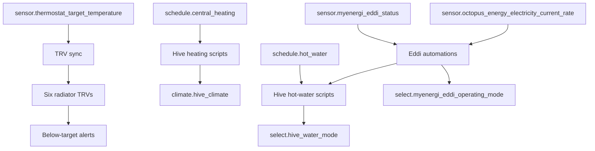
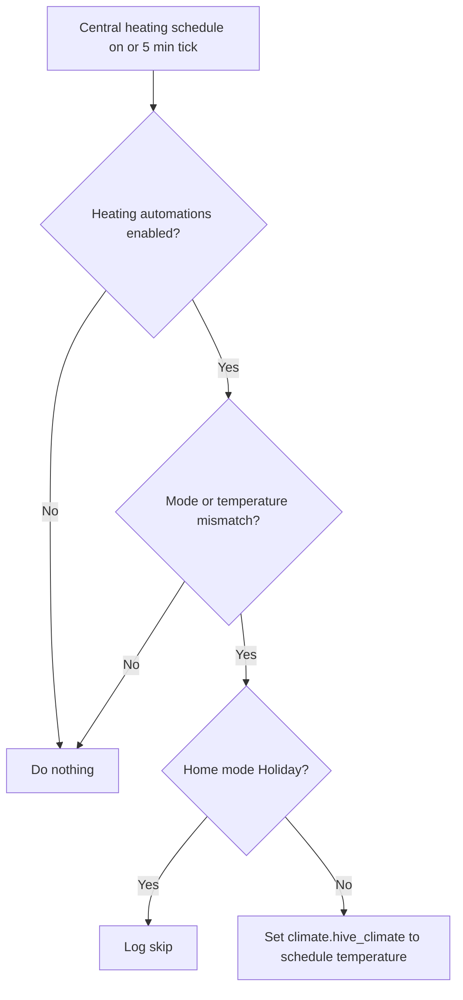
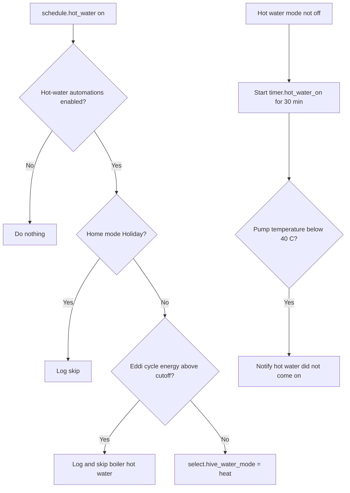

[<- Back to Integrations README](../README.md) · [Packages README](../../README.md) · [Main README](../../../README.md)

# HVAC Package Documentation

The HVAC packages manage central heating, Hive hot water, MyEnergi Eddi solar diversion, and radiator TRV monitoring. In plain English: schedules heat the house and hot water, holiday mode prevents unwanted heating, Eddi can replace boiler hot-water runs when solar or cheap electricity has already heated the tank, and radiator sensors alert when rooms are below target while the boiler is not already heating.

This documentation covers all YAML files in this folder:

| File | Purpose | Contents |
|------|---------|----------|
| `hive.yaml` | Central heating and Hive hot-water control | 10 automations, 8 scripts, 1 schedule, 12 history-stat sensors |
| `eddi.yaml` | MyEnergi Eddi hot-water diversion and boost control | 4 automations, 4 scripts, 1 input number, 1 utility meter |
| `hvac.yaml` | TRV synchronisation, radiator alerts, and boiler delta sensors | 2 automations, 30 sensors |

## Quick Summary

| Area | What Happens |
|------|--------------|
| Central heating | `schedule.central_heating` sets `climate.hive_climate` to the scheduled temperature while automations are enabled. |
| Hot water | `schedule.hot_water` turns Hive hot water on and off unless holiday mode or Eddi-heated-water checks say not to. |
| Hot-water safety | A 30-minute timer checks that pump temperature rose after hot water was turned on. |
| Eddi | Solar diversion is logged, stopped after tank max temperature when appropriate, and boosted during zero/negative or scheduled cheap-rate periods. |
| TRVs | Six TRVs follow the main thermostat target. Four rooms are monitored for being below target while the boiler is idle. |
| History | Heating and hot-water runtime sensors track daily, rolling, weekly, and monthly usage. |

## How It Fits Together

## Main Files

### `hive.yaml`

This file controls the boiler and Hive hot-water mode.

| Section | YAML Objects | Summary |
|---------|--------------|---------|
| Heating automations | 4 automations | Warns on thermostat auto mode, runs scheduled heating, sets frost-protection temperature at schedule end, and alerts if Hive is unavailable. |
| Hot-water automations | 6 automations | Logs hot-water mode changes, runs schedule on/off, starts/cancels a hot-water timer, and checks pump temperature after 30 minutes. |
| Heating scripts | 5 scripts | Away, home, off, schedule check, and heater schedule logging helper. |
| Hot-water scripts | 3 scripts | Check schedule state, turn hot water off, and turn hot water on. |
| Sensors | 12 history-stat sensors | Heating and hot-water runtime statistics. |

### `eddi.yaml`

This file manages the MyEnergi Eddi.

| Section | YAML Objects | Summary |
|---------|--------------|---------|
| Eddi automations | 4 automations | Logs diverting, restores Normal mode at 00:00/13:00, reacts when Eddi has heated enough water, and handles max tank temperature. |
| Eddi scripts | 4 scripts | Set holiday/normal/boost mode and make Octopus-rate boost decisions. |
| Helpers | 1 input number, 1 utility meter | Configures boost duration and tracks Eddi energy per heating cycle. |

### `hvac.yaml`

This file is the TRV and radiator-monitoring layer.

| Section | YAML Objects | Summary |
|---------|--------------|---------|
| TRV sync | 1 automation | Copies `sensor.thermostat_target_temperature` to six TRVs. |
| Radiator alerting | 1 automation | Alerts when bedroom, Leo's room, living room, or office stays below minimum target for 30 minutes while the boiler is not heating. |
| Boiler delta sensors | 4 statistics sensors | Tracks boiler flow temperature delta over 24 hours and 30 days. |
| Radiator template sensors | 26 template sensors | Current, target, thermostat, and minimum-target temperature sensors. |

## User Controls

| Entity | Plain-English Purpose |
|--------|-----------------------|
| `input_boolean.enable_central_heating_automations` | Master switch for central-heating schedule automation. |
| `input_boolean.enable_hot_water_automations` | Master switch for hot-water automations. |
| `input_boolean.enable_eddi_automations` | Master switch for Eddi automations. |
| `input_select.home_mode` | `Holiday` suppresses scheduled heating/hot-water actions in several branches. |
| `input_number.hot_water_solar_diverter_boiler_cut_off` | Eddi energy threshold above which boiler hot water can be skipped. |
| `input_number.eddi_boost_duration_minutes` | Eddi boost duration for cheap-rate or scheduled boost decisions, 5-60 minutes. |

## Everyday Behavior

### Central Heating Schedule

`HVAC: Heating Turned On` runs when `schedule.central_heating` turns on and every 5 minutes while the schedule is active. It calls `script.check_and_run_central_heating` if the thermostat is not already in heat mode or its temperature differs from the active schedule slot.

When the schedule turns off, `HVAC: Heating Turned Off` sets `climate.hive_climate` to heat mode at 7 C unless home mode is `Holiday`, where it logs a skip.

### Hot Water

Hot-water scheduling uses `schedule.hot_water`, `select.hive_water_mode`, Eddi cycle energy, and the Eddi cutoff helper.

### Eddi Boost Logic

`script.hvac_check_eddi_boost_hot_water` is the central decision point. It is called when Eddi reports `Max temp reached`, and may also be called by other packages.

| First Matching Condition | Action |
|--------------------------|--------|
| Current import rate below 0 and `input_boolean.eddi_heat_water_cost_below_nothing` is on | Boost Eddi for `input_number.eddi_boost_duration_minutes`. |
| Current import rate equals 0 and `input_boolean.eddi_heat_water_cost_nothing` is on | Boost Eddi for the configured duration. |
| Permanent below-export boost is enabled, or boost schedule 1 is enabled and active | Notify Danny and boost Eddi for the configured duration. |
| `timer.eddi_max_temperature_reached` is active, hot-water automations are enabled, and it is before 12:00 | Stop Eddi if it is not already stopped. |
| Current import rate is above 0 and Eddi status is `Boosting` | Stop the boost. |
| Eddi operating mode is not `Normal` | Set Eddi back to `Normal`. |

### TRVs And Radiator Alerts

`HVAC: House Target Temperature Changed` syncs these TRVs to the thermostat target:

| TRV |
|-----|
| `climate.ashlees_bedroom_radiator` |
| `climate.bedroom_radiator` |
| `climate.kitchen_radiator` |
| `climate.leos_bedroom_radiator` |
| `climate.living_room_radiator` |
| `climate.office_radiator` |

`HVAC: Radiators Below Target Temperature` watches bedroom, Leo's bedroom, living room, and office minimum-target sensors. It does not run while `climate.hive_receiver_heat` has `hvac_action: heating`. Office alerts only send when `binary_sensor.office_windows` and `binary_sensor.conservatory_door` are both `off`.

## Troubleshooting

| Issue | Check |
|-------|-------|
| Heating did not start | `schedule.central_heating`, `input_boolean.enable_central_heating_automations`, `input_select.home_mode`, and `climate.hive_climate`. |
| Heating setpoint looks wrong | The active schedule slot `temperature` attribute and `sensor.thermostat_target_temperature`. |
| Hot water did not turn on | `select.hive_water_mode`, `timer.hot_water_on`, and `sensor.central_heating_pump_temperature`. |
| Boiler hot-water run was skipped | `sensor.myenergi_eddi_energy_consumed_per_heating_cycle` versus `input_number.hot_water_solar_diverter_boiler_cut_off`. |
| Eddi does not boost during cheap rates | Octopus current rate sensor and the two cheap-rate booleans. |
| TRVs do not sync | `sensor.thermostat_target_temperature` and the six TRV climate entities. |
| Room-below-target alert did not fire | Boiler `hvac_action`, the room's minimum-target sensor, and the 30-minute trigger duration. |

## Related Documentation

| Document | Purpose |
|----------|---------|
| [Hive details](hive_README.md) | Heating and hot-water behavior. |
| [Eddi details](eddi_README.md) | Solar diverter and boost behavior. |
| [TRV details](hvac_README.md) | Radiator sensors and alerting. |
| [Energy](../energy/README.md) | Octopus and solar context used by Eddi decisions. |

*Last updated: 2026-06-27*
