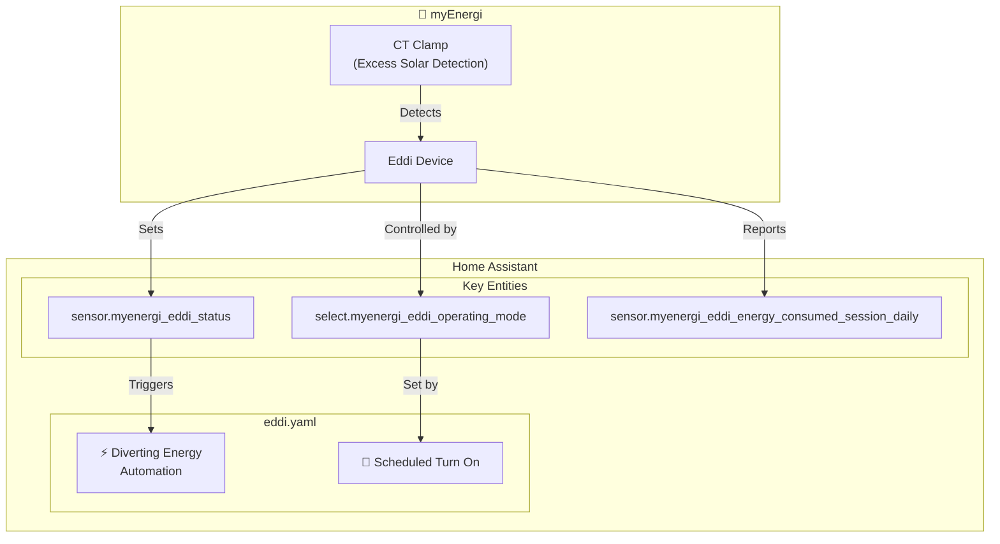
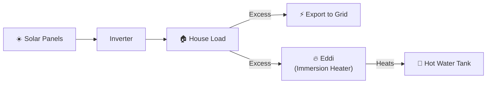
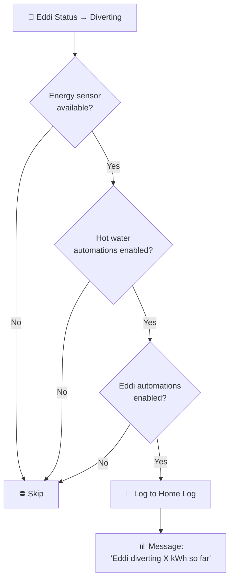
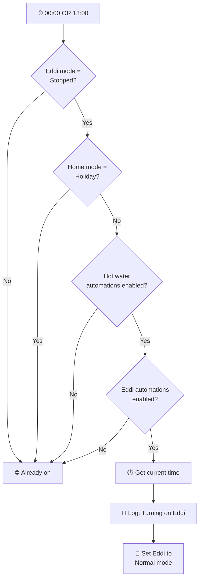
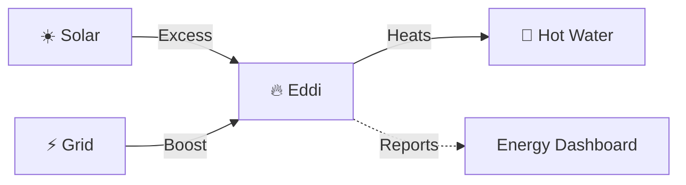

# Eddi

Integration with myEnergi Eddi for hot water heating via solar diversion.

**Integration:** https://github.com/CJNE/ha-myenergi

---

## Overview

The Eddi device diverts excess solar energy to heat hot water via an immersion heater. This package manages:
- **Solar diversion monitoring** — Tracks when Eddi is diverting excess solar
- **Scheduled heating** — Ensures hot water availability even without sun
- **Holiday mode** — Disables scheduled heating when away
- **Energy tracking** — Logs daily diverted energy

### Key Capabilities

- Automatic daily heating schedule (00:00 and 13:00 checks)
- Solar diversion notifications
- Integration with home mode (holiday detection)
- Manual boost control via scripts

---

## Architecture

---

## How Solar Diversion Works

When solar generation exceeds house consumption, the Eddi device redirects the excess to the immersion heater instead of exporting to the grid.

---

## Automations

### Energy: Eddi Diverting Energy
**ID:** `1677762423485`

Notifies when Eddi starts diverting excess solar to hot water.

**Notification includes:**
- Current diverted energy for the session
- Visual indicator (⛽)
- Logged at "Debug" level

---

### HVAC: Eddi Turn On
**ID:** `1685005214749`

Scheduled heating to ensure hot water availability.

**Schedule:**
| Time | Purpose |
|------|---------|
| 00:00 | Overnight heating (if no solar during day) |
| 13:00 | Midday boost (if morning wasn't sunny) |

---

## Key Entities

### myEnergi Integration

| Entity | Type | Description |
|--------|------|-------------|
| `sensor.myenergi_eddi_status` | Sensor | Current status (Diverting/Stopped/etc) |
| `select.myenergi_eddi_operating_mode` | Select | Operating mode (Normal/Stopped/Boost) |
| `sensor.myenergi_eddi_energy_consumed_session_daily` | Sensor | Daily diverted energy (kWh) |
| `sensor.myenergi_eddi_power` | Sensor | Current power diversion (W) |

### Input Booleans (Feature Flags)

| Entity | Purpose |
|--------|---------|
| `input_boolean.enable_hot_water_automations` | Master switch for hot water heating |
| `input_boolean.enable_eddi_automations` | Eddi-specific automation control |

### Input Select

| Entity | Purpose |
|--------|---------|
| `input_select.home_mode` | Home mode (Holiday disables scheduled heating) |

---

## Scripts

### Eddi Boost

Manual boost control can be triggered via:
- `select.myenergi_eddi_operating_mode` → Set to "Boost"
- Home Assistant service call

**Boost modes:**
| Mode | Behavior |
|------|----------|
| **Normal** | Automatic solar diversion |
| **Stopped** | No heating (manual override) |
| **Boost** | Force heating regardless of solar |

---

## Energy Dashboard

The Eddi contributes to home energy tracking:
- **Diverting** = Free heating from solar excess
- **Boost** = Grid-powered heating (if solar insufficient)

---

## Dependencies

### Required Integrations

- [ha-myenergi](https://github.com/CJNE/ha-myenergi) — Eddi device control

### Cross-Package Dependencies

| Dependency | Package | Purpose |
|------------|---------|---------|
| `input_select.home_mode` | home | Holiday mode detection |
| `script.send_to_home_log` | shared_helpers | Logging |
| `script.get_clock_emoji` | shared_helpers | Time-based emoji |

---

## Troubleshooting

| Issue | Check |
|-------|-------|
| Not diverting solar | CT clamp installation, solar excess availability |
| Not turning on at scheduled times | `input_boolean.enable_eddi_automations` state |
| Heating during holiday | `input_select.home_mode` value |
| Energy sensor unavailable | myEnergi integration connectivity |

---

## Related Documentation

| Document | Purpose |
|----------|---------|
| [HVAC](hvac_README.md) | Central heating coordination |
| [Hive](hive_README.md) | Main thermostat control |
| [Solar Assistant](../energy/solar_assistant_README.md) | Solar generation monitoring |
| [Octopus Energy](../energy/octopus_energy_README.md) | Rate-based decisions |

---

*Last updated: 2026-04-05*

*Source: [packages/integrations/hvac/eddi.yaml](../../../../packages/integrations/hvac/eddi.yaml)*
