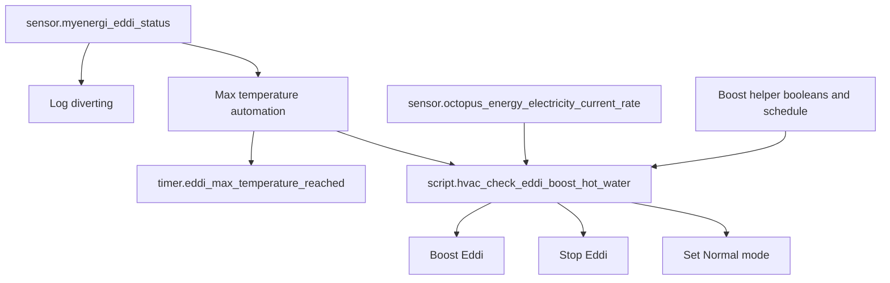
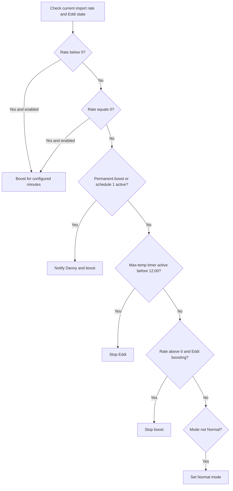

# Eddi Package Documentation

The Eddi package manages MyEnergi Eddi hot-water diversion. It logs solar diversion, returns Eddi to Normal mode after it has been stopped, stops or boosts Eddi after the hot-water tank reaches max temperature, and uses Octopus current rate plus helper booleans to decide whether electric boosting is worthwhile.

Source YAML: `eddi.yaml`

| Contents | Count |
|----------|-------|
| Automations | 4 |
| Scripts | 4 |
| Input numbers | 1 |
| Utility meters | 1 |

## Quick Summary

| Area | What Happens |
|------|--------------|
| Solar diversion | When `sensor.myenergi_eddi_status` becomes `Diverting`, a debug home-log entry records daily diverted energy. |
| Scheduled restore | At 00:00 and 13:00, Eddi is put back into `Normal` mode if it is stopped and automations are enabled. |
| Boiler coordination | If Eddi cycle energy exceeds the hot-water cutoff while Hive hot water is on, the hot-water schedule check is rerun. |
| Max temperature | When Eddi reports `Max temp reached`, a 4-hour timer starts and cheap-rate boost logic runs. |
| Cheap-rate boosting | Negative-rate, zero-rate, and scheduled boost branches can boost Eddi for the configured duration. |

## How It Works

## Automations

| Automation | ID | Trigger | Result |
|------------|----|---------|--------|
| `Energy: Eddi Diverting Energy` | `1677762423485` | `sensor.myenergi_eddi_status` becomes `Diverting` | Logs daily session energy if hot-water and Eddi automations are enabled and the daily energy sensor is not `unknown`. |
| `HVAC: Eddi Turn On` | `1685005214749` | 00:00 and 13:00 | If Eddi mode is `Stopped`, not holiday mode, and automations are enabled, cancels the max-temperature timer and sets operating mode to `Normal`. |
| `HVAC: Eddi Generated Hot Water And Hot Water Is On` | `1678578286486` | Eddi per-cycle energy rises above cutoff | If Hive receiver water is `on`, logs that Eddi heated enough water and calls `script.check_and_run_hot_water`. |
| `Eddi: Max Temperature Reached` | `1712238362391` | `sensor.myenergi_eddi_status` becomes `Max temp reached` | Logs, starts `timer.eddi_max_temperature_reached` for 4 hours, and calls the Eddi boost-check script with the current Octopus rate. |

## Scripts

| Script | Purpose |
|--------|---------|
| `script.hvac_set_solar_diverter_to_holiday_mode` | If Eddi automations are enabled, sets `select.myenergi_eddi_operating_mode` to `Stopped`. |
| `script.hvac_set_solar_diverter_to_normal_mode` | If Eddi automations are enabled, sets Eddi operating mode to `Normal`. |
| `script.hvac_set_solar_diverter_to_boost_mode` | Boosts Heater 1 for the supplied `minutes` value using `myenergi.myenergi_eddi_boost`. |
| `script.hvac_check_eddi_boost_hot_water` | Applies the cheap-rate, scheduled-boost, stop, cancel-boost, and default-normal decision tree. |

## Boost Decision Tree

`script.hvac_check_eddi_boost_hot_water` uses first-match-wins ordering.

| Helper | Purpose |
|--------|---------|
| `input_boolean.eddi_heat_water_cost_below_nothing` | Allows boosting when import rate is below 0. |
| `input_boolean.eddi_heat_water_cost_nothing` | Allows boosting when import rate equals 0. |
| `input_boolean.enable_permanent_hot_water_below_export` | Enables a scheduled-boost branch regardless of schedule 1. |
| `input_boolean.enable_boost_hot_water_schedule_1` | Enables schedule 1 boost checks. |
| `binary_sensor.boost_hot_water_schedule_1` | Indicates schedule 1 is currently active. |
| `input_number.eddi_boost_duration_minutes` | Boost duration, 5-60 minutes, default 20. |

## Energy Tracking

| Entity | Source | Purpose |
|--------|--------|---------|
| `sensor.myenergi_eddi_energy_consumed_per_heating_cycle` | Utility meter from `sensor.myenergi_eddi_energy_used_today` | Resets every 4 hours and is used to decide if Eddi has heated enough water. |

Power-user note: comments and log text mention 4-hour and 6-hour windows in different places, but the YAML utility meter cron is `0 */4 * * *`, so the actual reset cadence is every 4 hours.

## Troubleshooting

| Issue | Check |
|-------|-------|
| Eddi does not return to Normal | `select.myenergi_eddi_operating_mode`, home mode, and Eddi/hot-water automation booleans. |
| Eddi does not boost on cheap rates | Current Octopus rate, cheap-rate booleans, and `input_number.eddi_boost_duration_minutes`. |
| Eddi keeps stopping before noon | `timer.eddi_max_temperature_reached` and max-temperature branch. |
| Boiler hot water was not skipped | Eddi cycle energy versus `input_number.hot_water_solar_diverter_boiler_cut_off`. |
| Diverting log missing | `sensor.myenergi_eddi_energy_consumed_session_daily` must not be `unknown`. |

## Related Documentation

| Document | Purpose |
|----------|---------|
| [HVAC overview](README.md) | Folder-level heating, hot-water, and TRV overview. |
| [Hive](hive_README.md) | Hive hot-water scheduling that Eddi can influence. |
| [Energy](../energy/README.md) | Octopus and solar context. |

*Last updated: 2026-06-27*
