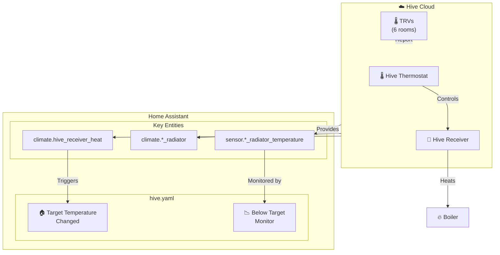
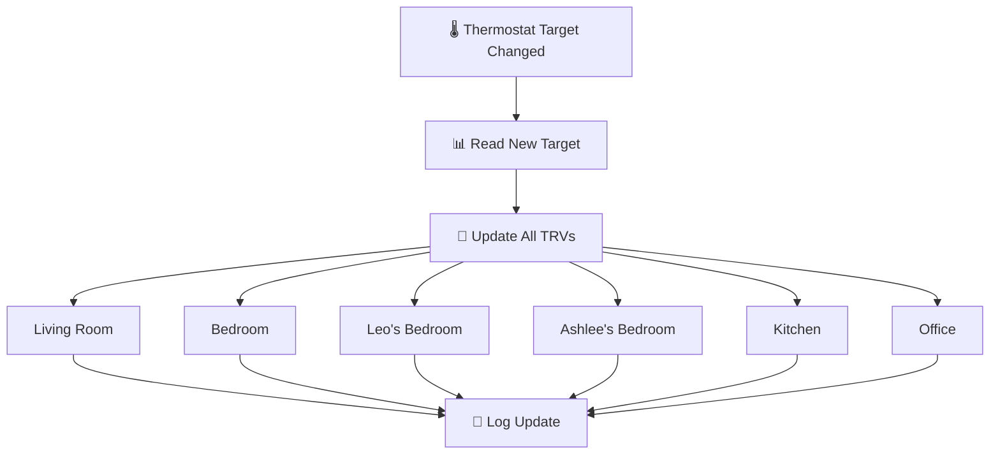
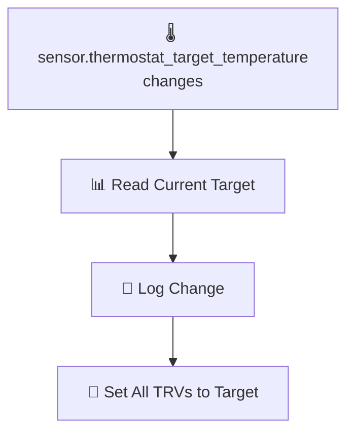
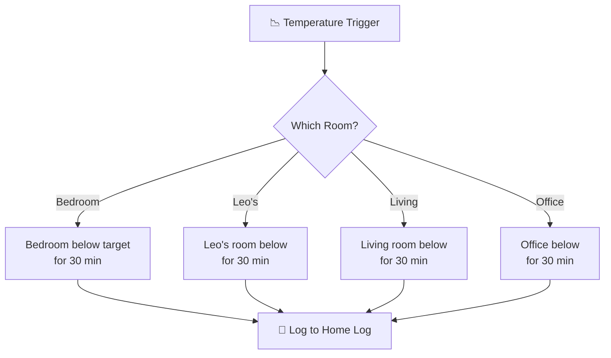
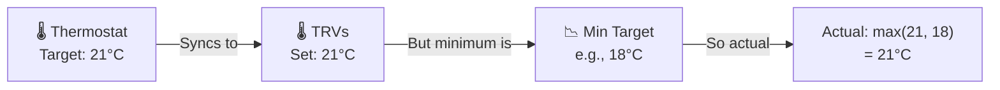

# Hive

Integration with Hive Active Heating for thermostat and TRV control.

**Integration:** https://www.home-assistant.io/integrations/hive/

---

## Overview

This package extends the Hive integration with:
- **TRV coordination** — Synchronizes radiator valves with thermostat setpoints
- **Temperature monitoring** — Tracks room temperatures vs targets
- **Heating optimization** — Reduces energy waste through intelligent control

### Key Capabilities

- Automatic TRV temperature synchronization
- Room-by-room temperature monitoring
- Boiler control via Hive receiver
- Integration with broader HVAC automation

---

## Architecture



---

## TRV Synchronization

When the main thermostat target changes, all TRVs are updated to match:



**TRVs Updated:**
| Room | Entity |
|------|--------|
| Living Room | `climate.living_room_radiator` |
| Bedroom | `climate.bedroom_radiator` |
| Leo's Bedroom | `climate.leos_bedroom_radiator` |
| Ashlee's Bedroom | `climate.ashlees_bedroom_radiator` |
| Kitchen | `climate.kitchen_radiator` |
| Office | `climate.office_radiator` |

---

## Automations

### HVAC: House Target Temperature Changed
**ID:** `1678125037184`

Synchronizes all TRVs when the main thermostat target changes.



**Message logged:**
```
Home thermostat target temperature changed.
Updating TRV from {old} to {new}c.
```

---

### HVAC: Radiators Below Target Temperature
**ID:** `1678271646645`

Monitors rooms that are below their target temperature.



**Purpose:**
- Identifies rooms struggling to reach target temperature
- Helps detect TRV issues or insulation problems
- Logs at Debug level for analysis

---

## Key Entities

### Climate Entities

| Entity | Type | Description |
|--------|------|-------------|
| `climate.hive_receiver_heat` | Climate | Main thermostat control |
| `climate.living_room_radiator` | Climate | Living room TRV |
| `climate.bedroom_radiator` | Climate | Main bedroom TRV |
| `climate.leos_bedroom_radiator` | Climate | Leo's room TRV |
| `climate.ashlees_bedroom_radiator` | Climate | Ashlee's room TRV |
| `climate.kitchen_radiator` | Climate | Kitchen TRV |
| `climate.office_radiator` | Climate | Office TRV |

### Sensor Entities

| Entity | Description |
|--------|-------------|
| `sensor.thermostat_target_temperature` | Current target temperature |
| `sensor.bedroom_radiator_temperature` | Bedroom current temp |
| `sensor.leos_radiator_temperature` | Leo's room current temp |
| `sensor.living_room_radiator_temperature` | Living room current temp |
| `sensor.office_radiator_temperature` | Office current temp |
| `sensor.*_radiator_minimum_target_temperature` | Per-room minimum target |

---

## Temperature Logic

### Target vs Minimum Target

| Concept | Purpose |
|---------|---------|
| **Target Temperature** | What the thermostat is set to (all TRVs sync to this) |
| **Minimum Target** | Floor temperature for a specific room (prevents over/under heating) |



---

## Dependencies

### Required Integrations

- [Hive](https://www.home-assistant.io/integrations/hive/) — Core thermostat/TRV integration

### Cross-Package Dependencies

| Dependency | Package | Purpose |
|------------|---------|---------|
| `script.send_to_home_log` | shared_helpers | Logging |

---

## Troubleshooting

| Issue | Check |
|-------|-------|
| TRVs not syncing | `climate.hive_receiver_heat` availability |
| Room not heating | TRV battery, valve pin stuck, minimum target setting |
| Temperature wrong | Sensor calibration in Hive app |
| Boiler not firing | Hive receiver connectivity, thermostat schedule |

---

## Related Documentation

| Document | Purpose |
|----------|---------|
| [HVAC](hvac/README.md) | Central heating coordination |
| [Eddi](eddi/README.md) | Hot water heating |

---

*Last updated: 2026-04-05*

*Source: [packages/integrations/hvac/hive.yaml](../../../../packages/integrations/hvac/hive.yaml)*
