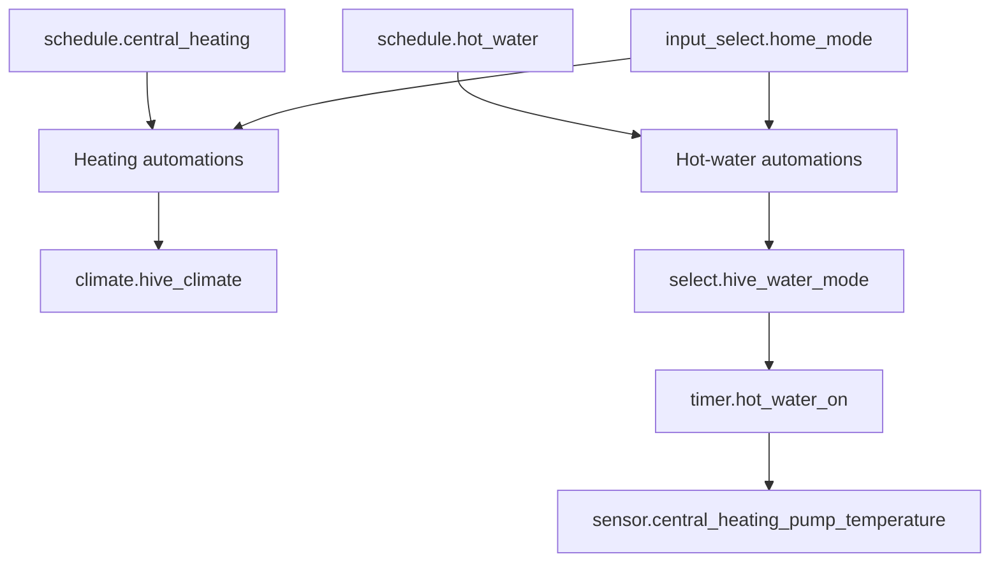

# Hive Package Documentation

Hive controls central heating and hot water. This package keeps the Hive devices aligned with Home Assistant schedules, protects holiday mode, records heating/hot-water runtime, and raises alerts if Hive or hot-water heating appears to fail.

Source YAML: `hive.yaml`

| Contents | Count |
|----------|-------|
| Automations | 10 |
| Scripts | 8 |
| Schedules | 1 |
| History-stat sensors | 12 |

## Quick Summary

| Area | What Happens |
|------|--------------|
| Central heating schedule | Turns `climate.hive_climate` on to the active schedule temperature and sets it to 7 C when the schedule ends. |
| Auto-mode warning | Notifies Danny if the thermostat is switched to `auto`. |
| Unavailable warning | Notifies Danny and Terina if `climate.hive_climate` is unavailable for 1 hour. |
| Hot-water schedule | Turns `select.hive_water_mode` to `heat` or `off` based on `schedule.hot_water`. |
| Holiday protection | Heating and hot-water schedule actions are skipped or reversed in `Holiday` mode. |
| Hot-water safety timer | Starts a 30-minute timer when hot water turns on, then warns if pump temperature is still below 40 C. |

## Everyday Flow

## Automations

| Automation | ID | Trigger | Result |
|------------|----|---------|--------|
| `HVAC: Heating Mode Changed To Automatic` | `1666470473973` | `climate.hive_climate` becomes `auto` | Sends Danny a direct warning if central-heating automations are enabled. |
| `HVAC: Heating Turned On` | `1666470473974` | `schedule.central_heating` on, or every 5 minutes | Calls `script.check_and_run_central_heating` when schedule is active and thermostat mode/temperature need updating. |
| `HVAC: Heating Turned Off` | `1666470473975` | `schedule.central_heating` off | Sets `climate.hive_climate` to heat at 7 C, unless home mode is `Holiday`. |
| `HVAC: Unavailable` | `1740955286496` | `climate.hive_climate` unavailable for 1 hour | Notifies Danny and Terina. |
| `HVAC: Hot Water Mode Changed` | `1666470473972` | `select.hive_water_mode` turns `on` | Logs the mode; in `Holiday` mode, notifies Danny and turns hot water off. |
| `Central Heating: Turn On Hot Water` | `1662589192400` | `schedule.hot_water` on | Turns hot water on unless disabled, already on, holiday mode, or Eddi cycle energy is above cutoff. |
| `Central Heating: Turn Off Hot Water` | `1662589333109` | `schedule.hot_water` off for 30 seconds | Turns hot water off unless disabled, already off, or holiday mode. |
| `HVAC: Hot Water On` | `1781974291399` | `select.hive_water_mode` changes to anything except `off` | Logs and starts `timer.hot_water_on` for 30 minutes. |
| `HVAC: Hot Water Off` | `1781974291400` | `select.hive_water_mode` becomes `off` | Logs and cancels `timer.hot_water_on`. |
| `HVAC: Hot Water Check` | `1781974497124` | `timer.hot_water_on` finishes | If `sensor.central_heating_pump_temperature` is below 40 C, sends a high-priority hot-water failure notification. |

## Scripts

| Script | Purpose |
|--------|---------|
| `script.set_central_heating_to_away_mode` | Turns off the heating schedule and sets Hive to heat at 7 C. |
| `script.set_central_heating_to_home_mode` | Runs the central-heating schedule check if Hive is not already heating. |
| `script.set_central_heating_to_off` | Sets Hive to heat at 7 C and logs schedule turn-off. |
| `script.check_and_run_central_heating` | Core schedule logic for applying the active schedule temperature. |
| `script.hvac_turn_off_heater_schedule` | Logs that the heater schedule is being turned off. |
| `script.check_and_run_hot_water` | Calls hot-water on or off script depending on `schedule.hot_water`. |
| `script.set_hot_water_to_off` | Sets `select.hive_water_mode` to `off`, or notifies if Hive water mode is unavailable. |
| `script.set_how_water_to_on` | Sets `select.hive_water_mode` to `heat`, or notifies if Hive water mode is unavailable. |

Power-user note: `set_how_water_to_on` is the actual script entity name in YAML, including the `how` typo.

## Central Heating Schedule

`schedule.central_heating` stores the target temperature on each slot. Weekday mornings start at 06:30, Saturday/Sunday at 07:30, with 20 C and 22 C slots depending on occupancy.

## History Sensors

| Group | Sensors |
|-------|---------|
| Heating duration | Today, last 24 hours, yesterday, this week, last week, this month, last month. |
| Hot-water duration | Today, last 24 hours, yesterday, this week, this month. |

Heating history uses `sensor.thermostat_action == heating`. Hot-water history uses `sensor.hotwater_state == ON`.

## Troubleshooting

| Issue | Check |
|-------|-------|
| Heating schedule ignored | `input_boolean.enable_central_heating_automations`, `schedule.central_heating`, and `input_select.home_mode`. |
| Heating target not updating | Active schedule slot `temperature` attribute and `climate.hive_climate` state. |
| Hot water does not turn on | `input_boolean.enable_hot_water_automations`, `schedule.hot_water`, `select.hive_water_mode`, and Eddi cutoff comparison. |
| Hot-water failure alert | `sensor.central_heating_pump_temperature` after the 30-minute timer. |
| Hive offline alerts | `climate.hive_climate` availability and Hive local thermostat integration. |

## Related Documentation

| Document | Purpose |
|----------|---------|
| [HVAC overview](README.md) | Folder-level heating, Eddi, and TRV overview. |
| [Eddi](eddi_README.md) | Solar diverter decisions that can skip boiler hot-water runs. |
| [TRV coordination](hvac_README.md) | Radiator target and below-target logic. |

*Last updated: 2026-06-27*
