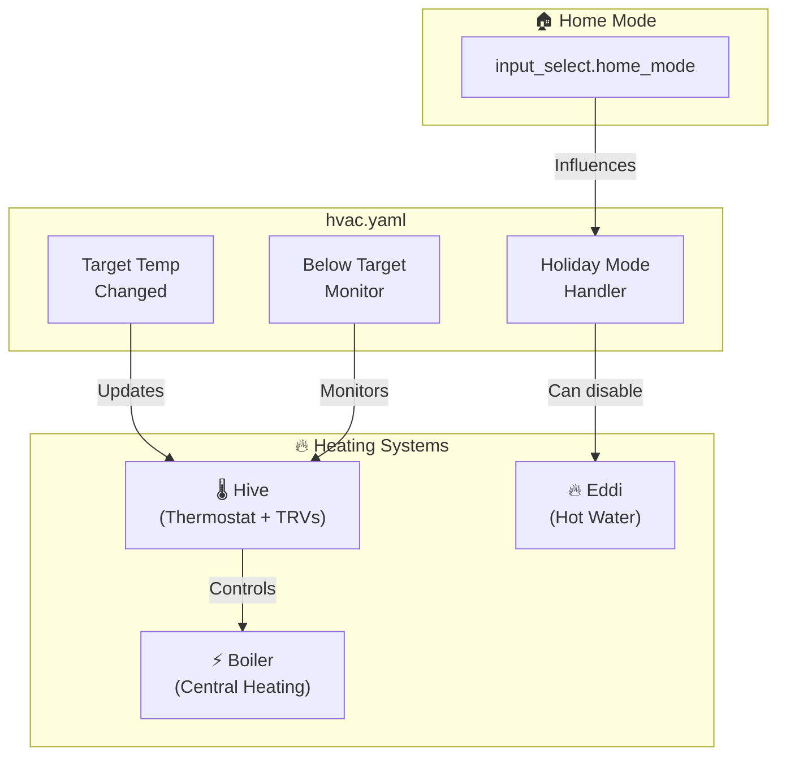
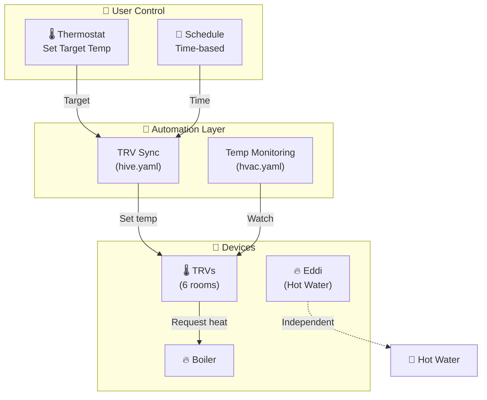
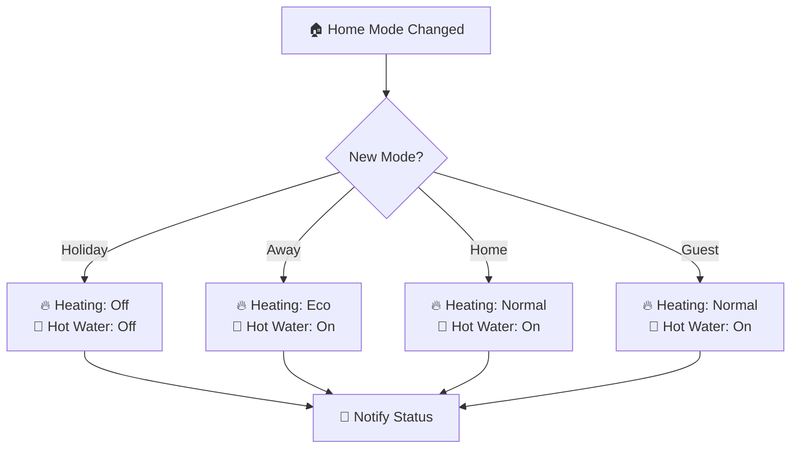
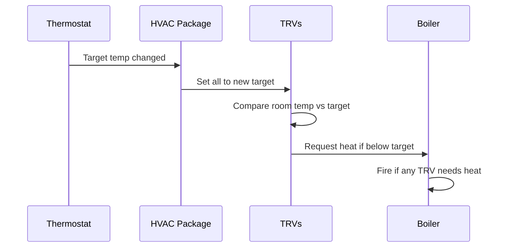

# HVAC

Central heating, ventilation, and air conditioning coordination.

---

## Overview

This package provides the coordination layer between different heating systems:
- **Radiator control** — TRV management and temperature monitoring
- **Boiler control** — Central heating activation
- **Hot water** — Eddi solar diversion coordination
- **Climate modes** — Home mode integration (holiday, guest, etc.)

### Key Capabilities

- Synchronizes radiator TRVs with thermostat setpoints
- Monitors rooms below target temperature
- Integrates heating with home mode (holiday = heating off)
- Provides centralized HVAC status

---

## Architecture

---

## System Coordination

The HVAC system works as a hierarchy:

---

## Automations

### HVAC: House Target Temperature Changed
**ID:** `1678125037184`

Propagates thermostat changes to all radiator TRVs.

See [Hive documentation](hive/README.md) for details.

---

### HVAC: Radiators Below Target Temperature
**ID:** `1678271646645`

Monitors rooms struggling to reach target temperature.

**Monitored Rooms:**
- Bedroom
- Leo's bedroom
- Living room
- Office

**Trigger:** Temperature below minimum target for 30+ minutes

---

## Key Entities

### Climate Entities

| Entity | Description |
|--------|-------------|
| `climate.hive_receiver_heat` | Main thermostat |
| `climate.*_radiator` | Individual room TRVs |

### Sensor Entities

| Entity | Description |
|--------|-------------|
| `sensor.thermostat_target_temperature` | Current heating target |
| `sensor.*_radiator_temperature` | Room temperatures |
| `sensor.*_radiator_minimum_target_temperature` | Floor temperatures |

### Input Select

| Entity | Options | Purpose |
|--------|---------|---------|
| `input_select.home_mode` | Home, Away, Holiday, Guest, No Children | Controls heating behavior |

---

## Home Mode Integration

| Mode | Heating | Hot Water | Notes |
|------|---------|-----------|-------|
| **Home** | Normal schedule | On | Standard operation |
| **Away** | Eco/Reduced | On | Lower temperatures |
| **Holiday** | Off | Off | Everything disabled |
| **Guest** | Normal | On | Guest comfort priority |
| **No Children** | Adult schedule | On | Different room priorities |

---

## Heating Logic Flow

---

## Dependencies

### Sub-packages

| Package | Purpose |
|---------|---------|
| [Hive](hive/README.md) | Thermostat and TRV control |
| [Eddi](eddi/README.md) | Hot water solar diversion |

### Cross-Package Dependencies

| Dependency | Package | Purpose |
|------------|---------|---------|
| `input_select.home_mode` | home | Mode-based heating control |
| `script.send_to_home_log` | shared_helpers | Logging |

---

## Troubleshooting

| Issue | Check |
|-------|-------|
| No heating | Thermostat schedule, home mode, TRV batteries |
| One room cold | That room's TRV, minimum target setting |
| Boiler short-cycling | TRV synchronization, temperature differential |
| Hot water cold | Eddi status, holiday mode, solar availability |

---

## Related Documentation

| Document | Purpose |
|----------|---------|
| [Hive](hive/README.md) | TRV and thermostat details |
| [Eddi](eddi/README.md) | Hot water heating |
| [Energy](../energy/README.md) | Energy dashboard integration |

---

*Last updated: 2026-04-05*

*Source: [packages/integrations/hvac/hvac.yaml](../../../../packages/integrations/hvac/hvac.yaml)*
