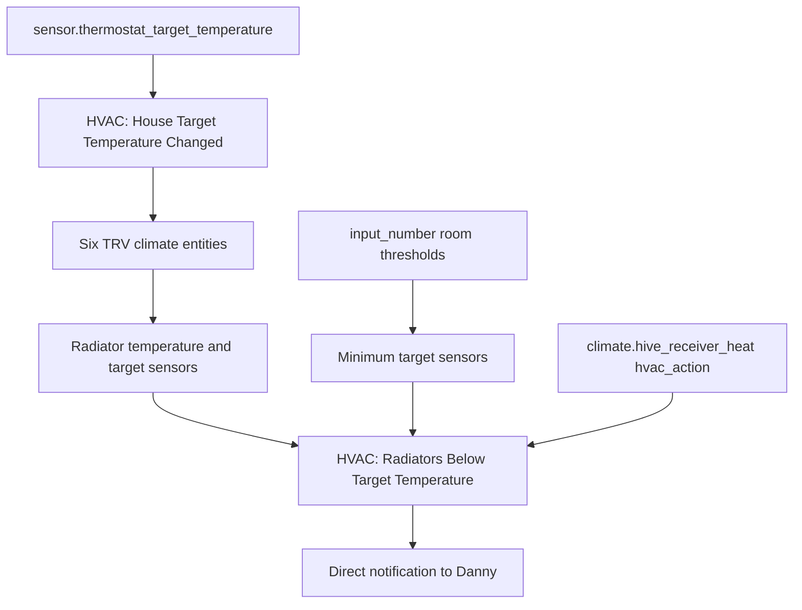

# HVAC TRV Package Documentation

This package is the radiator coordination layer. It mirrors the main Hive thermostat target to selected TRVs, creates radiator temperature sensors, tracks boiler flow-temperature deltas, and alerts when rooms remain below their minimum target while the boiler is not already heating.

Source YAML: `hvac.yaml`

| Contents | Count |
|----------|-------|
| Automations | 2 |
| Statistics sensors | 4 |
| Template sensors | 26 |

## Quick Summary

| Area | What Happens |
|------|--------------|
| TRV sync | When `sensor.thermostat_target_temperature` changes, six radiator TRVs are set to that temperature. |
| Below-target alerts | Bedroom, Leo's bedroom, living room, and office are monitored for 30 minutes below minimum target. |
| Boiler idle guard | Alerts are suppressed while `climate.hive_receiver_heat` has `hvac_action: heating`. |
| Office guard | Office alerts only send if office windows and the conservatory door are both closed. |
| Sensors | Current, target, and minimum-target radiator values are exposed for dashboards and automations. |

## How It Works

## Automations

| Automation | ID | Trigger | Result |
|------------|----|---------|--------|
| `HVAC: House Target Temperature Changed` | `1678125037184` | `sensor.thermostat_target_temperature` changes | Logs the change and sets six TRVs to the new target temperature. |
| `HVAC: Radiators Below Target Temperature` | `1678271646645` | Monitored radiator temperature stays below its minimum target for 30 minutes | Sends Danny a room-specific radiator call-for-heat notification, unless the boiler is already heating. |

## TRVs Synced To Main Target

| Entity |
|--------|
| `climate.ashlees_bedroom_radiator` |
| `climate.bedroom_radiator` |
| `climate.kitchen_radiator` |
| `climate.leos_bedroom_radiator` |
| `climate.living_room_radiator` |
| `climate.office_radiator` |

## Rooms Monitored For Below-Target Alerts

| Room | Temperature Sensor | Minimum Target Sensor | Extra Conditions |
|------|--------------------|-----------------------|------------------|
| Bedroom | `sensor.bedroom_radiator_temperature` | `sensor.bedroom_radiator_minimum_target_temperature` | Boiler must not already be heating. |
| Leo's bedroom | `sensor.leos_radiator_temperature` | `sensor.leos_radiator_minimum_target_temperature` | Boiler must not already be heating. |
| Living room | `sensor.living_room_radiator_temperature` | `sensor.living_room_radiator_minimum_target_temperature` | Boiler must not already be heating. |
| Office | `sensor.office_radiator_temperature` | `sensor.office_radiator_minimum_target_temperature` | Boiler must not already be heating; office windows and conservatory door must be closed for the office-specific branch. |

Minimum target sensors are calculated as TRV target temperature minus the room's `input_number.*_radiator_heating_threshold`.

## Sensors

### Boiler Delta Statistics

| Entity | Source | Window/Characteristic |
|--------|--------|-----------------------|
| `sensor.flow_temperature_delta_last_24_hours` | `sensor.boiler_delta_temperature` | Mean over 24 hours. |
| `sensor.flow_temperature_highest_delta` | `sensor.boiler_delta_temperature` | Maximum over 30 days. |
| `sensor.flow_temperature_lowest_delta` | `sensor.boiler_delta_temperature` | Minimum over 30 days. |
| `sensor.flow_temperature_delta_difference` | `sensor.boiler_delta_temperature` | Absolute distance over 30 days. |

### Radiator Template Sensors

Current and target temperature sensors are defined for Ashlee's bedroom, bedroom, conservatory radiator 1, conservatory radiator 2, kitchen, Leo's bedroom, living room, office, and porch. Additional sensors expose `sensor.thermostat_action` and `sensor.thermostat_target_temperature` from `climate.hive_receiver_heat`.

Minimum-target sensors are defined for Ashlee's bedroom, bedroom, kitchen, Leo's bedroom, living room, and office.

## Troubleshooting

| Issue | Check |
|-------|-------|
| TRVs did not update | `sensor.thermostat_target_temperature` and the six TRV climate entities. |
| Below-target alert did not fire | Room temperature, minimum target, 30-minute duration, and boiler `hvac_action`. |
| Office alert missing | `binary_sensor.office_windows` and `binary_sensor.conservatory_door`; both must be `off` for the office-specific notification. |
| Minimum target is unexpected | TRV target temperature and the room threshold helper. |
| Boiler delta sensors unavailable | `sensor.boiler_delta_temperature` history and statistics integration availability. |

## Related Documentation

| Document | Purpose |
|----------|---------|
| [HVAC overview](README.md) | Folder-level HVAC overview. |
| [Hive](hive_README.md) | Main thermostat and hot-water scheduling. |
| [Eddi](eddi_README.md) | Hot-water solar diverter logic. |

*Last updated: 2026-06-27*
