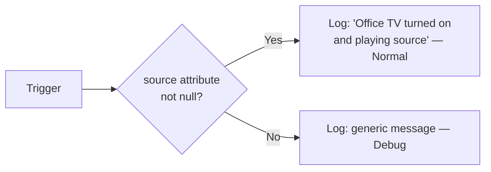

[<- Back to Integrations README](../README.md) · [Packages README](../../README.md) · [Main README](../../../README.md)

# LG WebOS TV

Monitoring automations for the office LG TV using the native [webostv](https://www.home-assistant.io/integrations/webostv/) integration.

---

## Overview

Four automations track the office TV's power state, input source changes, and extended viewing sessions. Events are logged to the home log; a direct notification is sent to Danny if the TV has been on for 4 hours or more.

---

## Automations

| ID | Alias | Trigger | Action |
|----|-------|---------|--------|
| `1617814309728` | Office: TV On | `media_player.office_tv` off → on | Logs power-on with source (Normal) or without source (Debug) |
| `1617814349289` | Office: TV Off | `media_player.office_tv` on → off | Logs power-off (Debug) |
| `1617814753264` | Office: TV Source Changes | `media_player.office_tv` source attribute changes | Logs new source (Normal) or generic change (Debug) |
| `1753129971064` | Office: TV On For Long Time | `media_player.office_tv` not `off` for 4 hours | Sends direct notification to Danny |

### TV On / Source Changes — logic

Both "TV On" and "TV Source Changes" share the same conditional log pattern:

---

## Entities

| Entity | Description |
|--------|-------------|
| `media_player.office_tv` | Office LG WebOS TV |

---

## Dependencies

- **Integration:** [Home Assistant LG webostv](https://www.home-assistant.io/integrations/webostv/)
- **Scripts:** `script.send_to_home_log`, `script.send_direct_notification`
- **Person:** `person.danny` (4-hour notification recipient)

---

*Last updated: 2026-04-05*
