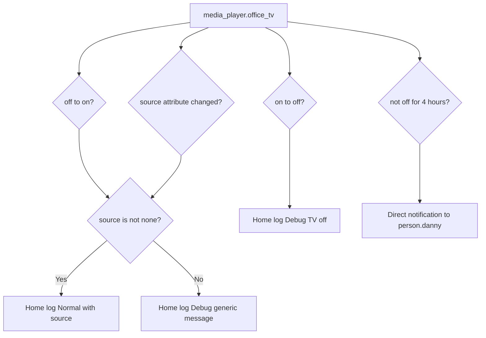

[<- Back to Integrations README](README.md) · [Packages README](../README.md) · [Main README](../../README.md)

# LG WebOS TV Package Documentation

The LG package logs office TV activity from the WebOS TV integration and sends Danny a direct notification if the office TV has been left on for a long time.

This documentation covers `lg.yaml`.

| File | Purpose | Contents |
|------|---------|----------|
| `lg.yaml` | Office LG TV monitoring | 4 automations |

## Quick Summary

For non-technical users, the important behavior is:

| Area | What Happens |
|------|--------------|
| TV turns on | The home log records that the office TV turned on, including the current source when available. |
| TV turns off | The home log records a debug TV-off message. |
| Source changes | The home log records the new source when available, otherwise it records a generic media-change debug message. |
| Left on too long | Danny gets a direct notification if the TV has been in any state other than `off` for 4 hours. |

## How It Works

## Technical Reference

### Automations

| ID | Alias | Trigger | Action | Mode |
|----|-------|---------|--------|------|
| `1617814309728` | `Office: TV On` | `media_player.office_tv` from `off` to `on` | Logs source at Normal level if present, otherwise logs generic power-on at Debug level. | `queued`, max 10 |
| `1617814349289` | `Office: TV Off` | `media_player.office_tv` from `on` to `off` | Logs power-off at Debug level. | `queued`, max 10 |
| `1617814753264` | `Office: TV Source Changes` | `media_player.office_tv` `source` attribute changes | Logs source at Normal level if present, otherwise logs generic media-change at Debug level. | `queued`, max 10 |
| `1753129971064` | `Office: TV On For Long Time` | `media_player.office_tv` not to `off` for 4 hours | Sends direct notification to `person.danny`. | `single` |

Power-user note: the long-running TV automation uses `not_to: "off"`, so it can trigger after 4 continuous hours in any non-off state, not only the literal `on` state.

## Important Entities

| Entity | Used For |
|--------|----------|
| `media_player.office_tv` | Trigger source and source attribute provider. |
| `person.danny` | Recipient for the 4-hour notification. |

## Troubleshooting

| Symptom | First Things To Check |
|---------|-----------------------|
| TV-on log has no source | Check the `source` attribute on `media_player.office_tv`; the YAML logs a generic debug message when it is `none`. |
| Source changes are not logged | Check whether the `source` attribute is changing, not just playback state. |
| Long-on notification did not arrive | Confirm the TV stayed continuously not `off` for 4 hours and the automation trace did not reset. |
| Unexpected long-on notification | Check whether WebOS reports standby or unavailable states as non-`off`. |

## Related Integration

| Integration | Purpose |
|-------------|---------|
| [LG webostv](https://www.home-assistant.io/integrations/webostv/) | Provides the `media_player.office_tv` entity. |

*Last updated: 2026-06-27*
